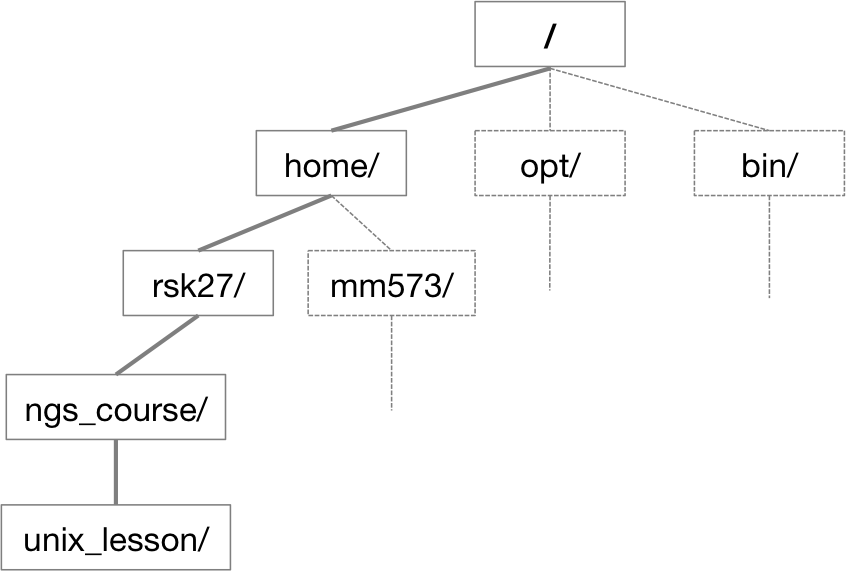

- How do you access the shell?
- How do you use it?
  - Getting around the Unix file system
  - Looking at files
  - Manipulating files
  - Automating tasks
- What is it good for?


# Setting up

Today we're going to go through how to access Unix/Linux and some of the basic shell commands. We will be doing this by manipulating an example dataset from a small RNA-seq experiment.

Since we are going to be working with this data on our remote server, [HMS Orchestra](https://rc.hms.harvard.edu/#orchestra), we first need to log onto the server. After we're logged on, we will each make our own copy of the example data folder.

## Logging in

** macOS **

Macs have a utility application called Terminal for performing tasks on the command line (shell), both locally and on remote machines. We will be using it to log into Orchestra.

** Windows **

By default, there is no terminal for the bash shell available in the Windows OS, so you have to use a downloaded program, Git BASH. Git BASH is part of the [Git for Windows](https://git-for-windows.github.io/) download, and is a shell (bash) emulator. You can also use [Putty](http://www.chiark.greenend.org.uk/~sgtatham/putty/download.html) to log in to remote machines from Windows computers, but it is a little more involved and has different capabilities.

### Let's log in! 

Type in the following command with your eCommons username (replace the `$USER` placeholder with your username).

```bash
ssh $USER@orchestra.med.harvard.edu
```

You will receive a prompt for your password, and you should type in your eCommons password; note that the cursor will *not move* as you type in your password.

A warning might pop up the first time you try to connect to a remote machine. If necessary, enter `yes` or `y`. 

## Copy example data folder

Once logged in, you should see the Orchestra news and the command prompt (`$`).

The command prompt will have some characters before it, something like `-bash-4.1` or `$USER@loge`. This is telling you what the name of the computer you are working on is.

The first command we will type on the command prompt will be to start a so-called "interactive session" on Orchestra.

```bash
bsub -Is -q interactive bash
```

Press enter after you type in that command. You will get a couple of messages, but in a few seconds you should get back the command prompt `$`; the string of characters before the command prompt, however, have changed. They should say something like `usr01@clarinet001-001`. *We will be explaining what this means in more detail tomorrow when we talk about Orchestra and high-performance computing (HPC) environments.* 

Make sure that your command prompt is now preceded by a character string containing a musical instrument name (e.g. bassoon, clarinet, ottavino).

Let's make a a directory (folder) in your user home for everything we do in this NGS Data Analysis course. We will use the `mkdir` command which we will discuss in more detail later. For now, type the following command at the command prompt.

```bash
mkdir ngs_course/
```

Copy the data directory `unix_lesson/` from our shared `hbctraining` group on Orchestra into your newly created `ngs_course/` directory.

`cp` is the command for copy, and requires you to specify (1) source (`/groups/hbctraining/ngs-data-analysis2016/unix_lesson/`) and (2) destination (`ngs_course/`) directories, *separated by a space*. Note that spaces in a command line environment are important, and must be escaped in file paths, which we will discuss further later. The `-r` flag (or `-R`, `--recursive`) here means "recursive", and will prompt bash to copy all files inside the requested source directory to the destination.

```bash
cp -r /groups/hbctraining/ngs-data-analysis-longcourse/unix_lesson/ ngs_course/
```


# Starting with the shell

Now that we've copied the `unix_lesson/` data to our local user home, let's navigate inside using the `cd` command. `cd` stands for "change directory".

```bash
cd ngs_course
cd unix_lesson
```

Let's list what's inside `unix_lesson/` with the `ls` command. `ls` stands for "list" and it lists the directory contents.

```bash
ls
```

```
genomics_data  raw_fastq  README.txt  reference_data
```

There are five items listed.  What are they? We can use a "modifier" with `ls` to get more information. This modifier is called an argument (more below).

```bash
ls -F
```

```
genomics_data/  raw_fastq/  README.txt  reference_data/
```

Anything with a `/` after it is a directory. Things with a `*` after them are programs. If there are no decorations after the name, it's a file.

All commands are essentially programs that are able to perform specific, commonly-used tasks.

You can also use the command `ls -l` to see whether items in a directory are files or directories. `ls -l` gives a lot more information too.

```
drwxrwsr-x 2 rsk27 hbctraining 227 Jan 26 11:36 genomics_data
drwxrwsr-x 2 rsk27 hbctraining 228 Jan 26 10:44 raw_fastq
-rw-rw-r-- 1 rsk27 hbctraining 244 Jan 26 11:40 README.txt
drwxrwsr-x 2 rsk27 hbctraining  62 Jan 26 10:44 reference_data
```

Let's go into the `raw_fastq/` directory and see what is in there.

```bash
cd raw_fastq/
ls -F
```

```
Irrel_kd_1.subset.fq  Irrel_kd_3.subset.fq  Mov10_oe_2.subset.fq
Irrel_kd_2.subset.fq  Mov10_oe_1.subset.fq  Mov10_oe_3.subset.fq
```

All six items in this directory have no trailing slashes, so they are all files, and not folders/directories.

## Arguments

Most commands take additional arguments that control their exact behavior. For example, `-F` and `-l` are arguments to `ls`.  The `ls` command, like many commands, take a lot of arguments. Another useful one is `-t`, which will show a listing sorted by the time stamp.  

How do we know what the available arguments that go with a particular command are? Most commonly used shell commands have a manual available in the shell. You can access the manual using the `man` command.

```bash
man ls
```

This will open the manual page for `ls`. Use <kbd>SPACE</kbd> to go forward and <kbd>b</kbd> to go backwards. When you are done reading, just hit <kbd>q</kbd> to quit.

Commands that are run from the shell can get extremely complicated. To see an example, open up the manual page for the `find` command. No one can possibly learn all of these arguments, of course. So you will probably find yourself referring to the manual page frequently.

<div class="note">
If the manual page within the terminal is hard to read and traverse, the manual exists online, use your web searching powers to get it! In addition to the arguments, you can also find good usage examples online; Google is your friend.
</div>


# The Unix directory file structure (a.k.a. where am I?)
 
As you've already just seen, you can move around between different directories or folders at the command line. Why would you want to do this, rather than just navigating around the normal way using a GUI (GUI = Graphical User Interface, pronounced *gooey*).

## Moving around the file system

Let's practice moving around a bit.

We're going to work in that `unix_lesson/` directory.

First we did something like go to the folder of our username. Then we changed directories to `ngs_course/`, then `unix_lesson/` and then `raw_fastq/`

Like on any computer you have used before, the file structure within unix is hierarchical. It's like an upside down tree with root (`/`) as the starting point of the tree-like structure:



That root (`/`) is often also called the 'top' level.

When you log in to a remote computer you are on one of the branches of that tree, your home directory (e.g. `/home/$USER`)

<div class="note">
On macOS, which is UNIX-based, the root level is also `/`. On Windows, it is drive specific; generally `C:\` is considered root, but it changes to `D:\`, if you are on that drive.
</div>

This tree can also be represented as follows:

```
/ (root)
├── home/
    ├── rsk27/
        ├── ngs_course/
            ├── unix_lesson/
                ├── genomics_data/
                    ├── genes_subset.fa
                    ├── Mov10_rnaseq_metadata.txt
                    ├── .
                    ├── .
                ├── raw_fastq/
                    ├── Irrel_kd_3.subset.fq
                    ├── Mov10_oe_1.subset.fq
                    ├── Mov10_oe_2.subset.fq
                    ├── .
                    ├── .
                ├── README.txt
                └── reference_data/
                    ├── chr1-hg19_genes.gtf
                    └── chr1.fa
    ├── mm573
    ├── .
    ├── .
├── bin/
├── opt/
├── .
└── .
```

There is a command that will show us something similar. What do you think the command might be called?

```bash
tree
```

Now let's learn more about moving between directories at the command line.

```bash
cd
```

This puts you in your home directory. No matter where you are in the directory system, `cd` will always bring you back to your home directory. It is also used to change directories when followed by more instructions.

Now using `cd` and `ls`, go in to the `unix_lesson/` directory and list its contents. Now go into the `raw_fastq/` directory, and list its contents.

Let's also check to see where we are. Sometimes when we're wandering around in the file system, it's easy to lose track of where we are. The command that tells you this is:

```bash
pwd
```

This stands for "print working directory", i.e. the directory you're currently working in.

What if we want to move back up and out of the `raw_fastq/` directory? Can we just type `cd unix_lesson/`? Try it and see what happens.

To go "back up a level", we can use `..`.

```bash
cd ..
```

Now do `ls` and `pwd`. 

`..` denotes parent directory, and you can use it anywhere in the system to go back to the parent directory. Can you think of an example when this won't work?


## Examining the contents of other directories

By default, the `ls` commands lists the contents of the working directory (i.e. the directory you are in). You can always find the directory you are in using the `pwd` command. However, you can also give `ls` the names of other directories to view. Navigate to the home directory if you are not already there.

```bash
cd
ls ngs_course/
```

This will list the contents of the `ngs_course/` directory without you having to navigate there.

The `cd` command works in a similar way.

```bash
cd ngs_course/unix_lesson/raw_fastq/
pwd
```

You should now be in `raw_fastq/` and you got there without having to step through the intermediate directories. 

<div class="note">
If you are aware of the directory structure, you can string together as long a list as you like. (Also see note about Tab Completion later in this lesson). Think of the second tree diagram above when you are putting together the route to a directory.
</div>

## Exercise

- List the `Mov10_oe_1.subset.fq` file from your home directory without changing directories


# Full vs. relative paths

The `cd` command takes an argument which is the directory name. Directories can be specified using either a *relative path* or a *full path*. 

As we know, the directories on the computer are arranged into a hierarchy, and the full path tells you where a directory is in that hierarchy, starting with the root `/` directory. Navigate to the home directory (`cd`). Now, enter the `pwd` command and you should see:

```bash
pwd
```

```
/home/$USER
```

which is the full path for your home directory. This tells you that you are in a directory called `$USER`, which sits inside a directory called `home` which sits inside the very top directory in the hierarchy, the *root directory*. So, to summarize: `$USER` is a directory in `home` which is a directory in the top level root `/` directory.

Now enter the following command:

```bash
cd /home/$USER/ngs_course/unix_lesson/raw_fastq/
```

This jumps to `raw_fastq/`. Now go back to the home directory (`cd`). We saw
earlier that the command:

```bash
cd ngs_course/unix_lesson/raw_fastq/
```

had the same effect - it took us to the `raw_fastq` directory. But, instead of specifying the full path (`/home/$USER/ngs_course/unix_lesson/raw_fastq/`), we specified a *relative path*. In other words, we specified the path **relative to our current working directory**. 

A full path always starts with `/`, a relative path does not.

A relative path is like getting directions from someone on the street. They tell you to "go right at the Stop sign, and then turn left on Main Street". That works great if you're standing there together, but not so well if you're trying to tell someone how to get there from another country. A full path is like GPS coordinates. It tells you exactly where something is no matter where you are right now.

You can usually use either a full path or a relative path depending on what is most convenient and what the tool we are using requires.

Over time, it will become easier for you to keep a mental note of the structure of the directories that you are using and how to quickly navigate amongst them using relative paths.

## Exercise

- Change directories to `/home/$USER/ngs_course/unix_lesson/raw_fastq/`, and list the contents of `unix_lesson/genomics_data/` without changing directories again.
- List the contents of the `/bin/` directory. Do you see anything familiar in there? How can you tell these are programs rather than plain files?


# Saving time with tab completion, wildcards and other shortcuts 

## Tab completion

Typing out directory names can waste a lot of time and generate a ton of typos. There is a really easy shortcut to help with this.

Navigate to the home directory, start typing out the name of a directory, then hit the tab key: 

```bash
cd ngs<tab>
```

the shell tries to fill in the rest of the directory using the list of files and folders in that directory. In this case, the shell will fill in the rest of the directory name for `ngs_course/`. 

Now, navigate to `ngs_course/unix_lesson/raw_fastq/` and type:

```bash
ls Mov10_oe_<tab><tab>
```

When you hit the first tab, nothing happens. The reason is that there are multiple files in `raw_fastq/` which start with `Mov10_oe_`. Thus, the shell does not know which one to fill in. When you hit tab again, the shell will list the possible choices.

Tab completion can also fill in the names of commands. For example, enter `e<tab><tab>`. You will see the name of every command that starts with an `e`. One of those is `echo`. If you enter `ec<tab>` you will see that tab completion works. 

<div class="note">
**Tab completion is your friend!** It helps prevent spelling mistakes, and speeds up the process of typing in the (full or relative) path.
</div>

## Wild cards

The '*' character is a shortcut for "everything". Thus, if you enter `ls *`, you will see all of the contents of a given directory. Now try this command:

```bash
ls *fq
```

This lists every file that ends with a `fq`. This command:

```bash
ls /usr/bin/*.sh
```

lists every file in `/usr/bin/` that ends in the characters `.sh`.

```bash
ls Mov10*fq
```

lists only the files that begin with 'Mov10' and end with 'fq'

So how does this actually work? The shell (bash) considers an asterisk (`*`) to be a wildcard character that can be used to substitute for any single character or any string of characters. 

<div class="note">
An asterisk/star is only one of the many wildcards in UNIX, but this is the most powerful one and we will be using this one the most for our exercises.
</div>

## Exercise

Do each of the following using a single `ls` command without
navigating to a different directory.

- List all of the files in `/bin/` that start with the letter 'c'
- List all of the files in `/bin/` that contain the letter 'a'
- List all of the files in `/bin/` that end with the letter 'o'

Bonus: List all of the files in `/bin/` that contain the letter 'a' or 'c'.

## Other shortcuts

There are several more shortcuts which you should know about, but today we are talking about only a few. As you continue to work with the shell and on the terminal, you will come across and likely adopt many other shortcuts. 

The home directory is often listed in commands, so a shortcut for it seems like a good idea. In the shell the tilde character, `~`, is a shortcut for your home directory. 

Make sure your working directory is still `/home/$USER/ngs_course/unix_lesson/raw_fastq/`, and then enter the command:

```bash
ls ~
```

This prints the contents of your home directory, without you having to type the full path because the tilde `~` is equivalent to `/home/$USER`.

You can use the `~` in paths too:

```bash
ls ~/ngs_course/unix_lesson/reference_data/
```

Another shortcut is `..`, which we encountered earlier:

```bash
ls ..
```

The shortcut `..` always refers to the directory above your current directory and is a very important when using relative paths. So, it prints the contents of the `unix_lesson/`. You can chain this together with another directory in `unix_lesson/`, so:

```bash
ls ../reference_data/
```

Finally, the special directory `.` always refers to your current directory. So, `ls`, `ls .`, and `ls ././././.` all do the same thing, they print the contents of the current directory. This may seem like a useless shortcut right now, but it is needed to specify a destination, e.g. `cp ../data/counts.txt .` or `mv ~/james-scripts/parse-fasta.sh .`.


To summarize, while you are in your home directory, the commands `ls ~`, `ls ~/.`, and `ls /home/$USER` all do exactly the same thing. These shortcuts are not necessary, but they are really convenient!

## Command History

You can easily access previous commands.  Hit the up arrow. Hit it again.  You can step backwards through your command history. The down arrow takes your forwards in the command history. <kbd>Ctrl + R</kbd> will do a reverse-search through your command history. This is very useful.

You can also review your recent commands with the `history` command.

```bash
history
```

This will return a numbered list of recent commands. You can reuse one of these commands directly by referring to the number of that command.

If your history looked like this:

```
259  ls *
260  ls /usr/bin/*.sh
261  ls *fq
```

then you could repeat command #260 by simply entering:

```bash
!260
```

(that's an exclamation mark).  You will be glad you learned this when you try to re-run very complicated commands.

<div class="note">
Only a certain number of commands are stored and displayed with `history`, there is a way to modify this to store a different number.
</div>

## Other handy keyboard shortcuts

- <kbd>Ctrl + C</kbd> will cancel the command you are writing, and give you a fresh prompt.
- <kbd>Ctrl + A</kbd> will bring you to the start of the command you are writing.
- <kbd>Ctrl + E</kbd> will bring you to the end of the command.

## Exercise

- Find the line number in your history for the last exercise (listing
files in `/bin/`) and reissue that command.


# Examining Files

We now know how to move around the file system and look at the
contents of directories, but how do we look at the contents of files?

The easiest way (but really not the ideal way in most situations) to examine a file is to just print out all of the
contents using the command `cat`. `cat` stands for concatenate; it has many uses and printing the contents of a files onto the terminal is one of them.

```bash
cat ~/ngs_course/unix_lesson/genomics_data/proteins_subset.fa
```

This prints out the all the contents of `proteins_subset.fa` to the screen.

What does this file contain?

`cat` is a terrific command, but when the file is really big, it should be avoided; `less`, is preferred for files larger than a few bytes. Let's take a look at the fastq files in `raw_fastq/`. These files are quite large, so we probably do not want to use the `cat` command to look at them. Instead, we can use the `less` command. 

Move back to the `raw_fastq/` directory and enter the following command:

```bash
less Mov10_oe_1.subset.fq
```

We will explore fastq files in more detail later, but notice that fastq files have four lines of data associated with every sequence read. Not only is there a header line and the nucleotide sequence, similar to a fasta file, but fastq files also contain quality information for each nucleotide in the sequence. 

The `less` command opens the file, and lets you navigate through it. The keys used to move around the file are identical to the `man` command.


<span class="caption">Shortcuts for `less`</span>

| key              | action                 |
| ---------------- | ---------------------- |
| <kbd>SPACE</kbd> | to go forward          |
| <kbd>b</kbd>     | to go backwards        |
| <kbd>g</kbd>     | to go to the beginning |
| <kbd>G</kbd>     | to go to the end       |
| <kbd>q</kbd>     | to quit                |


`less` also gives you a way of searching through files. Just hit the <kbd>/</kbd> key to begin a search. Enter the name of the string of characters you would like to search for and hit enter. It will jump to the next location where that string is found. If you hit <kbd>/</kbd> then <kbd>ENTER</kbd>, `less` will just repeat the previous search. `less` searches from the current location and works its way forward. If you are at the end of the file and search for the word "cat", `less` will not find it. You need to go to the beginning of the file and search.

For instance, let's search for the sequence `GAGACCC` in our file. You can see that we go right to that sequence and can see what it looks like. To exit hit <kbd>q</kbd>.

The `man` command (program) actually uses `less` internally and therefore uses the same keys and methods, so you can search manuals using `/` as well!

There's another way that we can look at files, and in this case, just
look at part of them. This can be particularly useful if we just want
to see the beginning or end of the file, or see how it's formatted.

The commands are `head` and `tail` and they just let you look at
the first 10 lines and the last 10 lines of a file, respectively.

```bash
head Mov10_oe_1.subset.fq
tail Mov10_oe_1.subset.fq
```

The `-n` option to either of these commands can be used to print the first or last `n` lines of a file. To print the first/last line of the file use:

```bash
head -n 1 Mov10_oe_1.subset.fq
tail -n 1 Mov10_oe_1.subset.fq
```

## Creating, moving, copying, and removing

Now we can move around in the file structure, look at files, search files, redirect. But what if we want to do normal things like copy files or move them around or get rid of them. Sure we could do most of these things without the command line, but what fun would that be?! Besides it's often faster to do it at the command line, or you'll be on a remote server like Amazon where you won't have another option.

Our raw data in this case is fastq files. We don't want to change the original files,
so let's make a copy to work with.

Lets copy the file using the copy `cp` command. Navigate to the `raw_fastq/` directory.

```bash
cp Mov10_oe_1.subset.fq Mov10_oe_1.subset-copy.fq
ls -l
```

Now `Mov10_oe_1.subset-copy.fq` has been created as a copy of `Mov10_oe_1.subset.fq`

Let's make a 'backup' directory where we can put this file.

The `mkdir` command is used to make a directory. Just enter `mkdir`
followed by a space, then the directory name.

```bash
mkdir backup
```

<div class="note">
File/directory/program names with spaces in them do not work in Unix. Use characters like hyphens or underscores instead.
</div>

We can now move our backed up file in to this directory. We can move files around using the command `mv`.

```bash
mv *copy.fq backup
ls -al backup
```

```
drwxrwsr-x 2 mp298 mp298       43 Sep 30 13:59 .
drwxrwsr-x 8 mp298 mp298      203 Sep 30 13:58 ..
-rw-rw-r-- 1 mp298 mp298 75706556 Sep 30 13:56 Mov10_oe_1.subset-copy.fq
```

The `mv` command is also how you rename files. Since this file is so
important, let's rename it:

```bash
cd backup
mv Mov10_oe_1.subset-copy.fq Mov10_oe_1.subset-copy.fq_DO_NOT_TOUCH!`
ls
```

```
Mov10_oe_1.subset-copy.fq_DO_NOT_TOUCH!
```

Both `mv` and `cp` require that you specify 2 things after the command on the command line: first is the object being copied, moved or renamed, and the second is the destination it's being moved or copied to, or the new name!

<div class="note">
With moving and renaming files, it will not ask you if you are sure that you want to "replace existing file".
</div>

Finally, we decided this was not what we needed to do, and we want to start over with an empty backup directory. To do this we will use the `rm` command. 

<div class="note">
The `rm` file permanently removes the file. Be careful with this command. The shell doesn't just nicely put the files in the Trash. They're really gone. If you wanted to play it safe and have Unix ask you "are your sure you want to delete this file?", you can include the `-i` argument every time you run it.
</div>

```bash
rm Mov10_oe_1.subset-copy.fq_DO_NOT_TOUCH!
```

## Exercise

1. Create a new directory called `backup_ref_data/` in `~/ngs_course/unix_lesson/` (bonus points for creating this when you are in the `backup/` directory!)
2. Copy over the contents of the `~/ngs_course/unix_lesson/reference_data/` into `backup_ref_data/` after changing directories to `~/ngs_course/unix_lesson/` (if you are not already there).
3. *Using just one command*, **move** the `raw_fastq/backup/` directory to your current working directory (which is `~/ngs_course/unix_lesson/`) and **rename** it `backup_fastq/`.


* * *


We really don't need these backup directories, so, let's delete both. Make sure you have navigated to `~/ngs_course/unix_lesson/`, and now we will use the `rm` command to delete. By default, `rm`, will NOT delete directories, but you use the `-r` flag if you are sure that you want to delete the directories and everything within them. To be safe, let's use it with the `-i` flag.

```bash
rm -ri backup_ref_data/ backup_fastq/ 
```

- `-r`: recursive, commonly used as an option when working with directories, e.g. with `cp`. 
- `-i`: prompt before every removal.


# Commands, options, and keystrokes covered

```
bash
cd
ls
man
pwd
~           # home dir
.           # current dir
..          # parent dir
*           # wildcard
echo
ctrl + c    # cancel current command
ctrl + a    # start of line
ctrl + e    # end of line
history
!           # repeat cmd
cat
less
head
tail
cp
mdkir
mv
rm
```


# Additional learning resources

- http://fosswire.com/post/2007/08/unixlinux-command-cheat-sheet/
- https://github.com/swcarpentry/boot-camps/blob/master/shell/shell_cheatsheet.md
- http://explainshell.com/
- http://www.commandlinefu.com/




Adapted from the lesson by Tracy Teal. Original contributors: Paul Wilson, Milad Fatenejad, Sasha Wood and Radhika Khetani for [Software Carpentry](http://software-carpentry.org/).
