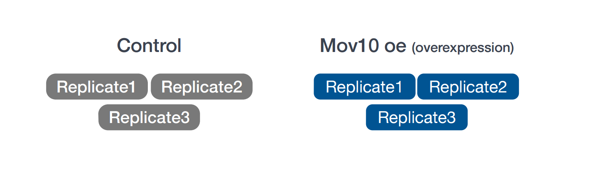

[Data management slides]: https://github.com/hbc/NGS-Data-Analysis-long-course/raw/Fall_2016/sessionI/slides/data_management.pdf
[SRA]: http://www.ncbi.nlm.nih.gov/sra  "Sequence Read Archive"

- Recognize the need for data management.
- Plan a good genomics experiment and getting started with project organization.
- Have a general idea of the experiment and its objectives.
- Understand how and why we chose this dataset.


## Data Management

Project organization is one of the most important parts of a sequencing project, but is often overlooked in the excitement to get a first look at new data. While it's best to get yourself organized before you begin analysis, it's never too late to start.

Importantly, the methods and approaches needed for bioinformatics are the same required in a wet lab environment. **Planning, documentation, and organization** are essential to good, reproducible science. 

### Planning

You should approach your sequencing project in a very similar way to how you do a biological experiment, and ideally, begins with **experimental design**. We're going to assume that you've already designed a beautiful sequencing experiment to address your biological question, collected appropriate samples, and that you have enough statistical power.


### Organization

Every computational analysis you do is going to spawn many files, and inevitability, you'll want to run some of those analyses again. Genomics projects can quickly accumulate hundreds of files across tens of folders. Before you start any analysis it is best to first get organized and **create a planned storage space for your workflow**.

We will start by creating a directory that we can use for the rest of the RNA-seq session.

First, make sure that you are in your home directory.

```bash
$ cd
$ pwd
```

This should return `/home/username`.

Now make a directory for the RNA-seq analysis within the `ngs_course/` folder using the `mkdir` command. You can use the parents flag (`-p` or `--parents`) to complete the file path if any parents (e.g. `ngs_course/`) don't already exist. This isn't the case here, since we already made `ngs_course/`, but can be very useful when scripting workflows. 

```bash
$ mkdir -p ~/ngs_course/rnaseq/
```

Next, set up the following structure within your project directory to keep files organized.

```bash
rnaseq
  ├── logs
  ├── meta
  ├── raw_data  
  ├── reference_data
  ├── results
  └── scripts
```

*This is a generic structure and can be tweaked based on personal preference.*

- `logs`: It is important to keep track of the commands run and the specific parameters used, but also to have a record of any standard output that is generated while running the command. 
- `meta`: This folder contains any information that describes the samples you are using, which we often refer to as metadata. 
- `raw_data`: Store any **unmodified** raw data obtained prior to computational analysis here. We strongly recommend placing the original source NGS run data here, i.e. FASTQ files.
- `reference_data`: Store any necessary genomic annotation reference (e.g. FASTA, GTF) files here.
- `results`: This folder will contain the output from the different tools you implement in your workflow. To stay organized, you should create sub-folders specific to each tool/step of the workflow. 
- `scripts`: This folder will contain the scripts that you use to run analyses at different points in the workflow.

Create a directory for the project by changing into `rnaseq/` and then using `mkdir` to create the subdirectories.

```bash
$ cd ~/ngs_course/rnaseq/
$ mkdir -p logs meta raw_data reference_data results scripts
``` 

Verify that the subdirectories now exist.

```bash
ls -l
```

Let's populate the `rnaseq/` project with our example RNA-seq FASTQ data.

The FASTQ files are located inside `~/ngs_course/unix_lesson/raw_fastq/`, and we need to copy them to `raw_data/`. We can match them by file extension with `*.fq`.

```bash
$ cp ~/ngs_course/unix_lesson/raw_fastq/*.fq raw_data/
```

Later in the workflow when we perform alignment, we will require genome reference files (.fa, .gtf) for alignment and read counting. These files are also in the `unix_lesson/` directory inside `reference_data/`, we can copy over the whole folder in this case. You can use `.` as a placeholder for the current working directory as the destination.

```bash
$ cp -r ~/ngs_course/unix_lesson/reference_data/ .
```

Perfect, now the structure of `rnaseq/` should look like this:

```bash
rnaseq
├── logs
├── meta
├── raw_data
│   ├── Irrel_kd_1.subset.fq
│   ├── Irrel_kd_2.subset.fq
│   ├── Irrel_kd_3.subset.fq
│   ├── Mov10_oe_1.subset.fq
│   ├── Mov10_oe_2.subset.fq
│   └── Mov10_oe_3.subset.fq
├── reference_data
│   ├── chr1.fa
│   └── chr1-hg19_genes.gtf
├── results
└── scripts
```

### Documentation

For all of those steps, collecting specimens, extracting DNA, prepping your samples, you've likely kept a lab notebook that details how and why you did each step, but **documentation doesn't stop at the sequencer**! 

#### Log files

In your lab notebook, you likely keep track of the different reagents and kits used for a specific protocol. Similarly, recording information about the tools and parameters is important for documenting your computational experiments. 

- Keep track of software versions used.
- Record information on parameters used and summary statistics at every step (e.g., how many adapters were removed, how many reads did not align).
- Save log files and console output.
    - Different tools have different ways of reporting log messages and you might have to experiment a bit to figure out what output to capture. You can redirect standard output with the `>` symbol which is equivalent to `1> (standard out)`; other tools might require you to use `2>` to re-direct the `standard error` instead.
 
#### README file

Keeping notes on what happened in what order, and what was done, is essential for reproducible research. If you don’t keep good notes, then you will forget what you did pretty quickly, and if you don’t know what you did, no one else has a chance. After setting up the filesystem and running a workflow it is useful to have a **README file within your project** directory. This file will usually contain a quick one line summary about the project and any other lines that follow will describe the files/directories found within it. An example README is shown below. Within each sub-directory you can also include README files to describe the analysis and the files that were generated.

```
## README ##
## This directory contains data generated from the NGS Data Analysis Course
## Date: June 1st, 2017

There are six subdirectories in this directory:

raw_data : contains raw data
meta:  contains...
logs:
reference_data:
results:
scripts:
```

*** 
### Exercise

- Take a moment to create a README for the `rnaseq/` folder (hint: use `vim` to create the file). Give a short description of the project and brief descriptions of the types of files you will be storing within each of the sub-directories. 
***

## Understanding the dataset

The dataset we are using is part of a larger study described in [Kenny PJ et al., *Cell Rep* 2014](http://www.ncbi.nlm.nih.gov/pubmed/25464849). The authors are investigating interactions between various genes involved in Fragile X syndrome, a disease of aberrant protein production, which results in cognitive impairment and autistic-like features. **The authors sought to show that RNA helicase MOV10 regulates the translation of RNAs involved in Fragile X syndrome.**

From this study we are using the [RNA-seq](http://www.ncbi.nlm.nih.gov/geo/query/acc.cgi?acc=GSE50499) data which is publicly available in the [SRA][]. In addition to the raw sequence data we also need to collect **information about the data**, also known as **metadata**.  We are usually quick to want to begin analysis of the sequence data (FASTQ files), but how useful is it if we know nothing about the samples that this sequence data originated from? Some relevant metadata for our dataset is provided below:

* The RNA was extracted from **HEK293F cells** that were transfected with a MOV10 transgene or an irrelevant siRNA.  
* The libraries for this dataset are **stranded** and were generated using the **dUTP method**. 
* Sequencing was carried out on the **Illumina HiSeq-2500 for 100bp single end** reads. 
* The full dataset was sequenced to **~40 million reads** per sample, but for this workshop we will be looking at a small subset on chr1 (~300,000 reads/sample).
* For each group we have three replicates as described in the figure below.



## Understanding the workflow

For any bioinformatics experiment you will have to go through a series of steps in order to obtain your final desired output. The execution of these steps in a sequential manner is what we often refer to as a **workflow or pipeline**. A simplified version of the workflow we will be using in this course is provided below. We have some of the steps briefly outlined here, but plan to cover each in more detail over the duration of this course.


1. Library preparation of biological samples (pre-sequencing)
2. Quality control - Assessing quality of sequence reads using FastQC
3. Quality control *(Optional)* - Adapter Trimming
4. Align reads to reference genome using STAR (splice-aware aligner)
5. Quantifying expression/Counting the number of reads mapping to each gene
6. Statistical analysis to identify differentially expressed genes (count normalization, linear modeling using R-based tools)

## Best practices for NGS Analysis 

Ok so now you are all set up and have begun your analysis. You have set up your space in a way such that someone unfamiliar with your project should be able to look at your files/folders and understand what you did and why. Before we move on, here are a few additional pointers:

1. **Make sure to use the appropriate software.** Do your research and find out what is best for the data you are working with. Don't just work with tools that you are able to easily install. Also, make sure you are using the most up-to-date versions! If you run out-of-date software, you are probably introducing errors into your workflow; and you may be missing out on more accurate methods.

2. **Keep up with the literature.** Bioinformatics is a fast-moving field and it's always good to stay in the know about recent developments. This will help you determine what is appropriate and what is not.  

3. **Do not re-invent the wheel.** If you run into problems, more often than not someone has already encountered that same problem. A solution is either already available or someone is working on it -- so find it!

4. **Testing is essential.** If you are using a tool for the first time, test it out on a single sample or a subset of the data before running your entire dataset through. This will allow you to debug quicker and give you a chance to also get a feel for the tool and the different parameters.

---

*This lesson has been developed by members of the teaching team at the [Harvard Chan Bioinformatics Core (HBC)](http://bioinformatics.sph.harvard.edu/). These are open access materials distributed under the terms of the [Creative Commons Attribution license](https://creativecommons.org/licenses/by/4.0/) (CC BY 4.0), which permits unrestricted use, distribution, and reproduction in any medium, provided the original author and source are credited.*

* *The materials used in this lesson were derived from work that is Copyright © Data Carpentry (http://datacarpentry.org/). 
All Data Carpentry instructional material is made available under the [Creative Commons Attribution license](https://creativecommons.org/licenses/by/4.0/) (CC BY 4.0).*
* *Adapted from the lesson by Tracy Teal. Original contributors: Paul Wilson, Milad Fatenejad, Sasha Wood and Radhika Khetani for Software Carpentry (http://software-carpentry.org/)*

