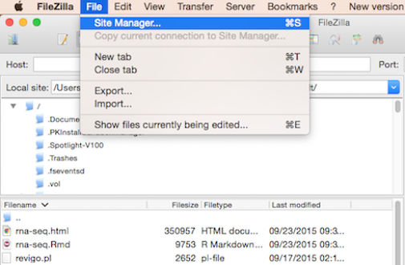
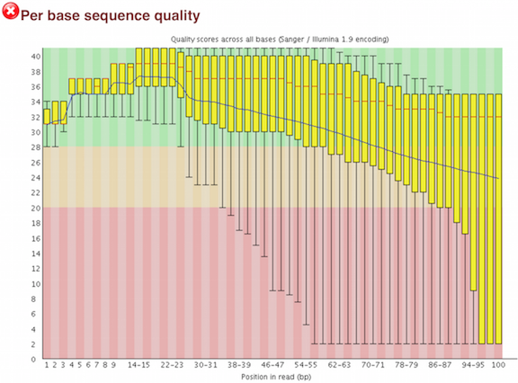
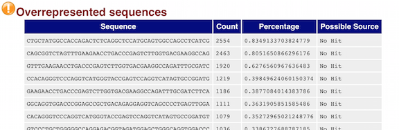

## Learning Objectives:

* Learn how to evaluate the quality of your NGS data using the program FastQC
* Use a `for loop` to automate operations on multiple files
* Create a job submission script to automate quality assessment
* Learning best practices for NGS analysis

## Quality Control of FASTQ files

A critical first step in the analysis of your NGS data is assessing the quality of your data and performing any necessary quality control measures, such as trimming.


## Assessing quality with FastQC

Since we have our directory structure set up, and we know about what information is stored in a FASTQ file, the next step is to examine quality metrics for our data.

[FastQC](http://www.bioinformatics.babraham.ac.uk/projects/fastqc/) provides a simple way to do some quality control checks on raw sequence data coming from high throughput sequencing pipelines. It provides a modular set of analyses which you can use to give a quick impression of whether your data has any problems of which you should be aware before doing any further analysis.

The main functions of FastQC are:

* Import of data from BAM, SAM or FastQ files (any variant)
* Providing a quick overview to tell you in which areas there may be problems
* Summary graphs and tables to quickly assess your data
* Export of results to an HTML based permanent report
* Offline operation to allow automated generation of reports without running the interactive application

### Run FastQC  

Before we run FastQC, let's start an interactive session on the cluster:

```bash
$ bsub -Is -n 1 -q interactive bash
```

***An interactive session is very useful to test tools, workflows, run jobs that open new interactive windows (X11-forwarding) and so on.***

Once your interactive job starts, notice that the command prompt has changed; this is because we are working on a compute node now, not on a login node. Change directories to `raw_data`.

```bash
$ cd ~/ngs_course/rnaseq/raw_data
```  

Before we start using software, we have to load the environments for each software package. On clusters, this is typically done using a **module** system. 

If we check which modules we currently have loaded, we should not see FastQC.

```bash
$ module list
```

This is because the FastQC program is not in our $PATH (i.e. its not in a directory that unix will automatically check to run commands/programs).

```bash
$ echo $PATH
```

To run the FastQC program, we first need to load the appropriate module, so it puts the program into our path:

```bash
$ module load seq/fastqc/0.11.3
```

Once a module for a tool is loaded, you have essentially made it directly available to you like any other basic UNIX command.

```bash
$ module list

$ echo $PATH
```

FastQC will accept multiple file names as input, so we can use the `*.fq` wildcard.

```bash
$ fastqc *.fq
```

*Did you notice how each file was processed serially? How do we speed this up?*

Exit the interactive session and start a new one with 6 cores, and use the multi-threading functionality of FastQC to run 6 jobs at once.

```bash
$ exit  #exit the current interactive session

$ bsub -Is -n 6 -q interactive bash   #start a new session with 6 cpus (-n 6)

$ module load seq/fastqc/0.11.3  #reload the module for the new session

$ cd ~/ngs_course/rnaseq/raw_data

$ fastqc -t 6 *.fq  #note the extra parameter we specified for 6 threads
```

How did I know about the -t argument for FastQC?

```bash
$ fastqc --help
```


Now, let's create a home for our results

```bash
$ mkdir ~/ngs_course/rnaseq/results/fastqc_untrimmed_reads
```

...and move them there (recall, we are still in `~/ngs_course/rnaseq/data/untrimmed_fastq/`)

```bash
$ mv *fastqc* ~/ngs_course/rnaseq/results/fastqc_untrimmed_reads/
```

### Performing quality assessment using job submission scripts
So far in our FASTQC analysis, we have been directly submitting commands to Orchestra using an interactive session (ie. `bsub -Is -n 6 -q interactive bash`). However, there are many more queues available on Orchestra than just the interactive queue. We can submit commands or series of commands to these queues using job submission scripts. 

**Job submission scripts** for Orchestra are just regular scripts, but contain the Orchestra **options/directives** for job submission, such as *number of cores, name of queue, runtime limit, etc*. We can submit these scripts to whichever queue we specify in the script using the `bsub` command as follows:

```bash
# DO NOT RUN THIS
$ bsub < job_submission_script.lsf
```

Submission of the script using the `bsub` command allows the load sharing facility (LSF) to run your job when its your turn. Let's create a job submission script to load the FASTQC module, run FASTQC on all of our fastq files, and move the files to the appropriate directory.

Change directories to `~/ngs_course/rnaseq/scripts`, and create a script named `mov10_fastqc.lsf` in `vim`. *Don't forget to enter insert mode, `i`, to start typing*.

```bash
$ cd ~/ngs_course/rnaseq/scripts

$ vim mov10_fastqc.lsf
```

The first thing we need in our script is the **shebang line**:

```bash
#!/bin/bash
```

Following the shebang line are the Orchestra options. For the script to run, we need to include options for **queue (-q) and runtime limit (-W)**. To specify our options, we precede the option with `#BSUB`, which tells Orchestra that the line contains options for job submission. 

```bash
#BSUB -q priority 		# queue name
#BSUB -W 2:00 		# hours:minutes runlimit after which job will be killed
#BSUB -n 6 		# number of cores requested -- this needs to be greater than or equal to the number of cores you plan to use to run your job
#BSUB -J rnaseq_mov10_fastqc 		# Job name
#BSUB -o %J.out			# File to which standard out will be written
#BSUB -e %J.err 		# File to which standard err will be written
```
Now in the body of the script, we can include any commands we want run:

```bash
## Changing directories to where the fastq files are located
cd ~/ngs_course/rnaseq/raw_data

## Loading modules required for script commands
module load seq/fastqc/0.11.3

## Running FASTQC
fastqc -t 6 *.fq

## Moving files to our results directory
mv *fastqc* ../results/fastqc_untrimmed_reads/
```

Save and quit the script. Now, let's submit the job to the LSF:

```bash
$ bsub < mov10_fastqc.lsf
```

You can check on the status of your job with:

```bash
$ bjobs
```


```bash
$ ls -lh ../results/fastqc_untrimmed_reads/
```

There should also be standard error (`.err`) and standard out (`.out`) files from the job listed in `~/ngs_course/rnaseq/scripts`. You can move these over to your `logs` directory and give them more intuitive names:

```bash
mv *.err ../logs/fastqc.err
mv *.out ../logs/fastqc.out
```

***
**Exercise**

How would you change the `mov10_fastqc.lsf` script if you had 9 fastq files you wanted to run in parallel.

***

### FastQC Results
   
Let's take a closer look at the files generated by FastQC:
   
`$ ls -lh ~/ngs_course/rnaseq/results/fastqc_untrimmed_reads/`

#### HTML reports
The .html files contain the final reports generated by fastqc, let's take a closer look at them. Transfer the file for `Mov10_oe_1.subset.fq` over to your laptop via *FileZilla*.

##### Filezilla - Step 1

Open *FileZilla*, and click on the File tab. Choose 'Site Manager'.
 


##### Filezilla - Step 2

Within the 'Site Manager' window, do the following: 

1. Click on 'New Site', and name it something intuitive (e.g. Orchestra)
2. Host: transfer.orchestra.med.harvard.edu 
3. Protocol: SFTP - SSH File Transfer Protocol
4. Logon Type: Normal
5. User: ECommons ID
6. Password: ECommons password
7. Click 'Connect'

	
	
***FastQC is just an indicator of what's going on with your data, don't take the "PASS"es and "FAIL"s too seriously.***

FastQC has a really well documented [manual page](http://www.bioinformatics.babraham.ac.uk/projects/fastqc/) with [more details](http://www.bioinformatics.babraham.ac.uk/projects/fastqc/Help/) about all the plots in the report. We recommend looking at [this post](http://bioinfo-core.org/index.php/9th_Discussion-28_October_2010) for more information on what bad plots look like and what they mean for your data.

Below are two of the most important analysis modules in FastQC, the **"Per base sequence quality"** plot and the **"Overrepresented sequences"** table. 

The **"Per base sequence quality"** plot provides the distribution of quality scores across all bases at each position in the reads.



The **"Overrepresented sequences"** table displays the sequences (at least 20 bp) that occur in more than 0.1% of the total number of sequences. This table aids in identifying contamination, such as vector or adapter sequences. 



We will go over the remaining plots in class. Remember, our report only represents a subset of reads (chromosome 1) for `Mov10_oe_1.subset.fq`, which can skew the QC results. We encourage you to look at the [full set of reads](https://dl.dropboxusercontent.com/u/74036176/Mov10oe_1-fastqc_report.html) and note how the QC results differ when using the entire dataset.
   
> **_NOTE:_** 
>The other output of FastQC is a .zip file. These .zip files need to be unpacked with the `unzip` program. If we try to `unzip` them all at once:
>
>```bash
>$ cd ~/ngs_course/rnaseq/results/fastqc_untrimmed_reads/    
>$ unzip *.zip
>```
>
>Did it work? 
>
>No, because `unzip` expects to get only one zip file. Welcome to the real world.
>We *could* do each file, one by one, but what if we have 500 files? There is a smarter way.
>We can save time by using a simple shell `for loop` to iterate through the list of files in *.zip.
>
>After you type the first line, you will get a special '>' prompt to type next lines.  
>You start with 'do', then enter your commands, then end with 'done' to execute the loop.
>
>Note that in the first line, we create a variable named `zip`.  After that, we call that variable with the syntax `$zip`. `$zip` is assigned the value of each item (file) in the list *.zip, once for each iteration of the loop.
>
>This loop is basically a simple program. When it runs
>
>```bash
>$ for zip in *.zip
> do
> unzip $zip
> done
>```
>This will run unzip once for each file (whose name is stored in the $zip variable). The contents of each file will be unpacked into a separate directory by the unzip program.
>
>The 'for loop' is interpreted as a multipart command.  If you press the up arrow on your keyboard to recall the command, it will be shown like so:
>
>```bash
>for zip in *.zip; do unzip $zip; done
>```
>
>When you check your history later, it will help you remember what you did!
>
>What information is contained in the unzipped folder?
>
>```bash
>$ ls -lh Mov10_oe_1.subset_fastqc
>$ head Mov10_oe_1.subset_fastqc/summary.txt
>```
>
>To save a record, let's `cat` all `fastqc summary.txt` files into one `full_report.txt` and move this to `~/ngs_course/rnaseq/docs`. 
>You can use wildcards in paths as well as file names.  Do you remember how we said `cat` is really meant for concatenating text files?
>    
>```bash
>$ cat */summary.txt > ~/ngs_course/rnaseq/logs/fastqc_summaries.txt
>```

## Quality Control (*Optional*) - Trimming 

We want to make sure that as many reads as possible map or align accurately to the genome. To ensure accuracy, only a small number of mismatches between the read sequence and the genome sequence are allowed, and any read with more than a few mismatches will be marked as being unaligned. 

Therefore, to make sure that all the reads in the dataset have a chance to map/align to the genome, unwanted information can be trimmed off from every read, one read at a time. The types of unwanted information can include one or more of the following:
- leftover adapter sequences
- known contaminants (strings of As/Ts, other sequences)
- poor quality bases at read ends

**We will not be performing this step** because:
* our data does not have an appreciable amount of leftover adapter sequences or other contaminating sequences based on FastQC.
* the alignment tool we have picked (STAR) is able to account for low-quality bases at the ends of reads when matching them to the genome.

If you need to perform trimming on your fastq data to remove unwanted sequences/bases, the recommended tool is [cutadapt](http://cutadapt.readthedocs.io/en/stable/index.html). 

Example of cutadapt usage:

```bash
$ cutadapt --adapter=AGATCGGAAGAG --minimum-length=25  -o myfile_trimmed.fastq.gz myfile.fastq.gz 
```

After trimming, cutadapt can remove any reads that are too short to ensure that you do not get spurious mapping of very short sequences to multiple locations on the genome. In addition to adapter trimming, cutadapt can trim off any low-quality bases too, but **please note that quality-based trimming is not considered best practice, since majority of recommended alignment tools can account for this.**

---
*This lesson has been developed by members of the teaching team at the [Harvard Chan Bioinformatics Core (HBC)](http://bioinformatics.sph.harvard.edu/). These are open access materials distributed under the terms of the [Creative Commons Attribution license](https://creativecommons.org/licenses/by/4.0/) (CC BY 4.0), which permits unrestricted use, distribution, and reproduction in any medium, provided the original author and source are credited.*

* *The materials used in this lesson was derived from work that is Copyright © Data Carpentry (http://datacarpentry.org/). 
All Data Carpentry instructional material is made available under the [Creative Commons Attribution license](https://creativecommons.org/licenses/by/4.0/) (CC BY 4.0).*
