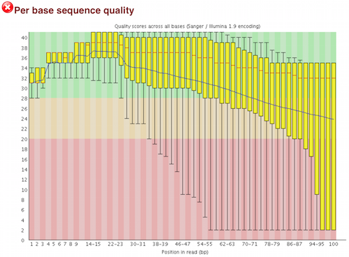

## Learning Objectives:
* Explore trimming strategies for improving the quality of FASTQ reads
* Use a `for loop` to automate operations on multiple files

## Quality Control - Trimming

So far we have run our raw reads through FastQC to assess the quality of our sequencing reads. Now we are going to improve the quality of our reads, by **trimming** off any "bad" bases.


Remember, that for our raw fastq data, we found the quality of the bases decreasing towards the 3' ends of the reads:



Raw sequencing reads can exhibit this decreasing sequence quality at the 3' ends; it used to be more common and more dramatic, but the Illumina set up has gotten better with time. We can improve the overall quality of our data by trimming off the poor quality bases; in addition, we can also trim off any contaminating vector or adapter sequences from the reads. 

> **Why Trim?**: Sequencing reads containing poor quality bases or contaminating sequences won't match the reference genome or transcriptome as well, making it difficult to align them to the known sequences.

> **When is Trimming unnecessary?**: When you are not planning to perform alignment-based counting, and instead use tools like Sailfish to perform alignment-free counting. We will cover alignment-free counting in session IV. 

## Trimming Tools  

Quality trimming can be accomplished either by removing the bases entirely from the sequence using a trimming tool or by an alignment tool that *"soft clips"* the low quality bases. Soft clipping doesn't actually remove the sequence, but the clipped sequence is skipped over or ignored when performing downstream operations. Although many alignment tools can perform the soft clipping of low quality bases, they **cannot** remove adapter or vector sequences. Therefore, if you use soft clipping and have a known issue with adapter or contamination, it is still recommended that you use a tool that removes these sequences from your reads prior to alignment.

Many trimming tools have been developed to perform quality and adapter trimming, but there are various strategies employed, and the tool or strategy chosen often relates to the personal preference of the user and the downstream tools to be used.

Trimming tools can perform sequence trimming using the following strategies:

**Quality trimming methods:**

- **base-by-base:** remove individual bases if it is below a certain quality threshold
- **sliding window approach:**
	- remove all bases of the window and 3' of the window if the average quality across a window size (e.g. 5 bases) is below a specific quality threshold
	-  remove all bases of the window and 3' of the window if a specific percentage of bases in window is below a specific quality threshold (e.g. remove bases if % good quality bases in window ≤ 70%)
- **hard crop:** remove a certain number of bases from the ends of all reads (e.g. remove 12 bases from all reads at 5’ end)
- **read removal:** if % good quality bases in whole read is below a specific threshold discard read (e.g. discard read if % good quality bases ≤ 70%)

**Other trimming options:**

- **adapter trimming:** trim any left over adapter sequences (usually at 5’ end for SE)
- **minimum length removal:** remove read if the read length is below a certain threshold


## Trimmomatic

We will use [*Trimmomatic*](http://www.usadellab.org/cms/?page=trimmomatic) to trim away adapters and filter out poor quality score reads. *Trimmomatic* is a java based program that can remove sequencer specific reads and nucleotides that fall below a certain threshold. *Trimmomatic* offers the option to trim reads using a hard crop, sliding window or base-by-base methods. It can also trim adapter sequences and remove reads if below a minimum length. In addition, *Trimmomatic* can be multi-threaded to run quickly using a single, complex command. 

Let's start an interactive session with 6 cores:
	
``` bash
$ bsub -Is -n 6 -q interactive bash
```

Let's check for the *Trimmomatic* module and load it:

``` bash
$ module avail seq/
$ module load seq/Trimmomatic/0.33
```


By loading the *Trimmomatic* module, the **trimmomatic-0.33.jar** file is now accessible to us in the **opt/** directory, allowing us to run the program. 

``` bash
$ echo $PATH
```

Because *Trimmomatic* is java based, it is run using the `java -jar` command:

``` bash
# DO NOT RUN THIS
java -jar /opt/Trimmomatic-0.33/trimmomatic-0.33.jar SE \
-threads 6 \
inputfile \
outputfile \
OPTION:VALUE... 
#DO NOT RUN THIS
```

`java -jar` calls the Java program, which is needed to run *Trimmomatic*, which is a 'jar' file (`trimmomatic-0.33.jar`). A 'jar' file is a special kind of java archive that is often used for programs written in the Java programming language.  If you see a new program that ends in '.jar', you will know it is a java program that is executed `java -jar` <*location of program .jar file*>.  

The `SE` argument is a keyword that specifies we are working with single-end reads. We have to specify the `-threads` parameter because *Trimmomatic* uses all threads on a node by default.

The next two arguments are input file and output file names. These are then followed by a series of options. The options tell the *Trimmomatic* program exactly how you want it to operate. *Trimmomatic* has a variety of options and parameters:

* **_SE_** or **_PE_** Single End or Paired End reads?
* **_-threads_** How many processors do you want *Trimmomatic* to run with?  
* **_-phred33_** or **_-phred64_** Which quality score do your reads have?
* **_SLIDINGWINDOW_** Perform sliding window trimming, cutting once the average quality within the window falls below a threshold.
* **_LEADING_** Cut bases off the start of a read, if below a threshold quality.
* **_TRAILING_** Cut bases off the end of a read, if below a threshold quality.
* **_CROP_** Cut the read to a specified length.
* **_HEADCROP_** Cut the specified number of bases from the start of the read.
* **_MINLEN_** Drop an entire read if it is below a specified length.
* **_ILLUMINACLIP_** Cut adapter and other illumina-specific sequences from the read
* **_TOPHRED33_** Convert quality scores to Phred-33.
* **_TOPHRED64_** Convert quality scores to Phred-64.

### Running Trimmomatic 

Change directories to the untrimmed fastq data location:

``` bash
$ cd ~/ngs_course/rnaseq/data/untrimmed_fastq
```

Since the *Trimmomatic* command is complicated and we will be running it a number of times, let's draft the command in a **text editor**, such as Sublime Text, TextWrangler or Notepad++. When finished, we will copy and paste the command into the terminal.

For the single fastq input file `Mov10_oe_1.subset.fq`, the command is:

``` bash
$ java -jar /opt/Trimmomatic-0.33/trimmomatic-0.33.jar SE \
-threads 6 \
-phred33 \
Mov10_oe_1.subset.fq \
../trimmed_fastq/Mov10_oe_1.qualtrim25.minlen35.fq \
ILLUMINACLIP:/opt/Trimmomatic-0.33/adapters/TruSeq3-SE.fa:2:30:10 \
TRAILING:25 \
MINLEN:35
```
**The backslashes at the end of the lines allow us to continue our script on new lines, which helps with readability of some long commands.** 

> The above command can also be written as:
>
> `java -jar /opt/Trimmomatic-0.33/trimmomatic-0.33.jar SE -threads 6 -phred33 Mov10_oe_1.subset.fq ../trimmed_fastq/Mov10_oe_1.qualtrim25.minlen35.fq ILLUMINACLIP:/opt/Trimmomatic-0.33/adapters/TruSeq3-SE.fa:2:30:10 TRAILING:25 MINLEN:35`

This command tells *Trimmomatic* to run on a fastq file containing Single-End reads (``Mov10_oe_1.subset.fq``, in this case) and to name the output file ``Mov10_oe_1.qualtrim25.minlen35.fq``. The program will remove Illumina adapter sequences given by the file, `TruSeq3-SE.fa` and will cut nucleotides from the 3' end of the sequence if their quality score is below 25. The entire read will be discarded if the length of the read after trimming drops below 35 nucleotides.

After the job finishes, you should see the *Trimmomatic* output in the terminal: 

```
TrimmomaticSE: Started with arguments: -threads 6 -phred33 Mov10_oe_1.subset.fq ../trimmed_fastq/Mov10_oe_1.qualtrim25.minlen35.fq ILLUMINACLIP:/opt/Trimmomatic-0.33/adapters/TruSeq3-SE.fa:2:30:10 TRAILING:25 MINLEN:35
Using Long Clipping Sequence: 'AGATCGGAAGAGCGTCGTGTAGGGAAAGAGTGTA'
Using Long Clipping Sequence: 'AGATCGGAAGAGCACACGTCTGAACTCCAGTCAC'
ILLUMINACLIP: Using 0 prefix pairs, 2 forward/reverse sequences, 0 forward only sequences, 0 reverse only sequences
Input Reads: 305900 Surviving: 300423 (98.21%) Dropped: 5477 (1.79%)
TrimmomaticSE: Completed successfully
```

Now that we know the command successfully runs, let's make the *Trimmomatic* command into a submission script. A submission script is oftentimes preferable to executing commands on the terminal because we can use it to store the parameters we used for a command(s) inside a file, and helps with reproducibility. In the future, if we forget which parameters we used during our analysis, we can just check our script. If we need to run the program on other files, we can easily change the script. 

### Running Trimmomatic on all files using a script

To run the *Trimmomatic* command on a worker node via the job scheduler, we need to create a submission script with two important components:

1. our **LSF directives** at the **beginning** of the script. This is so that the scheduler knows what resources we need in order to run our job on the compute node(s).

2. the commands to be run in order

We already know how to run *Trimmomatic*, but there is some good news and bad news. One should always ask for the bad news first.  ***Trimmomatic* only operates on one input file at a time** and we have more than one input file.  The good news? We already know how to use a **'for' loop** to deal with this situation. 

Let's write an LSF submission script to run the *Trimmomatic* command for every raw fastq file using a 'for' loop. Let's also run *FastQC* on each of our trimmed fastq files to evaluate the quality of our reads post-trimming:

``` bash
vim trimmomatic_mov10_allfiles.lsf
```

``` bash
#!/bin/bash

#BSUB -q priority 		# queue name
#BSUB -W 2:00 		# hours:minutes runlimit after which job will be killed.
#BSUB -n 6 		# number of cores requested
#BSUB -J rnaseq_mov10_qc         # Job name
#BSUB -o %J.out       # File to which standard out will be written
#BSUB -e %J.err       # File to which standard err will be written

# Load modules necessary for running commands

module load seq/Trimmomatic/0.33
module load seq/fastqc/0.11.3

# Change directories to folder where fastq files are located

cd ~/ngs_course/rnaseq/data/untrimmed_fastq

# Run a 'for loop' to run the Trimmomatic command on each of the untrimmed fastq files

for infile in *.fq
   do

  # Create names for the output trimmed files
  	outfile=$infile.qualtrim25.minlen35.fq
  
 # Run Trimmomatic command
	java -jar /opt/Trimmomatic-0.33/trimmomatic-0.33.jar SE \
  	-threads 6 \
  	-phred33 \
  	$infile \
  	../trimmed_fastq/$outfile \
	ILLUMINACLIP:/opt/Trimmomatic-0.33/adapters/TruSeq3-SE.fa:2:30:10 \
  	TRAILING:25 \
  	MINLEN:35
  	
   done
    
# Run FastQC on each of the trimmed fastq files

fastqc -t 6 ../trimmed_fastq/*.fq

# Create a directory for the trimmed FastQC results

mkdir ../../results/fastqc_trimmed_reads

# Move FastQC results to the new directory

mv ../trimmed_fastq/*fastqc* ../../results/fastqc_trimmed_reads
```


``` bash
$ bsub < trimmomatic_mov10_allfiles.lsf
```

It is good practice to load the modules we plan to use at the beginning of the script. Therefore, if we run this script in the future, we don't have to worry about whether we have loaded all of the necessary modules prior to executing the script. In addition, we are able to keep track of the tool versions used, for reproducibility.

Do you remember how the variable name in the first line of a 'for loop' specifies a variable that is assigned the value of each item in the list in turn?  We can call it whatever we like.  This time it is called `infile`.  Note that the fifth line of this 'for loop' is creating a second variable called `outfile`.  We assign it the value of `$infile` with `'.qualtrim25.minlen35.fq'` appended to it. **There are no spaces before or after the '='.**

``` bash
ls -lh data/trimmed_fastq`
```

Use *FileZilla* to download the FastQC html file for `Mov10_oe_1.subset.fq`. Has our read quality improved with trimming?

### Trimmomatic with paired-end data


**How would our command change if we were using paired-end data?**

``` bash
java -jar /opt/Trimmomatic-0.33/trimmomatic-0.33.jar PE \
-phred33 \
-threads 6 \
-trimlog raw_fastq/trimmomatic.log \
<input 1> <input 2> \
<paired output 1> <unpaired output 1> \
<paired output 2> <unpaired output 2> \
ILLUMINACLIP:/opt/Trimmomatic-0.33/adapters/TruSeq3-PE.fa:2:30:10 \
TRAILING:25 \
MINLEN:35
```
***

*This lesson has been developed by members of the teaching team at the [Harvard Chan Bioinformatics Core (HBC)](http://bioinformatics.sph.harvard.edu/). These are open access materials distributed under the terms of the [Creative Commons Attribution license](https://creativecommons.org/licenses/by/4.0/) (CC BY 4.0), which permits unrestricted use, distribution, and reproduction in any medium, provided the original author and source are credited.*

* *The materials used in this lesson was derived from work that is Copyright © Data Carpentry (http://datacarpentry.org/). 
All Data Carpentry instructional material is made available under the [Creative Commons Attribution license](https://creativecommons.org/licenses/by/4.0/) (CC BY 4.0).*
