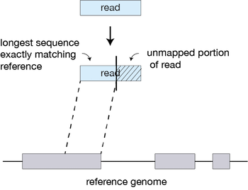
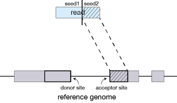
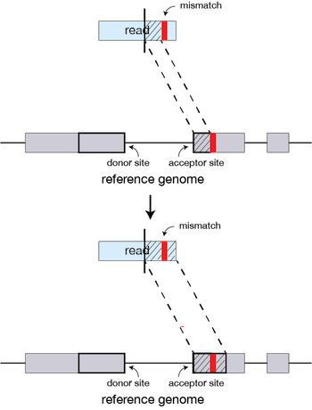
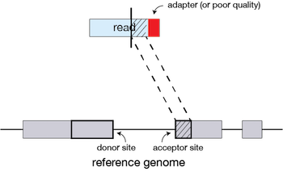
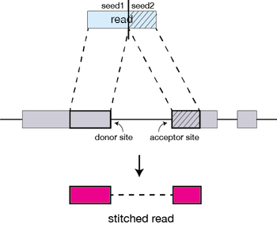

Approximate time: 90 minutes

## Learning Objectives:

* Understanding the alignment method STAR utilizes to align sequence reads to the reference genome
* Identifying the intricacies of alignment tools used in NGS analysis (parameters, usage, etc)
* Choosing appropriate STAR alignment parameters for our dataset
* Running STAR on multiple samples

## Read Alignment


Now that we have our quality-trimmed reads, we can move on to read alignment. We perform read alignment or mapping to determine where in the genome are reads originated from. The alignment process consists of choosing an appropriate reference genome to map our reads against and performing the read alignment using one of several splice-aware alignment tools such as [STAR](http://bioinformatics.oxfordjournals.org/content/early/2012/10/25/bioinformatics.bts635) or [HISAT2](http://ccb.jhu.edu/software/hisat2/index.shtml). The choice of aligner is often a personal preference and also dependent on the computational resources that are available to you.

## STAR Aligner

To determine where on the human genome our reads originated from, we will align our reads to the reference genome using [STAR](http://www.ncbi.nlm.nih.gov/pmc/articles/PMC3530905/) (Spliced Transcripts Alignment to a Reference). STAR is an aligner designed to specifically address many of the challenges of RNA-seq data mapping using a strategy to account for spliced alignments. 

### STAR Alignment Strategy

STAR is shown to have high accuracy and outperforms other aligners by more than a factor of 50 in mapping speed, but is memory intensive. The algorithm achieves this highly efficient mapping by performing a two-step process:

1. Seed searching
2. Clustering, stitching, and scoring

#### Seed searching

For every read that STAR aligns, STAR will search for the longest sequence that exactly matches one or more locations on the reference genome. These longest matching sequences are called the Maximal Mappable Prefixes (MMPs):


	
The different parts of the read that are mapped separately are called 'seeds'. So the first MMP that is mapped to the genome is called *seed1*.

STAR will then search again for only the unmapped portion of the read to find the next longest sequence that exactly matches the reference genome, or the next MMP, which will be *seed2*. 



This sequential searching of only the unmapped portions of reads underlies the efficiency of the STAR algorithm. STAR uses an uncompressed suffix array (SA) to efficiently search for the MMPs, this allows for quick searching against even the largest reference genomes. Other slower aligners use algorithms that often search for the entire read sequence before splitting reads and performing iterative rounds of mapping.

**If STAR does not find an exact matching sequence** for each part of the read due to mismatches or indels, the previous MMPs will be extended.



**If extension does not give a good alignment**, then the poor quality or adapter sequence (or other contaminating sequence) will be soft clipped.




#### Clustering, stitching, and scoring

The separate seeds are stitched together to create a complete read by first clustering the seeds together based on proximity to a set of 'anchor' seeds, or seeds that are not multi-mapping.

Then the seeds are stitched together based on the best alignment for the read (scoring based on mismatches, indels, gaps, etc.). 



## Running STAR

### Set-up

To get started with this lesson, start an interactive session with 6 cores:

```
$ bsub -Is -n 6 -q interactive bash	
```

You should have a directory tree setup similar to that shown below. it is best practice to have all files you intend on using for your workflow present within the same directory. In our case, we have our original FASTQ files and post-trimming data generated in the previous section. We also have all reference data files that will be used in downstream analyses.

```
rnaseq
	├── data
	│   ├── reference_data
	│   │   └── chr1.fa
	│   │   └── chr1-hg19_genes.gtf
 	|   ├── untrimmed_fastq
	│   │   
	│   └── trimmed_fastq
	│       ├── Irrel_kd_1.subset.fq.qualtrim25.minlen35.fq
	│       ├── Irrel_kd_2.subset.fq.qualtrim25.minlen35.fq
	│       ├── Irrel_kd_3.subset.fq.qualtrim25.minlen35.fq
	│       ├── Mov10_oe_1.subset.fq.qualtrim25.minlen35.fq
	│       ├── Mov10_oe_2.subset.fq.qualtrim25.minlen35.fq
	│       └── Mov10_oe_3.subset.fq.qualtrim25.minlen35.fq
	|
	├── meta
	├── results
	└── logs
```

Change directories into the `reference_data` folder. 

```
$ cd ~/ngs_course/rnaseq/data/reference_data
```

To use the STAR aligner, load the Orchestra module: 

```
$ module load seq/STAR/2.5.2a
```

Aligning reads using STAR is a two step process:   

1. Create a genome index 
2. Map reads to the genome

> A quick note on shared databases for human and other commonly used model organisms. The Orchestra cluster has a designated directory at `/groups/shared_databases/` in which there are files that can be accessed by any user. These files contain, but are not limited to, genome indices for various tools, reference sequences, tool specific data, and data from public databases, such as NCBI and PDB. So when using a tool and requires a reference of sorts, it is worth taking a quick look here because chances are it's already been taken care of for you. 

```
$ ls -l /groups/shared_databases/igenome/
```

### Creating a genome index

For this workshop we are using reads that originate from a small subsection of chromosome 1 (~300,000 reads) and so we are using only chr1 as the reference genome. 

To store our genome indices, we need to create a directory:

```
$ mkdir my_genome_index
```

The basic options to **generate genome indices** using STAR are as follows:


* `--runThreadN`: number of threads
* `--runMode`: genomeGenerate mode
* `--genomeDir`: /path/to/store/genome_indices
* `--genomeFastaFiles`: /path/to/FASTA_file 
* `--sjdbGTFfile`: /path/to/GTF_file
* `--sjdbOverhang`: readlength -1

> *NOTE:* In case of reads of varying length, the ideal value for `--sjdbOverhang` is max(ReadLength)-1. In most cases, the default value of 100 will work similarly to the ideal value.

Now let's create a job submission script to generate the genome index:

```
$ vim genome_index.lsf
```
Within `vim` we now add our shebang line, the Orchestra LSF directives, and our STAR command. 

```
#!/bin/bash

#BSUB -q priority # queue name
#BSUB -W 2:00 # hours:minutes runlimit after which job will be killed.
#BSUB -n 6 # number of cores requested
#BSUB -J STAR_index         # Job name
#BSUB -o %J.out       # File to which standard out will be written
#BSUB -e %J.err       # File to which standard err will be written

module load seq/STAR/2.5.2a

STAR --runThreadN 6 \
--runMode genomeGenerate \
--genomeDir my_genome_index \
--genomeFastaFiles chr1.fa \
--sjdbGTFfile chr1-hg19_genes.gtf \
--sjdbOverhang 99

```

```
$ bsub < genome_index.lsf 
```

### Aligning reads

After you have the genome indices generated, you can perform the read alignment. We previously generated the genome indices for you in `/groups/hbctraining/ngs-data-analysis2016/rnaseq/reference_data/reference_STAR` directory so that we don't get held up waiting on the generation of the indices.

To get started with read alignment, change directories to the `trimmed_fastq` folder and remove the extra `Mov10_oe_1` trimmed file that we currently have. This will save us problems with duplicate samples down the road: 

```bash

$ cd ~/ngs_course/rnaseq/data/trimmed_fastq/
$ rm Mov10_oe_1.qualtrim25.minlen35.fq
```

Create an output directory for our alignment files:

	$ mkdir ../../results/STAR


We are going to explore how to **automate running the STAR command** by doing the following:

1. running it in the *interactive shell* to ensure the command is functional
2. specifying *filename as a command line parameter* when running the STAR command from a script
3. executing the command *in parallel for all files* from a script

### STAR command in interactive bash

For now, we're going to work on just one sample to set up our workflow. To start we will use the trimmed first replicate in the Mov10 over-expression group, `Mov10_oe_1.subset.fq.qualtrim25.minlen35.fq`. Details on STAR and its functionality can be found in the [user manual](https://github.com/alexdobin/STAR/blob/master/doc/STARmanual.pdf); we encourage you to peruse through to get familiar with all available options.

The basic options for aligning reads to the genome using STAR are:

* `--runThreadN`: number of threads / cores
* `--readFilesIn`: /path/to/FASTQ_file
* `--genomeDir`: /path/to/genome_indices_directory
* `--outFileNamePrefix`: prefix for all output files

Listed below are additional parameters that we will use in our command:

* `--outSAMtype`: output filetype (SAM default)
* `--outSAMunmapped`: what to do with unmapped reads
* `--outSAMattributes`: specify SAM attributes in output file

> **NOTE:** Default filtering is applied in which the maximum number of multiple alignments allowed for a read is set to 10. If a read exceeds this number there is no alignment output. To change the default you can use `--outFilterMultimapNmax`, but for this lesson we will leave it as default. Also, note that "**STAR’s default parameters are optimized for mammalian genomes.** Other species may require significant modifications of some alignment parameters; in particular, the maximum and minimum intron sizes have to be reduced for organisms with smaller introns" [[1](http://bioinformatics.oxfordjournals.org/content/early/2012/10/25/bioinformatics.bts635.full.pdf+html)].

We can access the software by simply using the STAR command followed by the basic parameters described above and any additional parameters. The full command is provided below for you to copy paste into your terminal. If you want to manually enter the command, it is advisable to first type out the full command in a text editor (i.e. [Sublime Text](http://www.sublimetext.com/) or [Notepad++](https://notepad-plus-plus.org/)) on your local machine and then copy paste into the terminal. This will make it easier to catch typos and make appropriate changes. 

```
# DO NOT RUN THIS!

STAR --genomeDir /groups/hbctraining/ngs-data-analysis2016/rnaseq/reference_data/reference_STAR \
--runThreadN 6 \
--readFilesIn Mov10_oe_1.subset.fq.qualtrim25.minlen35.fq \
--outFileNamePrefix ../../results/STAR/Mov10_oe_1_ \
--outSAMtype BAM SortedByCoordinate \
--outSAMunmapped Within \
--outSAMattributes Standard 

# DO NOT RUN THIS!
```

### Running STAR script to take a filename as input

The interactive queue on Orchestra offers a great way to test commands to make sure they perform the way you intend before adding them a script. Now that we know the STAR command executed properly, we want to create a script with some flexibility that will take a filename as input to run the STAR command.

#### Positional parameters

**Positional parameters** allow flexibility within a script. These are special variables that allow us to change the values in a script by entering those values as command line arguments. For example, the following command has two command line arguments specified:

```
$ sh script.sh filename.fq
```

The command is 'sh', and the arguments are the name of the script, "script.sh" and the name of the fastq file, "filename.fq". The argument after the command is designated as $0 (script.sh), and the argument after $0 is $1 (filename.fq).

*The command-line arguments $1, $2, $3,...$9 are positional parameters, with $0 pointing to the actual command, program or shell script, and $1, $2, $3, ...$9 as the arguments to the command." This basically means that "Script Name" == $0, "First Parameter" == $1, "Second Parameter" == $2 and so on...*

We can specify a filename to use as input to a script using **positional parameters**. To explore this using positional parameters, let's create a script called `word_count.sh` to count the number of words, lines, and characters in a specified file:

```
$ vim word_count.sh
```
In the script, write the following:

```
#!/bin/bash

# Exploring positional parameters

wc $1
```

We can run this script by entering the following:

```
$ sh word_count.sh Mov10_oe_1.subset.fq.qualtrim25.minlen35.fq
```
In this command, `word_count.sh` is $0 and `Mov10_oe_1.subset.fq.qualtrim25.minlen35.fq` is $1. Whatever we enter in the $1 position when we run the command will be used in place of $1 inside the script for `wc $1`.

Let's say we wanted to specify as input the option or flag of the `wc` command to return the number of words, lines, or characters. We could create another variable, $2 as the flag for `wc`:

```
#!/bin/bash

# Exploring positional parameters

wc -$2 $1
```
Now we can determine the number of **lines** in the Mov10 rep1 file with:

```
sh word_count.sh Mov10_oe_1.subset.fq.qualtrim25.minlen35.fq l
```

In this command, `word_count.sh` is $0 and `Mov10_oe_1.subset.fq.qualtrim25.minlen35.fq` is $1 and `l` is $2. When these parameters are used in the script, the full command executed is: `wc -l Mov10_oe_1.subset.fq.qualtrim25.minlen35.fq`.

[This is an example of a simple script that used the concept of positional parameters and the associated variables.](http://steve-parker.org/sh/eg/var3.sh.txt)

#### Using positional parameters to specify an input filename for the STAR command

Now let's write a script to run the STAR command and use positional parameters to specify which filename to run the script on:

```
$ vim star_analysis_on_input_file.sh
```

Within the script, add the shebang line and create a variable named `fq` to be the first command line parameter used when running the script:

```
#!/bin/bash

fq=$1
```

Next, we'll initialize variables that contain the paths to where the common files are stored and then use the variable names (with a $) in the actual commands later in the script. This is a shortcut for when you want to use this script for a dataset that used a different genome, e.g. mouse; you'll just have to change the contents of these variable at the beginning of the script.

```
# location of genome reference index files

genome=/groups/hbctraining/ngs-data-analysis2016/rnaseq/reference_data/reference_STAR 

# set up our software environment

module load seq/STAR/2.5.2a

# feedback from our script to help with future debugging

echo "Processing file $fq ..."

# set up output filenames and locations

align_out=~/ngs_course/rnaseq/results/STAR/${fq}_
```

Our variables are now staged. We now need to modify the STAR command to use it so that it will run the steps of the analytical workflow with more flexibility:

```
# Run STAR
STAR --runThreadN 6 \
--genomeDir $genome \
--readFilesIn $fq \
--outFileNamePrefix $align_out \
--outSAMtype BAM SortedByCoordinate \
--outSAMunmapped Within \
--outSAMattributes Standard 
```
It is always nice to have comments at the top of a more complex script to make sure that when your future self, or a co-worker, uses it they know exactly how to run it and what the script will do. So for our script, we can have the following lines of comments right at the top after #!/bin/bash/:

```
# This script takes a trimmed fastq file of RNA-Seq data and outputs STAR alignment files.
# USAGE: sh star_analysis_on_input_file.sh <name of fastq file>
```

Once you save this new script, it is ready for running:

```
$ chmod u+rwx star_analysis_on_input_file.sh      # make it executable, this is good to do, even if your script runs fine without it to ensure that it always does and you are able to tell that it's an executable shell script.

$ sh star_analysis_on_input_file.sh <name of fastq>
```

#### Running our script iteratively as a job submission to the LSF scheduler

The above script will run in an interactive session for one file at a time, but **what if we wanted to run this script as a job submission to LSF, and with only one command have LSF run through the analysis for all your input fastq files**?

To run the above script iteratively for all of the files on a worker node via the job scheduler, we could write a **new submission script** that uses a **for loop** to iterate through and run the above script for all the fastq files.

```
# DO NOT RUN THIS!

#!/bin/bash
#BSUB -q priority       # Partition to submit to (comma separated)
#BSUB -n 6                  # Number of cores, since we are running the STAR command with 6 threads
#BSUB -W 1:30               # Runtime in D-HH:MM (or use minutes)
#BSUB -R "rusage[mem=4000]"    # Memory in MB
#BSUB -J rnaseq_mov10         # Job name
#BSUB -o %J.out       # File to which standard out will be written
#BSUB -e %J.err       # File to which standard err will be written

# this 'for loop', will take our trimmed fastq files as input and run the script for all of them one after the other. 

cd ~/ngs_course/rnaseq/data/trimmed_fastq/

for file in *.fq 
do
sh ~/ngs_course/rnaseq/data/trimmed_fastq/star_analysis_on_input_file.sh $file
done

# DO NOT RUN THIS!
```

### Parallelizing workflow for efficiency

The above script will run through the analysis for all your input fastq files, but it will do so in serial. **We can set it up so that the pipeline is working on all the trimmed data in parallel (at the same time)**. This will save us a lot of time when we have realistic datasets.

Let's make a modified version of the above script to parallelize our analysis. To do this need to modify one major aspect which will enable us to work with some of the constraints that this scheduler (LSF) has. We will be using a `for loop` for submission and putting the directives for each submission in the bsub command.

Let's make a new file called `star_analysis_on_allfiles-for_lsf.sh`. Note this is a normal shell script.

```
$ vim star_analysis_on_allfiles_for-lsf.sh
```

This file will loop through the same files as in the previous script, but the command it submits will be the actual bsub command:

```
#!/bin/bash

cd ~/ngs_course/rnaseq/data/trimmed_fastq/

for file in *.fq
do
bsub -q priority -n 6 -W 1:30 -R "rusage[mem=4000]" -J rnaseq_mov10 -o %J.out -e %J.err sh ~/ngs_course/rnaseq/data/trimmed_fastq/star_analysis_on_input_file.sh $file
sleep 1
done
```

Now, let's run the job to submit jobs to LSF for each fastq file in the `trimmed_fastq` folder:
```
$ sh star_analysis_on_allfiles_for-lsf.sh
```

>NOTE: All job schedulers are similar, but not the same. Once you understand how one works, you can transition to another one without too much trouble. They all have their pros and cons that the system administrators for your setup have taken into consideration and picked one that fits the needs of the users best.

What you should see on the output of your screen would be the jobIDs that are returned from the scheduler for each of the jobs that your script submitted.

You can see their progress by using the `bjobs` command (though there is a lag of about 60 seconds between what is happening and what is reported).

Don't forget about the `bkill` command, should something go wrong and you need to cancel your jobs.

### Log files

Last but not least, it is best practice to keep everything contained within the planned storage that you had created when setting up for this project. There should be a number of standard error (`.err`) and standard out (`.out`) files that you will want to keep for future reference. Move these over to your `logs` folder: 

	$ mv *.err ../../logs
	$ mv *.out ../../logs

---
*This lesson has been developed by members of the teaching team at the [Harvard Chan Bioinformatics Core (HBC)](http://bioinformatics.sph.harvard.edu/). These are open access materials distributed under the terms of the [Creative Commons Attribution license](https://creativecommons.org/licenses/by/4.0/) (CC BY 4.0), which permits unrestricted use, distribution, and reproduction in any medium, provided the original author and source are credited.*
