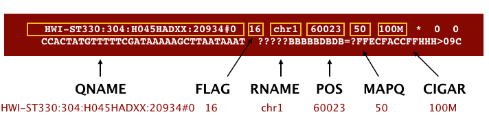
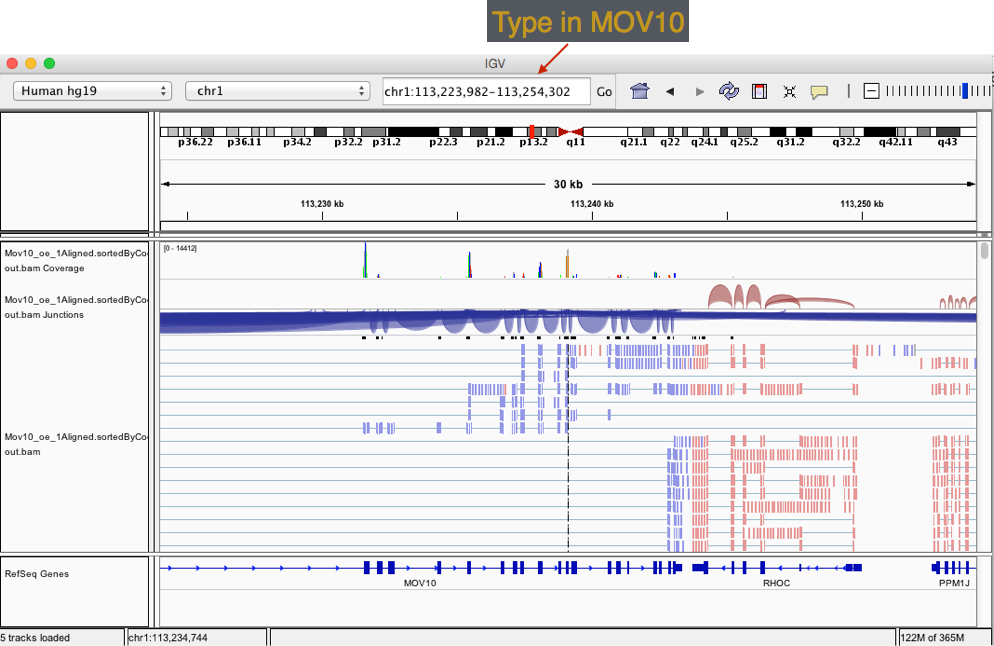

Approximate time: 120 minutes

## Learning objectives

* Evaluating the STAR aligner output files
* Understanding the standard alignment file (SAM/BAM) structure
* Using `samtools` to evaluate alignment quality 
* Visualizing alignment quality using IGV (genome browser)  


## Assessing alignment quality

After running our FASTQ files through the STAR aligner, you should have noticed a number of output files in the `~/ngs_course/rnaseq/results/STAR` directory. Let's take a quick look at some of the files that were generated and explore the content of some of them. 

	$ cd ~/ngs_course/rnaseq/results/STAR
	
	$ ls -lh

What you should see, is that for each FASTQ file you have **5 output files** and a single tmp directory. Briefly, these files are described below:

* `Log.final.out` - a summary of mapping statistics for the sample
* `Aligned.sortedByCoord.out.bam` - the aligned reads, sorted by coordinate, in BAM format
* `Log.out` - a running log from STAR, with information about the run 
* `Log.progress.out` -  job progress with the number of processed reads, % of mapped reads etc., updated every ~1 minute
* `SJ.out.tab` - high confidence collapsed splice junctions in tab-delimited format. Only junctions supported by uniquely mapping reads are reported

## Mapping statistics

Having completed the alignment, the first thing we want to know is how well did our reads align to the reference. Rather than looking at each read alignment, it can be more useful to evaluate statistics that give a general overview for the sample. One of the output files from the STAR aligner contains mapping statistics, let's take a closer look at one of those files. We'll use the `less` command which allows us to scroll through it easily: 

	$ less Mov10_oe_1.subset.fq.qualtrim25.minlen35.fq_Log.final.out
	
The log file provides information on reads that 1) mapped uniquely, 2) reads that mapped to mutliple locations and 3) reads that are unmapped. Additionally, we get details on splicing, insertion and deletion. From this file the most informative statistics include the **mapping rate and the number of multimappers**.

* As an example, a good quality sample will have **at least 75% of the reads uniquely mapped**. Once values start to drop lower than 60% it's advisable to start troubleshooting. The lower the number of uniquely mapping reads means the higher the number of reads that are mapping to multiple locations. It is best to keep this number low because multi-mappers are not included when we start counting reads

> NOTE: The thresholds suggested above will vary depending on the organism that you are working with. Much of what is discussed here is in the context of working with human or mouse data. For example, 75% of mapped reads holds true only if the genome is good or mature. For badly assembled genomes we may not observe a high mapping rate, even if the actual sequence sample is good.


In addition to the aligner-specific summary we can also obtain quality metrics using tools like [Qualimap](http://qualimap.bioinfo.cipf.es/doc_html/intro.html#what-is-qualimap). Qualimap is an application that provides both a Graphical User Interface (GUI) and a command-line interface to facilitate the quality control of alignment sequencing data. The tool examines sequencing alignment data according to the features of the mapped reads and their genomic properties and provides an overall view of the data that helps to to the detect biases in the sequencing and/or mapping of the data.

The input for Qualimap can be one or more BAM files and the output consists of HTML or PDF reports with useful figures and tab delimited files of metrics data.The tool has different analyses available to run including BAMQC, RNASeq-QC, and CountsQC and can be useful for comparing sequencing quality across different samples, but can also be run on individual samples. We will not be using this tool in the course, but describe some of the features of RNASeq-QC specifically, to point out things to look for when assessing alignment quality of RNA-seq data:

reads genomic origin, junction analysis, transcript coverage and 5’-3’ bias computation
* Reads genomic origin: Even if you have high genomic mapping rate for all samples, check to see where the reads are mapping. Ensure that there is not an unusually high number of **reads mapping to intronic regions** (~30% expected) and fewer than normally observed **mapping to exons** (~55%). A high intronic mapping suggests possible genomic DNA contamination and/or pre-mRNA. 
* Transcript coverage and 5'-3' bias computation
* Junction analysis: analysis of junction positions in spliced alignments (i.e known, partly known, novel) 
* Ribosomal RNA (rRNA) constitutes a large majority of the RNA species in any total RNA preparation. Despite depletion methods, you can never achieve complete rRNA removal. Even with Poly-A enrichment a small percentage of ribosomal RNA can stick to the enrichment beads non-specifically. **Excess ribosomal content (> 2%)** will normally have to be filtered out so that differences in rRNA mapped reads across samples do not affect alignment rates and skew subsequent normalization of the data. *This is not done by Qualimap.*
* GC bias and strand specificity


*** 

**Exercise**

Using the less command take a look at `Mov10_oe_1.subset.fq.qualtrim25.minlen35.fq_Log.final.out` and answer the following questions:

1. How many reads map to more than 10 locations on the genome?
2. How many reads are unmapped due to read length?
3. What is the average mapped length per read?

***


## Alignment file format: SAM/BAM

The output we requested from the STAR aligner (using the appropriate parameters) is a BAM file. By default STAR will return a file in SAM format. BAM is a binary, compressed version of the SAM file, also known as **Sequence Alignment Map format**. The SAM file, introduced is a tab-delimited text file that contains information for each individual read and its alignment to the genome. While we will go into some features of the SAM format, the paper by [Heng Li et al](http://bioinformatics.oxfordjournals.org/content/25/16/2078.full) provides a lot more detail on the specification.

The file begins with a **header**, which is optional. The header is used to describe source of data, reference sequence, method of alignment, etc., this will change depending on the aligner being used. Each section begins with character ‘@’ followed by a two-letter record type code.  These are followed by two-letter tags and values. Example of some common sections are provided below:

```
@HD  The header line
VN: format version
SO: Sorting order of alignments

@SQ  Reference sequence dictionary
SN: reference sequence name
LN: reference sequence length
SP: species

@PG  Program
PN: program name
VN: program version
```

Following the header is the **alignment section**. Each line that follows corresponds to alignment information for a single read. Each alignment line has **11 mandatory fields for essential mapping information** and a variable number of other fields for aligner specific information. 



An example read mapping is displayed above. *Note that the example above spans two lines, but in the file it is a single line.* Let's go through the fields one at a time. First, you have the read name (`QNAME`), followed by a `FLAG` 


The `FLAG` value that is displayed can be translated into information about the mapping. 

| Flag | Description |
| ------:|:----------------------:|
| 1 | read is mapped |
| 2 | read is mapped as part of a pair |
| 4 | read is unmapped |
| 8 | mate is unmapped |
| 16| read reverse strand|
| 32 | mate reverse strand |
| 64 | first in pair |
| 128 | second in pair |
| 256 | not primary alignment |
| 512 | read fails platform/vendor quality checks |
| 1024| read is PCR or optical duplicate |

* For a given alignment, each of these flags are either **on or off** indicating the condition is **true or false**. 
* The `FLAG` is a combination of all of the individual flags (from the table above) that are true for the alignment 
* The beauty of the flag values is that any combination of flags can only result in one sum.

In our example we have a number that exist in the table, making it relatively easy to translate. But suppose our read alignment has a flag of 163 -- what does this translate to? It is the sum of 4 different flags:

`163 = 1 + 2 + 32 + 128  `

Which tells us that:  

1. the read is mapped
2. the read is mapped as part of a pair
3. this is the mate reverse strand
4. this read is the second of the pair

**There are tools that help you translate the bitwise flag, for example [this one from Picard](https://broadinstitute.github.io/picard/explain-flags.html)**

Moving along the fields of the SAM file, we then have `RNAME` which is the reference sequence name. The example read is from chromosome 1 which explains why we see 'chr1'. `POS` refers to the 1-based leftmost position of the alignment. `MAPQ` is giving us the alignment quality, the scale of which will depend on the aligner being used. 


`CIGAR` is a sequence of letters and numbers that represent the *edits or operations* required to match the read to the reference. The letters are operations that are used to indicate which bases align to the reference (i.e. match, mismatch, deletion, insertion), and the numbers indicate the associated base lengths for each 'operation'.

| Operation | Description |
| ------:|:----------------------:|
| M | sequence match or mismatch |
| I | insertion to the reference |
| D | deletion from reference |
| N | skipped region from the reference|


Suppose our read has a CIGAR string of `50M3I80M2D` which translates to:
* 50 matches or mismatches
* 3 bp insertion
* 80 matches/mismatches
* 2 bp deletion

Now to the remaning fields in our SAM file:


The next three fields are more pertinent to paired-end data. `MRNM` is the mate reference name. `MPOS` is the mate position (1-based, leftmost). `ISIZE` is the inferred insert size.

Finally, you have the data from the original FASTQ file stored for each read. That is the raw sequence (`SEQ`) and the associated quality values for each position in the read (`QUAL`).


## `samtools`

[SAMtools](http://samtools.sourceforge.net/) is a tool that provides alot of functionality in dealing with SAM files. SAMtools utilities include, but are not limited to, viewing, sorting, filtering, merging, and indexing alignments in the SAM format. In this lesson we will explore a few of these utilities on our alignment files. Let's get started by loading the `samtools` module:

	module load seq/samtools/1.3

### Viewing the SAM file

Now that we have learned so much about the SAM file format, let's use `samtools` to take a quick peek at our own files. The output we had requested from STAR was a BAM file. The problem is the BAM file is binary and not human-readable. Using the `view` command within `samtools` we can easily convert the BAM into something that we can understand. You will be returned to screen the entire SAM file, and so we can either write to file, or pipe this to the `less` command so we can scroll through it.

We will do the latter (since we don't really need it for downstream analysis) and scroll through the SAM file (using the up and down arrows) to see how the fields correspond to what we expected. Adding the `-h` flag allows to also view the header.

```
$ samtools view -h Mov10_oe_1.subset.fq.qualtrim25.minlen35.fq_Aligned.sortedByCoord.out.bam | less

``` 

### Filtering the SAM file

Now we know that we have all of this information for each of the reads -- wouldn't it be useful to summarize and filter based on selected criteria? Suppose we wanted to set a threshold on mapping quality. For example, we want to know how many reads aligned with a quality score higher than 30. To do this, we can combine the `view` command with additional flags `q 30` and `-c` (to count):

```
$ samtools view -q 30 -c Mov10_oe_1.subset.fq.qualtrim25.minlen35.fq_Aligned.sortedByCoord.out.bam

```
*How many of reads have a mapping quality of 30 or higher?*

We can also apply filters to select reads based on where they fall within the `FLAG` categories. Remember that the bitwise flags are like boolean values. If the flag exists, the statement is true. Similar to when filtering by quality we need to use the `samtools view` command, however this time use the `-F` or `-f` flags.

* `-f` - to find the reads that agree with the flag statement 
* `-F`  - to find the reads that do not agree with the flag statement


### Indexing the BAM file

To perform some functions (i.e. subsetting, visualization) on the BAM file, an index is required. Think of an index located at the back of a textbook. When you are interested in a particular subject area you look for the keyword in the index and identify the pages that contain the relevant information. Similaril indexing the BAM file aims to achieve fast retrieval of alignments overlapping a specified region without going through the whole alignment file. In order to index a BAM file, it must first be sorted by the reference ID and then the leftmost coordinate, which can also be done with `samtools`. However, in our case we had included a parameter in our STAR alignment run so we know our BAM files are already sorted.

To index the BAM file we use the `index` command:

    $ samtools index Mov10_oe_1.subset.fq.qualtrim25.minlen35.fq_Aligned.sortedByCoord.out.bam

This will create an index in the same directory as the BAM file, which will be identical to the input file in name but with an added extension of `.bai`.


****

**Exercise:**

1. The STAR log file for `Mov10_oe_1` indicated that there were a certain number of reads mapping to multiple locations. When this happens, one of these alignments is considered
primary and all the other alignments have the secondary alignment flag set in the SAM records. **Use `samtools` and your knowledge of [bitwise flags](https://github.com/hbc/NGS_Data_Analysis_Course/blob/master/sessionII/lessons/03_alignment_quality.md#bitwise-flags-explained) to find count how many secondary reads there are for `Mov10_oe_1`.**


***


## Visualization

Another method for assessing the quality of your alignment is to visualize the alignment using a genome browser. For this course we will be using the [Integrative Genomics Viewer (IGV)](https://www.broadinstitute.org/igv/) from the Broad Institute. *You should already have this downloaded on your laptop.* IGV is an interactive tool which allows exploration of large, integrated genomic datasets. It supports a wide variety of data types, including array-based and next-generation sequence data, and genomic annotations, which facilitates invaluable comparisons.

### Transfer files

In order to visualize our alignments we will first need to move over the relevant files. We previously used FileZilla to transfer files from Orchestra to your laptop. However, there is another way to do so using the command line interface. **This option is only available for Mac and Linux users! PC users can use Filezilla.**  Similar to the `cp` command to copy there is a command that allows you to securely copy files between computers. The command is called `scp` and allows files to be copied to, from, or between different hosts. It uses ssh for data transfer and provides the same authentication and same level of security as ssh. 

First, identify the location of the _origin file_ you intend to copy, followed by the _destination_ of that file. Since the origin file is located on Orchestra, this requires you to provide remote host and login information.

The following 2 files need to be moved from Orchestra to your local machine,
 
`Mov10_oe_1.subset.fq.qualtrim25.minlen35.fq_Aligned.sortedByCoord.out.bam`,

`Mov10_oe_1.subset.fq.qualtrim25.minlen35.fq_Aligned.sortedByCoord.out.bam.bai` 

```
$ scp user_name@orchestra.med.harvard.edu:/home/user_name/ngs_course/rnaseq/results/Mov10_oe_1.subset.fq.qualtrim25.minlen35.fq_Aligned.sortedByCoord.out.bam* /path/to/directory_on_laptop
```


### Visualize

* Start [IGV](https://www.broadinstitute.org/software/igv/download) _You should have this previously installed on your laptop_
* Load the Human genome (hg19) into IGV using the dropdown menu at the top left of your screen. _Note: there is also an option to "Load Genomes from File..." under the "Genomes" pull-down menu - this is useful when working with non-model organisms_
* Load the .bam file using the **"Load from File..."** option under the **"File"** pull-down menu. *IGV requires the .bai file to be in the same location as the .bam file that is loaded into IGV, but there is no direct use for that file.*



***

**Exercise**

Now that we have done this for one sample, let's try using the same commands to perform the indexing on a the Irrelevant replicate 1 and copy over the index (bai) file along with the corresponding BAM file to your laptop. Then upload the BAM file into IGV for visualization. 

1. How does the MOV10 gene look in the control sample in comparison to the overexpression sample?
2. Take a look at a few other genes by typing into the search bar. For example, PPM1J and PTPN22. How do these genes compare? 

***

---
*This lesson has been developed by members of the teaching team at the [Harvard Chan Bioinformatics Core (HBC)](http://bioinformatics.sph.harvard.edu/). These are open access materials distributed under the terms of the [Creative Commons Attribution license](https://creativecommons.org/licenses/by/4.0/) (CC BY 4.0), which permits unrestricted use, distribution, and reproduction in any medium, provided the original author and source are credited.*
