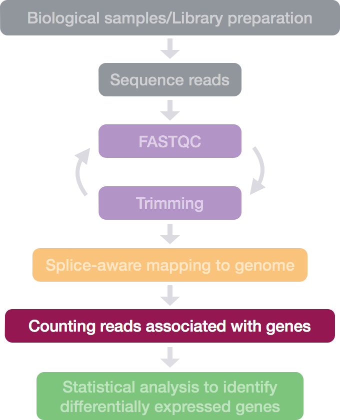
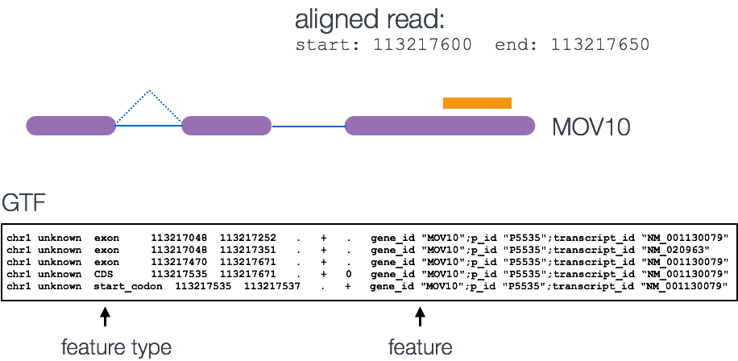
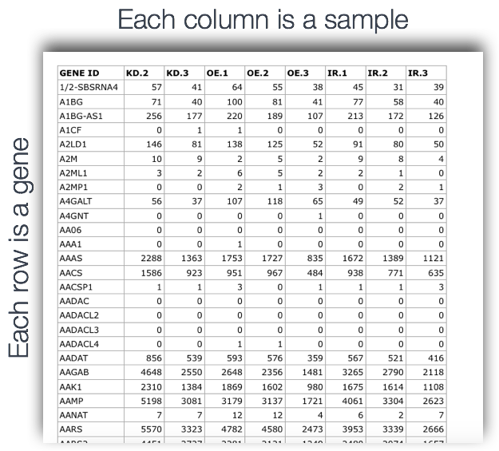
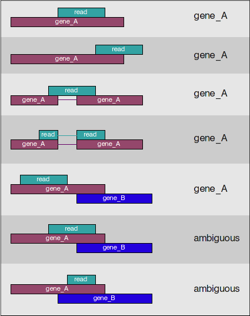

Approximate time: 75 minutes

## Learning Objectives:

* understand how counting tools work
* generate a count matrix using featureCounts
* generate a report with multiQC to document results

## Counting reads as a measure of gene expression


Once we have our reads aligned to the genome, the next step is to count how many reads have mapped to each gene. There are many tools that can use BAM files as input and output the number of reads (counts) associated with each feature of interest (genes, exons, transcripts, etc.). 2 commonly used counting tools are [featureCounts](http://bioinf.wehi.edu.au/featureCounts/) and [htseq-count](http://www-huber.embl.de/users/anders/HTSeq/doc/count.html). 

* The above tools only report the "raw" counts of reads that map to a single location (uniquely mapping) and are best at counting at the gene level. Essentially, total read count associated with a gene (*meta-feature*) = the sum of reads associated with each of the exons (*feature*) that "belong" to that gene.

* There are other tools available that are able to account for multiple transcripts for a given gene. In this case the counts are not whole numbers, but have fractions. In the simplest example case, if 1 read is associated with 2 transcripts, it can get counted as 0.5 and 0.5 and the resulting count for that transcript is not a whole number.

* In addition there are tools that will count multimapping reads, but this is a dangerous thing to do since you will be overcounting the total number of reads which can cause issues with normalization and eventually with accuracy of differential gene expression results. 

**Input for counting = multiple BAM files + 1 GTF file**

Simply speaking, the genomic coordinates of where the read is mapped (BAM) are cross-referenced with the genomic coordinates of whichever feature you are interested in counting expression of (GTF), it can be exons, genes or transcripts.



**Output of counting = A count matrix, with genes as rows and samples are columns**

These are the "raw" counts and will be used in statistical programs downstream for differential gene expression.



### Counting using featureCounts
Today, we will be using the [featureCounts](http://bioinf.wehi.edu.au/featureCounts/) tool to get the *gene* counts. We picked this tool because it is accurate, fast and is relatively easy to use. It counts reads that map to a single location (uniquely mapping) and follows the scheme in the figure below for assigning reads to a gene/exon. 



featureCounts can also take into account whether your data are **stranded** or not. If strandedness is specified, then in addition to considering the genomic coordinates it will also take the strand into account for counting. If your data are stranded always specify it.

#### Setting up to run featureCounts
First things first, start an interactive session with 4 cores:
	
``` bash
$ bsub -Is -n 4 -q interactive bash
```

Now, change directories to your rnaseq directory and start by creating 2 directories, (1) a directory for the output and (2) a directory for the bam files we generated earlier:

``` bash
$ cd ~/ngs_course/rnaseq/
$ mkdir results/counts results/STAR/bams
```

Let's move the bam files over to the `results/STAR/bams` directory
	
``` bash
$ mv ~/ngs_course/rnaseq/results/STAR/*fq_Aligned*bam ~/ngs_course/rnaseq/results/STAR/bams
# check to make sure the move worked and that only the files we wanted moved over
```
featureCounts is not available as a module on Orchestra, but we have already added the path for it to our `$PATH` variable last time. 

``` bash
$ echo $PATH  # You should see /opt/bcbio/centos/bin among other paths
```

> ** If you don't see `/opt/bcbio/centos/bin` in your `$PATH` variable, add the following `export` command to your `~/.bashrc` file using vim: `export PATH=/opt/bcbio/centos/bin:$PATH`.**


#### Running featureCounts

How do we use this tool, what is the command and what options/parameters are available to us?

``` bash
$ featureCounts
```

So, it looks like the usage is `featureCounts [options] -a <annotation_file> -o <output_file> input_file1 [input_file2] ... `, where `-a`, `-o` and input files are required.

We are going to use the following options:

`-T 4 # specify 4 cores`

`-s 2 # these data are "reverse"ly stranded`

and the following are the values for the required parameters:

`-a ~/ngs_course/rnaseq/reference_data/chr1-hg19_genes.gtf # required option for specifying path to GTF`

`-o ~/ngs_course/rnaseq/results/counts/Mov10_featurecounts.txt # required option for specifying path to, and name of the text output (count matrix)`

`~/ngs_course/rnaseq/results/STAR/bams/*bam # the list of all the bam files we want to collect count information for`

Let's run this now:

``` bash
$ featureCounts -T 4 -s 2 \ 
  -a ~/ngs_course/rnaseq/reference_data/chr1-hg19_genes.gtf \
  -o ~/ngs_course/rnaseq/results/counts/Mov10_featurecounts.txt \
  ~/ngs_course/rnaseq/results/STAR/bams/*bam
```

> If you wanted to collect the information that is on the screen as the job runs, you can modify the command and add the `2>` redirection at the end. This type of redirection will collect all the information from the terminal/screen into a file.

``` bash
# **DO NOT RUN THIS** 
# note the last line of the command below
	
$ featureCounts -T 4 -s 2 \ 
  -a ~/ngs_course/rnaseq/reference_data/chr1-hg19_genes.gtf \
  -o ~/ngs_course/rnaseq/results/counts/Mov10_featurecounts.txt \
  ~/ngs_course/rnaseq/results/STAR/bams/*bam \
  2> /ngs_course/rnaseq/results/counts/Mov10_featurecounts.screen-output
```
#### featureCounts output

The output of this tool is 2 files, *a count matrix* and *a summary file* that tabulates how many the reads were "assigned" or counted and the reason they remained "unassigned". Let's take a look at the summary file:
	
``` bash
$ less results/counts/Mov10_featurecounts.txt.summary
```
Now let's look at the count matrix:
	
``` bash
$ less results/counts/Mov10_featurecounts.txt
```	
There is information about the genomic coordinates and the length of the gene, we don't need this for the next step, so we are going to extract the columns that we are interested in.
	
``` bash
$ cut -f1,7,8,9,10,11,12 results/counts/Mov10_featurecounts.txt > results/counts/Mov10_featurecounts.Rmatrix.txt
```
The next step is to clean it up a little further by modifying the header line (we could also do this in R, or in a GUI text editor):
	
``` bash
$ vim results/counts/Mov10_featurecounts.Rmatrix.txt
```

### Note on counting PE data

For paired-end (PE) data, the bam file contains information about whether both read1 and read2 mapped and if they were at roughly the correct distance from each other, that is to say if they were "properly" paired. For most counting tools, only properly paired reads are considered by default, and each read pair is counted only once as a single "fragment". 

For counting PE fragments associated with genes, the input bam files need to be sorted by read name (i.e. alignment information about both read pairs in adjoining rows). The alignment tool might sort them for you, but watch out for how the sorting was done. If they are sorted by coordinates (like with STAR), you will need to use `samtools sort` to re-sort them by read name before using as input in featureCounts. If you do not sort you BAM file by read name before using as input, featureCounts assumes that almost all the reads are not properly paired.

## Documenting results for QC

As you walk through the workflow, it is important to document the parameters you are using to run the analysis, but it is also very important to document the results at every step. This is a form of QC and it will enable you to identify any issues with the parameters you are using or any contamination, biases, etc.  

### Manual tracking
One way to document the results is by keeping track of how many reads you started with and how many of those ended up being associated with genes. 

The things to keep track of for each sample are the following:
* number of raw reads
* number of reads aligned to genome
* number of reads associated with genes 

But this method is tedious and difficult. Several tools exist that help you with the documentation, and additionally have really nice visualizations to go along with it, e.g. [Qualimap](http://qualimap.bioinfo.cipf.es/doc_html/index.html), [MultiQC](http://multiqc.info/). These tools have some overlap, but Qualimap is focused on count data whereas MultiQC is able to make a report from the output of many different tools in a given workflow.

### Tracking and aggregating results from tools with *MultiQC*

Today we will be using MultiQC, which aggregates results from several tools and generates a single HTML report with plots to visualize results. This is a very useful method of not only keeping track of what is going on at each step with each sample, but more importantly it enables a graphical comparison of samples with each other.

MultiQC can generate this report from 36 different bioinformatics tools, and these tools span various NGS analyses, e.g., basic QC, RNA-seq, variant calling, genome annotation, etc. Today we are going to use it to aggregate information from the results of [FastQC](http://multiqc.info/docs/#fastqc), [STAR](http://multiqc.info/docs/#star), and [featureCounts](http://multiqc.info/docs/#featurecounts). MultiQC can parse the information from specific output files from each of these tools and the manual page specifies the required output from each of the tools that should be used as input to MultiQC.

We are going to start by creating a directory in the `~/ngs_course/rnaseq/results/` directory called `multiqc_report` and navigating to it. You should already be in the `~/ngs_course/rnaseq/` directory.

```bash
mkdir results/multiqc_report

cd results/multiqc_report
```

Next, we are going to run multiQC on the output of FastQC (zip files), STAR (.Log.final.out files) and featureCounts (the summary file).

```bash
multiqc -n multiqc_report_rnaseq \
~/ngs_course/rnaseq/results/fastqc_untrimmed_reads/*zip \
~/ngs_course/rnaseq/logs/*Log.final.out \
~/ngs_course/rnaseq/results/counts/Mov10_featurecounts.txt.summary
```

> If you did not move the log files that are output by STAR, you will have to modify the path of the 2nd input in the code above to `~/ngs_course/rnaseq/results/STAR/*Log.final.out`

> If you want to save the output on the terminal into a log file, you can use `2>` operator to redirect it to a file.

The output of multiQC is 1 HTML file and a data folder. Let's transfer the interactive HTML report over to our laptops using FileZilla and visualize the outputs of the 3 tools we used to generate the report.

The multiqc report is relatively quick to generate and provides a really clear method for comparing the samples to determine consistency, and to identify problematic samples.

---
*This lesson has been developed by members of the teaching team at the [Harvard Chan Bioinformatics Core (HBC)](http://bioinformatics.sph.harvard.edu/). These are open access materials distributed under the terms of the [Creative Commons Attribution license](https://creativecommons.org/licenses/by/4.0/) (CC BY 4.0), which permits unrestricted use, distribution, and reproduction in any medium, provided the original author and source are credited.*
