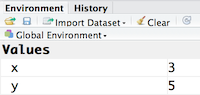
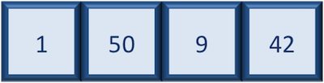
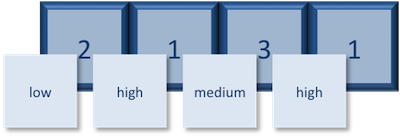
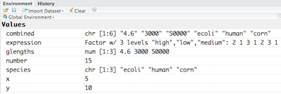

Approximate time: 70 min

## Learning Objectives

* Become familiar with R syntax
* Understand variables and the assignment operator in R
* Understand the various data types and data structures in R

## The R syntax
Now that we know how to talk with R via the script editor or the console, we want to use R for something more than adding numbers. To do this, we need to know more about the R syntax. 


Below is an example script highlighting the many different "parts of speech" for R (syntax):

  - the **comments** `#` and how they are used to document function and its content
  - **variables** and **functions**
  - the **assignment operator** `<-`
  - the `=` for **arguments** in functions

_NOTE: indentation and consistency in spacing is used to improve clarity and legibility_


### Example script

```{r example-script}

# Load libraries
library(Biobase)
library(limma)
library(ggplot2)

# Setup directory variables
baseDir <- getwd()
dataDir <- file.path(baseDir, "data")
metaDir <- file.path(baseDir, "meta")
resultsDir <- file.path(baseDir, "results")

# Load data
meta <- read.delim(file.path(metaDir, '2015-1018_sample_key.csv'), header=T, sep="\t", row.names=1)
```

## Assignment operator

To do useful and interesting things in R, we need to assign _values_ to
_variables_ using the assignment operator, `<-`.  For example, we can use the assignment operator to assign the value of `3` to `x` by executing:

```r
x <- 3
```

The assignment operator (`<-`) assigns **values on the right** to **variables on the left**. 

*In RStudio, typing `Alt + -` (push `Alt` at the same time as the `-` key) will write ` <- ` in a single keystroke.*


## Variables

A variable is a symbolic name for (or reference to) information. Variables in computer programming are analogous to "buckets", where information can be maintained and referenced. On the outside of the bucket is a name. When referring to the bucket, we use the name of the bucket, not the data stored in the bucket.

In the example above, we created a variable or a 'bucket' called `x`. Inside we put a value, `3`. 

Let's create another variable called `y` and give it a value of 5. 

```r
y <- 5
```

When assigning a value to an variable, R does not print anything to the console. You can force to print the value by using parentheses or by typing the variable name.

```
y
```

You can also view information on the variable by looking in your `Environment` window in the upper right-hand corner of the RStudio interface.



Now we can reference these buckets by name to perform mathematical operations on the values contained within. What do you get in the console for the following operation: 

```r
x + y
```

Try assigning the results of this operation to another variable called `number`. 

```r
number <- x + y
```

***
**Exercise**

1. Try changing the value of the variable `x` to 5. What happens to `number`?
2. Now try changing the value of variable `y` to contain the value 10. What do you need to do, to update the variable `number`?

***

### Tips on variable names
Variables can be given almost any name, such as `x`, `current_temperature`, or
`subject_id`. However, there are some rules / suggestions you should keep in mind:

- Make your names explicit and not too long.
- Avoid names starting with a number (`2x` is not valid but `x2` is)
- Avoid names of fundamental functions in R (e.g., `if`, `else`, `for`, see [here](https://stat.ethz.ch/R-manual/R-devel/library/base/html/Reserved.html) for a complete list). In general, even if it's allowed, it's best to not use other function names (e.g., `c`, `T`, `mean`, `data`) as variable names. When in doubt
check the help to see if the name is already in use. 
- Avoid dots (`.`) within a variable name as in `my.dataset`. There are many functions
in R with dots in their names for historical reasons, but because dots have a
special meaning in R (for methods) and other programming languages, it's best to
avoid them. 
- Use nouns for object names and verbs for function names
- Keep in mind that **R is case sensitive** (e.g., `genome_length` is different from `Genome_length`)
- Be consistent with the styling of your code (where you put spaces, how you name variable, etc.). In R, two popular style guides are [Hadley Wickham's style guide](http://adv-r.had.co.nz/Style.html) and [Google's](https://google-styleguide.googlecode.com/svn/trunk/Rguide.xml).


## Data Types

Variables can contain values of specific types within R. The six **data types** that R uses include: 

* `"numeric"` for any numerical value 
* `"character"` for text values, denoted by using quotes ("") around value   
* `"integer"` for integer numbers (e.g., `2L`, the `L` indicates to R that it's an integer)
* `"logical"` for `TRUE` and `FALSE` (the boolean data type)
* `"complex"` to represent complex numbers with real and imaginary parts (e.g.,
  `1+4i`) and that's all we're going to say about them
* `"raw"` that we won't discuss further

The table below provides examples of each of the commonly used data types:

| Data Type  | Examples|
| -----------:|:-------------------------------:|
| Numeric:  | 1, 1.5, 20, pi|
| Character:  | “anytext”, “5”, “TRUE”|
| Integer:  | 2L, 500L, -17L|
| Logical:  | TRUE, FALSE, T, F|

## Data Structures

We know that variables are like buckets, and so far we have seen that bucket filled with a single value. Even when `number` was created, the result of the mathematical operation was a single value. **Variables can store more than just a single value, they can store a multitude of different data structures.** These include, but are not limited to, vectors (`c`), factors (`factor`), matrices (`matrix`), data frames (`data.frame`) and lists (`list`).


### Vectors

A vector is the most common and basic data structure in R, and is pretty much the workhorse of R. It's basically just a collection of values, mainly either numbers,



or characters,


or logical values,


**Note that all values in a vector must be of the same data type.** If you try to create a vector with more than a single data type, R will try to coerce it into a single data type. 

For example, if you were to try to create the following vector:


R will coerce it into:


The analogy for a vector is that your bucket now has different compartments; these compartments in a vector are called *elements*. 

Each **element** contains a single value, and there is no limit to how many elements you can have. A vector is assigned to a single variable, because regardless of how many elements it contains, in the end it is still a single entity (bucket). 

Let's create a vector of genome lengths and assign it to a variable called `glengths`. 

Each element of this vector contains a single numeric value, and three values will be combined together into a vector using `c()` (the combine function). All of the values are put within the parentheses and separated with a comma.


```{r, purl=FALSE}
glengths <- c(4.6, 3000, 50000)
glengths
```
*Note your environment shows the `glengths` variable is numeric and tells you the `glengths` vector starts at element 1 and ends at element 3 (i.e. your vector contains 3 values).*


A vector can also contain characters. Create another vector called `species` with three elements, where each element corresponds with the genome sizes vector (in Mb).

```{r, purl=FALSE}
species <- c("ecoli", "human", "corn")
species
```

***
**Exercise**

1. Create a vector of numeric and character values by _combining_ the two vectors that we just created (`glengths` and `species`). Assign this combined vector to a new variable called `combined`. *Hint: you will need to use the combine `c()` function to do this*. 
Print the `combined` vector in the console, what looks different compared to the original vectors?

***

### Factors

A **factor** is a special type of vector that is used to **store categorical data**. Each unique category is referred to as a **factor level** (i.e. category = level). Factors are built on top of integer vectors such that each **factor level** is assigned an **integer value**, creating value-label pairs. 


Let's create a factor vector and explore a bit more.  We'll start by creating a character vector describing three different levels of expression:

```r
expression <- c("low", "high", "medium", "high", "low", "medium", "high")
```

Now we can convert this character vector into a *factor* using the `factor()` function:

```r
expression <- factor(expression)
```

So, what exactly happened when we applied the `factor()` function? 



The expression vector is categorical, in that all the values in the vector belong to a set of categories; in this case, the categories are `low`, `medium`, and `high`. By turning the expression vector into a factor, the **categories are assigned integers alphabetically**, with high=1, low=2, medium=3. This in effect assigns the different factor levels. You can view the newly created factor variable and the levels in the **Environment** window.




***
**Exercise**

Let's say that in our experimental analyses, we are working with three different sets of cells: normal, cells knocked out for geneA (a very exciting gene), and cells overexpressing geneA. We have three replicates for each celltype.

1. Create a vector named `samplegroup` using the code below. This vector will contain nine elements: 3 control ("CTL") samples, 3 knock-out ("KO") samples, and 3 over-expressing ("OE") samples:

	```{r, purl=FALSE}
	samplegroup <- c("CTL", "CTL", "CTL", "KO", "KO", "KO", "OE", "OE", "OE")
	```

2. Turn `samplegroup` into a factor data structure.

***

### Matrix

A `matrix` in R is a collection of vectors of **same length and identical datatype**. Vectors can be combined as columns in the matrix or by row, to create a 2-dimensional structure.


Matrices are used commonly as part of the mathematical machinery of statistics. They are usually of numeric datatype and used in computational algorithms to serve as a checkpoint. For example, if input data is not of identical data type (numeric, character, etc.), the `matrix()` function will throw an error and stop any downstream code execution.

### Data Frame

A `data.frame` is the _de facto_ data structure for most tabular data and what we use for statistics and plotting. A `data.frame` is similar to a matrix in that it's a collection of vectors of of the **same length** and each vector represents a column. However, in a dataframe **each vector can be of a different data type** (e.g., characters, integers, factors). 


A data frame is the most common way of storing data in R, and if used systematically makes data analysis easier. 

We can create a dataframe by bringing **vectors** together to **form the columns**. We do this using the `data.frame()` function, and giving the function the different vectors we would like to bind together. *This function will only work for vectors of the same length.*

```r
df <- data.frame(species, glengths)
```

Beware of `data.frame()`’s default behaviour which turns **character vectors into factors**. Print your data frame to the console:

```r
df
```

Upon inspection of our dataframe, we see that although the species vector was a character vector, it automatically got converted into a factor inside the data frame (the removal of quotation marks). We will show you how to change the default behavior of a function in the next lesson.

*Note that you can view your data.frame object by clicking on its name in the `Environment` window.*

### Lists

Lists are a data structure in R that can be perhaps a bit daunting at first, but soon become amazingly useful. A list is a data structure that can hold any number of any types of other data structures.


If you have variables of different data structures you wish to combine, you can put all of those into one list object by using the `list()` function and placing all the items you wish to combine within parantheses:

```r
list1 <- list(species, df, number)
```
Print out the list to screen to take a look at the components:

```r
list1
	
[[1]]
[1] "ecoli" "human" "corn" 

[[2]]
  species glengths
1   ecoli      4.6
2   human   3000.0
3    corn  50000.0

[[3]]
[1] 5

```

There are three components corresponding to the three different variables we passed in, and what you see is that structure of each is retained. Each component of a list is referenced based on the number position. For example, since the dataframe was the second structure we passed in, it is referenced with `list1[[2]]`. We will talk more about how to inspect and manipulate components of lists in later lessons.

***
**Exercise**

Create a list called `list2` containing `species`, `glengths`, and `number`.

---

*This lesson has been developed by members of the teaching team at the [Harvard Chan Bioinformatics Core (HBC)](http://bioinformatics.sph.harvard.edu/). These are open access materials distributed under the terms of the [Creative Commons Attribution license](https://creativecommons.org/licenses/by/4.0/) (CC BY 4.0), which permits unrestricted use, distribution, and reproduction in any medium, provided the original author and source are credited.*

* *The materials used in this lesson is adapted from work that is Copyright © Data Carpentry (http://datacarpentry.org/). 
All Data Carpentry instructional material is made available under the [Creative Commons Attribution license](https://creativecommons.org/licenses/by/4.0/) (CC BY 4.0).*


