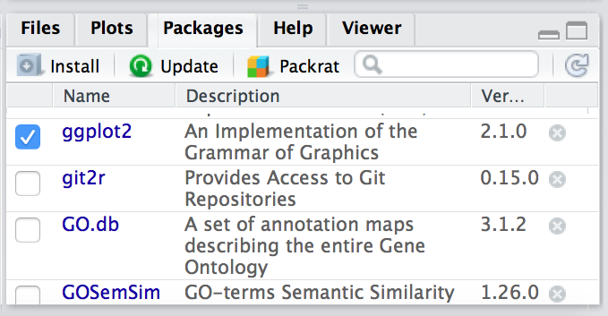

Approximate time: 50 min

## Learning Objectives

* Describe and utilize functions in R. 
* Modify default behavior of functions using arguments in R.
* Identify R-specific sources of help to get more information about functions.
* Demonstrate how to install external packages to extend R’s functionality. 
* Identify different R-specific and external sources of help to (1) troubleshoot errors and (2) get more information about functions and packages.
* Export data tables and plots for use outside of the R environment.

## Functions and their arguments

### What are functions?

A key feature of R is functions. Functions are **"self contained" modules of code that accomplish a specific task**. Functions usually take in some sort of data structure (value, vector, dataframe etc.), process it, and return a result.

The general usage for a function is the name of the function followed by parentheses:

```r
function_name(input)
```
The input(s) are called **arguments**, which can include:

1. the physical object (any data structure) on which the function carries out a task 
2. specifications that alter the way the function operates (e.g. options)

Not all functions take arguments, for example:

```r
getwd()
```

However, most functions can take several arguments. If you don't specify a required argument when calling the function, you will either receive an error or the function will fall back on using a *default*. 

The **defaults** represent standard values that the author of the function specified as being "good enough in standard cases". An example would be what symbol to use in a plot. However, if you want something specific, simply change the argument yourself with a value of your choice.

### Basic functions

We have already used a few examples of basic functions in the previous lessons i.e `getwd()`, `c()`, and  `factor()`. These functions are available as part of R's built in capabilities, and we will explore a few more of these base functions below. 

You can also get functions from external [*packages or libraries*](https://github.com/hbc/NGS_Data_Analysis_Course/blob/master/sessionII/lessons/07_introR-functions-and-arguments.md#packages-and-libraries) (which we'll talk about in a bit), or [even write your own](https://campus.datacamp.com/courses/writing-functions-in-r/a-quick-refresher?ex=1). 

Let's revisit a function that we have used previously to combine data `c()` into vectors. The *arguments* it takes is a collection of numbers, characters or strings (separated by a comma). The `c()` function performs the task of combining the numbers or characters into a single vector. You can also use the function to add elements to an existing vector:

```r
glengths <- c(glengths, 90) # adding at the end	
glengths <- c(30, glengths) # adding at the beginning
```

What happens here is that we take the original vector `glengths` (containing three elements), and we are adding another item to either end. We can do this over and over again to build a vector or a dataset.

Since R is used for statistical computing, many of the base functions involve mathematical operations. One example would be the function `sqrt()`. The input/argument must be a number, and the output is the square root of that number. Let's try finding the square root of 81:

```r
sqrt(81)
```

Now what would happen if we **called the function** (e.g. ran the function), on a *vector of values* instead of a single value? 

```r
sqrt(glengths)
```

In this case the task was performed on each individual value of the vector `glengths` and the respective results were displayed.


Let's try another function, this time using one that we can change some of the *options* (arguments that change the behavior of the function), for example `round`:

```r
round(3.14159)
```

We can see that we get `3`. That's because the default is to round to the nearest whole number. **What if we want a different number of significant digits?**


#### Seeking help & Arguments

The best way of finding out this information is to use the `?` followed by the name of the function. Doing this will open up the help manual in the bottom right panel of RStudio that will provide a description of the function, usage, arguments, details, and examples: 

```r
?round
```	
Alternatively, if you are familiar with the function but just need to remind yourself of the names of the arguments, you can use:

```r
args(round)
```

Even more useful is the `example()` function. This will allow you to run the examples section from the Online Help to see exactly how it works when executing the commands. Let's try that for `round()`:

```r
example("round")
```

In our example, we can change the number of digits returned by **adding an argument**. We can type `digits=2` or however many we may want:


```r
round(3.14159, digits=2)
```

> *NOTE:* If you provide the arguments in the exact same order as they are defined (in the help manual) you don't have to name them:
>
	round(3.14159, 2)
>
>However, it's usually not recommended practice because it involves a lot of memorization. In addition, it makes your code difficult to read for your future self and others, especially if your code includes functions that are not commonly used. (It's however OK to not include the names of the arguments for basic functions like `mean`, `min`, etc...). Another advantage of naming arguments, is that the order doesn't matter. This is useful when a function has many arguments. 

**Example of an argument**

```r
df <- data.frame(species, glengths, stringsAsFactors = F)
```

***
**Exercise** 

1. Another commonly used base function is `mean()`. Use this function to calculate an average for the `glengths` vector.


## Packages and Libraries

**Packages** are collections of R functions, data, and compiled code in a well-defined format, created to add specific functionality. There are 10,000+ user contributed packages and growing.

There are a set of **standard (or base) packages** which are considered part of the R source code and automatically available as part of your R installation. Base packages contain the **basic functions** that allow R to work, and enable standard statistical and graphical functions on datasets; for example, all of the functions that we have been using so far in our examples. 

The directories in R where the packages are stored are called the **libraries**. The terms *package* and *library* are sometimes used synonymously and there has been [discussion](http://www.r-bloggers.com/packages-v-libraries-in-r/) amongst the community to resolve this. It is somewhat counter-intuitive to _load a package_ using the `library()` function and so you can see how confusion can arise.


You can check what libraries are loaded in your current R session by typing into the console:

```r
sessionInfo()

# OR

search()
```

In this workshop we will mostly be using functions from the standard base packages. However, the more you work with R you will come to realize that there is a cornucopia of R packages that offer a wide variety of functionality. To use additional packages will require installation. Many packages can be installed from the [CRAN](http://cran.r-project.org/) or [Bioconductor](https://www.bioconductor.org/) repositories.

### Package installation from CRAN 

CRAN is a repository where the latest downloads of R (and legacy versions) are found in addition to source code for thousands of different user contributed R packages.


Packages for R can be installed from the [CRAN](http://cran.r-project.org/) package repository using the `install.packages` function. This function will download the source code from on the CRAN mirrors and install the package (and any dependencies) locally on your computer. 

An example is given below for the `ggplot2` package that will be required for some plots we will create later on. Run this code to install `ggplot2`.


```r
install.packages('ggplot2')
```
### Package installation from Bioconductor
Alternatively, packages can also be installed from [Bioconductor](https://www.bioconductor.org/), another repository of packages which provides tools for the analysis and comprehension of high-throughput **genomic data**. These packages includes (but is not limited to) tools for performing statistical analysis, annotation packages, and accessing public datasets.


There are many packages that are available in CRAN and Bioconductor, but there are also packages that are specific to one repository. Generally, you can find out this information with a Google search or by trial and error. 

To install from Bioconductor, you will first need to install Bioconductor and all the standard packages. *This only needs to be done once ever for your R installation.* 

**If you were successful with the installation from CRAN, you do not need to run this**

```r
# DO NOT RUN THIS!

source("http://bioconductor.org/biocLite.R")
biocLite()
```

Once you have the standard packages installed, you can install additional packages using the `biocLite.R` script. If it's a new R session you will also have to source the script again. Here we show that the same package `ggplot2` is available through Bioconductor:


```r
# DO NOT RUN THIS!

biocLite('ggplot2')
```
### Package installation from source

Finally, R packages can also be installed from source. This is useful when you do not have an internet connection (and have the source files locally), since the other two methods are retrieving the source files from remote sites. 

To install from source, we use the same `install.packages` function but we have additional arguments that provide *specifications* to *change from defaults*:

```r
# DO NOT RUN THIS!

install.packages('ggplot2_1.0.1.tar.gz', type="source", repos=NULL)
```
### Loading libraries
Once you have the package installed, you can **load the library** into your R session for use. Any of the functions that are specific to that package will be available for you to use by simply calling the function as you would for any of the base functions. *Note that quotations are not required here.*


```r
library(ggplot2)
```

You can also check what is loaded in your current environment by using `sessionInfo()` or `search()` and you should see your package listed as:

```r
other attached packages:
[1] ggplot2_2.0.0
```

### Finding functions specific to a package

This is your first time using `ggplot2`, how do you know where to start and what functions are available to you? One way to do this, is by using the `Package` tab in RStudio. If you click on the tab, you will see listed all packages that you have installed. For those *libraries that you have loaded*, you will see a blue checkmark in the box next to it. Scroll down to `ggplot2` in your list:

  


If your library is successfully loaded you will see the box checked, as in the screenshot above. Now, if you click on `ggplot2` RStudio will open up the help pages and you can scroll through.

An alternative is to find the help manual online, which can be less technical and sometimes easier to follow. For example, [this website](http://docs.ggplot2.org/current/) is much more comprehensive for ggplot2 and is the result of a Google search. Many of the Bioconductor packages also have very helpful vignettes that include comprehensive tutorials with mock data that you can work with.

### Finding functions but not knowing which package it is a part of

If you are looking for a function to do a particular task, you can use `help.search()` (*but only looks through the installed packages*):

```r
help.search("scatter")
```

If you can't find what you are looking for, you can use the [rdocumention.org](http://www.rdocumentation.org) website that search through the help files across all packages available.

### Cryptic error messages

It is very likely that someone else has encountered this same problem already! 

* Start by googling the error message.  However, this doesn't always work very well because often, package developers rely on the error catching provided by R. You end up with general error messages that might not be very helpful to diagnose a problem (e.g. "subscript out of bounds").

* Check stackoverflow. Search using the `[r]` tag. Most questions have already been answered, but the challenge is to use the right words in the search to find the answers: [http://stackoverflow.com/questions/tagged/r](http://stackoverflow.com/questions/tagged/r)


## Asking for help

The key to getting help from someone is for them to grasp your problem rapidly. You
should make it as easy as possible to pinpoint where the issue might be.

1. Try to **use the correct words** to describe your problem. For instance, a package
is not the same thing as a library. Most people will understand what you meant,
but others have really strong feelings about the difference in meaning. The key
point is that it can make things confusing for people trying to help you. **Be as
precise as possible when describing your problem.**

2. **Always include the output of `sessionInfo()`** as it provides critical information about your platform, the versions of R and the packages that you are using, and other information that can be very helpful to understand your problem.

```r
sessionInfo()  #This time it is not interchangeable with search()
```

3. If possible, **reproduce the problem using a very small `data.frame`**
instead of your 50,000 rows and 10,000 columns one, provide the small one with
the description of your problem. When appropriate, try to generalize what you
are doing so even people who are not in your field can understand the question. 
	- To share an object with someone else, you can provide either the raw file (i.e., your CSV file) with
your script up to the point of the error (and after removing everything that is
not relevant to your issue). Alternatively, in particular if your questions is
not related to a `data.frame`, you can save any other R data structure that you have in your environment to a file:

```r
# DO NOT RUN THIS!

save(iris, file="/tmp/iris.RData")
```

The content of this `.RData` file is not human readable and cannot be posted directly on stackoverflow. It can, however, be emailed to someone who can read it with this command:

```r
# DO NOT RUN THIS!

some_data <- load(file="~/Downloads/iris.RData")
```

### Where to ask for help?

* **Your friendly colleagues**: if you know someone with more experience than you,
  they might be able and willing to help you.
* **Stackoverflow**: if your question hasn't been answered before and is well
  crafted, chances are you will get an answer in less than 5 min.
* **The [R-help](https://stat.ethz.ch/mailman/listinfo/r-help)**: it is read by a
  lot of people (including most of the R core team), a lot of people post to it,
  but the tone can be pretty dry, and it is not always very welcoming to new
  users. If your question is valid, you are likely to get an answer very fast
  but don't expect that it will come with smiley faces. Also, here more than
  everywhere else, be sure to use correct vocabulary (otherwise you might get an
  answer pointing to the misuse of your words rather than answering your
  question). You will also have more success if your question is about a base
  function rather than a specific package.
* **The [Bioconductor support site](https://support.bioconductor.org/)**. This is very useful and if you tag your post, there is a high likelihood of getting an answer from the developer.
* If your question is about a specific package, see if there is a mailing list
  for it. Usually it's included in the DESCRIPTION file of the package that can
  be accessed using `packageDescription("name-of-package")`. You may also want
  to try to **email the author** of the package directly.
* There are also some **topic-specific mailing lists** (GIS, phylogenetics, etc...),
  the complete list is [here](http://www.r-project.org/mail.html).
  
### More resources
* The [Posting Guide](http://www.r-project.org/posting-guide.html) for the R
  mailing lists.
* [How to ask for R help](http://blog.revolutionanalytics.com/2014/01/how-to-ask-for-r-help.html)
  useful guidelines
* The [Introduction to R](http://cran.r-project.org/doc/manuals/R-intro.pdf) can also be dense for people with little programming experience but it is a good place to understand the underpinnings of the R language.
* The [R FAQ](http://cran.r-project.org/doc/FAQ/R-FAQ.html) is dense and technical but it is full of useful information.


---

*This lesson has been developed by members of the teaching team at the [Harvard Chan Bioinformatics Core (HBC)](http://bioinformatics.sph.harvard.edu/). These are open access materials distributed under the terms of the [Creative Commons Attribution license](https://creativecommons.org/licenses/by/4.0/) (CC BY 4.0), which permits unrestricted use, distribution, and reproduction in any medium, provided the original author and source are credited.*

* *The materials used in this lesson is adapted from work that is Copyright © Data Carpentry (http://datacarpentry.org/). 
All Data Carpentry instructional material is made available under the [Creative Commons Attribution license](https://creativecommons.org/licenses/by/4.0/) (CC BY 4.0).*

