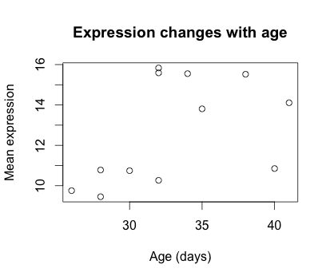
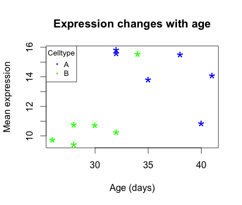
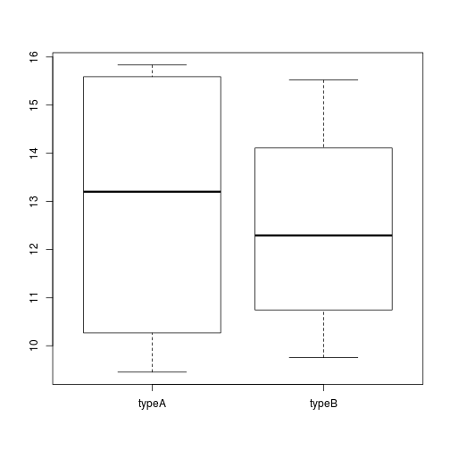

Approximate time: 45 minutes

## Basic plots in R
R has a number of built-in tools for basic graph types such as histograms, scatter plots, bar charts, boxplots and much [more](http://www.statmethods.net/graphs/). Rather than going through all of different types, we will focus on `plot()`, a generic function for plotting x-y data. 

To get a quick view of the different things you can do with `plot`, let's use the `example()` function:
```r	
example("plot")
```

Here, you will find yourself having to press `<Return>` so you can scroll through the different types of graphs generated by `plot`. Take note of the different parameters used with each command and how that affects the aesthetics of the plot. 

```r
dev.off() 
# this means "device off" and we will be going over what this does at the end of this section. 
# For now, it makes it so that when we draw plots they show up where they are supposed to?
```

### Scatterplot
For some hands-on practice we are going to use `plot` to draw a scatter plot and obtain a graphical view of the relationship between two sets of continuous numeric data. From our new_metadata file we will take the `samplemeans` column and plot it against `age_in_days`, to see how mean expression changes with age. 

Now our metadata has all the information to draw a scatterplot. The base R function to do this is `plot(y ~ x, data)`:
```r
plot(samplemeans ~ age_in_days, data=new_metadata)
```

  

Each point represents a sample. The values on the y-axis correspond to the average expression for each sample which is dependent on the x-axis variable `age_in_days`. This plot is in its simplest form, we can customize many features of the plot (fonts, colors, axes, titles) through [graphic options](http://www.statmethods.net/advgraphs/parameters.html).

For example, let's start by giving our **plot a title and renaming the axes**. We can do that by simply adding the options `xlab`, `ylab` and `main` as arguments to the `plot()` function:

```r
plot(samplemeans ~ age_in_days, data=new_metadata, main="Expression changes with age", xlab="Age (days)", 
	ylab="Mean expression")
```	
	
 


We can also change the **shape of the data point using the `pch`** option and the **size of the data points using `cex`** (specifying the amount to magnify relative to the default).

```r
plot(samplemeans ~ age_in_days, data=new_metadata, main="Expression changes with age", xlab="Age (days)", 
	ylab="Mean expression", pch="*", cex=2.0)
```


We can also add some **color to the data points** on the plot by adding `col="blue"`. Alternatively, you can sub in any of the default colors or you can [experiment with other R packages](http://www.stat.ubc.ca/~jenny/STAT545A/block14_colors.html#basic-color-specification-and-the-default-palette) to fiddle with better palettes. 

We can also add color to **separate the data points by information** in our data frame. For example, suppose we wanted to the data points colored by celltype. We would need to specify a vector of colours and provide the factor by which we are separating samples. The first level in our factor vector (which by default is assigned alphabetically) would get assigned the first color that we list. So in this case, blue corresponds to celltype A samples and green corresponds to celltype B.

```r
plot(samplemeans ~ age_in_days, data=new_metadata, main="Expression changes with age", xlab="Age (days)", 
	ylab="Mean expression", pch="*", cex=2.0, col=c("blue", "green")[celltype])
```


The last thing this plot needs is a **figure legend describing the color scheme**. It would be great if it created one for you by default, but with R base functions unfortunately it is not that easy. To draw a legend on the current plot, you need to run a **new function called `legend()`** and specify the appropriate arguments. The code to do so is provided below. Don't worry if it seems confusing, we plan on showing you a much more intuitive way of plotting your data.

```r
legend("topleft", pch="*", col=c("blue", "green"), c("A", "B"), cex=0.8,
 	title="Celltype")
```


***

**Exercise** 


1. Change the color scheme in the scatterplot, such that it reflects the `genotype` of samples rather than `celltype`.

2. Use R help to find out how to increase the size of the text on the axis labels.

***

***

> ## Other Types of Plots in Base R
> *NOTE: we will not run these in class, but the code is provided if you are interested in exploring more on your own.*
> ### Barplot 
> Barplots are useful for comparing the distribution of a quantitative variable (numeric) between groups or categories. A **barplot**  would be much more useful to compare the samplemeans (numeric variable) for each sample. We can use `barplot` to draw a single bar representing each sample and the height indicates the average expression level. 
>
```r
?barplot
# note that there is no "data=" argument for barplot()
```
>Similar to the scatterplot, we can use additional arguments to specify the aesthetics that we want to change. For example, changing axis labeling and adding some color.
```r
barplot(new_metadata$samplemeans, names.arg=c(1:12), horiz=TRUE, col=c("darkblue", "red")[new_metadata$genotype]) 
```	
>  
> 
> ### Histogram 
> If we are interested in an overall distribution of numerical data, a **histogram** is what we'd want. To plot a histogram of the data use the `hist` command:
```r
hist(new_metadata$samplemeans)
```
> Again, there are many options that we can change by modifying the default parameters. Let's color in the bars, remove the borders and increase the number of breaks:
```r
hist(new_metadata$samplemeans, xlab="Mean expression level", main="", col="darkgrey", border=FALSE) 
```
>  
>
> ### Boxplot
>
> Using additional sample information from our metadata, we can use plots to compare values between different factor levels or categories. For example, we can compare the sample means across celltypes 'typeA' and 'typeB' using a **boxplot**.
```r
# Boxplot
boxplot(samplemeans~celltype, data=new_metadata)
```
> 
> 


---
*This lesson has been developed by members of the teaching team at the [Harvard Chan Bioinformatics Core (HBC)](http://bioinformatics.sph.harvard.edu/). These are open access materials distributed under the terms of the [Creative Commons Attribution license](https://creativecommons.org/licenses/by/4.0/) (CC BY 4.0), which permits unrestricted use, distribution, and reproduction in any medium, provided the original author and source are credited.*
