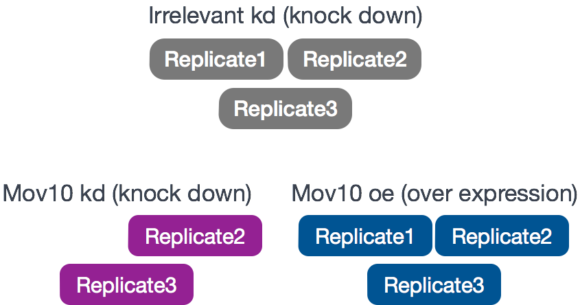
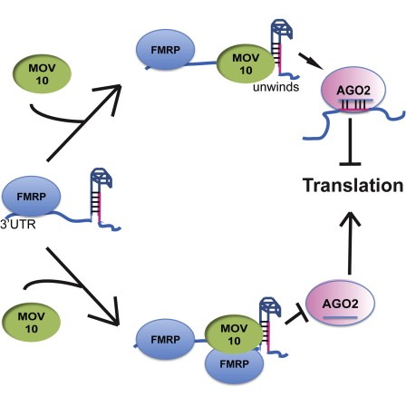
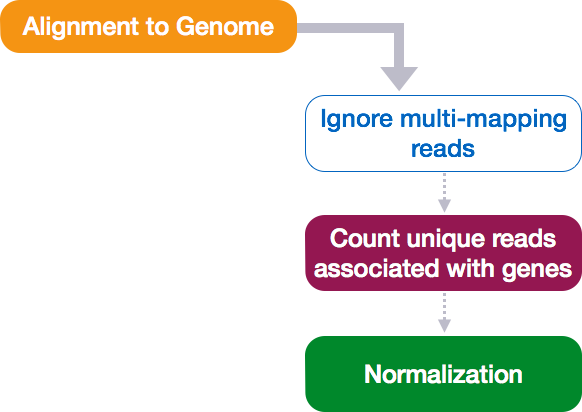

Approximate time: 40 minutes

## Learning Objectives 

* A review of the experiment and its objectives
* Getting setup in R (project setup, loading data, loading libraries)
* Becoming familiar with the `DESeqDataSet` object 

 
## Review of the dataset

We will be using the full count matrix from the RNA-Seq dataset we started with in our workflow from the previous session.  It is part of a larger study described in [Kenny PJ et al, Cell Rep 2014](http://www.ncbi.nlm.nih.gov/pubmed/25464849). Although we have gone through this before, we have a brief summary to remind you of the biological relevance and experimental design.

The RNA-Seq was performed on HEK293F cells that were either transfected with a MOV10 transgene, or siRNA to knock down Mov10 expression, or non-specific (irrelevant) siRNA. This resulted in 3 conditions **Mov10 oe** (over expression), **Mov10 kd** (knock down) and **Irrelevant kd**, respectively. The number of replicates is as shown below. 

Using these data, we will evaluate transcriptional patterns associated with perturbation of MOV10 expression. Please note that the irrelevant siRNA will be treated as our control condition.



***What is the purpose of these datasets? What does Mov10 do?***

The authors are investigating interactions between various genes involved in Fragile X syndrome, a disease in which there is aberrant production of the FMRP protein. 

> **FMRP** is “most commonly found in the brain, is essential for normal cognitive development and female reproductive function. Mutations of this gene can lead to fragile X syndrome, mental retardation, premature ovarian failure, autism, Parkinson's disease, developmental delays and other cognitive deficits.” - from [wikipedia](https://en.wikipedia.org/wiki/FMR1)

> **MOV10**, is a putative RNA helicase that is also associated with **FMRP** in the context of the microRNA pathway. 

**The hypothesis [the paper](http://www.ncbi.nlm.nih.gov/pubmed/25464849) is testing is that FMRP and MOV10 associate and regulate the translation of a subset of RNAs.**



**Our questions:**
* What patterns of expression can we identify with the loss or gain of MOV10? 
* Are there any genes shared between the two conditions?

## Setting up

Let's get started by opening up RStudio and setting up a new project for this analysis. 

1. Go to the `File` menu and select `New Project`.
2. In the `New Project` window, choose `New Directory`. Then, choose `Empty Project`. Name your new directory `DEanalysis` and then "Create the project as subdirectory of:" the Desktop (or location of your choice).
3. After your project is completed, it should automatically open in RStudio. 

To check whether or not you are in the correct working directory, use `getwd()`. The path `Desktop/DEanalysis` should be returned to you in the console. Within your working directory use the `New folder` button in the bottom right panel to create three new directories: `data`, `meta` and `results`. Remember the key to a good analysis is keeping organized from the start!

Go to the `File` menu and select `New File`, and select `R Script`. This should open up a script editor in the top left hand corner. This is where we will be typing and saving all commands required for this analysis. In the script editor type in a header line:

```r
## Gene-level differential expression analysis using DESeq2
## NGS Data Analysis 2016
```

Now save the file as `de_script.R`. When finished your working directory should now look something like this:


Finally, we need to grab the files that we will be working with for the analysis. Right click on the links below, and choose the "Save link as ..." option to download:

* Save the [full counts matrix](https://raw.githubusercontent.com/hbc/NGS_Data_Analysis_Course/master/sessionIII/data/Mov10_full_counts.txt) file in the `data` directory.
* Save the [full metadata table](https://raw.githubusercontent.com/hbc/NGS_Data_Analysis_Course/master/sessionIII/data/Mov10_full_meta.txt) file in the `meta` directory.

## Loading libraries

For this analysis we will be using several R packages, some which have been installed from CRAN and others from Bioconductor. To use these packages (and the functions contained within them), we need to **load the libraries.** Add the following to your script and don't forget to comment liberally!

```r
## Setup
### Bioconductor and CRAN libraries used
library(ggplot2)
library(RColorBrewer)
library(DESeq2)
library(pheatmap)
```

## Loading data

To load the data into our current environment, we will be using the `read.table` function. We need to provide the path to each file and also specify arguments to let R know that we have a header (`header = T`) and the first column is our row names (`row.names =1`). By default the function expects tab-delimited files, which is what we have.

```r
## Load in data
data <- read.table("data/Mov10_full_counts.txt", header=T, row.names=1) 

meta <- read.table("meta/Mov10_full_meta.txt", header=T, row.names=1)
```

Use `class()` to inspect our data and make sure we are working with data frames:

```r
### Check classes of the data we just brought in
class(data)
class(meta)
```

As a sanity check we should also make sure that we have sample names that match between the two files, and that the samples are in the right order.

```r
### Check that sample names match in both files
all(names(data) %in% rownames(meta))
all(names(data) == rownames(meta))
```

***

**Exercise**	

1. Suppose we had sample names matching in the counts matrix and metadata file, but they were out of order. Write the line(s) of code required to create a new matrix with columns ordered such that they were identical to the row names of the metadata.

*** 


## `DESeq2DataSet`

Now that we have all the required files and libraries loaded we are ready to begin with the exploratory part of our analysis. 

Amongst the DE tools that work on count data directly, a popular one is [DESeq2](https://bioconductor.org/packages/release/bioc/html/DESeq2.html). The methodology of DESeq2 (as described in the lecture) has high sensitivity and precision, while controlling the false positive rate. It also has various functions for QC assessment conveniently built-in.

The first thing we need to do is create `DESeqDataSet` object. Bioconductor software packages often define and use a custom class for storing data that makes sure that all the needed 'data slots' are consistently provided and fulfill the requirements. These objects are similar to `lists` in that the `data slots` are analogous to components as they store a number of different types of data structures. These objects are **different from lists** in that the slots are designated for specific information and access to that information (i.e. selecting data from the object) is by using object-specific functions as defined by the package.

Let's start by creating the `DESeqDataSet` object and then we can talk a bit more about what is stored inside it. To create the object we will need the **count matrix** and the **metadata** table as input. We will also need to specify a **design formula**. The design formula specifies the column(s) in the metadata table and how they should be used in the analysis. For our dataset we only have one column we are interested in, that is `~sampletype`. This column has three factor levels, which tells DESeq2 that for each gene we want to evaluate gene expression change with respect to these different levels.

```r
## Create DESeq2Dataset object
dds <- DESeqDataSetFromMatrix(countData = data, colData = meta, design = ~ sampletype)
```


You can use DESeq-specific functions to access the different slots and retrieve information, if you wish. For example, suppose we wanted the original count matrix we would use `counts()` (*Note: we nested it within the `View()` function so that rather than getting printed in the console we can see it in the script editor*) :

```r
View(counts(dds))
```

As we go through the workflow we will use the relevant functions to check what information gets stored inside our object.


## Normalization of counts

The next step is to normalize the count data in order to be able to make fair gene comparisons both within and between samples.




Remember, that there are other factors that are proportional to the read counts in addition to the gene expression that we are interested in. In DESeq2, `sizeFactors` are computed based on the median of ratios method. This method accounts for gene length and sequencing depth. To generate these size factors we can use the `estimateSizeFactors()` function:

```r
dds <- estimateSizeFactors(dds)
```

By assiging the results back to the `dds` object we are filling in the slots of the `DESeqDataSet` object with the appropriate information. We can take a look at the normalization factor applied to each sample using:

```r
sizeFactors(dds)
```

Now, to retrieve the normalized counts matrix from `dds`, we use the `counts()` function and add the argument `normalized=TRUE`.

```r
normalized_counts <- counts(dds, normalized=TRUE)
```

We can save this normalized data matrix to file for later use:

```r
write.table(normalized_counts, file="data/normalized_counts.txt", sep="\t", quote=F, col.names=NA)
```


---
*This lesson has been developed by members of the teaching team at the [Harvard Chan Bioinformatics Core (HBC)](http://bioinformatics.sph.harvard.edu/). These are open access materials distributed under the terms of the [Creative Commons Attribution license](https://creativecommons.org/licenses/by/4.0/) (CC BY 4.0), which permits unrestricted use, distribution, and reproduction in any medium, provided the original author and source are credited.*
