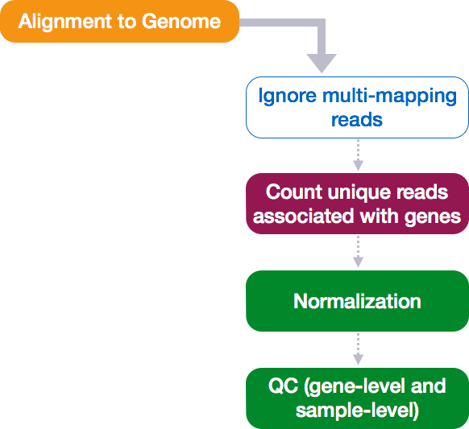

Approximate time: 50 minutes

## Learning Objectives 

* Transforming counts for unsupervised clustering methods
* Evaluating quality of samples using Principal Components Analysis
* Hierarchical clustering of samples in the dataset

## Transformation of counts

Many common statistical methods for exploratory analysis of multidimensional data, e.g. clustering and principal components analysis (PCA), work best for data that generally have the **same range of variance at different ranges of the mean values**. For RNA-seq raw counts, however, the variance grows with the mean. So the results of a PCA will be largely driven by genes with many counts.

A simple and commonly used strategy to avoid this is to take the logarithm of the normalized count values plus a small pseudocount (for 0 counts); however, now the genes with the very lowest counts will tend to dominate the results.

The DESeq2 solution to this is the **regularized log transform** [[Love, Huber, and Anders 2014](http://www.ncbi.nlm.nih.gov/pmc/articles/PMC4302049/pdf/13059_2014_Article_550.pdf)]. For genes with high counts, the `rlog` transformation will give similar result to the ordinary log2 transformation of normalized counts. For genes with lower counts, however, the values are shrunken towards the genes’ means across all samples.

```r
### Transform counts for data visualization
rld <- rlog(dds, blind=TRUE)
```

The `rlog` function returns a `DESeqTransform`, another type of DESeq-specific object. The reason you don't just get a matrix of transformed values is because all of the parameters (i.e. size factors) that went in to computing the rlog transform are stored in that object. We will be using this object to plot figures for quality assessment.

## Quality assessment and exploratory analysis	


### Principal components analysis (PCA)

One way to visualize sample-to-sample distances is a principal components analysis (PCA). DESeq2 has a built-in function for plotting PCA plots, that uses `ggplot2` under the hood. This is great because it saves us having to type out lines of code and having to fiddle with the different ggplot2 layers. In addition, it takes the `rlog` object as an input directly, hence saving us the trouble of extracting the relevant information from it.

> A nice [video explaining PCA plots](https://www.youtube.com/watch?v=_UVHneBUBW0) in more detail is available from StatQuest.

The function `plotPCA()` requires two arguments as input: an `rlog` object and the `intgroup` (the column in our metadata that we are interested in). 

```r
### Plot PCA 
plotPCA(rld, intgroup="sampletype")
```


**What does this plot tell you about the similarity of samples? Does it fit the expectation from the experimental design?** By default the function uses the *top 500 most variable genes*. You can change this by adding the `ntop` argument and specifying how many genes you want to use.

***

**Exercise**

Plot the PCA using *all of the genes* in your original count matrix. *Hint: you can use `nrow()` to help get the total number of genes*

***

### Hierarchical Clustering

Another method for quality assessment of data is to cluster samples based on how dis/similar they are to one another. In this lesson, we will be using the Pearson correlation to measure similarity between samples. Alternatively, it is also common to compute distance-based measures (i.e Poisson distance) as input to clustering. 


Using correlation values is referred to as an inter-correlation analysis (ICA). This involves taking each sample as a vector of ~22k values and then making pair-wise comparisons between all samples by computing a Pearson correlation. Generally, we expect to see a fairly high correlation (> 0.95) between all samples for a good dataset. Additionally, we expect to see samples clustered similar to the groupings observed in a PCA plot.

Samples that show particularly low correlation values with all other samples (< 0.80) represent outliers. These samples are usually removed. Additionally, the heatmap is useful in identifying batch effects based on block structures that correspond to when the samples were run.

Since there is no built-in function for heatmaps in DESeq2 we will be using `pheatmap()`. This function requires a matrix/dataframe of numeric values as input, and so the first thing we need to is retrieve that information from the `rld` object:

```r
### Extract the rlog matrix from the object
rld_mat <- assay(rld) 
```

Then we need to compute the pairwise correlation values for samples. We can do this using the `cor()` function:

```r
### Compute pairwise corrrelation values
rld_cor <- cor(rld_mat)
```

And now to plot the correlation values as a heatmap:

```r
### Plot heatmap
pheatmap(rld_cor)
```


Overall, we observe pretty high correlations across the board ( > 0.999) suggesting no outlying sample(s). Also, similar to the PCA plot you see the samples clustering together by sampletype. Together, these plots suggest to us that the data are of good quality and we have the green light to proceed to differential expression analysis.


> NOTE: The `pheatmap` function has a number of different arguments that we can alter from default values to enhance the aesthetics of the plot. If you are curious and want to explore more, try running the code below. *How does your plot change?* Take a look through the help pages (`?pheatmap`) and identify what each of the added arguments is contributing to the plot.
>
> ```r
> heat.colors <- brewer.pal(6, "Blues")
> pheatmap(rld_cor, color = heat.colors, border_color=NA, fontsize = 10, 
>			fontsize_row = 10, height=20)
> ```       
> Curious on all of the available color palettes offered by the RColorBrewer package? Try typing in your console `display.brewer.all()` and see what happens!
>


## Saving the Project

Now we are set up to run the comparisons between the 3 groups and get lists of differentially expressed genes. **Make sure you save your R session as you quit RStudio to your DEanalysis project, so you don't lose all your work from this setting up module!**


---
*This lesson has been developed by members of the teaching team at the [Harvard Chan Bioinformatics Core (HBC)](http://bioinformatics.sph.harvard.edu/). These are open access materials distributed under the terms of the [Creative Commons Attribution license](https://creativecommons.org/licenses/by/4.0/) (CC BY 4.0), which permits unrestricted use, distribution, and reproduction in any medium, provided the original author and source are credited.*
