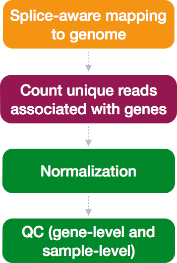
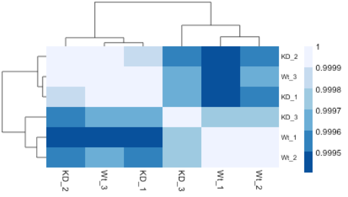
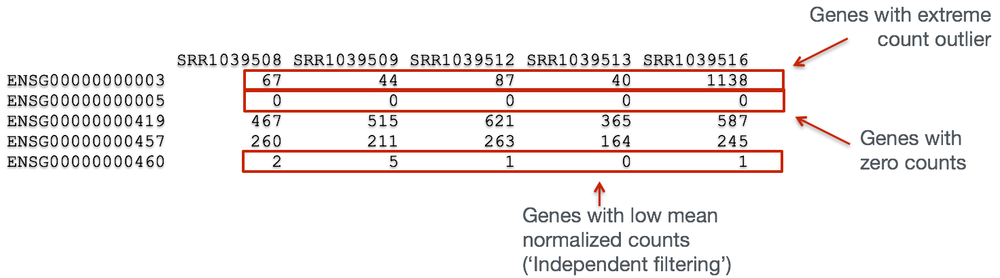
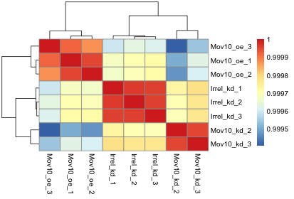

Approximate time: 80 minutes

## Learning Objectives 

* Transforming counts for unsupervised clustering methods
* Evaluating quality of samples using Principal Components Analysis
* Hierarchical clustering of samples in the dataset 

# Quality Control

The next step in the DESeq2 workflow is QC, which includes sample-level and gene-level steps to perform QC checks on the count data to help us ensure that the samples/replicates look good. 



## Sample-level QC

A useful initial step in an RNA-seq analysis is often to assess overall similarity between samples: 

- Which samples are similar to each other, which are different? 
- Does this fit to the expectation from the experiment’s design? 
- What are the major sources of variation in the dataset?

Log2-transformed normalized counts are used to assess similarity between samples using Principal Component Analysis (PCA) and hierarchical clustering. DESeq2 uses a **regularized log transform** (rlog) of the normalized counts for sample-level QC as it moderates the variance across the mean, thereby improving the distances/clustering for these visualization methods.


Sample-level QC allows us to see how well our replicates cluster together, as well as, observe whether our experimental condition represents the major source of variation in the data. Performing sample-level QC can also identify any sample outliers, which may need to be explored to determine whether they need to be removed prior to DE analysis. 


### [Principal Component Analysis (PCA)](https://github.com/hbctraining/DGE_workshop/blob/master/lessons/principal_component_analysis.md)

Principal Component Analysis (PCA) is a technique used to emphasize variation and bring out strong patterns in a dataset (dimensionality reduction). Details regarding PCA are given below (based on [materials from StatQuest](https://www.youtube.com/watch?v=_UVHneBUBW0), and if you would like a more thorough description, we encourage you to explore [StatQuest's video](https://www.youtube.com/watch?v=_UVHneBUBW0). 

If you had two samples and wanted to plot the counts of one sample versus another, you could plot the counts of one sample on the x-axis and the other sample on the y-axis as shown below:


You could draw a line through the data in the direction representing the most variation, which is on the diagonal in this example. The maximum variation in the data is between the two endpoints of this line.  

For PCA analysis, it is essentially doing this same thing between all samples, *n*, in *n*-dimensional space. If you have more than three samples, this is hard to visualize, but essentially a line is drawn through the data representing the most variation (PC1). Another line is drawn through the data representing the second most variation in the data (PC2). PC3 represents the direction of the third most variation in the data, and so on and so forth to PC*n*. 

We can plot a sum of the values for each gene based on it's expression (normalized counts) and influence on PC1 and PC2. **If two samples have similar levels of expression for the genes that contribute significantly to the variation represented by PC1, they will be plotted close together on the PC1 axis.** 

Since genes with the greatest variation between samples will have the greatest influence on the principal components, we hope our experimental condition explains this variation (e.g. high counts in one condition and low counts in the other). With PC1 representing the most variation in the data and PC2 representing the second most variation in the data, we can visualize how similar the variation of genes is between samples. **We would expect the treatment groups to separate on PC1 and/or PC2, and the biological replicates to cluster together.** This is easiest to understand by visualizing example PCA plots.

The example PCA plot below is what we hope for, with our treatment groups separating on PC1, which explains 89% of the variation in the data. 


We can use other variables **present in our metadata** to explore other causes of the variation in our data:


We can determine that the 5% of variation in the data represented by PC2 is due to variation between individuals in this paired design example.

In the next example, we can visualize the samples clustering by genotype on PC2 (13% variance). **If we saw one of the red samples below clustering with the blue samples (or vice versa), we might be worried about a mix-up. It would give us sufficient cause to remove that sample as an outlier and/or do some follow-up tests in the lab.**


We can see that the plasmid expression level represents the major source of variation in the data on PC1 (55% variance).


PCA is also a nice way to look for batch effects. In the below figure, we see batch 1 separate distinctly from batches 2 and 3.


Even if your samples do not separate by PC1 or PC2, you may still get biologically relevant results from the DE analysis, just don't be surprised if you do not get a large number of DE genes. To give more power to the tool for detecting DE genes, it is best to account for  major, known sources of variation in your model. 

***
**Exercise**


The figure below was generated from a time course experiment with sample groups 'Ctrl' and 'Sci' and the following timepoints: 0h, 2h, 8h, and 16h. 

- Determine the sources explaining the variation represented by PC1 and PC2.
- Do the sample groups separate well?
- Do the replicates cluster together for each sample group?
- Are there any outliers in the data?
- Should we have any other concerns regarding the samples in the dataset?


***

### Hierarchical Clustering Heatmap

Similar to PCA, hierarchical clustering is another, complementary method for identifying strong patterns in a dataset and potential outliers. The heatmap displays **the correlation of gene expression for all pairwise combinations of samples** in the dataset. Since the majority of genes are not differentially expressed, samples generally have high correlations with each other (values higher than 0.80). Samples below 0.80 may indicate an outlier in your data and/or sample contamination.  

The hierarchical tree can indicate which samples are more similar to each other based on the normalized gene expression values. The color blocks indicate substructure in the data, and you would expect to see your replicates cluster together as a block for each sample group. Additionally, we expect to see samples clustered similar to the groupings observed in a PCA plot. 

In the plot below, we would be a bit concerned about 'Wt_3' and 'KO_3' samples not clustering with the other replicates. We would want to explore the PCA to see if we see the same clustering of samples.




## Gene-level QC

In addition to examining how well the samples/replicates cluster together, there are a few more QC steps. Prior to differential expression analysis it is beneficial to omit genes that have little or no chance of being detected as differentially expressed. This will increase the power to detect differentially expressed genes. The genes omitted fall into three categories:

- Genes with zero counts in all samples
- Genes with an extreme count outlier
- Genes with a low mean normalized counts



**DESeq2 will perform this filtering by default; however other DE tools, such as EdgeR will not.** It is important to understand what filtering is performed by your tool of choice to know if you need to perform any additional filtering prior to the differential expression analysis.


## Mov10 quality assessment and exploratory analysis using DESeq2	

Now that we have a good understanding of the QC steps normally employed for RNA-seq, let's implement them for the Mov10 dataset we are going to be working with.

### Transform normalized counts using the rlog transformation

**To improve the distances/clustering for the PCA and heirarchical clustering visualization methods**, we need to moderate the variance across the mean by applying the rlog transformation to the normalized counts. 

> The rlog transformation of the normalized counts is only necessary for these visualization methods during this quality assessment. We will not be using these tranformed counts downstream.

```r
### Transform counts for data visualization
rld <- rlog(dds, blind=TRUE)
```

The `rlog` function returns a `DESeqTransform` object, another type of DESeq-specific object. The reason you don't just get a matrix of transformed values is because all of the parameters (i.e. size factors) that went into computing the rlog transform are stored in that object. We use this object to plot the PCA and heirarchical clustering figures for quality assessment.

### Principal components analysis (PCA)

DESeq2 has a built-in function for plotting PCA plots, that uses `ggplot2` under the hood. This is great because it saves us having to type out lines of code and having to fiddle with the different ggplot2 layers. In addition, it takes the `rlog` object as an input directly, hence saving us the trouble of extracting the relevant information from it.

The function `plotPCA()` requires two arguments as input: an `rlog` object and the `intgroup` (the column in our metadata that we are interested in). 

```r
### Plot PCA 
plotPCA(rld, intgroup="sampletype")
```


**What does this plot tell you about the similarity of samples? Does it fit the expectation from the experimental design?** By default the function uses the *top 500 most variable genes*. You can change this by adding the `ntop` argument and specifying how many genes you want to use to draw the plot.

> **NOTE:** The `plotPCA()` function will only return the values for PC1 and PC2. If you would like to explore the additional PCs in your data or if you would like to identify genes that contribute most to the PCs, you can use the `prcomp()` function. [Resources](http://www.sthda.com/english/wiki/principal-component-analysis-in-r-prcomp-vs-princomp-r-software-and-data-mining) are available to learn how to do more complex inquiries using the PCs.


### Hierarchical Clustering

Since there is no built-in function for heatmaps in DESeq2 we will be using the `pheatmap()` function from the `pheatmap` package. This function requires a matrix/dataframe of numeric values as input, and so the first thing we need to is retrieve that information from the `rld` object:

```r
### Extract the rlog matrix from the object
rld_mat <- assay(rld)    ## assay() is function from the "SummarizedExperiment" package that was loaded when you loaded DESeq2
```

Then we need to compute the pairwise correlation values for samples. We can do this using the `cor()` function:

```r
### Compute pairwise correlation values
rld_cor <- cor(rld_mat)    ## cor() is a base R function

head(rld_cor)   ## check the output of cor(), make note of the rownames and colnames
```

And now to plot the correlation values as a heatmap:

```r
### Plot heatmap
pheatmap(rld_cor)
```



Overall, we observe pretty high correlations across the board ( > 0.999) suggesting no outlying sample(s). Also, similar to the PCA plot you see the samples clustering together by sample group. Together, these plots suggest to us that the data are of good quality and we have the green light to proceed to differential expression analysis.


> NOTE: The `pheatmap` function has a number of different arguments that we can alter from default values to enhance the aesthetics of the plot. If you are curious and want to explore more, try running the code below. *How does your plot change?* Take a look through the help pages (`?pheatmap`) and identify what each of the added arguments is contributing to the plot.
>
> ```r
> heat.colors <- brewer.pal(6, "Blues")
> pheatmap(rld_cor, color = heat.colors, border_color=NA, fontsize = 10, 
>			fontsize_row = 10, height=20)
> ```       
> Curious on all of the available color palettes offered by the RColorBrewer package? Try typing in your console `display.brewer.all()` and see what happens!
>

---
*This lesson has been developed by members of the teaching team at the [Harvard Chan Bioinformatics Core (HBC)](http://bioinformatics.sph.harvard.edu/). These are open access materials distributed under the terms of the [Creative Commons Attribution license](https://creativecommons.org/licenses/by/4.0/) (CC BY 4.0), which permits unrestricted use, distribution, and reproduction in any medium, provided the original author and source are credited.*

