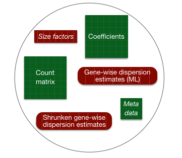
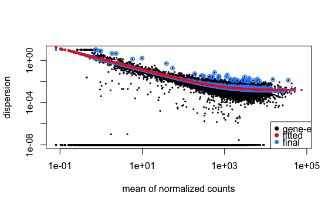

Approximate time: 45 minutes

## Learning Objectives 

* Understanding the different components of differential expression analysis in the context of DESeq2
* Exploring different objects in DESeq2 
* Building results tables for comprison of different sample conditions


## DESeq2: Differential expression analysis

### Running DESeq2

To run the differential expression pipeline on the raw counts in DESeq2, we use a **single call to the function `DESeq()`**. The required input is the `DESeqDataSet` object that we created in the last lesson. By re-assigning the results of the function back to the same variable name, we can continue to fill in the `slots` of our `DESeqDataSet` object.

	## Run analysis
	dds <- DESeq(dds)
 
This function will print out a message for the various steps it performs: 

```
estimating size factors
estimating dispersions
gene-wise dispersion estimates
mean-dispersion relationship
final dispersion estimates
fitting model and testing
``` 


**Everything from normalization to linear modeling was carried out by the use of a single function!** The results of each step were inserted into the object that you initialized.




> *NOTE:* There are individual functions available in DESeq2 that would allow us to carry out each step in the workflow in a step-wise manner, rather than a single call. We demonstrated one example when generating size factors to create a normalized matrix. By calling `DESeq()`, the individual functions for each step are run for you.


## Normalization

To normalize the count data DESeq2 calculates size factors for each sample, using the *median of ratios method*. Let's take a quick look at size factor values we have for each sample:

```
> sizeFactors(dds)
Mov10_kd_2 Mov10_kd_3 Mov10_oe_1 Mov10_oe_2 Mov10_oe_3 Irrel_kd_1 Irrel_kd_2 Irrel_kd_3 
 1.5646728  0.9351760  1.2016082  1.1205912  0.6534987  1.1224020  0.9625632  0.7477715 
 
```
 
These numbers should be identical to those we generated initially when we had run the function `estimateSizeFactors(dds)`. Take a look at the total number of reads for each sample using `colSums(counts(dds))`. *How do the numbers correlate with the size factor?*

Now take a look at the total depth after normalization using `colSums(counts(dds, normalized=T))`, how do the values across samples compare with the total counts taken for each sample?

> *NOTE:* it can be advantageous to calculate gene-specific normalization factors (size factors) to account for further sources of technical biases such as differing dependence on GC content, gene length or the like, and these can be supplied to DESeq2 instead of using the median of ratios method.

> *NOTE:* A very popular normalization metric that is cited in the literature and used quite frequently is **RPKM/FPKM** (Reads Per Kilobase Million). Recent studies have shown that these metrics **should not be used**. [This video by StatQuest](http://www.rna-seqblog.com/rpkm-fpkm-and-tpm-clearly-explained/) is a great resource for understanding why not. Briefly, RNA-seq differential expression is about comparing proportions of expression. Because of the order of operations when computing RPKM/FPKM (scale by sequencing depth, followed by gene length), each sample becomes a pie of different size. Therefore, when we try to compare proportions from those pies to one another it is no longer a fair comparison (i.e 1/3 of a 6" pie is much smaller than 1/3 of a 10" pie).


## Dispersion estimates

In our model, the **within group variability** is accounted for using the dispersion parameter. Dispersion estimates are computed **per gene**, because different genes naturally have a different scale of biological variability. DESeq2 does a first pass estimate on dispersion for each gene (using maximum-likelihood estimate), but with such small sample sizes we will make very bad estimates of gene-wise dispersion unless we **share information across genes**. The next step is therefore taking information from all gene dispersion estimates to shrink them to more reasonable values.

Let's take a look at the dispersion estimates for our data:

	# Plot dispersion estimates
	plotDispEsts(dds)
	


 

The black dots are the original estimates for each gene. The red smooth curve provides an accurate estimate for the expected dispersion value for genes of a given expression strength. The blue dots represent shrunken estimates. The circles indicate outliers, where we don't perform shrinkage. 

We use an empirical Bayes approach which lets the strength of shrinkage depend (i) on an estimate of how close true dispersion values tend to be to the fit and (ii) on the degrees of freedom. **Since we have a small sample size, for many genes we see quite a bit of shrinkage.**


## Identifying gene expression changes

We have three sample classes so we can make three possible pairwise comparisons:

1. Control vs. Mov10 overexpression
2. Control vs. Mov10 knockdown
3. Mov10 knockdown vs. Mov10 overexpression

**We are really only interested in #1 and #2 from above**. Using the design formula we provided `~sampletype`, DESeq 2 internally created the following design matrix:

```
   	      Intercept	sampletypecontrol sampletypeMOV10_knockdown	sampletypeMOV10_overexpression
Mov10_kd_2	 1		0		1		0
Mov10_kd_3	 1		0		1		0
Mov10_oe_1   1		0		0		1
Mov10_oe_2   1		0		0		1
Mov10_oe_3   1		0		0		1
Irrel_kd_1	 1		1		0		0
Irrel_kd_2	 1		1		0		0
Irrel_kd_3	 1		1		0		0	

```
This design matrix is now used to setup the contrasts to request the comparisons we want to make.


### Hypothesis testing: Wald test


In our case the *'parameters'* described in the Wikipedia definition above, are the coefficients that have been estimated by DESeq2. **Coefficients are used as input to the Wald test** to identify the true estimates. **The Wald test was performed as the default hypothesis test when we ran the `DESeq()` function on the `dds` object**.  

DESeq2 performs a hypothesis test for all possible pairwise comparisons. In order for us to **retrieve the results for a specific pair of sample classes** we need to provide this information to DESeq2 in the form of **contrasts**. Contrasts are created in in three different ways/R syntax. In this lesson we will demonstrate the syntax that is most intuitive. 

> *NOTE:* The Wald test can also be used with **continuous variables**. If the variable of interest provided in the design formula is continuous-valued, then the reported log2 fold change is per unit of change of that variable.

We need to use the coefficient names to specify our comparisons, these correspond to the headers in your design matrix. To find out how the coefficients are named we can use the `resultsNames()` function:

	# Find names of coefficients
	resultsNames(dds)

To specify the specific contrasts, we need to provide the column names from the coefficients table as a list of 2 character vectors:

	## Define contrasts
	contrast_oe <- list( "sampletypeMOV10_overexpression", "sampletypecontrol")

**The order of the names, determines the direction of fold change that is reported.** The name provided in the second element is the level that is used to baseline. So for example, if we observe a log2 fold change of -2 this would mean the gene expression is lower in Mov10_oe relative to the control. Pass the contrast vector as an argument to the `results()` function:

	# Extract results table
	res_tableOE <- results(dds, contrast=contrast_oe)


This will build a results table containing Wald test statistics for the comparison we are interested in. Let's take a look at what information is stored in the results:

	head(res_tableOE)

```
log2 fold change (MAP): sampletype MOV10_overexpression vs control 
Wald test p-value: sampletype MOV10_overexpression vs control 
DataFrame with 6 rows and 6 columns
               baseMean log2FoldChange      lfcSE       stat    pvalue       padj
              <numeric>      <numeric>  <numeric>  <numeric> <numeric>  <numeric>
1/2-SBSRNA4  45.6520399     0.26976764 0.18775752  1.4367874 0.1507784 0.25242910
A1BG         61.0931017     0.20999700 0.17315013  1.2128030 0.2252051 0.34444163
A1BG-AS1    175.6658069    -0.05197768 0.12366259 -0.4203185 0.6742528 0.77216278
A1CF          0.2376919     0.02237286 0.04577046  0.4888056 0.6249793         NA
A2LD1        89.6179845     0.34598540 0.15901426  2.1758136 0.0295692 0.06725157
A2M           5.8600841    -0.27850841 0.18051805 -1.5428286 0.1228724 0.21489067
```
> *NOTE:* The results table looks very much like a data frame and in many ways it can be treated like one (i.e when accessing/subsetting data). However, it is important to recognize that it is actually stored in a `DESeqResults` object. When we start visualizing our data, this information will be helpful. 

Let's go through some of the columns in the results table to get a better idea of what we are looking at. To extract information regarding the meaning of each column we can use `mcols()`:

	mcols(res_tableOE, use.names=T)

* `baseMean`: mean of normalized counts for all samples
* `log2FoldChange`: log2 fold change
* `lfcSE`: standard error
* `stat`: Wald statistic
* `pvalue`: Wald test p-value
* `padj`: BH adjusted p-values
 
Now that we have results for the overexpression results, let's do the same for the **Control vs. Knockdown samples**. The first thing, we need to do is create a contrasts vector called `contrast_kd` for the Mov10_knockdown comparison to control.

	## Define contrasts
	contrast_kd <- list( "sampletypeMOV10_knockdown", "sampletypecontrol")

Use that contrasts vector to extract a results table and store that to a variable called `res_tableKD`.  

	# Extract results table
	res_tableKD <- results(dds, contrast=contrast_kd)

Take a quick peek at the results table containing Wald test statistics for the Control-Knockdown comparison we are interested in and make sure that format is similar to what we observed with the OE.

***

**Excercise**

1. Create a contrasts vector for the Mov10_overexpression comparison to *all other samples*.

***


> **NOTE: on p-values set to NA**
> > 
> 1. If within a row, all samples have zero counts, the baseMean column will be zero, and the log2 fold change estimates, p-value and adjusted p-value will all be set to NA.
> 2. If a row contains a sample with an extreme count outlier then the p-value and adjusted p-value will be set to NA. These outlier counts are detected by Cook’s distance. 
> 3. If a row is filtered by automatic independent filtering, for having a low mean normalized count, then only the adjusted p-value will be set to NA. 


---
*This lesson has been developed by members of the teaching team at the [Harvard Chan Bioinformatics Core (HBC)](http://bioinformatics.sph.harvard.edu/). These are open access materials distributed under the terms of the [Creative Commons Attribution license](https://creativecommons.org/licenses/by/4.0/) (CC BY 4.0), which permits unrestricted use, distribution, and reproduction in any medium, provided the original author and source are credited.*

* *Materials and hands-on activities were adapted from [RNA-seq workflow](http://www.bioconductor.org/help/workflows/rnaseqGene/#de) on the Bioconductor website*
