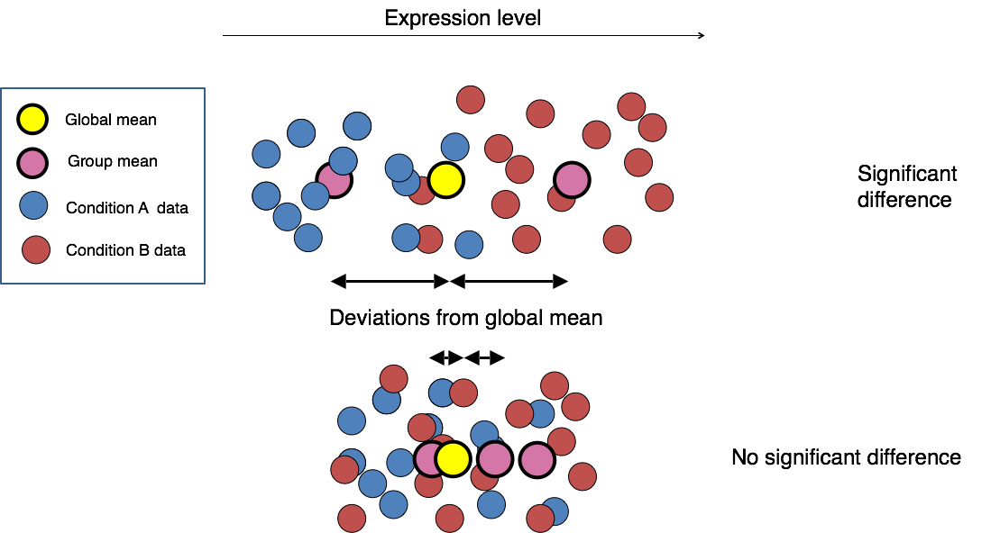
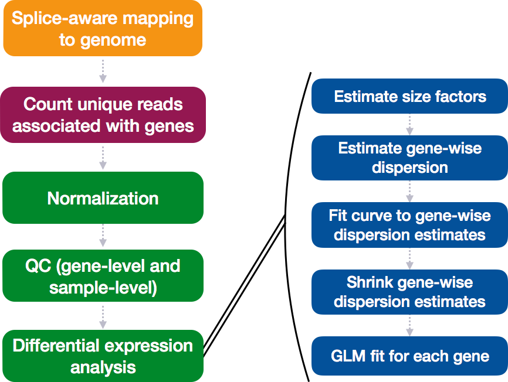
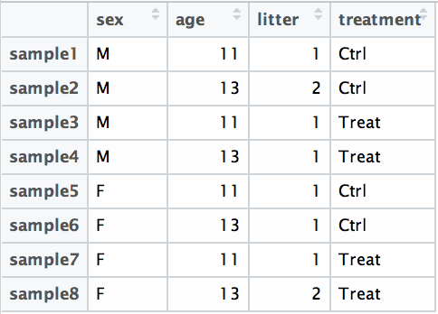
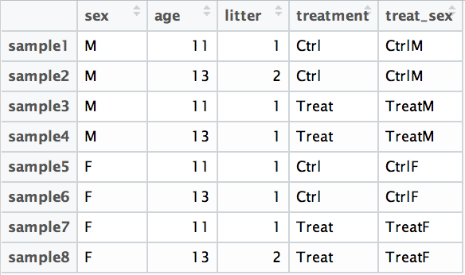
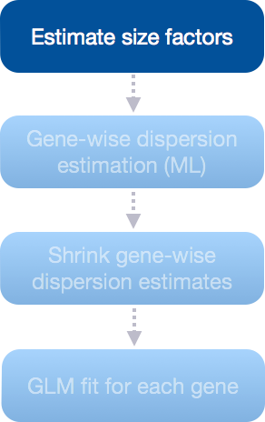
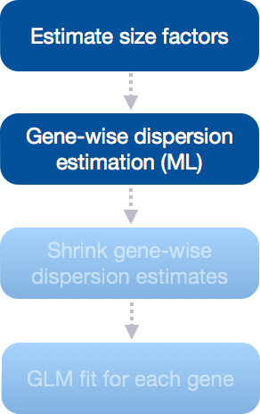
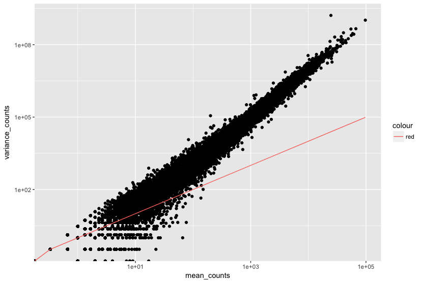
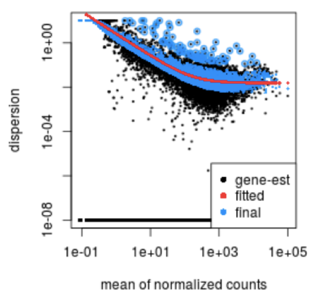
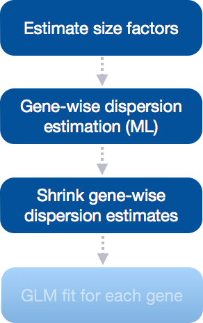
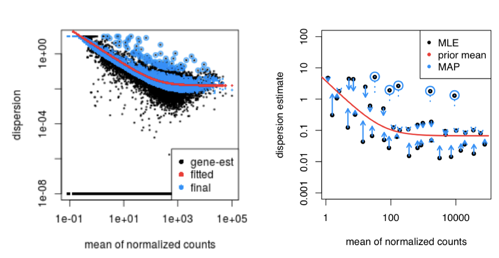

Approximate time: 60 minutes

## Learning Objectives 

* Understanding the different steps in a differential expression analysis in the context of DESeq2
* Building results tables for comparison of different sample classes


# Differential expression analysis with DESeq2

The final step in the differential expression workflow is the actual fitting of the raw counts to the statistical model and testing for differentially expressed genes. Essentially we want to determine whether the mean expression levels of different sample groups are significantly different.



DESeq2 builds on good ideas for dispersion estimation and use of Generalized Linear Models from the DSS and edgeR methods. The [DESeq2 paper](https://genomebiology.biomedcentral.com/articles/10.1186/s13059-014-0550-8) was published in 2014, but the package is continually updated and available for use in R through Bioconductor.

Differential expression analysis with DESeq2 requires multiple steps, as displayed below. During the analysis, DESeq2 will model the raw counts, using normalization factors (size factors) to account for differences in library depth and composition. Then DESeq2 will estimate the gene-wise dispersions and shrink these estimates to generate more accurate estimates of dispersion to model the counts. Finally, DESeq2 will fit the negative binomial model and perform hypothesis testing using the Wald test or Likelihood Ratio Test.



Prior to performing the differential expression analysis, it is a good idea to know what sources of variation are present in your data, either by exploration during the QC and/or prior knowledge. Once you know the major sources of variation, you can remove them prior to analysis or control for them in the statistical model. 

## Design formula
You can specify the sources of variation in your DESeq2 model using a **design formula**. A design formula tells the statistical software which sources of variation to control for, as well as, the factor of interest to test for during differential expression testing. For example, if you know that sex is a significant source of variation in your data, then `sex` should be included in your model. The **design formula** should have **all of the factors in your metadata that account for major sources of variation** in your data. **The last factor entered in the formula should be the condition of interest.**

For example, suppose you have the following metadata:



If you want to examine the expression differences between treatments, and you know that major sources of variation include `sex` and `age`, then your design formula would be:

`design <- ~ sex + age + treatment`

The tilde (`~`) should always proceed your factors and tells DESeq2 to model the counts using the following formula. Note the **factors included in the design formula need to match the column names in the metadata**. 

***
**Exercises**

1. Suppose you wanted to study the expression differences between the two age groups in the metadata shown above, and major sources of variation were `sex` and `treatment`, how would the design formula be written?
2. Based on our **Mov10** `metadata` dataframe, which factors could we include in our design formula?
3. What would you do if you wanted to include a factor in your design formula that is not in your metadata? 

***

### Complex designs

DESeq2 also allows for the analysis of complex designs. You can explore interactions or 'the difference of differences' by specifying for it in the design formula. For example, if you wanted to explore the effect of sex on the treatment effect, you could specify for it in the design formula as follows: 

`design <- ~ sex + age + treatment + sex:treatment`

Since the interaction term `sex:treatment` is last in the formula, the results output from DESeq2 will output results for this term. Alternatively, as recommended in the [DESeq2 vignette](https://www.bioconductor.org/packages/release/bioc/vignettes/DESeq2/inst/doc/DESeq2.pdf), we could create a new factor variable in our metadata based on the two interaction factors as shown in the table below:



The design formula would be:

`design <- ~ sex + age + treatment + treat_sex`

## Running DESeq2

Now that we know how to specify the model to DESeq2, we can run the differential expression pipeline on the **raw counts**. To do this, we must create a DESeqDataSet as we did in the ['Count normalization'](../02_DGE_count_normalization.md) lesson and specify the location of our raw counts and metadata, and input our design formula:

```r
dds <- DESeqDataSetFromMatrix(countData = data, colData = meta, design = ~ sampletype)
```

To run the actual differential expression analysis, we use a single call to the function `DESeq()`. 

```r
##Run analysis
dds <- DESeq(dds)
```

By re-assigning the results of the function back to the same variable name (`dds`), we can continue to fill in the `slots` of our `DESeqDataSet` object.


**Everything from normalization to linear modeling was carried out by the use of a single function!** This function will print out a message for the various steps it performs: 

```
estimating size factors
estimating dispersions
gene-wise dispersion estimates
mean-dispersion relationship
final dispersion estimates
fitting model and testing
``` 

> **NOTE:** There are individual functions available in DESeq2 that would allow us to carry out each step in the workflow in a step-wise manner, rather than a single call. We demonstrated one example when generating size factors to create a normalized matrix. By calling `DESeq()`, the individual functions for each step are run for you.

### DESeq2 differential gene expression analysis workflow

The workflow for the differential gene expression analysis with DESeq2 is output below:


We will be taking a detailed look at each of these steps to better understand how DESeq2 is performing the statistical analysis and what metrics we should examine to explore the quality of our analysis.

### Estimate size factors

The first step in the differential expression analysis is to estimate the size factors, which is exactly what we already did to normalize the raw counts. 



DESeq2 will automatically estimate the size factors when performing the differential expression analysis if you haven't already done so. However, if you have already generated the size factors, then DESeq2 will use these values. 

To normalize the count data DESeq2 calculates size factors for each sample, using the *median of ratios method* discussed previously in the ['Count normalization'](../02_DGE_count_normalization.md) lesson. Let's take a quick look at size factor values we have for each sample:

```
sizeFactors(dds)

Mov10_kd_2 Mov10_kd_3 Mov10_oe_1 Mov10_oe_2 Mov10_oe_3 Irrel_kd_1 Irrel_kd_2 Irrel_kd_3 
 1.5646728  0.9351760  1.2016082  1.1205912  0.6534987  1.1224020  0.9625632  0.7477715  
```
 
These numbers should be identical to those we generated initially when we had run the function `estimateSizeFactors(dds)`. Take a look at the total number of reads for each sample using:

```r
colSums(counts(dds))
```

*How do the numbers correlate with the size factor?*

Now take a look at the total depth after normalization using:

```r
colSums(counts(dds, normalized=T))
```
How do the values across samples compare with the total counts taken for each sample?

> **NOTE:** It can be advantageous to calculate gene-specific normalization factors (size factors) to account for further sources of technical biases such as differing dependence on GC content, gene length or the like, and these can be supplied to DESeq2 instead of using the median of ratios method.

### Estimate gene-wise dispersion

The next step in the differential expression analysis is the estimation of gene-wise dispersions. Before we get into the details, we should have a good idea about what dispersion is referring to in DESeq2.



**What exactly is dispersion?** Dispersion is a measure of spread or variability in the data. Variance, standard deviation, IQR, among other measures, can all be used to measure dispersion. However, DESeq2 uses a specific measure of dispersion (α) related to the mean (μ) and variance of the data: `Var = μ + α*μ^2`. 

**What does the DESeq2 dispersion represent?** The dispersion estimates are inversely related to the mean and directly related to variance. **Based on this relationship, the dispersion is higher for small mean counts and lower for large mean counts.** We can compare dispersion estimates to compare the variance of genes for a given mean (the dispersion estimates for genes with the same mean will differ only based on their variance). **Therefore, the dispersion estimates reflect the variance in gene expression for a given mean value.** 

The plot of mean versus variance in count data below shows the variance in gene expression increases with the mean expression (each black dot is a gene). Notice that the relationship between mean and variance is linear on the log scale, and for higher means, we could predict the variance relatively accurately given the mean. However, **for low mean counts, the variance estimates have a much larger spread and the dispersion estimates will differ much more between genes of the same mean**. 



**How does the dispersion relate to our model?** To accurately model sequencing counts, we need to generate accurate estimates of within-group variation (variation between replicates of the same sample group) for each gene. With only a few (3-6) replicates per group, the **estimates of variation for each gene are often unreliable, particularly for low count genes** (large differences in dispersion for genes with similar means). Therefore, DESeq2 **shares information across genes** to generate more accurate estimates of variation based on the mean expression level of the gene using a method called 'shrinkage'. **DESeq2 assumes that genes with similar expression levels have similar dispersion.** 

DESeq2 generates more accurate measures of dispersion using the following steps:

1. **Estimate the dispersion for each gene separately**

	To model the dispersion based on expression level (mean counts of replicates), the dispersion for each gene is estimated using maximum likelihood estimation. In other words, **given the count values of the replicates, the most likely estimate of dispersion is calculated**.

2. **Fit a curve to the the gene estimates given expression strength**

	The idea behind fitting a curve to the data is that different genes will have different scales of biological variability, but, over all genes, there will be a distribution of reasonable estimates of dispersion. 

	This curve is displayed as a red line in the figure below, which plots the estimate for the **expected dispersion value for genes of a given expression strength**. Each black dot is a gene with an associated mean expression level and maximum likelihood estimation (MLE) of the dispersion (Step 1).

	

3. **Shrink gene-wise dispersion estimates toward the values predicted by the curve**

The next step in the workflow is to shrink the gene-wise dispersion estimates toward the expected dispersion values.



The curve allows for more accurate identification of differentially expressed genes when sample sizes are small, and the strength of the shrinkage for each gene depends on :
	
- how close gene dispersions are from the curve 
- sample size (more samples = less shrinkage)

**This shrinkage method is particularly important to reduce false positives in the differential expression analysis.** Genes with low dispersion estimates are shrunken towards the curve, and the more accurate, higher shrunken values are output for fitting of the model and differential expression testing. 

Dispersion estimates that are slightly above the curve are also shrunk toward the curve for better dispersion estimation; however, genes with extremely high dispersion values are not shrunken toward the curve due to the likelihood that the gene does not follow the modeling assumptions and has higher variability than others for biological or technical reasons [[1](https://genomebiology.biomedcentral.com/articles/10.1186/s13059-014-0550-8)]. Shrinking the values toward the curve could result in false positives, so these values are not shrunken. These genes are shown surrounded by blue circles below. 



**This is a good plot to examine to ensure your data is a good fit for the DESeq2 model.** You expect your data to generally scatter around the curve, with the dispersion decreasing with increasing mean expression levels. If you see a cloud or different shapes, then you might want to explore your data more to see if you have contamination (mitochondrial, etc.) or outlier samples.

Let's take a look at the dispersion estimates for our MOV10 data:

```r
# Plot dispersion estimates
plotDispEsts(dds)
```


 
**Since we have a small sample size, for many genes we see quite a bit of shrinkage. Do you think our data are a good fit for the model?**


---
*This lesson has been developed by members of the teaching team at the [Harvard Chan Bioinformatics Core (HBC)](http://bioinformatics.sph.harvard.edu/). These are open access materials distributed under the terms of the [Creative Commons Attribution license](https://creativecommons.org/licenses/by/4.0/) (CC BY 4.0), which permits unrestricted use, distribution, and reproduction in any medium, provided the original author and source are credited.*

*Some materials and hands-on activities were adapted from [RNA-seq workflow](http://www.bioconductor.org/help/workflows/rnaseqGene/#de) on the Bioconductor website*

***

 

