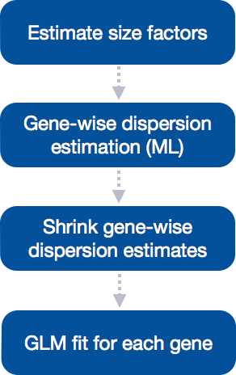
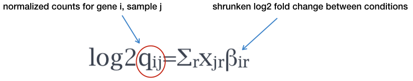
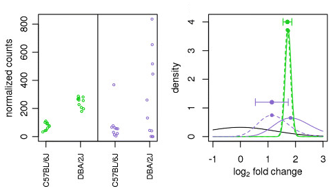

Approximate time: 60 minutes

## Learning Objectives 

* Understanding the different steps in a differential expression analysis in the context of DESeq2
* Building results tables for comparison of different sample classes


# Differential expression analysis with DESeq2: model fitting and hypothesis testing 

## Generalized Linear Model fit for each gene

The final step in the DESeq2 workflow is fitting the Negative Binomial model for each gene and performing differential expression testing.



As discussed [earlier](01_DGE_setup_and_overview.md), the count data generated by RNA-seq exhibits overdispersion (variance > mean) and the statistical distribution used to model the counts needs to account for this overdispersion. DESeq2 uses a negative binomial distribution to model the RNA-seq counts using the equation below:

 
 
DESeq2 will use this formula to create the model for **each** gene, but what we really want to know is whether the log2 foldchanges between conditions is significantly different from 0. The log2 foldchanges and their standard error can be estimated using the normalized counts with the formula:

 

By fitting the model, DESeq2 will determine the **estimates for the log2 foldchanges and their standard error values for each sample group relative to the mean expression of all samples**. However, the log2 foldchanges are adjusted to account for the large variance associated with the estimates for low read counts, so that these genes are not included as false positives.

### Shrunken log2 foldchanges (LFC)

Generally for NGS count data, there is a large variance associated with the LFC estimates for genes with low read counts, and these weakly expressed genes would be identified as differentially expressed due solely to this variation. To account for this issue and reduce false positives for lowly expressed genes, DESeq2 shrinks the LFC estimates toward zero when the information for a gene is low, which could include:

- Low counts
- High dispersion values

Similar to the previous shrinkage of dispersion estimates, the shrinkage of LFC estimates uses information from all genes to generate more accurate estimates. Specifically, the distribution of LFC estimates for all genes is used (as a prior) to shrink the LFC estimates of genes with little information or high dispersion toward more likely (lower) LFC estimates. 



*Illustration taken from the [DESeq2 paper](https://genomebiology.biomedcentral.com/articles/10.1186/s13059-014-0550-8).*

For example, in the figure above, the green gene and purple gene have the same mean values for the two sample groups (C57BL/6J and DBA/2J), but the green gene has low variation while the purple gene has high levels of variation. For the green gene with low variation, the unshrunken LFC estimate (vertex of the green solid line) is very similar to the shrunken LFC estimate (vertex of the green dotted line), but the LFC estimates for the purple gene are quite different due to the high dispersion. So even though two genes can have similar normalized count values, they can have differing degrees of LFC shrinkage. Notice the LFC estimates are shrunken toward the prior (black solid line).


>**NOTE:** If very large expected fold changes for a number of individual genes are expected, but not so many large fold changes that the prior would not include such large fold changes, then you may want to turn off LFC shrinkage.
> 
>You can turn off the beta prior when calling the `DESeq()` fucntion: `DESeq(dds, betaPrior=FALSE)`. By turning off the prior, the log2 foldchanges would be the same as those calculated by:
>
>`log2 (normalized_counts_group1 / normalized_counts_group2)`

### Hypothesis testing using the Wald test

The shrunken LFC estimates are output for each sample group relative to the mean expression of all groups. These estimates represent the **model coefficients**, and these coefficients are calculated regardless of the comparison of interest. The model coefficients can be viewed with `coefficients(dds)` to explore the strength of the effect for each factor group relative the overall mean for every gene. 

However, generally we are interested in the LFC estimates relative to other sample groups instead of to the mean expression of all groups. To do this, we must test if the difference in the log2 fold changes between groups is zero. To determine whether the difference in shrunken LFC estimates differs significantly from zero, the **Wald test** is used. The Wald test is generally used to make pair-wise comparisons (i.e. compare the LFCs from two different conditions).

#### Creating contrasts

To indicate to DESeq2 the two groups we want to compare, we can use **contrasts** to perform differential expression testing using the Wald test. Contrasts can be provided to DESeq2 a few different ways:

1. Automatically DESeq2 will use the base factor level of the condition of interest as the base for statistical testing. 
2. You can create a list for your comparison of interest using the factor levels given in `resultsNames()`, which lists all of the levels for all factors in your model design. The level given last is the base level for the comparison. For example, if the output of `resultsNames(dds)` is `"sexF", "sexM"`, then you could write the contrast as follows:
	
	```r
	
	# DO NOT RUN!
	
	contrast_sex <- list("sexF", "sexM")
	
	results(dds, contrast=contrast_sex)
	
	```
>
> **NOTE:** The Wald test can also be used with **continuous variables**. If the variable of interest provided in the design formula is continuous-valued, then the reported log2 fold change is per unit of change of that variable.

#### MOV10 DE analysis: contrasts and Wald tests

We have three sample classes so we can make three possible pairwise comparisons:

1. Control vs. Mov10 overexpression
2. Control vs. Mov10 knockdown
3. Mov10 knockdown vs. Mov10 overexpression

**We are really only interested in #1 and #2 from above**. Using the design formula we provided `~ sampletype`, DESeq2 internally created the following design matrix:

```
   	      Intercept  sampletypecontrol  sampletypeMOV10_knockdown  sampletypeMOV10_overexpression
Mov10_kd_2	 1	 	0		  1		 		0 
Mov10_kd_3	 1		0		  1				0
Mov10_oe_1   	 1		0		  0				1
Mov10_oe_2   	 1		0		  0				1
Mov10_oe_3   	 1		0		  0				1
Irrel_kd_1	 1		1		  0				0
Irrel_kd_2	 1		1		  0				0
Irrel_kd_3	 1		1		  0				0	

```

This design matrix is now used to setup the contrasts to request the comparisons we want to make. This information is utilized to inform the model about which replicates should be used to estimate the **log2 foldchanges (LFC)**.

We will tell DESeq2 the contrasts we would like to make using the `list()` method. To do this, we need to use the coefficient names to specify our comparisons, these correspond to the headers in your design matrix. To find out how the coefficients are named we can use the `resultsNames()` function:

```r
# Find names of coefficients
resultsNames(dds)
```

To specify the contrasts, we need to provide the column names from the coefficients table as a list of 2 character vectors:

```r
## Define contrasts
contrast_oe <- list( "sampletypeMOV10_overexpression", "sampletypecontrol")
```

**The order of the names, determines the direction of fold change that is reported.** The name provided in the second element is the level that is used as baseline. So for example, if we observe a log2 fold change of -2 this would mean the gene expression is lower in Mov10_oe relative to the control. Now, pass the contrast vector as an argument to the `results()` function:

```r
# Extract results table
res_tableOE <- results(dds, contrast=contrast_oe)
```

>**NOTE:** We could have specified the contrast in the `results()` argument. The syntax is:
>
>```r
>results(dds, contrast = c("sample_group", "level_to_compare", "base_level"))
>````
>
>Using our data, you could specify the contrast as follows:
>
>```r
>results(dds, contrast = c("sampletype", "MOV10_overexpression", "control"))`
>```

This will build a results table containing Wald test statistics for the comparison we are interested in. Let's take a look at what information is stored in the results:

```r
head(res_tableOE)
```

```
log2 fold change (MAP): sampletype MOV10_overexpression vs control 
Wald test p-value: sampletype MOV10_overexpression vs control 
DataFrame with 6 rows and 6 columns
               baseMean log2FoldChange      lfcSE       stat    pvalue       padj
              <numeric>      <numeric>  <numeric>  <numeric> <numeric>  <numeric>
1/2-SBSRNA4  45.6520399     0.26976764 0.18775752  1.4367874 0.1507784 0.25242910
A1BG         61.0931017     0.20999700 0.17315013  1.2128030 0.2252051 0.34444163
A1BG-AS1    175.6658069    -0.05197768 0.12366259 -0.4203185 0.6742528 0.77216278
A1CF          0.2376919     0.02237286 0.04577046  0.4888056 0.6249793         NA
A2LD1        89.6179845     0.34598540 0.15901426  2.1758136 0.0295692 0.06725157
A2M           5.8600841    -0.27850841 0.18051805 -1.5428286 0.1228724 0.21489067
```


#### Multiple test correction

Note that we have pvalues and p-adjusted values in the output. Which should we use to identify significantly differentially expressed genes?

If we used the `p-value` directly from the Wald test with a significance cut-off of 0.05 (α = 0.05), then 5% of all genes would be called as differentially expressed (i.e. 5% false positive genes). The more genes we test, the more 'false positives' we discover. For example, if we test 20,000 genes for differential expression, we would expect to find 1,000 false positive genes. We would not want to sift through our "significant" genes to identify which ones are true positives.

DESeq2 helps reduce the number of genes tested by removing those genes unlikely to be significantly DE prior to testing, such as those with low number of counts and outlier samples (gene-level QC). However, we still need to correct for multiple testing to reduce the number of false positives, and there are a few common approaches:

- **Bonferroni:** The adjusted p-value is calculated by: p-value * m (m = total number of tests). **This is a very conservative approach with a high probability of false negatives**, so is generally not recommended.
- **FDR / Benjamini-Hochberg:** Rank the genes by p-value, then multiply each ranked p-value by m/rank. This approach is designed to control the proportion of false positives among the set of rejected null hypotheses.
- **Q-value / Storey method:** The minimum FDR that can be attained when calling that feature significant. For example, if gene X has a q-value of 0.013 it means that 1.3% of genes that show p-values at least as small as gene X are false positives

In DESeq2, the p-values attained by the Wald test are corrected for multiple testing using the Benjamini and Hochberg method. The p-adjusted values should be used to determine significant genes. The significant genes can be output for visualization and/or functional analysis.

#### MOV10 DE analysis: results exploration

The results table looks very much like a dataframe and in many ways it can be treated like one (i.e when accessing/subsetting data). However, it is important to recognize that it is actually stored in a `DESeqResults` object. When we start visualizing our data, this information will be helpful. 

```r
class(res_tableOE)
```

Let's go through some of the columns in the results table to get a better idea of what we are looking at. To extract information regarding the meaning of each column we can use `mcols()`:

```r
mcols(res_tableOE, use.names=T)
```

* `baseMean`: mean of normalized counts for all samples
* `log2FoldChange`: log2 fold change
* `lfcSE`: standard error
* `stat`: Wald statistic
* `pvalue`: Wald test p-value
* `padj`: BH adjusted p-values
 
Now that we have results for the overexpression results, let's do the same for the **Control vs. Knockdown samples**. The first thing, we need to do is create a contrasts vector called `contrast_kd` for the Mov10_knockdown comparison to control.

```r
## Define contrasts
contrast_kd <- list( "sampletypeMOV10_knockdown", "sampletypecontrol")
```

Use that contrasts vector to extract a results table and store that to a variable called `res_tableKD`.  

```r
# Extract results table
res_tableKD <- results(dds, contrast=contrast_kd)
```

Take a quick peek at the results table containing Wald test statistics for the Control-Knockdown comparison we are interested in and make sure that format is similar to what we observed with the OE.

> **NOTE: on p-values set to NA**
> > 
> 1. If within a row, all samples have zero counts, the baseMean column will be zero, and the log2 fold change estimates, p-value and adjusted p-value will all be set to NA.
> 2. If a row contains a sample with an extreme count outlier then the p-value and adjusted p-value will be set to NA. These outlier counts are detected by Cook’s distance. 
> 3. If a row is filtered by automatic independent filtering, for having a low mean normalized count, then only the adjusted p-value will be set to NA. 

# Summary of DGE analysis

1. Count normalization and exploratory data analysis (PCA & heirarchical clustering)
2. Run DESeq2:
	- Create DESeq2 dataset:
	```
	dds <- DESeqDataSetFromMatrix(countData = data, colData = meta, design = ~ sampletype)
	```

	

---
*This lesson has been developed by members of the teaching team at the [Harvard Chan Bioinformatics Core (HBC)](http://bioinformatics.sph.harvard.edu/). These are open access materials distributed under the terms of the [Creative Commons Attribution license](https://creativecommons.org/licenses/by/4.0/) (CC BY 4.0), which permits unrestricted use, distribution, and reproduction in any medium, provided the original author and source are credited.*

*Some materials and hands-on activities were adapted from [RNA-seq workflow](http://www.bioconductor.org/help/workflows/rnaseqGene/#de) on the Bioconductor website*

***
