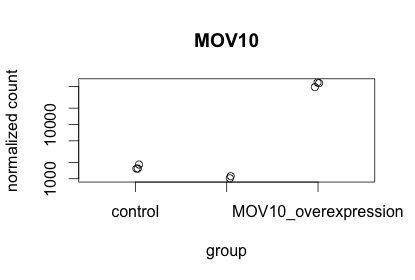
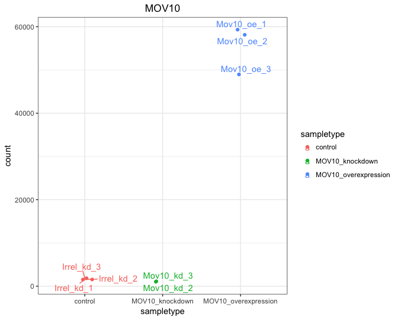
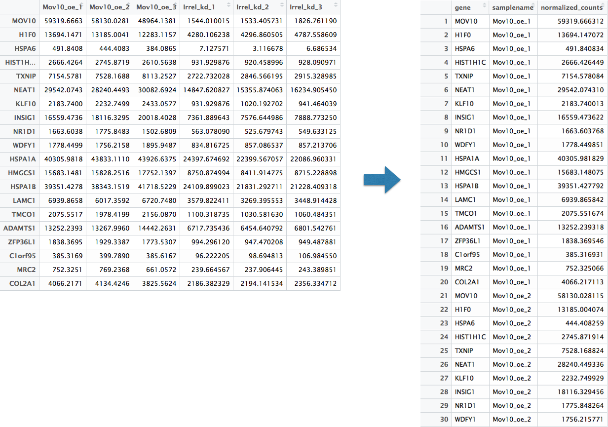
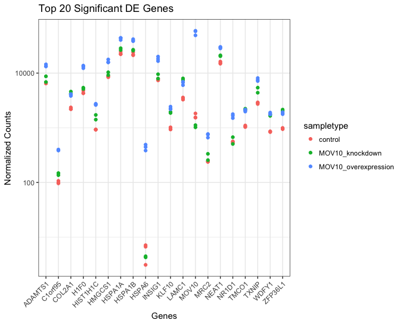
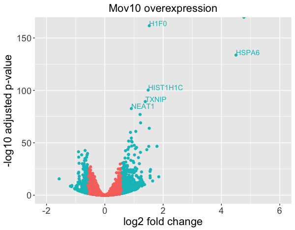
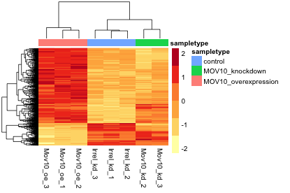
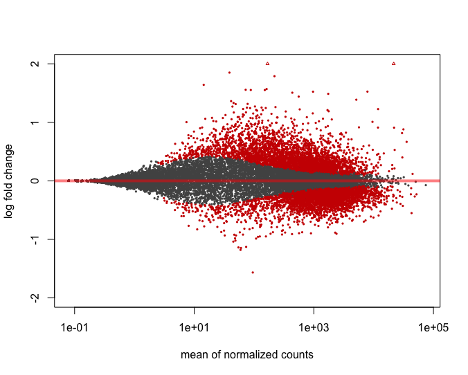

Approximate time: 75 minutes

## Learning Objectives 

* Exploring our significant genes using data visualization
* Using volcano plots to evaluate relationships between DEG statistics
* Plotting expression of significant genes using heatmaps

## Visualizing the results

When we are working with large amounts of data it can be useful to display that information graphically to gain more insight. Visualization deserves an entire course of its own, but during this lesson we will get you started with some basic and more advanced plots commonly used when exploring differential gene expression data.

### Plotting signicant DE genes

One way to visualize results would be to simply plot the expression data for a handful of genes. We could do that by picking out specific genes of interest or selecting a range of genes:

#### Using DESeq2 `plotCounts()` to plot a single gene

To pick out a specific gene of interest to plot, for example Mov10, we can use the `plotCounts()` from DESeq2:

```r
# load libraries
library(DESeq2)
library(reshape)
library(ggplot2)
library(ggrepel)
library(DEGreport)

# Plot expression for single gene
plotCounts(dds, gene="MOV10", intgroup="sampletype") 
```


**This function only allows for plotting the counts of a single gene at a time.** If you wish to change the appearance of this plot, we can save the output of `plotCounts()` to a variable specifying the `returnData=TRUE` argument, then use `ggplot()`:

```r
# Save plotcounts to variable
d <- plotCounts(dds, gene="MOV10", intgroup="sampletype", returnData=TRUE)

# Adding samplenames to data frame
d$name <- rownames(d)

# Plotting the MOV10 normalized counts
ggplot(d, aes(x=sampletype, y=count, color=sampletype)) + 
  geom_point(position=position_jitter(w=0.1,h=0)) +
  geom_text_repel(aes(label = name)) + 
  theme_bw() +
  ggtitle("MOV10") +
  theme(plot.title=element_text(hjust=0.5))
```

**Within `ggplot()` we can use the `geom_text_repel()` from the 'ggrepel' R package to label our individual points on the plot.**



#### Using `ggplot2` to plot multiple genes (e.g. top 20)

Often it is helpful to check the expression of multiple genes of interest at the same time. While this isn't easily done using the `plotCounts()` function, we can use `ggplot()` to do this after performing some data wrangling.

We are going to plot the normalized count values for the **top 20 differentially expressed genes (by padj values)**. 

To do this, we first need to determine the gene names of our top 20 genes by ordering our significant results and extracting the top 20 genes:

```r
## Order significant results by padj values
sigOE_ordered <- sigOE[order(sigOE$padj), ]
top20_sigOE_genes <- rownames(sigOE_ordered[1:20, ])
```

Then, we can extract the normalized count values for these top 20 genes:

```r
## normalized counts for top 20 significant genes
normalized_counts <- counts(dds, normalized=T)
top20_sigOE_norm <- normalized_counts[top20_sigOE_genes, ]
```

Now that we have the normalized counts for each of the top 20 genes, to plot using `ggplot()`, we need to gather the counts for all samples into a single column (dataset from a wide format to a long format).

The `melt()` function in the **reshape** R package will perform this operation and will output the normalized counts for all genes for *Mov10_oe_1* listed in the first 20 rows, followed by the normalized counts for *Mov10_oe_2* in the next 20 rows, so on and so forth.

```r
## use melt to change to long data format
melted_top20_sigOE <- data.frame(melt(top20_sigOE_norm))
colnames(melted_top20_sigOE) <- c("gene", "samplename", "normalized_counts")
```



Now if we want our counts colored by sample group, then we need to combine the metadata information with the melted normalized counts data into the same data frame for input to `ggplot()`:

```r
## add metadata to melted dataframe
meta$samplename <- rownames(meta)
melted_top20_sigOE <- merge(melted_top20_sigOE, meta)
```

Finally, we can use ggplot2 to plot our normalized counts for the top 20 genes:

```r
## plot using ggplot2
ggplot(melted_top20_sigOE) +
        geom_point(aes(x = gene, y = normalized_counts, color = sampletype)) +
        scale_y_log10() +
        xlab("Genes") +
        ylab("Normalized Counts") +
        ggtitle("Top 20 Significant DE Genes") +
        theme_bw() +
	theme(axis.text.x = element_text(angle = 45, hjust = 1)) +
	theme(plot.title=element_text(hjust=0.5))
```



### Volcano plot

The above plot would be great to look at the expression levels of good number of genes, but for more of a global view there are other plots we can draw. A commonly used one is a volcano plot; in which you have the log transformed adjusted p-values plotted on the y-axis and log2 fold change values on the x-axis. There is no built-in function for the volcano plot in DESeq2, but we can easily draw it using `ggplot2`. 

To generate a volcano plot, we first need to have a column in our results data indicating whether or not the gene is considered differentially expressed based on p-adjusted and log2 foldchange values.

```r
threshold_OE <- res_tableOE$padj < padj.cutoff & abs(res_tableOE$log2FoldChange) > lfc.cutoff
```

We now have a logical vector of values that has a length which is equal to the total number of genes in the dataset. The elements that have a `TRUE` value correspond to genes that meet the criteria (and `FALSE` means it fails). It should countain the same number of TRUEs as the number of genes in our `sigOE` data frame.

```r
length(which(threshold_OE))
```
	
To add this vector to our results table we can use the `$` notation to create the column on the left hand side of the assignment operator, and then assign the vector to it instead of using `cbind()`:

```r
res_tableOE$threshold <- threshold_OE                
```

Now, we need to do the same for the `res_tableKD`:

```r
# Create threshold vector
threshold_KD <- res_tableKD$padj < padj.cutoff & abs(res_tableKD$log2FoldChange) > lfc.cutoff

# Add vector to data frame
res_tableKD$threshold <- threshold_KD
``` 

To plot using ggplot2, we need our results to be data frames (currently stored in  `DESeqResults` objects):

```r
# Create dataframe for plotting
resOE_df <- data.frame(res_tableOE)
```
We want to label some of the genes that have very low p-values. To do this we fist need to identify the set of genes that we want labeled.

```r
# Get gene symbols for genes that have p < 1e-80
sig_genes <- row.names(resOE_df)[which(resOE_df$padj < 1e-80)]

# Add a column of logical values to indicate which genes we want labeled
resOE_df$genelabels <- row.names(resOE_df) %in% sig_genes
```

Now we can start plotting. The `geom_point` object is most applicable, as this is essentially a scatter plot. In order to display the selected text labels we will need to add the `aes()` inside of `ggplot()` instead of `geom_point()`: 

```r
# Volcano plot
  
ggplot(resOE_df, aes(x=log2FoldChange, y=-log10(padj),color=threshold, label=row.names(resOE_df))) +
  geom_point() +
  geom_text(aes(label=ifelse(genelabels ==T,row.names(resOE_df),'')), hjust=0, vjust=0) +
  ggtitle('Mov10 overexpression') +
  xlab("log2 fold change") + 
  ylab("-log10 adjusted p-value") +
  xlim(c(-2,6)) +
  theme(plot.title = element_text(size = rel(1.5), hjust=0.5),
        axis.title = element_text(size = rel(1.5)),
        axis.text = element_text(size = rel(1.25)),
        legend.position = "none")

```




### Heatmap

Alternatively, we could extract only the genes that are identified as significant and the plot the expression of those genes using a heatmap:

```r
### Extract normalized expression for significant genes
norm_OEsig <- normalized_counts[rownames(sigOE),]
```

Now let's draw the heatmap using `pheatmap`:

```r
### Annotate our heatmap (optional)
annotation <- data.frame(sampletype=meta[,'sampletype'], 
                     row.names=rownames(meta))

### Set a color palette
heat.colors <- brewer.pal(6, "YlOrRd")

### Run pheatmap
pheatmap(norm_OEsig, color = heat.colors, cluster_rows = T, show_rownames=F,
annotation= annotation, border_color=NA, fontsize = 10, scale="row",
     fontsize_row = 10, height=20)
```
         
       

> *NOTE:* There are several additional arguments we have included in the function for aesthetics. One important one is `scale="row"`, in which Z-scores are plotted, rather than the actual normalized count value. Z-scores are computed on a gene-by-gene basis by subtracting the mean and then dividing by the standard deviation. The Z-scores are computed **after the clustering**, so that it only affects the graphical aesthetics and the color visualization is improved.

### MA Plot

Another plot often useful to exploring our results is the MA plot. The MA plot shows the mean of the normalized counts versus the log2 foldchanges for all genes tested. The genes that are significantly DE are colored to be easily identified. The DESeq2 package also offers a simple function to generate this plot:

```r
plotMA(res_tableOE, alpha = 0.05, ylim=c(-2,2))
```


We would expect to see significant genes across the range of expression levels.

DESeq2 offers a useful function for interactively identifying genes in the MA plot:

```r
idx <- identify(res_tableOE$baseMean, res_tableOE$log2FoldChange)

# Click on points to identify, then hit `esc` to return back to the command prompt. When finished, the row numbers should appear on the plot

rownames(res_tableOE)[idx]
```

***

**Exercise**

1. Generate two figures for the KD-control comparison: a volcano plot and a heatmap. 
2. Save both images to file.

***

***NOTE:** The package 'DEGreport' can make the top20 genes and the volcano plots generated above by writing a few lines of simple code. While you can customize the plots above, you may be interested in using the easier code. Below are examples for code to create these plots:*

```r
DEGreport::degPlot(dds = dds, res = res, n=20, xs="type", group = "condition")

DEGreport::degPlotWide(dds = dds, genes = row.names(res)[1:5], group = "condition")

DEGreport::degVolcano(
    as.data.frame(res[,c("log2FoldChange","padj")]), # table - 2 columns
    plot_text=as.data.frame(res[1:10,c("log2FoldChange","padj","id")])) # table to add names
```
***

*This lesson has been developed by members of the teaching team at the [Harvard Chan Bioinformatics Core (HBC)](http://bioinformatics.sph.harvard.edu/). These are open access materials distributed under the terms of the [Creative Commons Attribution license](https://creativecommons.org/licenses/by/4.0/) (CC BY 4.0), which permits unrestricted use, distribution, and reproduction in any medium, provided the original author and source are credited.*

* *Materials and hands-on activities were adapted from [RNA-seq workflow](http://www.bioconductor.org/help/workflows/rnaseqGene/#de) on the Bioconductor website*
