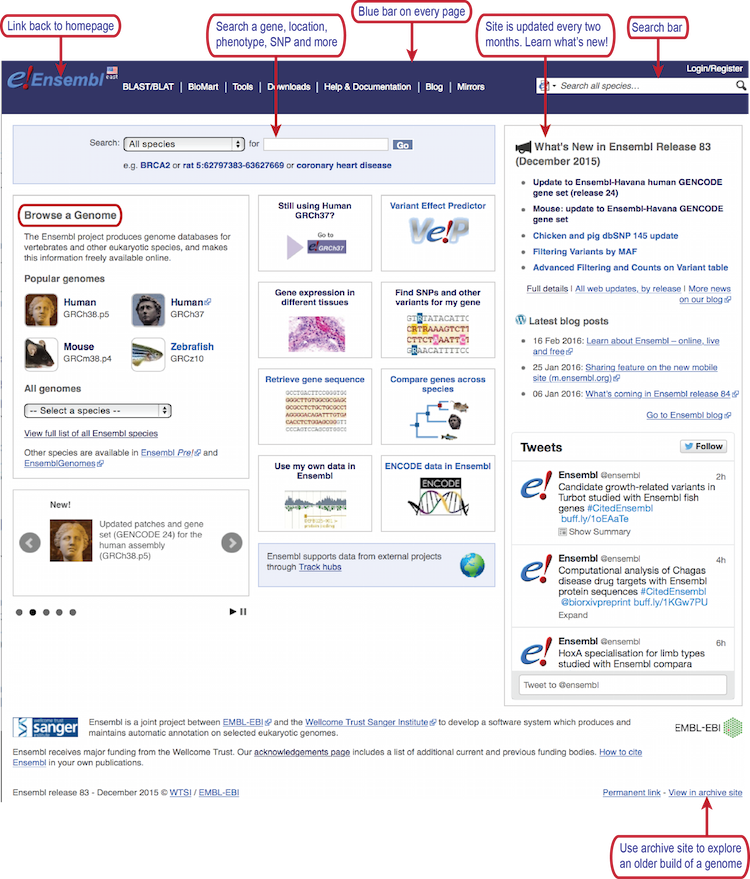
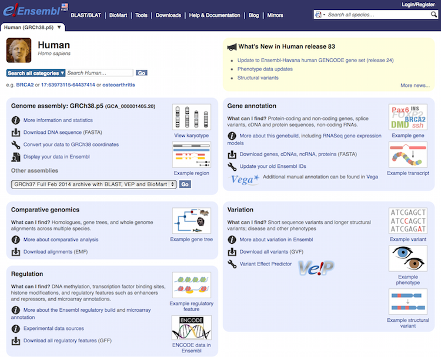
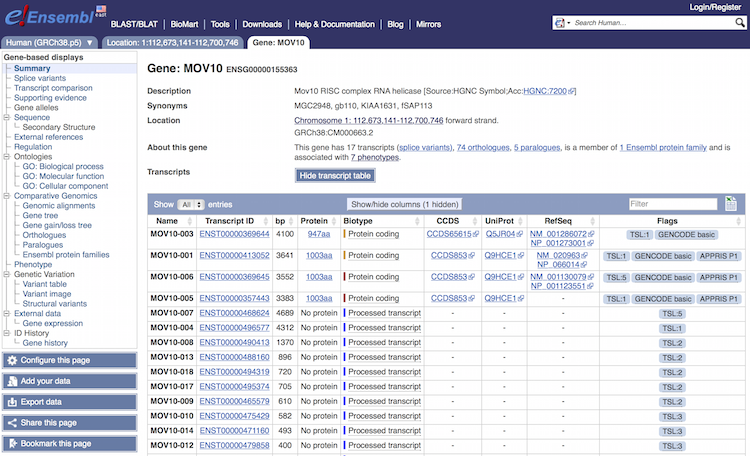
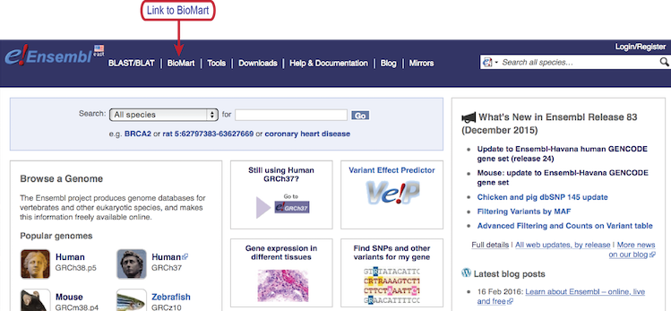
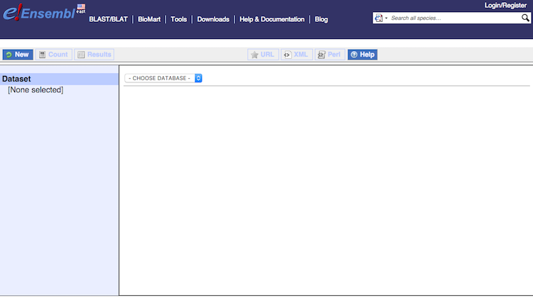

Contributors: Mary Piper

Approximate time: 1.5 hours

## Learning Objectives

* learn how to use features of the Ensembl biological database and genome browser to access information and data during an NGS analysis

### Ensembl genome database and browser

#### Overview
[*Ensembl*](http://useast.ensembl.org/index.html) provides a website that acts as a **single point of access to annotated genomes** for vertebrate species. 



- **Searching Ensembl**:  Look for a gene, location, variant and more using the search box on the homepage or the box that is provided in the top right corner of any Ensembl page.

	- a gene name (for example, BRCA2) - best to use the official gene symbols ([HGNC](http://www.genenames.org))
	- a UniProt accession number (for example, P51587)
	- a disease name (for example, coronary heart disease)
	- a variation (for example, rs1223)
	- a location - a genomic region (for example, rat X:100000..200000)
	- a PDB ID or a Gene Ontology (GO) term

	Most search results will take you to the appropriate Ensembl view through a results page. If you search using a location you will be directed straight to the location tab (this tab provides a view of a region of a genome).

- **Browse a Genome**: Choose your species of interest in this section. The drop down menu under 'All genomes' allows you to select from the full list. The *Ensembl Pre!* site contains new genomes (either new species to Ensembl, or updates in the reference assembly) that do not yet have an Ensembl gene set.  BLAST/BLAT is available for organisms in all Ensembl sites, including Pre!

- **Help**: There is a wealth of help and documentation in Ensembl if you are new to the browser. Video tutorials are provided and printable pdfs with exercises. Custom data may be uploaded to Ensembl or displayed directly by attaching a file by URL. 

- **News**: To find out what release you are working with, have a look at the news section of the homepage. If the current release is not the one you need, access archive sites to access previous versions, or releases, of Ensembl using the link on the lower right side.
 
#### Querying Ensembl 
Each species in Ensembl has its own home page, where you can find out who provided the genome sequence and which version of the genome assembly is represented.  

1. Click on the common name of your species of interest to go to the species homepage. We’ll click on `Human`.

	

	Within the human genome page, find the basic features:

	- Search bar for human information on gene, location, disease, etc.
	- News for the current human genome release
	- Information and sequences for the current human genome build
	- Links to example features in Ensembl
	- Guides on how to access information on comparative genomics, regulation, and variation

4. In the search bar type `mov10`, and from the search results select `MOV10 (Human Gene)`. The gene page for MOV10 should populate. 
	
	
	
	The `Gene` page is organized as follows:
	
	- The top of the page has a **gene overview**, followed by the **transcript table**. All transcripts identified using any evidence are provided in the table. The transcripts are color-coded based on whether the transcript is protein-coding or non-coding, as well as, by the quality of evidence:
	
		- **Gold:** protein-coding transcripts are reviewed annotations with highest confidence
		- **Red:** protein-coding transcripts are less confident
		- **Blue:** non-coding transcripts
		
		In addition to coloring, Ensembl also provides flags in the table for **"Transcript Support Levels"**, which highlight how well-supported or poorly-supported are the transcript models.
		
		Also provided in the table are the links to the **Consensus CoDing Sequence** sets (CCDS) for available transcripts. The CCDS is a consensus set of coding sequences established as a collaborative effort between NCBI, Ensembl, Vega, UniProt-SwissProt, and UCSC. 
		
		Note the Ensembl ID for the MOV10 gene is `ENSG00000155363`. Ensembl uses the following format for naming:
	
		- ENSG###########	Ensembl Gene ID
		- ENST###########	Ensembl Transcript ID
		- ENSP###########	Ensembl Peptide ID
		- ENSE###########	Ensembl Exon ID
	
		For non-human species a suffix is added:
	
		- MUS (Mus musculus) for mouse ENSMUSG###
		- DAR (Danio rerio) for zebrafish: ENSDARG###
	

	- Below the transcript table is a summary section with links to external databases, followed by visualization of the transcripts.
	
	
	
	**NOTE:** in the visualization, the blue bar represents the genome contig, and transcripts above the bar are forward-stranded and those below are reverse.
	
	- The side panel has **detailed gene information** displayed as a hierarchical tree. The various categories provide detailed and downloadable gene information, including associated sequence data, regulatory regions, GO terms, comparative genomics information, and variation data.
	
6. Let's suppose we are interested in the MOV10-001 transcript. Click on the MOV10-001 transcript ID, `ENST00000413052`. This should open a new tab entitled `Transcript: MOV10-001` with detailed information for the transcript. 

	- If you click on `exons`, the sequence for each of the exons will be displayed below. If you click on `12 domains and features` the associated domains are output. If you click on `625 variations`, all variants for the transcript are listed with variation IDs, supporting evidence, and predicted effect on protein function. Additional detailed information on the transcript and protein is available on the side panel. 

7. Let's now visualize our transcripts for the gene using the `Location` tab. There are a lot of features available from this genome browser, which we cannot go into due to time limitations, but there are many tutorials available from Ensembl to learn about these features.


## Ensembl Biomart

While Ensembl contains extensive genomic information, we often want to mine the data to export a custom dataset. Ensembl offers the `Biomart` tool for accessing and mining the Ensembl database. You can access BioMart directly using the web interface; alternatively, there is an R package, "biomaRt", available for use for mining Ensembl data from R.

### Web interface

8. You can access BioMart from any page using the link in the menu bar.


The BioMart tool for data mining the Ensembl database is easy to use and requires three steps:

1. **Choose a dataset.** The dropdown menu allows you to choose from the Ensembl Gene, Ensembl Variation, Ensembl Regulation, and Vega databases. You will then be able to choose your species of interest.
2. **Select your filters or inputs.** You can restrict your query using various criteria, such as genomic region, specific genes, particular variants, etc.
3. **Choose the attributes to output.** You have a wide range of attributes that you can choose your query to output, such as features, structures, and sequence information.



Let’s use BioMart to obtain information on genomic location and transcript count for [this gene list](https://raw.githubusercontent.com/hbc/NGS_Data_Analysis_Course/master/sessionIV/results/sigOE_hw.txt); download this list by clicking on the link, or copy the list from your browser.

#### **Step 1: Choose a dataset** 
Click on `Dataset` and choose the database `Ensembl Genes ##` and `Homo sapiens genes(GRCh38.p#)`. 
_**NOTE:** if we wanted to use an older version of BioMart, we could click on the lower right-hand link to `View in archive site`._

#### **Step 2: Select your filters or inputs**
Click on `Filters`. Expand `GENE` and click on the box next to `Input external references ID list`. Choose `HGNC symbol(s)` from the drop-down menu. Either choose the file `sigOE_hw.txt` or copy and paste the gene names in the file into the text box.

#### **Step 3: Choose the attributes to output**
Click on `Attributes`and keep `Features` selected.

Expand `GENE` and choose the following:
	
	- Ensembl Gene ID
	- Description
	- Chromosome Name
	- Gene Start (bp)
	- Gene End (bp)
	- Strand
	- Associated Gene Name
	- Transcript count

Click on `Results` button in the upper left-hand corner. Save output to a comma-separated value (CSV) file. In the HTML table, click on the link for `MOV10` to take you to the Ensembl gene page.

### biomaRt R package
When you are performing an NGS analysis, you often find a need to access BioMart, for example, to find genomic locations, convert gene IDs, or filter sequences from your data. Luckily for us, there is an R package for BioMart, called `biomaRt`, which allows us to perform BioMart queries from R.

Let's explore BioMart functionality in R using a counts dataset with Ensembl IDs as row names. We would like to **convert the Ensembl IDs to gene names**. We can use `biomaRt` package to perform this conversion easily within R.

Click on the link to the [counts file](https://raw.githubusercontent.com/hbc/NGS_Data_Analysis_Course/master/sessionIV/results/counts.txt) and save it to your `data` folder.

Read in the counts file:

```r
# Read in counts file

full_counts <- read.table("data/counts.txt")

counts <- head(full_counts, n=50)
```

Load the biomaRt library:

```r
# Load library

library("biomaRt")
```

Now the same three steps required by the web interface are required by the R package. We are going show how to run the three steps by using BioMart to achieve the following goal: ***Return the gene names for a list of Ensembl mouse IDs***

#### **Step 1: Choose a dataset**

Similar to the web interface, we will choose a database (`Ensembl Genes ##`) and a species dataset (`Mus musculus genes (GRCm38.p#)`). 

Choose a BioMart database - we will choose the `Ensembl Genes ##`:

```r
# To connect to a BioMart database - useMart()

listMarts(host =  'www.ensembl.org')

ensembl_genes <- useMart('ENSEMBL_MART_ENSEMBL',
                        host =  'www.ensembl.org')
```

Choose the *Mus musculus* genes (GRCm38.p4) dataset within the `Ensembl Genes ##` database:

```r
# To query the BioMart database for a specific species - useDataset() within the query command

datasets <- listDatasets(ensembl_genes)

View(datasets)

mouse <- useDataset("mmusculus_gene_ensembl",
                   useMart('ENSEMBL_MART_ENSEMBL',
                           host =  'www.ensembl.org'))
```

#### **Step 2: Select your filters or inputs**

We can build a query of our dataset using the `getBM()` function and specifying the filters, filter values, attributes, and mart object database to search: `getBM(filters, values, attributes, mart)`

First we can specify our input using the `filters`argument. 

**What is our input?** We want to return gene names for a list of Ensembl mouse IDs from within our `counts` dataframe; therefore our input will be Ensembl IDs and their values will be the row names of our counts dataframe.

```r
# To build a query - getBM(filters, values, ...)

## "Filters" is a vector for the type of input; in our case, our input is Ensembl IDs

filters <- listFilters(mouse)

View(filters)

getBM(filters= "ensembl_gene_id", ...)  # The "..." represents that the getBM() function is not complete

                    
## "Values" is a vector of values for the filter; in our case, our Ensembl IDs are the row names of the counts dataset

getBM(filters= "ensembl_gene_id", 
		values= row.names(counts), ...)
```

#### **Step 3: Choose the attributes to output**

We can continue building our `getBM()` function by specifying what we want output for each of our Ensembl IDs using the `attributes` argument. We would like to output the Ensembl ID and the gene name. 

```r
# To build a query - getBM(filters, values, attributes, ...)

## "Attributes" is a vector of attributes for the output we want to generate

attributes <- listAttributes(mouse)

View(attributes)

## Use BioMart to return gene names for a list of Ensembl IDs:

gene_names <- getBM(filters= "ensembl_gene_id",
                    values= row.names(counts), 
                    attributes= c("ensembl_gene_id", "external_gene_name"), ...)
```

Finally, to complete the `getBM()` function, we need to specify which dataset to query.

```r
# To build a query - getBM(filters, values, attributes, mart)

gene_names <- getBM(filters= "ensembl_gene_id",
                    values= row.names(counts), 
                    attributes= c("ensembl_gene_id", "external_gene_name"), 
                    mart= mouse)

## Now we can run the query. BioMart queries can take a bit of time depending on the size of your dataset and the attributes you are asking for.                    

View(gene_names)
                    
```

Now that we have our gene names, we need to match them to the Ensembl IDs in our counts dataset. If the columns from two dataframes have the same name, we can merge the dataframes using those columns:

```r
# Merge the two dataframes by ensembl_gene_id

ensembl_results <- merge(counts, gene_names, by.x="row.names", by.y = "ensembl_gene_id")

write.csv(ensembl_results, "results/annotated_counts.csv", quote=F)
```
#### What if you are using an older genome? 

Check the archived BioMart sites to determine the archived database desired. 

If we want to use the archived databases in R, we need to change our query a bit to specify an older genome build:

```r
# Using an older genome build

mouse_mm9 <- useDataset("mmusculus_gene_ensembl",
                   useMart('ENSEMBL_MART_ENSEMBL',
                           host =  'may2012.archive.ensembl.org'))
```

The filters and attributes change for different builds of the genome, so you might find yourself looking them up if you change builds. Using our previous filters and attributes we would have run the following:                    

```r
# DO NOT RUN			   
gene.names_mm9 <- getBM(filters= "ensembl_gene_id", 
                    attributes= c("ensembl_gene_id", "external_gene_name"),
                    values= row.names(counts),
                    mart= mouse_mm9)
```

However, for `attributes`, specifying gene names using `external_gene_name` no longer works. To find the correct way to specify gene names for this mouse build, you will need to look up the attributes again:

```r
attributes_mm9 <- listAttributes(mouse_mm9)

View(attributes_mm9)

gene.names_mm9 <- getBM(filters= "ensembl_gene_id", 
                    attributes= c("ensembl_gene_id", "external_gene_id"),
                    values= row.names(counts),
                    mart= mouse_mm9)

# human archive for GRCH37 genome build: host = "grch37.ensembl.org"
```

***
*This lesson has been developed by members of the teaching team at the [Harvard Chan Bioinformatics Core (HBC)](http://bioinformatics.sph.harvard.edu/). These are open access materials distributed under the terms of the [Creative Commons Attribution license](https://creativecommons.org/licenses/by/4.0/) (CC BY 4.0), which permits unrestricted use, distribution, and reproduction in any medium, provided the original author and source are credited.*
