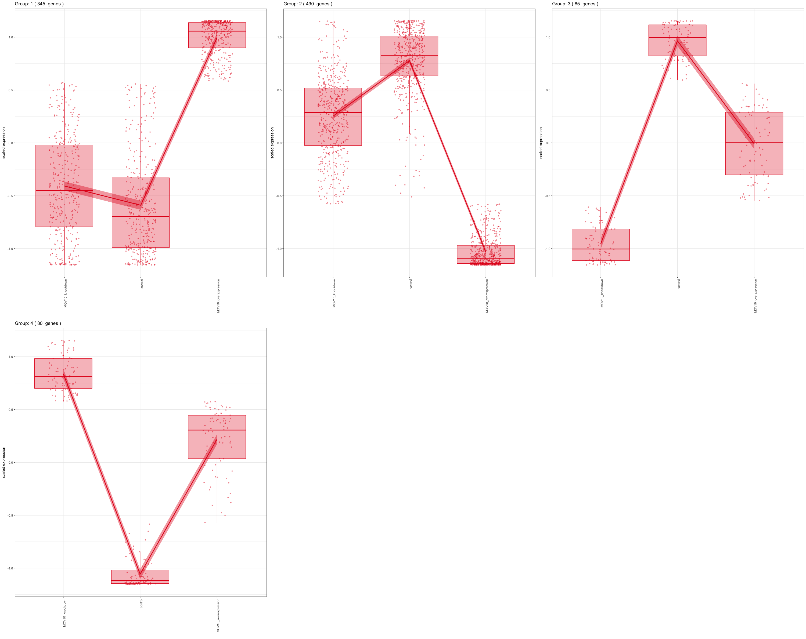
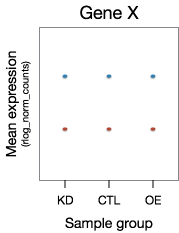
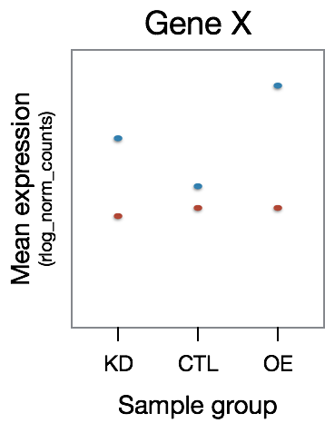

Approximate time: 45 minutes

## Learning Objectives 

* Introducing an alternative statistical test for differential expression analysis
* Extract results using the LRT and compare to Wald test
* Export results to file


## Hypothesis testing: Likelihood ratio test (LRT)

An alternative to pair-wise comparisons is to **analyze all levels of a factor at once**. By default the Wald test is used to generate the results table, but DESeq2 also offers the LRT which is used to identify any genes that show change in expression across the different levels. This type of test can be especially useful in analyzing time course experiments. 

To use the LRT, we use the `DESeq()` function but this time adding two arguments: 
1) to specify that we want to use the LRT test
2) the 'reduced' model

```r
# Likelihood ratio test
dds_lrt <- DESeq(dds, test="LRT", reduced = ~ 1)
```

Since our model only has one factor (`sampletype`), the reduced model is just the intercept. The LRT is comparing the full model to the reduced model to identify significant genes. **The p-values are determined solely by the difference in deviance between the full and reduced model formula (not log2 fold changes)**. 

Generally, this test will result in a larger number of genes than the individual pair-wise comparisons. While the LRT is a test of significance for differences of any level of the factor, one should not expect it to be exactly equal to the union of sets of genes using Wald tests (although we do expect a majority overlap).

Let's take a look at the results table:

```r
# Extract results
res_LRT <- results(dds_lrt)
```

You will find that similar columns are reported for the LRT test. One thing to note is, even though there are fold changes present they are not directly associated with the actual hypothesis test. Thus, when filtering significant genes from the LRT we use only the FDR as our threshold. *How many genes are significant at `padj < 0.05`?*

```r
# Subset the LRT results to return genes with padj < 0.05
sig_res_LRT <- subset(res_LRT, padj < padj.cutoff)

# Get sig gene lists
sigLRT_genes <- rownames(sig_res_LRT)
length(sigLRT_genes)

# Compare with the sigOE and sigKD gene lists
sigOE_genes <- rownames(sigOE)
length(sigOE_genes)

sigKD_genes <- rownames(sigKD)
length(sigKD_genes)
```

How many genes from the Mov10 overexpression Wald test are contained in the LRT gene set? And for the Mov10 knockdown? 

The number of significant genes observed from the LRT is quite high. We are **unable to set a fold change criteria here since the statistic is not generated from any one pairwise comparison.** This list includes genes that can be changing in any number of combinations across the three factor levels. It is advisable to instead increase the stringency on our criteria and lower the FDR threshold.

***

**Exercise**

1. Using a more stringent cutoff of `padj < 0.001`, count how many genes are significant using the LRT method.
2. Set the variables `OEgenes` and `KDgenes`to contain the genes that meet the  threshold `padj < 0.001`.
3. Find the overlapping number of genes between these gene sets and the genes from LRT at `padj < 0.0001`.
***

Often we are interested in genes that have particular patterns across the sample groups (levels) of our condition. For example, with the MOV10 dataset, we may be interested in genes that exhibit the lowest expression for the `Mov10_KD` and highest expression for the `Mov10_OE` sample groups (i.e. KD < CTL < OE). To identify genes associated with these patterns we can use a clustering tool, `degPatterns` from the 'DEGreport' package, that groups the genes based on their changes in expression across sample groups.

```r
# Subset results for faster cluster finding (for classroom demo purposes)
ordered_sig_res_LRT <- sig_res_LRT[order(sig_res_LRT$padj), ]
clustering_sig_genes <- data.frame(ordered_sig_res_LRT[1:1000, ])

# Obtain the rlog values for the normalized counts for plotting purposes
rlog_norm_counts <- assay(rld)
cluster_rlog <- rlog_norm_counts[rownames(clustering_sig_genes), ]

# Use the `degPatterns` function from the 'DEGreport' package to show gene clusters across sample groups
clusters <- degPatterns(cluster_rlog, metadata = meta, time = "sampletype", col=NULL)

# If we would like the order to be more intuitive we can reorder the levels and run the clustering again
levels(meta$sampletype)
levels(meta$sampletype) <- levels(meta$sampletype)[c(2,1,3)]

clusters <- degPatterns(cluster_rlog, metadata = meta, time = "sampletype", col=NULL)
```

While we don't see any clusters with the pattern we are looking for, we do see a lot of genes that don't change much between control and knockdown sample groups, but increase drastically with the overexpression group (Group 1). 



Let's explore the set of genes in Group 1 in more detail:

```r
# What type of data structure is the clusters output?
class(clusters)

# Let's see what is stored in the `df` component
head(clusters$df)

# Extract the Group 1 genes
cluster_groups <- clusters$df
group1 <- cluster_groups[cluster_groups$cluster == 1, ]

# or you could use subset(): 
# group1 <- subset(cluster_groups, cluster == 1)
```

We could extract the groups of genes and perform functional analysis on each of the groups of interest.

### LRT example - time course analyses

The LRT test can be especially helpful when performing time course analyses. We can explore whether there are any significant differences in treatment effect between any of the timepoints. 

For have an experiment looking at the effect of treatment over time on mice of two different genotypes. We could use a design formula for our 'full model' that would include the major sources of variation in our data: `genotype`, `treatment`, `time`, and our main condition of interest, which is the difference in the effect of treatment over time (`treatment:time`).

```r
full_model <- ~ genotype + treatment + time + treatment:time
```

To perform the LRT test, we can determine all genes that have significant differences in expression between treatments across time points by giving the 'reduced model' without the `treatment:time` term:

```r
reduced_model <- ~ genotype + treatment + time
```

Then, we could run our test by using the following code:

```r
dds <- DESeqDataSetFromMatrix(countData = raw_counts, colData = metadata, design = ~ genotype + treatment + time + treatment:time)

dds_lrt_time <- DESeq(dds, test="LRT", reduced = ~ genotype + treatment + time)
```
This analysis will not return genes where the treatment effect does not change over time, even though the genes may be differentially expressed between groups at a particular time point, as shown in the figure below:



The significant DE genes will represent those genes that have differences in the effect of treatment over time, an example is displayed in the figure below:




Once we have our results, we can determine the significant genes using a threshold of `padj` < 0.05 and return the normalized counts for those genes. Then we could perform clustering to identify genes that change over time in a way meaningful to us:

```r
clusters <- degPatterns(cluster_rlog, metadata = meta, time="time", col="treatment")
```

You can extract the groups of genes associated with the patterns of interest similar to the actions performed previously, then move on to functional analysis for each of the gene groups of interest.

---
*This lesson has been developed by members of the teaching team at the [Harvard Chan Bioinformatics Core (HBC)](http://bioinformatics.sph.harvard.edu/). These are open access materials distributed under the terms of the [Creative Commons Attribution license](https://creativecommons.org/licenses/by/4.0/) (CC BY 4.0), which permits unrestricted use, distribution, and reproduction in any medium, provided the original author and source are credited.*

* *Materials and hands-on activities were adapted from [RNA-seq workflow](http://www.bioconductor.org/help/workflows/rnaseqGene/#de) on the Bioconductor website*

