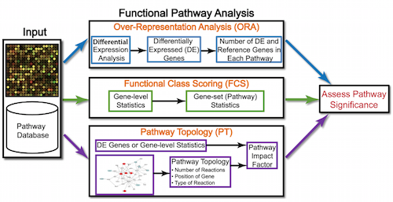
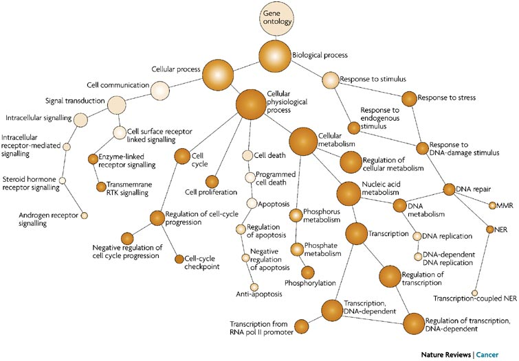
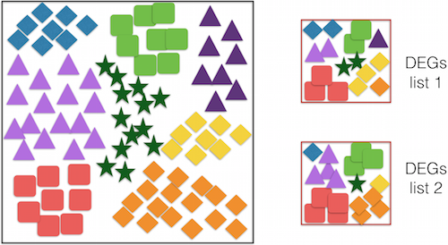
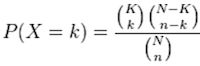
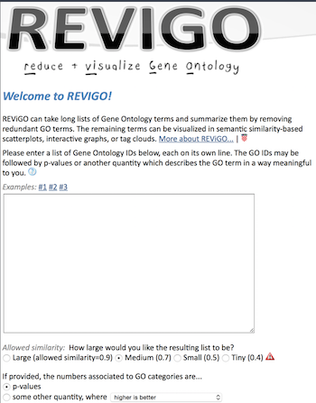
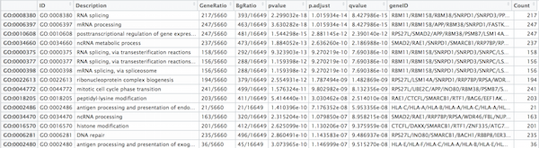
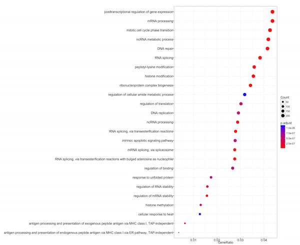
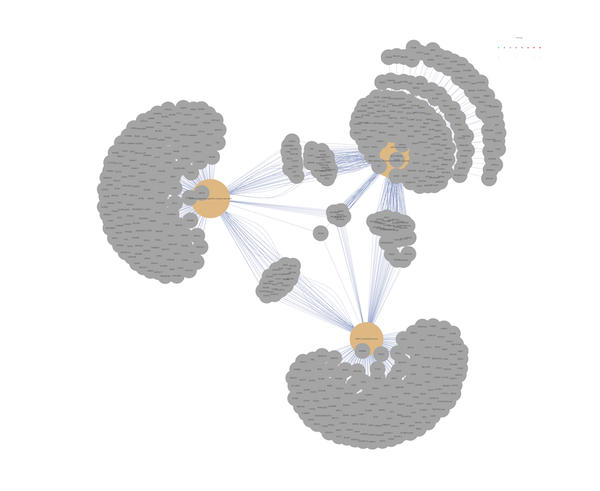
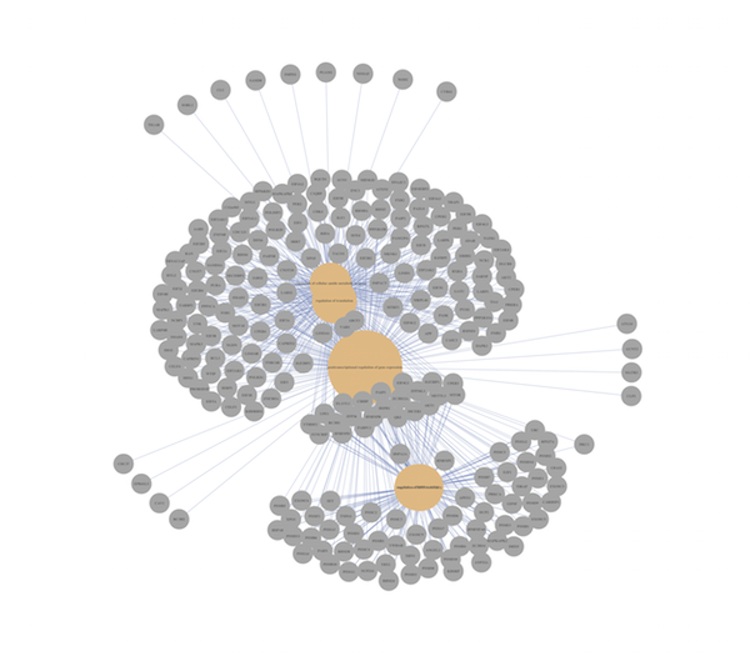

Approximate time: 105 minutes

Learning Objectives:
-------------------

*  Determine how functions are attributed to genes using Gene Ontology terms
*  Understand the theory of how functional enrichment tools yield statistically enriched functions or interactions
*  Discuss functional analysis using over-representation analysis, functional class scoring, and pathway topology methods
*  Explore functional analysis tools

# Functional analysis 

The output of RNA-Seq differential expression analysis is a list of significant differentially expressed genes (DEGs). To gain greater biological insight on the DEGs there are various analyses that can be done:

- determine whether there is enrichment of known biological functions, interactions, or pathways
- identify genes' involvement in novel pathways or networks by grouping genes together based on similar trends
- use global changes in gene expression by visualizing all genes being significantly up- or down-regulated in the context of external interaction data

Generally for any differential expression analysis, it is useful to interpret the resulting gene lists using freely available web- and R-based tools.  While tools for functional analysis span a wide variety of techniques, they can loosely be categorized into three main types: over-representation analysis, functional class scoring, and pathway topology [[1](../../resources/pathway_tools.pdf)]. 



## Over-representation analysis
There are a plethora of functional enrichment tools that perform some type of over-representation analysis by querying databases containing information about gene function and interactions. **Querying these databases for gene function requires the use of a _consistent vocabulary_ to describe gene function.** One of the most widely-used vocabularies is the **Gene Ontology (GO)**. This vocabulary was established by the Gene Ontology project, and the words in the vocabulary are referred to as GO terms. 

### Gene Ontology project

"The Gene Ontology project is a collaborative effort to address the need for consistent descriptions of gene products across databases" [[2](geneontology.org/page/documentation)]. The [Gene Ontology Consortium](http://geneontology.org/page/go-consortium-contributors-list) maintains the GO terms, and these GO terms are incorporated into gene annotations in many of the popular repositories for animal, plant, and microbial genomes. 

Tools that investigate **enrichment of biological functions or interactions** can query these databases for GO terms associated with a list of genes to determine whether any GO terms associated with particular functions or interactions are enriched in the gene set. Therefore, to best use and interpret the results from these functional analysis tools, it is helpful to have a good understanding of the GO terms themselves.

### GO terms

#### GO Ontologies

To describe the roles of genes and gene products, GO terms are organized into three independent controlled vocabularies (ontologies) in a species-independent manner: 

- **Biological process:** refers to the biological role involving the gene or gene product, and could include "transcription", "signal transduction", and "apoptosis". A biological process generally involves a chemical or physical change of the starting material or input.
- **Molecular function:** represents the biochemical activity of the gene product, such activities could include "ligand", "GTPase", and "transporter". 
- **Cellular component:** refers to the location in the cell of the gene product. Cellular components could include "nucleus", "lysosome", and "plasma membrane".

Each GO term has a term name (e.g. DNA repair) and a unique term accession number (GO:0005125), and a single gene product can be associated with many GO terms, since a single gene product "may function in several processes, contain domains that carry out diverse molecular functions, and participate in multiple alternative interactions with other proteins, organelles or locations in the cell" [[3](go.pdf)]. 

#### GO term hierarchy

Some gene products are well-researched, with vast quantities of data available regarding their biological processes and functions. However, other gene products have very little data available about their roles in the cell. 

For example, the protein, "p53", would contain a wealth of information on it's roles in the cell, whereas another protein might only be known as a "membrane-bound protein" with no other information available. 

The GO ontologies were developed to describe and query biological knowledge with differing levels of information available. To do this, GO ontologies are loosely hierarchical, ranging from general, 'parent', terms to more specific, 'child' terms. The GO ontologies are "loosely" hierarchical since 'child' terms can have multiple 'parent' terms.

Some genes with less information may only be associated with general 'parent' terms or no terms at all, while other genes with a lot of information be associated with many terms.



[Tips for working with GO terms](http://journals.plos.org/ploscompbiol/article?id=10.1371/journal.pcbi.1003343)

### Hypergeometric testing

In a set of genes, the frequency of GO terms can be determined, and the comparison of frequencies between a gene list & a “background” set will inform us about the over- or under-representation of the GO terms. This type of testing can inform us about over- or under-representation of other entities such as *particular motifs or pathways* too.



To determine whether GO terms (or motifs and pathways) are over- or under-represented, you can determine the **probability of having the observed proportion of genes associated with a specific GO term in your gene list based on the proportion of genes associated with the same GO term in the background set**. The background dataset can be all genes in genome for your organism or you can select your own background to use.

For example, let's suppose there are 13,000 total genes in the honeybee genome and 85 genes are associated with the GO term "DNA repair". In your gene list, there are 50 genes associated with "DNA repair" out of 1,000 genes in gene list. 

By comparing the ratios, 85/13,000 in "background" dataset and 50/1,000 in your gene list, it's evident that the GO term "DNA repair" is over-represented in your dataset.

To determine whether a GO term or pathway is *significantly* over- or under-represented, tools often perform **hypergeometric testing**. Using our honeybee example, the hypergeometric distribution is a probability distribution that describes the probability of 50 genes (k) being associated with "DNA repair", for all genes in our gene list (n=1,000), from a population of all of the genes in entire genome (N=13,000) which contains 85 genes (K) associated with "DNA repair" [[4](https://en.wikipedia.org/wiki/Hypergeometric_distribution)].

The calculation of probability of k successes follows the formula:

 

### gProfiler

[gProfileR](http://biit.cs.ut.ee/gprofiler/index.cgi) is a tool for the interpretation of large gene lists which can be run using a web interface or through R. The core tool takes a gene list as input and performs statistical enrichment analysis using hypergeometric testing to provide interpretation to user-provided gene lists. Multiple sources of functional evidence are considered, including Gene Ontology terms, biological pathways, regulatory motifs of transcription factors and microRNAs, human disease annotations and protein-protein interactions. The user selects the organism and the sources of evidence to test. There are also additional parameters to change various thresholds and tweak the stringency to the desired level. 


You can use gProfiler for a wide selection of organisms, and the tool accepts your gene list as input. If your gene list is ordered (e.g. by padj. values), then gProfiler will take the order of the genes into account when outputting enriched terms or pathways.

In addition, a large number (70%) of the functional annotations of GO terms are determined using _in silico_ methods to infer function from electronic annotation (IEA). While these annotations can offer valuable information, the information is of lower confidence than experimental and computational studies, and these functional annotations can be easily filtered out. 

The color codes in the gProfiler output represent the quality of the evidence for the functional annotation. For example, weaker evidence is depicted in blue, while strong evidence generated by direct experiment is shown with red or orange. Similar coloring is used for pathway information, with well-researched pathway information shown in black, opposed to lighter colors. Grey coloring suggests an unknown gene product or annotation. For more information, please see the [gProfiler paper](http://www.ncbi.nlm.nih.gov/pmc/articles/PMC1933153/).

Also, due to the hierarchical structure of GO terms, you may return many terms that seem redundant since they are child and parent terms. gProfiler allows for 'hierarchical filtering', returning only the best term per parent term.

#### Running gProfiler

For our gProfiler analysis, we are going to subset our `res_tableOE` only using a padjusted-value threshold of 0.05 (padj = 0.05). 

```r
### Functional analysis of MOV10 Overexpression using gProfileR (some of these are defaults; check help pages) 

library(gProfileR)

# Subsetting dataset to only include significant genes with padj < 0.05

sig_genes_table <- subset(res_tableOE, padj < 0.05) 
sig_genes_table <- data.frame(sig_genes_table)

# Running gprofiler to identify enriched processes among significant genes

gprofiler_results_oe <- gprofiler(query = rownames(sig_genes_table), 
                                  organism = "hsapiens",
                                  ordered_query = F, 
                                  exclude_iea = F, 
                                  max_p_value = 0.05, 
                                  max_set_size = 0,
                                  correction_method = "fdr",
                                  hier_filtering = "none", 
                                  domain_size = "annotated",
                                  custom_bg = "")

```

Let's save the gProfiler results to file:

```r
## Write results to file

write.table(gprofiler_results_oe, 
            "results/gprofiler_MOV10_oe.txt", 
            sep="\t", quote=F, row.names=F)
```

Now, extract only the lines in the gProfiler results with GO term accession numbers for downstream analyses:

```r
## Extract GO IDs for downstream analysis

allterms_oe <- gprofiler_results_oe$term.id

GOs_oe <- allterms_oe[grep('GO:', allterms_oe)]

write.table(GOs_oe, "results/GOs_oe.txt", sep="\t", quote=F, row.names=F, col.names=F)
```

### REVIGO

[REVIGO](http://revigo.irb.hr/) is a web-based tool that can take our list of GO terms, collapse redundant terms by semantic similarity, and summarize them graphically. 



Open `GOs_oe.txt` and copy and paste the GO ids into the REVIGO search box, and submit.


***gProfiler and REVIGO are great tools to validate experimental results and to make hypotheses. These tools suggest pathways that may be involved with your condition of interest; you should NOT use these tools to make conclusions about the pathways involved in your experimental process.***

J. Reimand, T. Arak, P. Adler, L. Kolberg, S. Reisberg, H. Peterson, J. Vilo. g:Profiler -- a web server for functional interpretation of gene lists (2016 update). Nucleic Acids Research 2016; doi: 10.1093/nar/gkw199

Supek F, Bošnjak M, Škunca N, Šmuc T. REVIGO summarizes and visualizes long lists of Gene Ontology terms. PLoS ONE 2011. doi:10.1371/journal.pone.0021800

## clusterProfiler
Similar to gprofileR, the tool [clusterProfiler](http://bioconductor.org/packages/release/bioc/html/clusterProfiler.html) performs over-representation analysis on GO terms associated with a list of genes. The GO terms output by clusterProfiler are generally quite similar to those output by gprofileR, but there are small differences due to the different algorithms used by the programs.

```r
# Load libraries
library(clusterProfiler)
library(DOSE)
library(org.Hs.eg.db)
library(biomaRt)

# clusterProfiler does not work as easily using gene names, so turning gene names into Ensembl IDs using biomaRt package for the significant genes and the background genes

mart <- useDataset("hsapiens_gene_ensembl",
                   useMart('ENSEMBL_MART_ENSEMBL',
                           host =  'grch37.ensembl.org'))
                           
sig_genes_ensembl <- getBM(filters = "external_gene_name", 
                values = rownames(sig_genes_table),
                attributes = c("ensembl_gene_id", "external_gene_name"),
                mart = mart)
                
sig_genes <- as.character(sig_genes_ensembl$ensembl_gene_id)

# Create background dataset for hypergeometric testing using all genes tested for significance in the raw counts dataset

all_genes <- getBM(filters = "external_gene_name", 
                   values = rownames(data),
                   attributes = "ensembl_gene_id",
                   mart = mart)
                   
all_genes <- as.character(all_genes$ensembl_gene_id)

# Run GO enrichment analysis 
ego <- enrichGO(gene=sig_genes, universe=all_genes, keytype ="ENSEMBL", OrgDb=org.Hs.eg.db, ont="BP", pAdjustMethod = "BH", qvalueCutoff =0.05, readable=TRUE)

# Output results from GO analysis to a table
cluster_summary <- summary(ego)
```


### Visualizing clusterProfiler results
ClusterProfiler has a variety of options for viewing the over-represented GO terms. We will explore the dotplot, enrichment plot, and the category netplot.

The dotplot shows the number of genes associated with the first 25 terms (size) and the p-adjusted values for these terms (color). 

```r
dotplot(ego, showCategory=25)
```



The enrichment plot shows the relationship between the top 25 most significantly enriched GO terms, by grouping similar terms together.

```r
enrichMap(ego, n=25, vertex.label.font=10)
```


Finally, the category netplot shows the relationships between the genes associated with the top five most significant GO terms and the fold changes of the significant genes associated with these terms (color). This plot is particularly useful for hypothesis generation in identifying genes that may be important to several of the most affected processes. 

```r
cnetplot(ego, categorySize="pvalue", showCategory = 5, vertex.label.font=6)
```



**NOTE:** You can color genes by foldchanges by adding an argument called `foldChange` with a vector of foldchanges corresponding to the `sig_genes` vector. Also, if you are interested in significant processes that are **not** among the top five, you can subset your `ego` dataset to only display these processes:

```r
ego2 <- ego
ego2@result <- ego@result[c(3,16,17,18,25),]
cnetplot(ego2, categorySize="pvalue", showCategory = 5)
```



## [Other functional analysis methods](https://github.com/hbc/NGS-Data-Analysis-long-course/blob/Fall_2016/sessionIII/lessons/functional_analysis_other_methods.md)

Over-representation analyses are only a single type of functional analysis method that is available for teasing apart the biological processes important to your condition of interest. Other types of analyses can be equally important or informative, including functional class scoring and pathway topology methods. Functional class scoring methods most often take as input the foldchanges for all genes, then look to see whether gene sets for particular biological processes are enriched among the high or low fold changes. This type of analysis can be particularly helpful if differential expression analysis only output a small list of significant DE genes. Finally, pathway topology analysis often takes into account both fold changes and adjusted p-values to identify dysregulated pathways and outputs whether pathways are inhibited/activated. We have [materials](https://github.com/hbc/NGS-Data-Analysis-long-course/blob/Fall_2016/sessionIII/lessons/functional_analysis_other_methods.md) to lead you through these other types of functional analyses, and we encourage you to take the time to work through them.


## Resources for functional analysis

* g:Profiler - http://biit.cs.ut.ee/gprofiler/index.cgi 
* DAVID - http://david.abcc.ncifcrf.gov/tools.jsp 
* clusterProfiler - http://bioconductor.org/packages/release/bioc/html/clusterProfiler.html
* GeneMANIA - http://www.genemania.org/
* GenePattern -  http://www.broadinstitute.org/cancer/software/genepattern/ (need to register)
* WebGestalt - http://bioinfo.vanderbilt.edu/webgestalt/ (need to register)
* AmiGO - http://amigo.geneontology.org/amigo
* ReviGO (visualizing GO analysis, input is GO terms) - http://revigo.irb.hr/ 
* WGCNA - http://www.genetics.ucla.edu/labs/horvath/CoexpressionNetwork
* GSEA - http://software.broadinstitute.org/gsea/index.jsp
* SPIA - https://www.bioconductor.org/packages/release/bioc/html/SPIA.html
* Gage/Pathview - http://www.bioconductor.org/packages/release/bioc/html/gage.html

***
*This lesson has been developed by members of the teaching team at the [Harvard Chan Bioinformatics Core (HBC)](http://bioinformatics.sph.harvard.edu/). These are open access materials distributed under the terms of the [Creative Commons Attribution license](https://creativecommons.org/licenses/by/4.0/) (CC BY 4.0), which permits unrestricted use, distribution, and reproduction in any medium, provided the original author and source are credited.*
