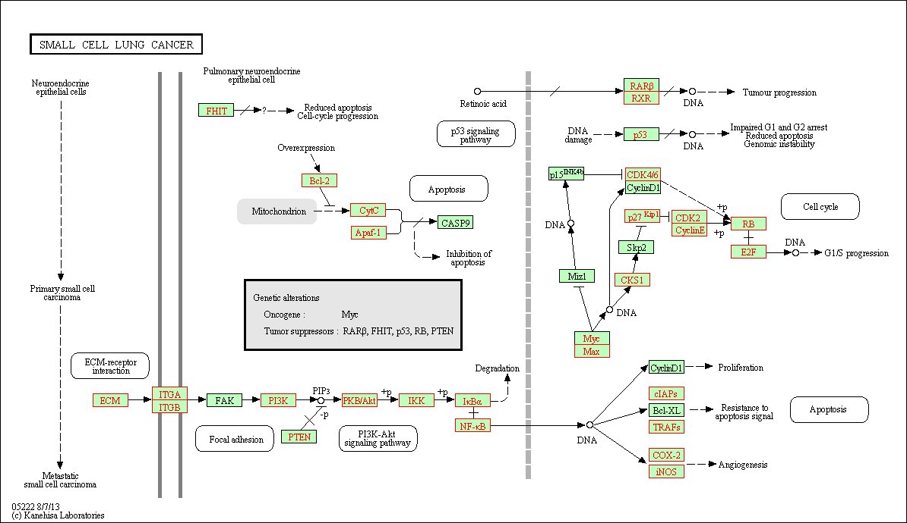
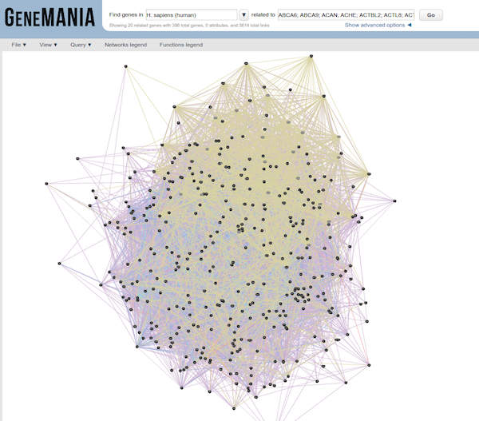

# Functional class scoring tools
Functional class scoring (FCS) tools, such as [GSEA](http://software.broadinstitute.org/gsea/index.jsp), use the gene-level statistics from the differential expression results to determine pathway-level expression changes. The hypothesis of FCS methods is that although large changes in individual genes can have significant effects on pathways (and will be detected via ORA methods), weaker but coordinated changes in sets of functionally related genes (i.e., pathways) can also have significant effects.  Thus, rather than setting an arbitrary threshold to identify 'significant genes', **all genes are considered** in the analysis. The gene-level statistics from the dataset are aggregated to generate a single pathway-level statistic and statistical significance of each pathway is reported.

### Gene set enrichment analysis using clusterProfiler and Pathview

Using the log2 fold changes obtained from the DESeq2 analysis for every gene, gene set enrichment analysis and pathway analysis was performed using clusterProfiler and Pathview tools.

For gene set or pathway analysis using clusterProfiler, coordinated differential expression over gene sets is tested instead of changes of individual genes. "Gene sets are pre-defined groups of genes, which are functionally related. Commonly used gene sets include those derived from KEGG pathways, Gene Ontology terms, gene groups that share some other functional annotations, etc. Consistent perturbations over such gene sets frequently suggest mechanistic changes" [1]. 

To perform GSEA analysis of KEGG gene sets, clusterProfiler requires the genes to be identified using Entrez IDs for all genes in our results dataset.

```r
# Return all genes with Entrez IDs
all_results_entrez <- getBM(filters = "external_gene_name", 
                   values = rownames(res_tableOE),
                   attributes = c("entrezgene","external_gene_name"),
                   mart = human)
                   
merged_all_results_entrez <- merge(data.frame(res_tableOE), all_results_entrez, by.x="row.names", by.y="external_gene_name") 
```

When performing our analysis, we need to remove the NA values prior to the analysis:

```r
# Remove any NA values
all_results_gsea <- subset(merged_all_results_entrez, entrezgene != "NA")
```

We also need to order our results by log2 fold changes:

```r
# Order results by `Log2FoldChange`
all_results_gsea <- all_results_gsea[order(all_results_gsea$log2FoldChange, decreasing = T), ]
```

Finally, extract and name the fold changes:

```r
# Extract the ordered foldchanges
foldchanges <- all_results_gsea$log2FoldChange
names(foldchanges) <- all_results_gsea$entrezgene
# head(foldchanges)
# foldchanges <- sort(foldchanges, T)

# GSEA using gene sets from KEGG pathways
gseaKEGG <- gseKEGG(geneList = foldchanges,
              organism = "hsa",
              nPerm = 1000,
              minGSSize = 120,
              pvalueCutoff = 0.05,
              verbose = FALSE)
              
gseaKEGG_results <- gseaKEGG@result
pathview(gene.data = foldchanges,
              pathway.id = kkgsea_results$ID[1],
              species = "hsa",
              limit = list(gene = max(abs(foldchanges)),
              cpd = 1))

# GSEA using gene sets associated with BP Gene Ontology terms
gseaGO <- gseGO(geneList = foldchanges, 
              OrgDb = org.Hs.eg.db, 
              ont = 'BP', 
              nPerm = 1000, 
              minGSSize = 100, 
              maxGSSize = 500, 
              pvalueCutoff = 0.05,
              verbose = FALSE) 

gseaGO_results <- gseaGO@result
gseaplot(gseaGO, geneSetID = 'GO:0048812')
```

### Gene set enrichment analysis using GAGE and Pathview

Gene set enrichment analysis using [GAGE (Generally Applicable Gene-set Enrichment for Pathway Analysis)](http://bioconductor.org/packages/release/bioc/html/gage.html) and [Pathview](http://bioconductor.org/packages/release/bioc/html/pathview.html) tools was also performed using a slightly different type of algorithm.

"GAGE assumes a gene set comes from a different distribution than the background and uses two-sample t-test to account for the gene set specific variance as well as the background variance. The two-sample t-test used by GAGE identifies gene sets with modest but consistent changes in gene expression level."[[2](http://bmcbioinformatics.biomedcentral.com/articles/10.1186/1471-2105-10-161)]

Pathview allows for the integration of the data generated by GAGE and visualization of the pathways from the dataset.


#### Exploring enrichment of KEGG pathways
To get started with GAGE and Pathview analysis, we need to load multiple libraries:

```r
# Install packages if this is your first time using them

source("http://bioconductor.org/biocLite.R") 
biocLite('gage', 'pathview', 'gageData', 'biomaRt', 'org.Hs.eg.db', 'DOSE', 'SPIA') 

# Loading the packages needed for GAGE and Pathview analysis

library(gage)
library(pathview)
library(gageData)
library(biomaRt)
library(org.Hs.eg.db)
```

To determine whether pathways in our dataset are enriched, we need to first obtain the gene sets to test:

```r
# Create datasets with KEGG gene sets to test

kegg_human <- kegg.gsets(species = "human", id.type = "kegg")
names(kegg_human)

kegg.gs <- kegg_human$kg.sets[kegg_human$sigmet.idx]
head(kegg.gs)
```

Now that we have our pathways to test, we need to bring in our own data. We will use the log2 fold changes output by DESeq2, `res_tableKD_sorted`, to determine whether particular pathways are enriched. GAGE requires the genes have Entrez IDs, so we will also convert our gene names into Entrez IDs prior to analysis. *If you do not have this file, you can download it using this [link](https://github.com/hbc/NGS_Data_Analysis_Summer2016/raw/master/sessionIII/data/res_tableKD.txt).*

> A useful tutorial for using GAGE and Pathview is available from Stephen Turner on R-bloggers: [http://www.r-bloggers.com/tutorial-rna-seq-differential-expression-pathway-analysis-with-sailfish-deseq2-gage-and-pathview/](http://www.r-bloggers.com/tutorial-rna-seq-differential-expression-pathway-analysis-with-sailfish-deseq2-gage-and-pathview/)

```r
#Set up

## Turn DESeq2 results into a dataframe

DEG <- data.frame(res_tableKD_sorted)

## Tool expects entrez IDs, so use Biomart to acquire IDs for the gene names

### Create database to search

mart <- useDataset("hsapiens_gene_ensembl", 
                   useMart('ENSEMBL_MART_ENSEMBL', 
                           host =  'www.ensembl.org')) 
                           
###List entrez IDs for each gene name

entrez <- getBM(filters= "external_gene_name", 
                attributes= c("external_gene_name", "entrezgene"),
                values= row.names(DEG),
                mart= mart)

## Merge results dataset, DEG, with Entrez IDs dataset

entrez_results <- merge(entrez, DEG, by.x = "external_gene_name", by.y ="row.names")
head(entrez_results, n=15)

entrez_results <- subset(entrez_results, entrezgene != "NA")
head(entrez_results, n=15)

## Extract only the log2FC values

foldchanges <- entrez_results$log2FoldChange
head(foldchanges)

## Name foldchanges vector with corresponding Entrez IDs as needed by GAGE tool

names(foldchanges) <- entrez_results$entrezgene
head(foldchanges)
```
Now the data is ready to run for GAGE analysis. The [GAGE vignette](https://www.bioconductor.org/packages/devel/bioc/vignettes/gage/inst/doc/gage.pdf) provides detailed information on running the analysis. Note that you can run the analysis and look for pathways with genes statistically only up- or down-regulated. Alternatively, you can explore statistically perturbed pathways, which are enriched in genes that may be either up- or down- regulated. For KEGG pathways, looking at both types of pathways could be useful.

```r
# Run GAGE

keggres = gage(foldchanges, gsets=kegg.gs, same.dir=T)
names(keggres)
head(keggres$greater) #Pathways that are up-regulated
head(keggres$less) #Pathways that are down-regulated

# Explore genes that are up-regulated

sel_up <- keggres$greater[, "q.val"] < 0.05 & !is.na(keggres$greater[, "q.val"])
path_ids_up <- rownames(keggres$greater)[sel_up]
path_ids_up

# Get the pathway IDs for the significantly up-regulated pathways

keggresids = substr(path_ids_up, start=1, stop=8)
keggresids
```
Now that we have the IDs for the pathways that are significantly up-regulated in our dataset, we can visualize these pathways and the genes identified from our dataset causing these pathways to be enriched using [Pathview](https://www.bioconductor.org/packages/devel/bioc/vignettes/pathview/inst/doc/pathview.pdf). 

```r
# Run Pathview

## Use Pathview to view significant up-regulated pathways

pathview(gene.data = foldchanges, pathway.id=keggresids, species="human", kegg.dir="results/")
```


#### Exploring enrichment of biological processes using GO terms in GAGE
Using the GAGE tool, we can identify significantly enriched gene ontology terms for biological process and molecular function based on the log2 fold changes for all genes. While gProfileR is an overlap statistic analysis tool which uses a threshold (adjusted p<0.05 here) to define which genes are analyzed for GO enrichment, gene set enrichment analysis tools like GAGE use a list of genes (here ranked by logFC) without using a threshold. This allows GAGE to use more information to identify enriched biological processes. The introduction to GSEA goes into more detail about the advantages of this approach: [http://www.ncbi.nlm.nih.gov/pmc/articles/PMC1239896/](http://www.ncbi.nlm.nih.gov/pmc/articles/PMC1239896/).

```r
#Acquire datasets

data(go.sets.hs)
head(names(go.sets.hs))

data(go.subs.hs)
names(go.subs.hs)
head(go.subs.hs$MF)

#Use gage to explore enriched biological processes
#Biological process 

go_bp_sets = go.sets.hs[go.subs.hs$BP]
```

> If we wanted to identify enriched molecular functions we would use the code: `go.sets.hs[go.subs.hs$MF]`


```r
# Run GAGE
go_bp_res = gage(foldchanges, gsets=go_bp_sets, same.dir=T)
class(go_bp_res)
names(go_bp_res)
head(go_bp_res$greater)
go_df_enriched <- data.frame(go_bp_res$greater)

GO_enriched_BP <- subset(go_df_enriched, q.val < 0.05)
GO_enriched_BP

write.table(GO_enriched_BP, "Mov10_GAGE_GO_BP.txt", quote=F)
```

Weijun Luo, Michael Friedman, Kerby Shedden, Kurt Hankenson, and Peter Woolf. GAGE: generally applicable
gene set enrichment for pathway analysis. BMC Bioinformatics, 2009. doi:10.1186/1471-2105-10-161.

Weijun Luo and Cory Brouwer. Pathview: an R/Bioconductor package for pathway-based data integration
and visualization. Bioinformatics, 29(14):1830-1831, 2013. doi: 10.1093/bioinformatics/btt285.


## Pathway topology tools
The previous analyses did not explore how genes interact with each other (e.g. activation, inhibition, phosphorylation, ubiquitination, etc) to determine the pathway-level statistics. Pathway topology-based methods utilize the number and type of interactions between gene product (our DE genes) and other gene products to infer gene function or pathway association. 

### SPIA
The [SPIA (Signaling Pathway Impact Analysis)](http://bioconductor.org/packages/release/bioc/html/SPIA.html) tool can be used to integrate the lists of differentially expressed genes determined by DESeq2, their fold changes, and pathway topology to identify affected pathways. The blog post from [Getting Genetics Done](http://www.gettinggeneticsdone.com/2012/03/pathway-analysis-for-high-throughput.html) provides a step-by-step procedure for using and understanding SPIA.


Before we run SPIA, we need to remove all NA values and duplicated Entrez IDs:

```r
# Set-up

## Significant genes is a vector of fold changes where the names are ENTREZ gene IDs. The background set is a vector of all the genes represented on the platform.

## Convert ensembl to entrez ids

entrez_results <- merge(DEG, entrez, by="external_gene_name")

sig_genes <- subset(entrez_results, padj< 0.05)$log2FoldChange

names(sig_genes) <- subset(entrez_results, padj< 0.05)$entrezgene

head(sig_genes)


## Remove NA and duplicated values
sig_genes <- sig_genes[!is.na(names(sig_genes))] 

sig_genes <- sig_genes[!duplicated(names(sig_genes))]

background_genes <- entrez_results$entrezgene

background_genes <- background_genes[!duplicated(background_genes)]

```

Now that we have our background and significant genes in the appropriate format, we can run SPIA:

```r
# Run SPIA.

library(SPIA)

spia_result <- spia(de=sig_genes, all=background_genes, organism="hsa")

head(spia_result, n=20)
```

SPIA outputs a table showing significantly dysregulated pathways based on over-representation and signaling perturbations accumulation. The table shows the following information: `pSize` is the number of genes on the pathway; `NDE` is the number of DE genes per pathway; `tA` is the observed total perturbation accumulation in the pathway; `pNDE` is the probability to observe at least NDE genes on the pathway using a hypergeometric model; `pPERT` is the probability to observe a total accumulation more extreme than tA only by chance; `pG` is the p-value obtained by combining pNDE and pPERT; `pGFdr` and `pGFWER` are the False Discovery Rate and respectively Bonferroni adjusted global p-values; and the Status gives the direction in which the pathway is perturbed (activated or inhibited). KEGGLINK gives a web link to the KEGG website that displays the pathway image with the differentially expressed genes highlighted in red.

We can view the significantly dysregulated pathways by viewing the over-representation and perturbations for each pathway.

```r
plotP(spia_result,threshold=0.05)
```
In this plot each pathway is a point and the coordinates are the log of pNDE (using a hypergeometric model) and the p-value from perturbations, pPERT. The oblique lines in the plot show the significance regions based on the combined evidence.

If we choose to explore the significant genes from our dataset occurring in these pathways, we can subset our SPIA results:

```r
## Look at pathway 05222 and view kegglink
subset(spia_result, ID == "05222")
```

Then, click on the KEGGLINK, we can view the genes within our dataset from these perturbed pathways:


Tarca AL, Kathri P and Draghici S (2013). SPIA: Signaling Pathway Impact Analysis (SPIA) using combined evidence of pathway over-representation and unusual signaling perturbations. [http://bioinformatics.oxfordjournals.org/cgi/reprint/btn577v1](http://bioinformatics.oxfordjournals.org/cgi/reprint/btn577v1).

***

## Other Tools

### GeneMANIA

[GeneMANIA](http://genemania.org/) is a tool for predicting the function of your genes. Rather than looking for enrichment, the query gene set is evaluated in the context of curated functional association data and results are displayed in the form of a network. Association data include protein and genetic interactions, pathways, co-expression, co-localization and protein domain similarity. Genes are represented as the nodes of the network and edges are formed by known association evidence. The query gene set is highlighted and so you can find other genes that are related based on the toplogy in the network. This tool is more useful for smaller gene sets (< 400 genes), as you can see in the figure below our input results in a bit of a hairball that is hard to interpret.



> Use the significant gene list generated from the analysis we performed in class as input to GeneMANIA. Using only pathway and coexpression data as evidence, take a look at the network that results. Can you predict anything functionally from this set of genes? 

### Co-expression clustering

Co-expression clustering is often used to identify genes of novel pathways or networks by grouping genes together based on similar trends in expression. These tools are useful in identifying genes in a pathway, when their participation in a pathway and/or the pathway itself is unknown. These tools cluster genes with similar expression patterns to create 'modules' of co-expressed genes which often reflect functionally similar groups of genes. These 'modules' can then be compared across conditions or in a time-course experiment to identify any biologically relevant pathway or network information.

You can visualize co-expression clustering using heatmaps, which should be viewed as suggestive only; serious classification of genes needs better methods.  

The way the tools perform clustering is by taking the entire expression matrix and computing pair-wise co-expression values. A network is then generated from which we explore the topology to make inferences on gene co-regulation. The [WGCNA](http://www.genetics.ucla.edu/labs/horvath/CoexpressionNetwork ) package (in R) is one example of a more sophisticated method for co-expression clustering.

***
*This lesson has been developed by members of the teaching team at the [Harvard Chan Bioinformatics Core (HBC)](http://bioinformatics.sph.harvard.edu/). These are open access materials distributed under the terms of the [Creative Commons Attribution license](https://creativecommons.org/licenses/by/4.0/) (CC BY 4.0), which permits unrestricted use, distribution, and reproduction in any medium, provided the original author and source are credited.*

