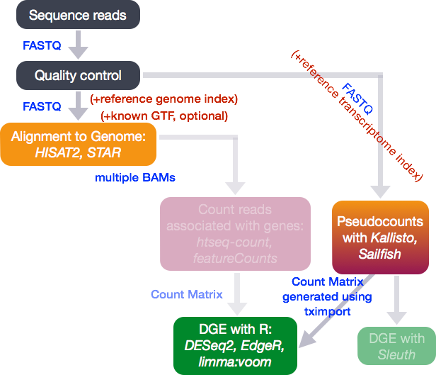
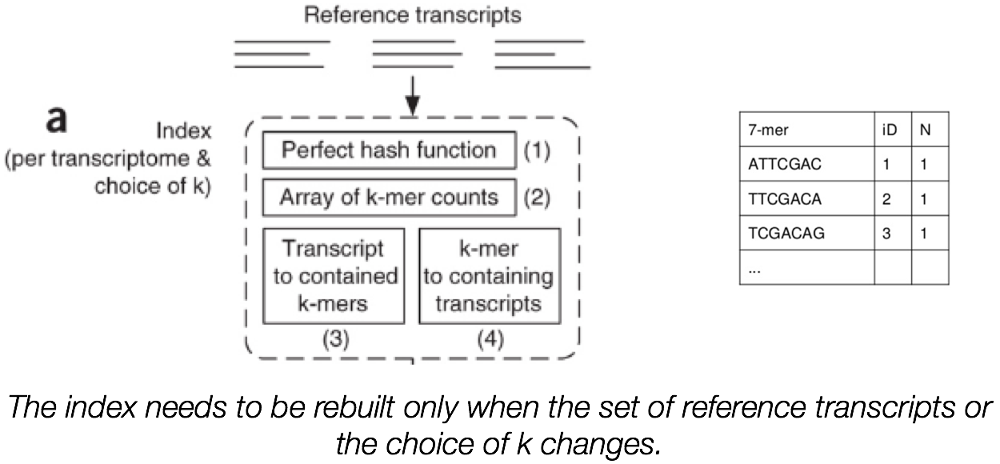
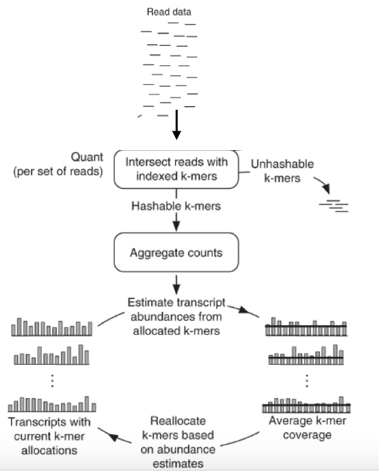

Approximate time: 2 hours

## Learning Objectives

* Using lightweight algorithms to quantify reads to Pseudocounts
* Understand how to use Sailfish to generate Pseudocounts
* Learn how to perform differential gene expression on Pseudocounts

## Alignment-free quantification of gene expression

In the standard RNA-seq pipeline that we have presented so far in this course, we have taken our reads post-QC and aligned them to the genome using our transcriptome (GTF) as guidance. The goal is to identify the genomic location where these reads originated from. Another strategy for quantification which has more recently been introduced involves **transcriptome mapping**. Tools that fall in this category include [Kallisto](https://pachterlab.github.io/kallisto/about), [Sailfish](http://www.nature.com/nbt/journal/v32/n5/full/nbt.2862.html) and [Salmon](https://combine-lab.github.io/salmon/); each working slightly different from one another. (For this course we will explore Sailfish in more detail.) Common to all of these tools is that we **avoid mapping reads**, which is a time-consuming step, and **provides quantification estimates much faster than do existing approaches** (typically 20 times faster) without loss of accuracy. These estimates, often referred to as 'pseudocounts' are then converted for use with DEG tools like DESeq2. 




### What is Sailfish?

[Sailfish](http://www.cs.cmu.edu/~ckingsf/software/sailfish/index.html) and it's more recent "upgrade" [Salmon](https://combine-lab.github.io/salmon/), are based on the philosophy of lightweight algorithms. They use the sequence of genes or transcripts as input (in FASTA format), and do not align the whole read. Sailfish uses a 2-step process based on **counting "kmers"**.


**Step 1: Indexing:** The first step is to create an index. This step involves evaluating the sequences for all possible unique sequences of length k (kmer) in the **transcriptome** (genes/transcripts) to create an index.

**The index helps creates a signature for each transcript in our reference transcriptome.** The Sailfish index has four components: 

1. a perfect hash containing the number of unique k-mers per transcript 
2. an array recording the number of times each k-mer occurs in the reference set
3. an index mapping each **transcript to the multiset of k-mers** that it contains
4. an index mapping each **k-mer to the set of transcripts** in which it appears.




**Step 2: Quantification:** The next step is to count the number of times those k-mers in the index appear in the sequenced reads (i.e. the FASTQ file). This count information is used to figure out which transcript the read probably came from, and estimate the abundance of each gene or transcript. 

1. Shred the reads into k-mers of size k.
2. Count the number of times each indexed k-mer occurs in the set of reads.
3. Sailfish then applies a 2-step EM algorithm to estimate abundance for each transcript



*Sailfish uses the frequency of k-mers that occur to determine transcript abundance based on transcript signatures in the index.*

> *NOTE:* that if there are k-mers in the reads that are not in the index they are not counted. As such, trimming is not required when using this method.

> The worklows above are taken from the Sailfish publication, [Patro R. et al, 2014](http://www.nature.com/nbt/journal/v32/n5/full/nbt.2862.html).


## Running Sailfish on Orchestra

First start an interactive session and create a new directory for our Sailfish analysis:

```bash
$ bsub -Is -q interactive bash

$ mkdir ~/ngs_course/rnaseq/sailfish
$ cd ~/ngs_course/rnaseq/sailfish
```   
> Sailfish is not available as a module on Orchestra, but it is installed as part of the bcbio pipeline. Since we already have the appropriate path (`/opt/bcbio/centos/bin`) in our `$PATH` variable we can use it by simply typing in `sailfish`.     

As you can imagine from the description above, when running Sailfish there are also two steps.

a. "Index" the transcriptome (transcripts or genes) using the `index` command:
    
```bash
## DO NOT RUN THIS CODE
$ sailfish index -p <num of cores> -k <kmer size> -t <fasta of gene sequences> 
   -o <folder name>
```

**We are not going to run this in class, but it only takes a few minutes.** We will be using an index we have generated from transcript sequences (all known transcripts/ splice isoforms with multiples for some genes), but this can be generated from genic sequences too. 

b. Get the abundance using the quantification step using the `quant` command and the parameters described below (more information on parameters can be found [here](http://sailfish.readthedocs.org/en/master/sailfish.html#description-of-important-options):


   * `i`: specify the location of the index directory; for us it is `/groups/hbctraining/ngs-data-analysis-longcourse/rnaseq/sailfish.ensembl2.idx/`
   * `-l SR`: specify stranded single-end reads
   * `-r`: list of files
   * `--useVBOpt`: use variational Bayesian EM algorithm rather than the ‘standard EM’ to optimize abundance estimates (more accurate) 
   * `-o`: output quantification file name

To run the quantification step on a single sample we have the command provided below. Let's try running it on our subset sample for `Mov10_oe_1.subset.fq`:

```bash
$ sailfish quant -i /groups/hbctraining/ngs-data-analysis-longcourse/rnaseq/sailfish.ensembl2.idx/ \
-l SR \
-r ~/ngs_course/rnaseq/data/untrimmed_fastq/Mov10_oe_1.subset.fq \
--useVBOpt \
-o Mov10_oe_1.subset.sailfish
```

## Sailfish output

You should see a new directory has been created that is named by the string value you provided in the `-o` command. Take a look at what is contained in this directory:

    $ ls -l Mov10_oe_1.subset.sailfish/
    
There is a logs directory, which contains all of the text that was printed to screen as Sailfish was running. Additionally, there is a file called `quant.sf`. 

This is the **quantification file** in which each row corresponds to a transcript, listed by Ensembl ID, and the columns correspond to metrics for each transcript:

```bash
Name    Length  EffectiveLength TPM     NumReads
ENST00000415118 8       4.79618 0       0
ENST00000434970 9       5.24851 0       0
ENST00000448914 13      7.01065 0       0
ENST00000604642 23      11.1044 0       0
ENST00000603326 19      9.51811 0       0
ENST00000604950 31      14.0891 0       0
ENST00000603077 31      14.0891 0       0
ENST00000605284 17      8.69981 0       0
....

```

*  The first two columns are self-explanatory, the **name** of the transcript and the **length of the transcript** in base pairs (bp). 
*  The **effective length** represents the the various factors that effect the length of transcript due to technical limitations of the sequencing platform.
* Sailfish outputs ‘pseudocounts’ which predict the relative abundance of different isoforms in the form of three possible metrics (KPKM, RPKM, and TPM). **TPM (transcripts per million)** is a commonly used normalization method as described in [[1]](http://www.ncbi.nlm.nih.gov/pmc/articles/PMC2820677/) and is computed based on the effective length of the transcript.
* Estimated **number of reads** (an estimate of the number of reads drawn from this transcript given the transcript’s relative abundance and length)

 
## Running Sailfish on multiple samples 

We just ran Sailfish on a single sample (and keep in mind a subset of chr1 from the original data). To obtain meaningful results we need to run this on **all samples for the full dataset**. To do so, we will create a shell script which will submit each Sailfish run as a job to Orchestra.

Open up a script in `vim`:

	$ vim sailfish_all_samples.sh

Now we can create a for loop to iterate over all FASTQ samples, and run Sailfish on each one. We begin by listing all BSUB directives to specify the resources we are requesting including memory, cores and wall time.

Next comes the Sailfish command. Note, that we are adding a parameter called `--numBootstraps` to the Sailfish command. Sailfish has the ability to optionally compute bootstrapped abundance estimates. **Bootstraps are required for estimation of technical variance**. Bootstrapping essentially takes a different sub-sample of reads for each bootstapping run for estimating the transcript abundances. The technical variance is the variation in transcript abundance estimates calculated for each of the different sub-samplings (or bootstraps). We will discuss this in more detail in the next lesson.

> *NOTE:* We are iterating over FASTQ files in the full dataset directory, located at `/groups/hbctraining/ngs-data-analysis2016/rnaseq/full_dataset/`

```bash
for fq in /groups/hbctraining/ngs-data-analysis2016/rnaseq/full_dataset/*.fastq
 do 
   base=`basename $fq .fastq`
   bsub -q mcore -n 6 -W 1:30 -R "rusage[mem=4000]" -J $base.mov10_sailfish -o %J.$base.out -e %J.$base.err \
   sailfish quant -i /groups/hbctraining/ngs-data-analysis-longcourse/rnaseq/sailfish.ensembl2.idx/ \
   -p 6 -l SR -r $fq --useVBOpt --numBootstraps 30 -o $base.sailfish 
 done
```

Save and close the script. This is now ready to run. **We are not going to run this script in class**, since it might take awhile and will interfere with the files we have already generated for you for use with the statistical analysis below.

> *NOTE:* PC users will want to add the `--auxDir` parameter to the Sailfish command and provide an alternate name for the directory. By default it will be named `aux` which interferes with the decompressing process when bringing files over locally to run `tximport/DESeq2` in R.  

## Performing DE analysis on Pseudocounts

The pseudocounts generated by Sailfish are represented as normalized TPM (transcripts per million) counts and map to transcripts or genes, depending on the input in the index step; in our case it was transcripts. These need to be converted into non-normalized count estimates for performing DESeq2 analysis. In addition, we need to be able to use the resulting non-normalized values which contain decimal places as input to create the DESeq object. Finally, to use DESeq2 we need to be able to tell which transcript is associated with which gene, since DESeq2 performs gene-level differential expression.

### Setting up to run DESeq2 on pseudocount data:

You can download the directory with the quant.sf files for the 8 full datasets using the link below. Once you have them downloaded continue to follow the set of instructions:

1. [Download Sailfish files](https://dl.dropboxusercontent.com/u/35207958/sailfish.zip)
2. Decompress (unzip) the zip archive and move the folder to an appropriate location (i.e `~/Desktop`)
3. Open RStudio and select 'File' -> 'New Project'  -> 'Existing Directory' and navigate to the `sailfish` directory 
4. Open up a new R script ('File' -> 'New File' -> 'Rscript'), and save it as `sailfish_de.R`

Your Rstudio interface should look something like the screenshot below:


The developers of DESeq2 have developed a package that can make the conversion of alignment-free methods of quantification compatible for DESeq2. This package is called [`tximport`](https://bioconductor.org/packages/release/bioc/html/tximport.html) and is available through Bioconductor. `tximport` imports transcript-level abundance, estimated counts and transcript lengths, and summarizes this into matrices for use with downstream gene-level analysis packages. 

**Step 1:** Install the `tximport` package and the `readr` package (you'll only need to do this once):
    
```R
# Install from Bioconductor
source("http://bioconductor.org/biocLite.R")
biocLite("tximport")
biocLite("readr")
```

**Step 2:** Load the required libraries:

```R
# Load libraries
library(tximport)
library(readr)
library(DESeq2)
library(biomaRt) # tximport requires gene symbols as row names
```

**Step 3:** Load the quantification data that was output from Sailfish:

```R
## List all directories containing data  
samples <- list.files(path = ".", full.names = F, pattern="\\.sailfish$")
    
## Obtain a vector of all filenames including the path
files <- file.path(samples, "quant.sf")
    
## Since all quant files have the same name it is useful to have names for each element
names(files) <-  samples
 ```
    
> **OPTION 2: An alternative to this is having absolute paths instead of relative paths.** This would be useful so you can run this from anywhere in your filesystem.
>

```R
## DO NOT RUN
dir <- getwd()
files <- file.path(dir, samples, "quant.sf")
	
## Create your own function
assignNames <- function(x){
		strsplit(x, "/")[[1]][6]
		}
names(files) <- sapply(files, assignNames, USE.NAMES=F)
```

Either of these methods will work, or even a combination of the two. The **main objective here is to add names to our quant files which will allow us to easily discriminate between samples in the final output matrix**. 

**Step 4.** Create a dataframe containing Ensembl Transcript IDs and Gene symbols

Our Sailfish index was generated with transcript sequences listed by Ensembl IDs, but `tximport` needs to know **which genes these transcripts came from**, so we need to use the `biomaRt` package to extract this information. However, since BiomaRt has been a little unreliable we are actually not going to use this code right now.
```R
## DO NOT RUN

# Create a character vector of Ensembl IDs		
ids <- read.delim(files[1], sep="\t", header=T)    # extract the transcript ids from one of the files
ids <- as.character(ids[,1]) 

# Create a mart object
# Note that we are using an archived host, since "www.ensembl.org" gave us an error
mart <- useDataset("hsapiens_gene_ensembl", useMart("ENSEMBL_MART_ENSEMBL", host="mar2016.archive.ensembl.org"))

# Get official gene symbol and Ensembl gene IDs
tx2gene <- getBM(
    filters= "ensembl_transcript_id", 
     attributes= c("ensembl_transcript_id", "external_gene_name"),
     values= ids,
     mart= mart)
     
# Re-order and save columns to a new variable
head(tx2gene)
```

We have already run the above code for you and saved the output in a text file which is in the sailfish directory. Load it in using: 

```R
tx2gene <- read.delim("tx2gene.txt",sep=" ")
```
    
**Step 5:** Run tximport to summarize gene-level information    
```R
?tximport   # let's take a look at the arguments for the tximport function

txi <- tximport(files, type="sailfish", txIn = TRUE, txOut = FALSE, tx2gene=tx2gene, reader=read_tsv)
```
### Output from `tximport`

The `txi` object is a simple list with three matrices: abundance, counts, length. 
```R
attributes(txi)
```
A final element 'countsFromAbundance' carries through the character argument used in the tximport call. The length matrix contains the average transcript length for each gene which can be used as an offset for gene-level analysis. 


### Using DESeq2 for DE analysis with pseudocounts

```R    
library(DESeq2)   # load this if you have not loaded it earlier

source('DESeqDataFromTx.R')   # required for using tximport output as input for DESeq2

## Create a sampletable/metadata

# Before we create this metadata object, let's see what the sample (column) order of the counts matrix is:
colnames(txi$counts)

condition=factor(c(rep("Ctl",3), rep("KD", 2), rep("OE", 3)))
sampleTable <- data.frame(condition, row.names = colnames(txi$counts))

## Create a DESeqDataSet object
dds <- DESeqDataSetFromTximport(txi, sampleTable, ~ condition)
```

Now you have created a DESeq object to proceed with DE analysis as we discussed in the last session!

***
*This lesson has been developed by members of the teaching team at the [Harvard Chan Bioinformatics Core (HBC)](http://bioinformatics.sph.harvard.edu/). These are open access materials distributed under the terms of the [Creative Commons Attribution license](https://creativecommons.org/licenses/by/4.0/) (CC BY 4.0), which permits unrestricted use, distribution, and reproduction in any medium, provided the original author and source are credited.*
