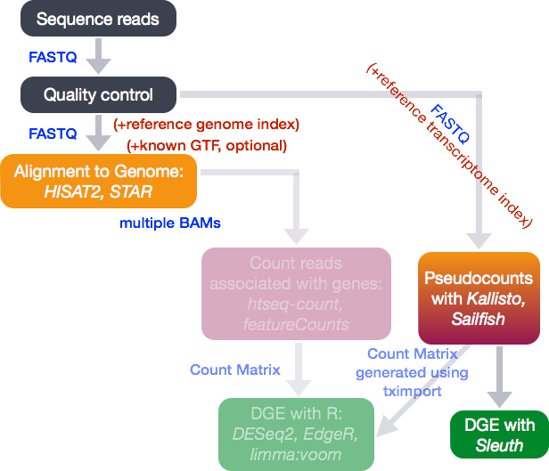
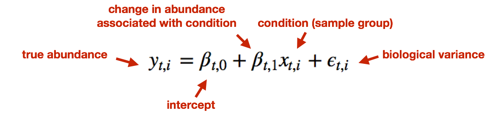
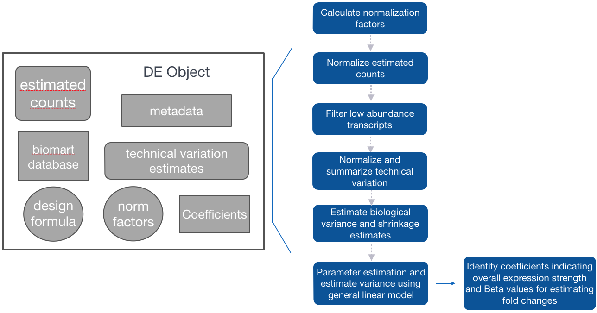
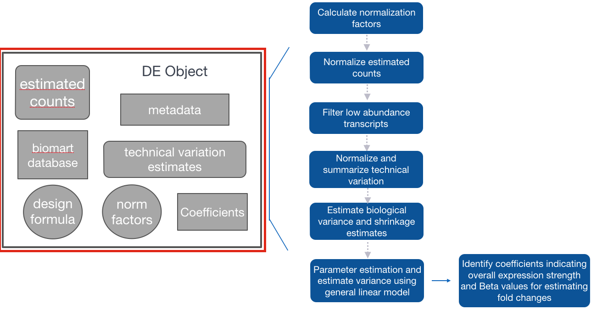
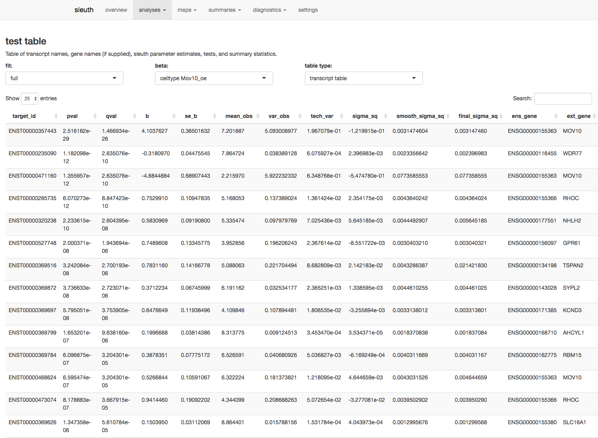
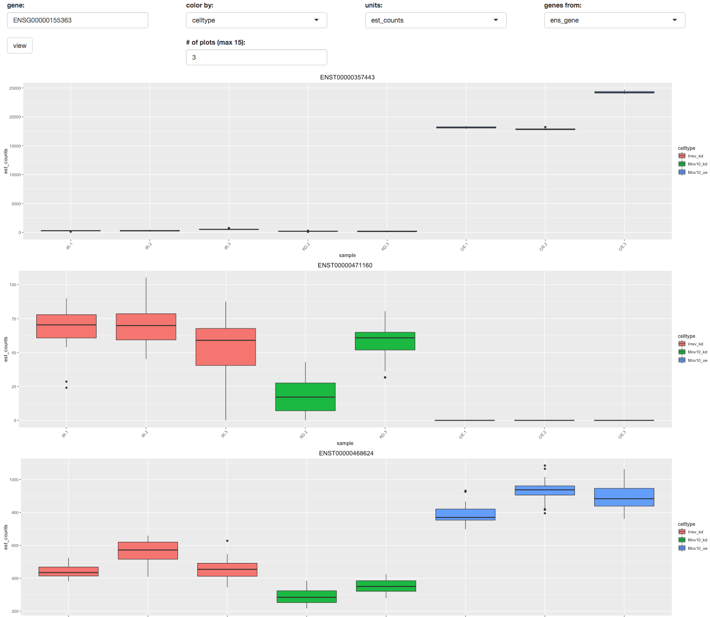

Contributors: Mary Piper

Approximate time: 1.25 hours

## Learning Objectives

* Determine differential expression of isoforms and visualization of results using Sleuth
* Understand how Sleuth determines biological and technical variation
* Learn how to run R on Orchestra and how to set up personal R libraries

## Transcript-level differential expression

Until this point we have focused on looking for expression changes at the gene-level. However, if you are interested in looking at **splice isoform expression changes between groups** the previous methods (i.e DESeq2) will not work. To demonstrate how to identify transcript-level differential expression we will be using a tool called Sleuth.



## What is Sleuth?

[Sleuth](http://pachterlab.github.io/sleuth/) is a fast, lightweight tool that uses transcript abundance estimates output from pseudo-alignment algorithms that use bootstrap sampling, such as Sailfish, Salmon, and Kallisto, to perform differential expression analysis of gene isoforms. 

To analyze the differential expression of gene isoforms, it is expected that RNA-Seq reads will often align to multiple isoforms of the same gene. Therefore, **multimapping reads cannot be ignored** to properly determine abundances of gene isoforms. 

Due to the statistical procedure required to assign reads to gene isoforms, in addition to the random processes underlying RNA-Seq, there will be **technical variability in the abundance estimates** output from the pseudo-alignment tool [[2](https://rawgit.com/pachterlab/sleuth/master/inst/doc/intro.html), [3](http://biorxiv.org/content/biorxiv/early/2016/06/10/058164.full.pdf)]. For example, if we performed multiple technical replicates and estimated abundances for gene isoforms, the abundance estimates for the technical replicates would exhibit variability greater than expected. Therefore, we would need technical replicates to distinguish technical variability from the biological variability.

Sleuth accounts for this technical variability by using bootstraps as a proxy for technical replicates, which are used to model the variability in the abundance estimates. Bootstrapping essentially estimates technical variance by using a different sub-sample of reads during each round of bootstrapping. **The technical variance is the variation in transcript abundance estimates calculated for each of the different sub-samplings (or bootstraps) and it accounts for the technical variation associated with the transcript abundance estimation process**. 

Sleuth models the unobserved true abundance (logarithm of true counts) using a general linear model, but includes the technical variance (variance between bootstrapping runs) as error in the response variable. 

<p align="center">
  
</p>


The observed (log) abundance estimates represent the sum of the true counts and the technical noise. Thereby, sleuth teases apart the source of the variance (technical vs. biological) for estimation of the "true" biological variance when determining whether transcripts are differentially expressed.

<p align="center">
  
</p>

In addition to performing differential expression analysis of transcripts, the sleuth tool also provides an html interface allowing exploration of the data and differential expression results interactively. More information about the theory/process for sleuth is available in [this blogpost](https://liorpachter.wordpress.com/2015/08/17/a-sleuth-for-rna-seq/) and step-by-step instructions are available in [this tutorial](https://rawgit.com/pachterlab/sleuth/master/inst/doc/intro.html).

***NOTE:*** *Kallisto is distributed under a non-commercial license, while Sailfish and Salmon are distributed under the [GNU General Public License, version 3](http://www.gnu.org/licenses/gpl.html).*


## Set-up for Running Sleuth on Orchestra

While Salmon and Sleuth are lightweight algorithms that can be quickly run on a laptop computer [[2](https://rawgit.com/pachterlab/sleuth/master/inst/doc/intro.html)], it is more efficient to run Sleuth on Orchestra. 

### Setting up the filesystem

Let's get started by setting up our directory. First let's copy over our metadata and the full Salmon output files. 

```bash
$ bsub -Is -R "rusage[mem=16000]" -q interactive bash

$ cd ~/ngs_course/rnaseq

$ cp /groups/hbctraining/ngs-data-analysis-longcourse/rnaseq/snapshots/meta/Mov10_full_meta.txt meta/

$ cp -r /groups/hbctraining/ngs-data-analysis-longcourse/rnaseq/snapshots/salmon/* salmon/
```

Now let's make a folder for our sleuth results and load the R module to run it.

```bash
$ mkdir sleuth

$ module load stats/R/3.3.1
```

Sleuth is an R package, and while some R packages are automatically available to us on Orchestra, some of the packages we need to run Sleuth are not. Therefore, to run Sleuth on Orchestra, we need to manually install these programs into our personal R library. If you haven't created a personal R library, you can do so by entering the following code ([Orchestra Wiki](https://wiki.med.harvard.edu/Orchestra/WebHome)):

```bash
$ mkdir -p ~/R/library
```

### Installing R packages

Since Sleuth was designed to use the output of Kallisto as input, our Salmon transcript abundance estimates need to be massaged into the format of the Kallisto output. To do this, we are going to use the package [Wasabi](https://github.com/COMBINE-lab/wasabi). 

We have installed all of these packages for you to copy to your personal libraries:

```bash

$ export R_LIBS_USER="/home/mp298/R/library"
```

Now, start R:

```bash
$ R
```

The terminal window should now turn into the R console with the R prompt `>`. 

If you were to manually install a package on Orchestra from CRAN we would have to specify where our library is using the following: `install.packages("name-of-your-package", lib="~/R/library")`. For Bioconductor packages nothing would change since we have already modified the environment variable to point to the library.

***NOTE:*** *Since we are not working in RStudio on Orchestra, we will not be able to readily view our environment or plots.*


### Setting up working directory and loading libraries

Before starting, let's set our working directory to the `rnaseq` folder:

```R
setwd("~/ngs_course/rnaseq")
```
and load the libraries for wasabi and sleuth, which is already installed on Orchestra. Sleuth also has a couple of dependencies and requires these other packages be loaded, as well: `biomaRt`, and `dplyr` (automatically available from Orchestra):

```R
library(wasabi)
library(sleuth)
library(biomaRt)
library(dplyr)
```

## Using Wasabi to convert Salmon output for Sleuth

Sleuth was built to use the bootstrapped estimates of transcript abundance from Kallisto; however, abundance estimates from Salmon (or Sailfish) work just as well, as long as bootstrapping is performed. To use our Salmon output estimates, we need to convert them to a Sleuth-compatible format using the Wasabi package.

First, we create a simple vector containing the paths to the directories containing the transcript abundance estimates for each sample (folders containing the .quant files). We can use the `file.path()` function to give the paths to each of the directories. 

Now, let's use this function to create our list of the paths to our transcript abundance files:

```R
sf_dirs <- file.path("salmon", c("Mov10_kd_2.salmon", "Mov10_kd_3.salmon", "Mov10_oe_1.salmon", "Mov10_oe_2.salmon", "Mov10_oe_3.salmon","Irrel_kd_1.salmon", "Irrel_kd_2.salmon", "Irrel_kd_3.salmon"))

sf_dirs
```

Now, we simply run the `prepare_fish_for_sleuth` function, which will write some status messages to the console and, when it's done, each directory will contain an `abundance.h5` file in a sleuth-compatible format.

```R
prepare_fish_for_sleuth(sf_dirs)
```

Each of the sample directories should now contain the `abundance.h5` files. These 
files will be used as input to Sleuth.

## Sleuth for estimation of differential expression of transcripts



The workflow for Sleuth is similar to the workflow followed for DESeq2, even though, the models for estimating differential expression are very different. 

**Step 1:** Creation of Sleuth object to provide metadata, estimated counts, and design formula for the analysis, in addition to a biomaRt database to switch between transcript IDs and associated gene names.

**Step 2:** Fit the sleuth model
	
- Estimation of size (normalization) factors using the median of ratios method, similar to DESeq2 
	
- Normalization of estimated counts using size factors (est. counts / size factors)

- Filtering of low abundance transcripts (< 5 est counts in more than 47% of the samples)

- Normalization of technical variation estimates

- Estimation of biological variance and shrinkage estimates (With small sample sizes, we will make very bad estimates of transcript-wise dispersion unless we share information across transcripts. Sleuth regularizes the biological variance estimate with shrinkage, similar to DESeq2, except uses a different statistical method (similar to Limma Voom).)
	
- Parameter estimation and estimation of variance using the general linear model.

- Identification of coefficients indicating overall expression strength and Beta values for estimating fold changes	

**Step 3:** Test for significant differences between conditions

After performing all analysis steps, we will explore our results by transferring the results to our local machine, and we will use the html interface available through the sleuth package.

## Sleuth workflow

### Step 1: Create Sleuth object for analysis



Similar to DESeq2, we need to tell Sleuth where to find the **metadata** (specifying which samplegroups the samples belong to, and any other metadata we want included in the analysis), **estimated counts** (output from Salmon) and the **design formula**. In addition, we also need a **biomaRt database** to easily convert between transcript IDs and associated gene names. To create this object there is no simple function like in DESeq2 (e.g. DESeqDataSetFromMatrix(countData = data, colData = meta, design = ~ sampletype)). 

To create this Sleuth object, we need to perform the following steps:

1. Create a dataframe containing metadata and locations of the estimated counts files:

  	- including any columns containing metadata to used in the analysis
  	- a column named `sample` containing all of the sample names matching the names in the metadata file
  	- a column named `path` containing the path to the abundance estimate files output from `wasabi`
        
2. Create a variable containing the model design 

3. Use biomaRt to create a dataset for Sleuth to query for Ensembl IDs and associated gene names

#### Create a dataframe needed to generate Sleuth analysis object

Read in the metadata file and use the `data.frame()` function to ensure it is a dataframe, then combine the metadata with the paths to the transcript abundance files to use as input for the Sleuth analysis. 

First we need to read in the metadata file:

```r
# Read in metadata file

summarydata <- data.frame(read.table("meta/Mov10_full_meta.txt", header=TRUE, row.names=1), check.rows=FALSE)

summarydata
```

Then we make sure the metadata and count estimate sample names match:

```r
# Name the directory paths for the abundance files with their corresponding sample IDs

## Make sure the order of the `sfdirs` created above matches the order of samples in the `summarydata` rownames

names(sf_dirs) <- rownames(summarydata)

sf_dirs
```

Finally, we can generate the data frame containing the metadata:

```r
# Generate the dataframe

sfdata <- summarydata
```

Sleuth expects the data to be presented in a specific format with specific column and row names; therefore, we will need to name columns based on the sleuth requirements for the analysis. 

Sleuth requires a column entitled "sample" containing the sample names:

```r
# Adding a column named 'sample'
sfdata$sample <- rownames(sfdata)
```

Now, we can include the path to the count estimate folders. Sleuth requires a column entitled "path" containing the paths to the estimated counts files stored in our `sf_dirs`:

```r
sfdata$path <- sf_dirs

sfdata
```

#### Provide the model design

Now that we have the metadata and location of the count estimates, we can input our design formula to determine the covariates and/or confounders that should be included in your experimental design model. Sleuth can be used to analyze multiple conditions from complex experimental designs.

Within Sleuth, models are written similar to DESeq2. Since the only condition we plan to test is our sample type, our design formula is very simple:

```r
design <- ~ sampletype
```

More complex designs can be analyzed using Sleuth as well by adding additional covariates (i.e `design <- ~ sex + treatment`). Interaction terms can also be added to the design formula to test if the effect attributable to a given condition is different based on another factor, for example, if the treatment effect differs between sexes. To learn more about setting up design formulas for more complex designs, see the [DESeq2 tutorial](https://www.bioconductor.org/packages/devel/bioc/vignettes/DESeq2/inst/doc/DESeq2.pdf) (chapter 3 discusses complex experimental designs). There is also a [recent post](http://nxn.se/post/134227694720/timecourse-analysis-with-sleuth) describing the use of Sleuth to perform time course analyses. While Sleuth has much flexiblity in design models, it is unable to support some complex designs, such as nested models.

#### Create Biomart dataset to query

The last component to include for our analysis is the biomaRt Ensembl genome database to obtain the Ensembl transcript/gene IDs and gene names for annotation of results. BiomaRt allows extensive genome information to be accessible during an analysis.

```r
# Using biomaRt, ensure host is the appropriate version since the main portal (www.ensembl.org) is not accessible from Orchestra

## Specify that the database to query is the human gene database

human_37 <- useDataset("hsapiens_gene_ensembl",
				useMart(biomart = "ENSEMBL_MART_ENSEMBL", 
					host = "feb2014.archive.ensembl.org")) #feb2014=build 37

## Specify the information to return

t2g <- getBM(attributes = c("ensembl_transcript_id", "ensembl_gene_id", "external_gene_id"), 
			mart = human_37)

## Rename the columns for use in Sleuth

t2g <- dplyr::rename(t2g, target_id = ensembl_transcript_id, ens_gene = ensembl_gene_id, ext_gene = external_gene_id)

head(t2g)
```

### Step 2: Fit the sleuth model


#### Fit the transcript abundance data to the Sleuth model

```r
# Create sleuth object for analysis 

so <- sleuth_prep(sfdata, design, target_mapping = t2g) 

# Fit the transcript abundance data to the sleuth model

so <- sleuth_fit(so)

# NOTE: alternatively the two prior steps could have been run as: "so <- sleuth_prep(sfdata, design, target_mapping = t2g) %>% sleuth_fit()

```

#### Check which models have been fit and which coefficients can be tested

Ensure the design model and coefficients are correct for your analysis. The level not shown is the base level.

```r
models(so)
```
> **NOTE:** Sleuth will automatically use the first level (alphabetically) in the factor variable being tested to compare all other conditions against (in our metadata, this is 'control'). If you want to use a different condition to be the base level, then you would need to use the relevel() function to change the base level of the variable in step 1 above. For example, if we wanted the base level of `sampletype` to be "MOV10_knockdown", we could use the following code:
>
>```r
> # DO NOT RUN!
> summarydata$sampletype <- relevel(summarydata$sampletype, ref = "MOV10_knockdown")
>```
>***An ordered factor will not give interpretable output, so do not order the factor using the factor() function, use relevel() >instead.***

### Step 3: Test significant differences between conditions using the Wald test


At this step in the workflow, we need to specify which level we want to compare against the base level (use the name given for the coefficients from `models(so)`):

```r
# Wald test for differential expression of isoforms

oe <- sleuth_wt(so, 'sampletypeMOV10_overexpression')

# output results

sleuth_results_oe <- sleuth_results(oe, 'sampletypeMOV10_overexpression', show_all = TRUE)
```

### Save R objects to file to transfer to local machine

Now that we have all of the analyses performed, we need to bring the output to our local machines for further exploration. The `save()` function works to write an R object to file, and takes the files to include in the R object as arguments.

```r
save("oe", "summarydata", "sleuth_results_oe", file="sleuth/oe.RData")
```

We have completed the generation of the sleuth differential expression results on Orchestra, we can now **quit R (`q()`)** .

You should now be back in the Orchestra shell window. Now copy all of the R library installations from our folder so that you have all packages needed to run Sleuth to your own personal folder.

```bash
$ cp -r /home/mp298/R/library/* ~/R/library
```

**The next command is needed to make sure that next time you install packages they are installed to your own home directory.*** 

```bash
$ echo 'R_LIBS_USER="~/R/library"' >  $HOME/.Renviron
```

## Exploration of differential expression results

### Set-up for local R session

Before we begin to explore our results, we need to **copy over the `oe.RData` file to our local machine using Filezilla** or `scp`.

If using `scp`, you need to open the Terminal on the local machine and type:

```bash
$ scp username@transfer.orchestra.med.harvard.edu:/home/username/ngs_course/rnaseq/sleuth/oe.RData Desktop
```

> **NOTE:** If the oe.RData file didn't write, you can copy over a back-up we have created:
> ```bash
> $ scp username@transfer.orchestra.med.harvard.edu:/groups/hbctraining/ngs-data-analysis-longcourse/rnaseq/snapshots/sleuth/oe.RData Desktop
> ```

**Open up RStudio and create a new project called `sleuth`.**

Within RStudio we need to install and load Sleuth similar to what we did on Orchestra:

```r
# Install the sleuth package on your local machine

source("http://bioconductor.org/biocLite.R")
biocLite("devtools")    # only if devtools not yet installed
biocLite("pachterlab/sleuth")
install.packages("dplyr") # only if dplyr not yet installed

# Load the sleuth library

library(sleuth)
library(dplyr)
```

After the R object has successfully transferred, you can load the object into your new R project using `load()` or by double-clicking on the `oe.RData` object in the RStudio file directory:

```r
load("~/Desktop/oe.RData")
```

Move `oe.RData` into the `sleuth` folder.

### Exploring transcript-level expression between samples

Now that we have our environment set up, we can perform some exploratory analyses. Sleuth offers us the option to explore the data and results interactively using a web interface. 

```r
sleuth_live(oe)
```

Using this web interface, we can explore diagnostic plots and summaries of experimental factors and expression levels. We also have the ability to perform clustering analyses such as PCA and heatmaps. Finally, we can analyze the differential expression results by plotting MA and volcano plots and by exploring expression levels at the transcript and gene levels. A brief tutorial explaining the options available interactively can be found [here](http://www.rna-seqblog.com/iihg-intro-to-sleuth-for-rna-seq/).

Explore the results table under the `analyses` tab, `test table`.



Look at the expression levels of Mov10 for three different isoforms using the `analyses` tab, `gene view`. Look for the Mov10 gene, ENSG00000155363. Compare expression of the different isoforms of Mov10.



> **NOTE:** The expression levels can be explored manually as well. For example, to plot the transcript expression values for Mov10 transcript "ENST00000357443" we would need technical variation estimates for each sample. To attain the expression estimates for each bootstrap sampling for every sample using the `get_bootstraps()` function in sleuth:
>
>```r
> boot_mov10_443 <- get_bootstraps(oe, "ENST00000357443")
>
> boot_mov10_443
>```
>
>If we view `boot_mov10_443`, we will see the estimated counts (est_counts) and Transcripts Per Million (tpm) values for each bootstrap of every sample. We can visualize the estimates and distributions:
>
>```r
>ggplot(boot_mov10_443, aes(sample, est_counts + 1, fill = sampletype)) + 
>        geom_boxplot() + 
>        facet_wrap(~target_id, ncol = 1) + 
>        theme_bw() + 
>        scale_y_log10() + 
>        theme(axis.text.x = element_text(angle = 90, hjust = 1)) + 
>        ylab("estimated counts") + 
>        xlab("")
>```
>
>The technical variation associated with the transcript abundance estimates for each sample is represented by the box plots. The biological variation is observed by viewing across biological replicates. This isoform of Mov10 shows the expected pattern of expression, with high expression in the Mov10 over-expressed samples and lower expression in the Mov10 knockdown samples.

***
*This lesson has been developed by members of the teaching team at the [Harvard Chan Bioinformatics Core (HBC)](http://bioinformatics.sph.harvard.edu/). These are open access materials distributed under the terms of the [Creative Commons Attribution license](https://creativecommons.org/licenses/by/4.0/) (CC BY 4.0), which permits unrestricted use, distribution, and reproduction in any medium, provided the original author and source are credited.*
