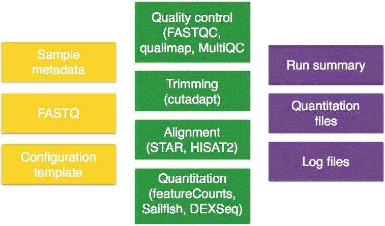
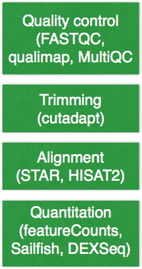

Approximate time: 90 minutes


## NGS pipelines

As you can see from our RNA-seq lessons so far, the analysis workflow is a multi-step process. We learned what is involved in running each individual step, and the details on inputs and outputs. Finally, we demonstrated how to combine the different steps into a single script for automation of the entire workflow from start to finish.

An alternative to creating your own pipeline for the analysis of your next-generation sequencing data, it to use an existing one. There are a number of pipelines available both commerical and academic, with some that are specific to a particular NGS experiment (i.e [variant calling](https://www.broadinstitute.org/gatk/), [RNA-seq](http://www.biomedcentral.com/content/pdf/1471-2164-16-S6-S3.pdf), [viral NGS analysis](http://viral-ngs.readthedocs.org/en/latest/)).

The pipeline we will be presenting here is [bcbio-nextgen](https://bcbio-nextgen.readthedocs.org/en/latest/).


## `bcbio-nextgen`

[bcbio-nextgen](https://bcbio-nextgen.readthedocs.io/en/latest/index.html) is a shared community resource for handling the data processing of various NGS experiments including variant calling, mRNA-seq, small RNA-seq and ChIP-seq. It is an open-source toolkit created by Brad Chapman with a lot of support (testing, bug reports etc.) and development from the large [user community](https://bcbio-nextgen.readthedocs.org/en/latest/contents/introduction.html#users).

> *"A piece of of software is being sustained if people are using it, fixing it, and improving it rather than replacing it"*
> -[Software Carpentry](http://software-carpentry.org/blog/2014/08/sustainability.html)
>

bcbio-nextgen provides *best-practice* piplelines with the goal of being:

* Scalable: Handles large datasets and sample populations on distributed heterogeneous compute environments
* Well-documented
* Easy(ish) to use: Tools come pre-configured
* Reproducible: Tracks configuration, versions, provenance and command lines
* Analyzable: Results feed into downstream tools to make it easy to query and visualize

It is available for installation on most Linux systems (compute clusters), and also has instructions for setup on the Cloud. It is currently installed on on the Orchestra cluster, and so we will demonstrate `bcbio-nextgen` for RNA-seq data using our Mov10 dataset as input.

> *NOTE:* There is also a [simplified version of how to use bcbio](https://github.com/sorgerlab/rnaseq) for RNA-Seq analysis put together by the Sorger lab, as the [readthedocs](https://bcbio-nextgen.readthedocs.io/en/latest/index.html) can be sometimes be overwhelming with much more detail than you need to get started.

The figure below describes the input (yellow), the workflow for RNA-seq (green) and output (purple) components of `bcbio`:

 

**As we work through this lesson we will introduce each component in more detail**.


## Setting up

Let's get started by logging on to Orchestra and starting an interactive session:

	$ bsub -Is -q interactive bash
	
The first thing we need to do in order to run `bcbio`, is setup some environment variables. Rather than just modifying them in the command-line, we will be adding it to our `.bashrc` file which is  located in your home directory. The `.bashrc` is a shell script that Bash runs whenever it is started interactively. You can put any command in that file that you could type at the command prompt, and is generally used to set an environment and customize things to your preferences.

Open up your `.bashrc` using `vim` and add in the following:

	# Environment variables for running bcbio -- YOU MAY ALREADY HAVE THIS
	export PATH=/opt/bcbio/centos/bin:$PATH
	
	unset PYTHONHOME
	unset PYTHONPATH

> *NOTE:* For people who are using non-english keyboards, you may also want to add the following to your `.bashrc` file:
>
> ```
> export LC_ALL=en_US.UTF-8
> export LANG=en_US.UTF-8
> export LANGUAGE=en_US.UTF-8
> ````
 
Close and save the file. Finally, let's set up the project structure. **Since `bcbio` will spawn a number of intermediate files as it goes through the pipeline of tools, we will use `/n/scratch2` space to make sure there is enough disk space to hold all of those files.** Your home directory on Orchestra will not be able to handle this amount of data. Another alternative is talking to the folks at HMS-RC to set up a directory in the `/groups` folder for your lab. 

Change directories into `/n/scratch2` and make a directory titled your Orchestra username (i.e. `mm573`). Since this is a shared space it is useful to make your own personal directory:

	$ cd /n/scratch2
	$ mkdir <ecommmons_id>


Now let's create a directory for the bcbio run:
	
	$ cd <ecommons_id>
	$ mkdir bcbio-rnaseq

## `bcbio`: Inputs

There are three things required as input for your `bcbio` run:

 

The files we will use as input are the **raw untrimmed FASTQ files**. We will need to copy the full dataset over from the `hbctraining` directory and into our current directory:

	$ cp /groups/hbctraining/ngs-data-analysis2016/rnaseq/bcbio-rnaseq/*.fq bcbio-rnaseq/


In addition to the data files, `bcbio` requires a **comma separated value file containing sample metadata**. The first column must contain the header `samplename` which corresponds to the FASTQ filenames you are running the analysis on. You can add a `description` column to change the sample name originally supplied by the file name, to this value (i.e. a short name). And finally, any columns that follow can contain additional information on each sample.

We have created this file for you, you will need to copy it over to your current directory.

	$ cp /groups/hbctraining/ngs-data-analysis2016/rnaseq/bcbio-rnaseq/mov10_project.csv bcbio-rnaseq/
	
Each line in the file corresponds to a sample, and each column has information about the samples. Move into the directory and take a look at the file:

	$ cd bcbio-rnaseq
	$ less mov10_project.csv

```
samplename,description,condition
Irrel_kd1.subset.fq,Irrel_kd1,control
Irrel_kd2.subset.fq,Irrel_kd2,control
Irrel_kd3.subset.fq,Irrel_kd3,control
Mov10_oe1.subset.fq,Mov10_oe1,overexpression
Mov10_oe2.subset.fq,Mov10_oe2,overexpression
Mov10_oe3.subset.fq,Mov10_oe3,overexpression
```

The final requirement is a **configuration template**, which will contain details on the analysis options. The template file is used in combination with the metadata file, and the FASTQ files to create a **config file** which is ultimately the input for `bcbio`.

You can start with one of the provided [best-practice templates](https://github.com/chapmanb/bcbio-nextgen/tree/master/config/templates) and modify it as required, or you can create your own. We have created a template for you based on the experimental details. Copy it over and then use `less` to take a look at what is inside.

	$ cp /groups/hbctraining/ngs-data-analysis2016/rnaseq/bcbio-rnaseq/mov10-template.yaml .
	$ less mov10-template.yaml
	
```
# Template for human RNA-seq using Illumina prepared samples
---
details:
  - analysis: RNA-seq
    genome_build: hg19
    algorithm:
      aligner: star
      quality_format: standard
      trim_reads: False
      strandedness: firststrand 
upload:
  dir: ../final
```

You should observe **indentation which is characteristic of the YAML file format** (YAML Ain't Markup Language). YAML is a human friendly data serialization standard for all programming languages. It takes concepts from languages such as C, Perl, and Python and ideas from XML. The data structure hierarchy is maintained by **outline indentation**.

The **configuration template defines `details` of each sample to process**, each described below:

* `analysis`: the type of analysis we are running (i.e. RNA-seq, chipseq, variant)
* `genome_build`: To find out which genomes are available in bcbio and how to specify it, you can type `bcbio_setup_genome.py` into the terminal. This will return to you a list of all current genomes.
* `algorithm`: provide the specifics for each tool that is being used in the workflow. This space is used to customize your run and tweak any of the tools/parameters from the preset defaults. We'll discuss these in more detail below.
* `metadata`: additional descriptive metadata about the sample. This will be added via the `.csv` when creating the final config file, so we don't need to add it here.

At the end of the template we define `upload` which is for the final ouput from `bcbio`. To find out more on the details that can be added to your YAML, check out the [readthedocs](https://bcbio-nextgen.readthedocs.io/en/latest/contents/configuration.html#algorithm-parameters). 	
	 
We can now **apply this template to all samples in our dataset**. To do this we use the `template` workflow (`-w`), which takes in the template YAML, the metadata and the samples and outputs a configuration file. 

	$ bcbio_nextgen.py -w template mov10-template.yaml mov10_project.csv *.fq
	
Upon completion of the command you should see the following output:

```
Configuration file created at: /home/mm573/ngs_course/rnaseq/bcbio-rnaseq/mov10_project/config/mov10_project.yaml
Edit to finalize and run with:
  cd /home/mm573/ngs_course/rnaseq/bcbio-rnaseq/mov10_project/work
  bcbio_nextgen.py ../config/mov10_project.yaml
```

If you take a look in your current directory, you will also find that a **new directory** has been created by the same name as your csv file `mov10_project`. Inside that directory you will find the following directory structure:

```
mov10_project/
├── config
└── work
```


## `bcbio`: Workflow

Before we actually run the analysis, let's talk a bit about the tools that will be run and some of the `algorithm` details we specified for these tools. **The RNA-seq pipeline includes steps for quality control, adapter trimming, alignment, and post-alignment quantitation at the level of the gene and isoform.**


 
In our configuration, we specified the following:

```
    algorithm:
      aligner: star
      quality_format: standard
      trim_reads: False
      strandedness: firststrand
 ```

* For quality control, the FASTQC tool is used and we selected `standard` to indicate the **standard fastqsanger quality** encoding. 
* Trimming is not required unless you are using and aligner that doesn't perform soft-clipping. By default trimming is performed and you can specify other details for `adapter` trimming, however this is very slow. Aligners that soft clip the ends of reads such as STAR and HISAT2, or algorithms using pseudoalignments like Sailfish handle contaminant sequences at the ends properly. This makes trimming unnecessary, and since we have chosen `star` as our aligner we have also set `trim_reads: False`.
* For RNA-seq libraries, if your library is strand specific, set the appropriate flag from [unstranded, firststrand, secondstrand]. The default is set to unstranded. For dUTP marked libraries, which we are working with, `firststrand` is correct.
* Alignment QC is performed by [Qualimap](http://qualimap.bioinfo.cipf.es/) and then [MultiQC](http://multiqc.info/) is run to collate these results into a report which contains features of the mapped reads and provides an overall view of the data that helps to the detect biases in the sequencing and/or mapping of the data. 
* Counting of reads is done using featureCounts and does not need to be specified in the configuration file. Also, Salmon which is an extremely fast alignment-free method of quantitation, is run. For each sample we get the `quant.sf` files and also a file of aggregated values across samples. In the outputs section we discuss in more detail the various quantitation files that are generated.


### Creating a job script to run `bcbio`

Upon creation of the config file, you will have noticed two directories were created. **The `work` directory is created because that is where `bcbio` expects you to run the job.**

Let's move into this directory:
	
	$ cd mov10_project/work

**`bcbio` pipeline runs in parallel using the IPython parallel framework. This allows scaling beyond the cores available on a single machine, and requires multiple machines with a shared filesystem like standard cluster environments.** `bcbio` is essentially creating its own mini-scheduler system with a single controller process that optimizes jobs on the worker nodes such that the job gets finished as fast and efficient as possible. Although, we will only ask for a single core in our job submission script `bcbio` will use the parameters provided in the command to spin up the appropriate number of cores required at each stage of the pipeline.

To run `bcbio` we call the same python script that we used for creating the config file `bcbio_nextgen.py` but we add different parameters:

* `../config/mov10_project.yaml`: specify path to config file relative to the `work` directory
* `-n 64`: total number of cores to use on the cluster during processing. For distributed jobs, you want to set cores to match the available cores on a single node in your cluster, then use `-n` as a multiple of this to determine how many nodes to spin up. For example, cores: 16 and -n 64 would try to make four 16 core machines available for analysis.
* `-t ipython`: use python for parallel execution
* `-s lsf`: type of scheduler
* `-q mcore`: queue to submit jobs to
* `-r mincores=2` and `-r minconcores=2`: these are parameters specifically used when using the `mcore` because two cores is the minimum requirement for the queue. The former specifies the minimum number of cores to batch together for parallel single core processes. The latter is the minimum number of cores to use for the controller process. 
* `--retries 3`: number of times to retry a job on failure
* `--timeout 380`: numbers of minutes to wait for a cluster to start up before timing out
* `-rW=72:00`: specifies resource options to pass along to the underlying queue scheduler


The job can take on the range of hours to days depending on the size of your dataset, and so rather than running interactively we will create a job submission script. 

Open up a script file using `vim` and create your job script:

	$ vim submit_bcbio.lsf

```
	#!/bin/sh

	#BSUB -q priority
	#BSUB -J bcbio_mov10
	#BSUB -n 1
	#BSUB -W 3:00
	#BUSB -R “rusage[mem=10000]”
	#BSUB -e mov10_project.err

	bcbio_nextgen.py ../config/mov10_project.yaml -n 64 -t ipython -s lsf -q mcore -r mincores=2 -r minconcores=2 '-rW=72:00' --retries 3 --timeout 380
```

Once you are done, save and close. From within the `work` directory you can now submit the job:

	$ bsub < submit_bcbio.lsf

Use `bjobs` to see the status of your job. *How many jobs do you see?*

## `bcbio`: Output


### Run summary

The results of the run will be summarized for you in a new directory called `final` as specified in our config file. The directory will be located in your project directory:

```
mov10_project/
├── config
├── work
└── final
```

There is a run summary file inside the date-stamped folder called `project-summary` in YAML format. The content of this file describes various quality metrics for each sample post-alignment. You will also find a directory called `multiqc`. Inside here you will find an HTML file that summarizes QC metrics for all samples into a single report. This is an [example report](http://multiqc.info/examples/rna-seq/multiqc_report.html) to give you an idea of the type of information you will find. *NOTE: you will need to move this over to your local laptop in order to view and interpret QC metrics.*

### Quantitation files

Inside the date-stamped directory you will also find a number of different quanitification files for your dataset. These files correspond to aggregated information from the different quantification methods that were applied in the workflow. For RNA-seq these are listed below and also detailed in the [readthedocs](https://bcbio-nextgen.readthedocs.io/en/latest/contents/outputs.html#rna-seq):

* `annotated_combined.counts` – featureCounts counts matrix with gene symbol as an extra column.
* `combined.counts` – featureCounts counts matrix with gene symbol as an extra column.
* `combined.dexseq` – DEXseq counts matrix with exonID as first column.
* `combined.gene.sf.tmp` – Sailfish gene count matrix normalized to TPM.
* `combined.isoform.sf.tpm` – Sailfish transcript count matix normalized to TPM.
* `combined.sf` – Sailfish raw output, all samples files are pasted one after another.
* `tx2gene.csv` – Annotation file needed for DESeq2 to use Sailfish output.

In the `final` directory there are also individual directories for each sample in your dataset. Within each of these folders you will find the final sorted BAM file and its associated index. There is also a `qc` folder which contains sub-directories that contain results from the different QC tools (FASTQC, qualimap). Finally, you should see a `sailfish` folder which contains the Sailfish output including `abundance.h5` files, which means these samples are ready for `sleuth` should you decide to run it.

> #### Using bcbio output to run `DESeq2` or `sleuth`
> 
> * For **gene-level differential expression** analysis, the `quant.sf` files are found within the `final` directory in a subdirectory under each sample. For example, the Mov10_oe1 file can be found in `bcbio-rnaseq/mov10_project/final/Mov10_oe1/sailfish/quant/`. These files can be used as input to the **`tximport/DESeq2`** workflow as described in our [previous lesson](https://github.com/hbc/NGS-Data-Analysis-long-course/blob/Fall_2016/sessionIV/lessons/01_Salifish.md#performing-de-analysis-on-pseudocounts). 
> * If you are interested in looking at **differential expression of splice isoform**s, you will want to use the `abundance.h5` files found at the same path listed above. These are the sleuth-compatible format which saves you having to run `wasabi`. These files can be used as input to the **`sleuth` workflow** as described in our [previous lesson](https://github.com/hbc/NGS-Data-Analysis-long-course/blob/Fall_2016/sessionIV/lessons/02_sleuth.md#sleuth-workflow)
> * *NOTE: that you will need to setup a directory structure imialr to what we had in class in order to follow along. i.e you will need to make sure each directory is named after the sample data it contains.*


### Log files

In the `final` folder there are also two log files:

1. `bcbio-nextgen.log`: High level logging information about the analysis. This provides an overview of major processing steps and useful checkpoints for assessing run times.
2. `bcbio-nextgen-commands.log`: Full command lines (including all parameters) for all third party software tools run.

There is one more log file located in the `work` folder. Here, you will find that there are many new directories and files. For each step of pipeline, new job submission scripts were generated as were various intermediate files and directories. 
Since the important files were collated and placed in the `final` directory, the only other important directory is the `logs` directory. The last log file is `bcbio-nextgen-debug.log`. It contains detailed information about processes including stdout/stderr from third party software and error traces for failures. **Look here to identify the status of running pipelines or to debug errors.** It labels each line with the hostname of the machine it ran on to ease debugging in distributed cluster environments.


***
*This lesson has been developed by members of the teaching team at the [Harvard Chan Bioinformatics Core (HBC)](http://bioinformatics.sph.harvard.edu/). These are open access materials distributed under the terms of the [Creative Commons Attribution license](https://creativecommons.org/licenses/by/4.0/) (CC BY 4.0), which permits unrestricted use, distribution, and reproduction in any medium, provided the original author and source are credited.*
