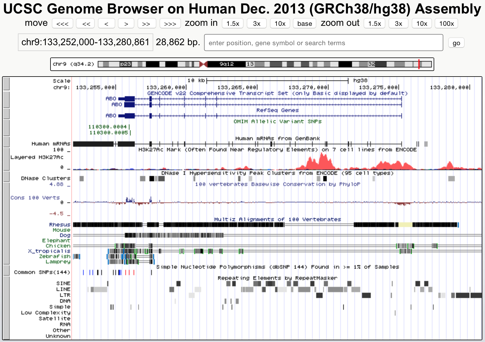
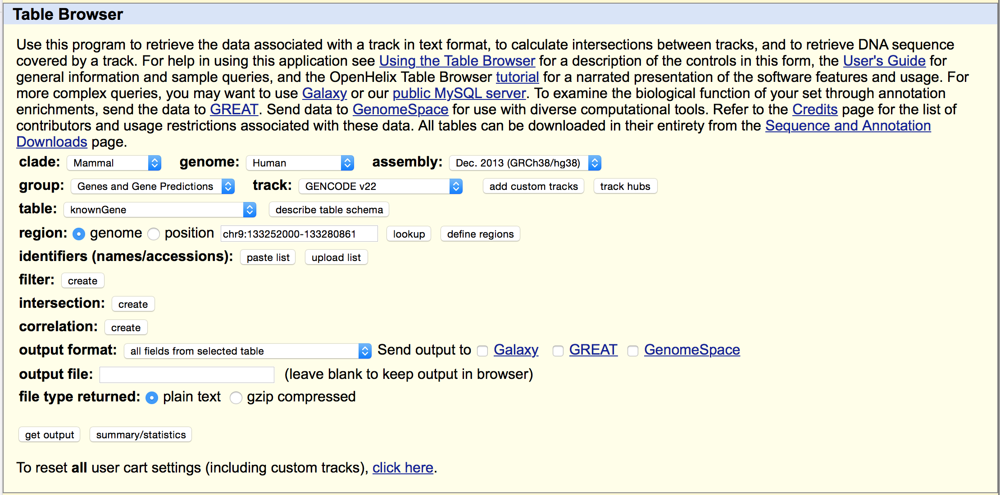

Contributors: Mary Piper, Meeta Mistry
Approximate time: 30 minutes

## Learning Objectives

* learn how to use features of the UCSC database and genome browser to access information and data during an NGS analysis

## Intro to UCSC

The [UCSC Genome Bioinformatics](https://genome.ucsc.edu/) site hosts a very popuar genome browser and wealth of information available for download. In addition, they have developed several tools and a few special formats for data representation, that have made analysis and visualization more flexible.

This website, like NCBI and Ensembl, acts as a portal to a vast amount of biological information. And similar to the others, there is a large amount of public data available for visualization and download. It also offers several tools for analysis.

UCSC is most popular for its genome browser, but the functionality of UCSC goes far beyond those tools. Arguably, it is not the best visualization tool. However, the so-called "table browser" provides access to a lot of information, customizable information, at your fingertips.

### The UCSC Genome Browser

#### Activity
* Look for the gene "CFTR"
* Remove all tracks except scale and RefSeq genes
* Using the menu below the visualization, add back Common SNPs 144, Conservation and Repeatmasker tracks
* Click on the gene, what do you see?
* Come back to the browser and click on a SNP

### The UCSC Table Browser (how to download data from UCSC)

#### Activity
* Look at a bed format representation of the SNPs we were just looking at in the genome browser
* Download the bed file above
* Download the sequence of the CFTR gene
* Download the sequence of the genomic area in which the CFTR gene exists

### Final words

The UCSC genome bioinformatics site has a limited number of species that it stores information for, as compared to NCBI and Ensembl. However, the information that it does store, including help for file formats and tools, is really in-depth and they make a great effort to make it accessible.

> The Countway library routinely holds short courses for the UCSC genome browsers, if you are interested in learning more.

***
*This lesson has been developed by members of the teaching team at the [Harvard Chan Bioinformatics Core (HBC)](http://bioinformatics.sph.harvard.edu/). These are open access materials distributed under the terms of the [Creative Commons Attribution license](https://creativecommons.org/licenses/by/4.0/) (CC BY 4.0), which permits unrestricted use, distribution, and reproduction in any medium, provided the original author and source are credited.*
