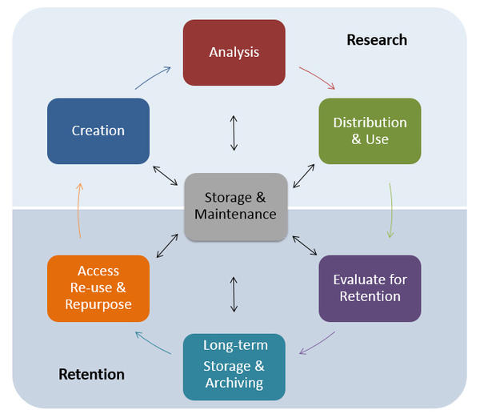
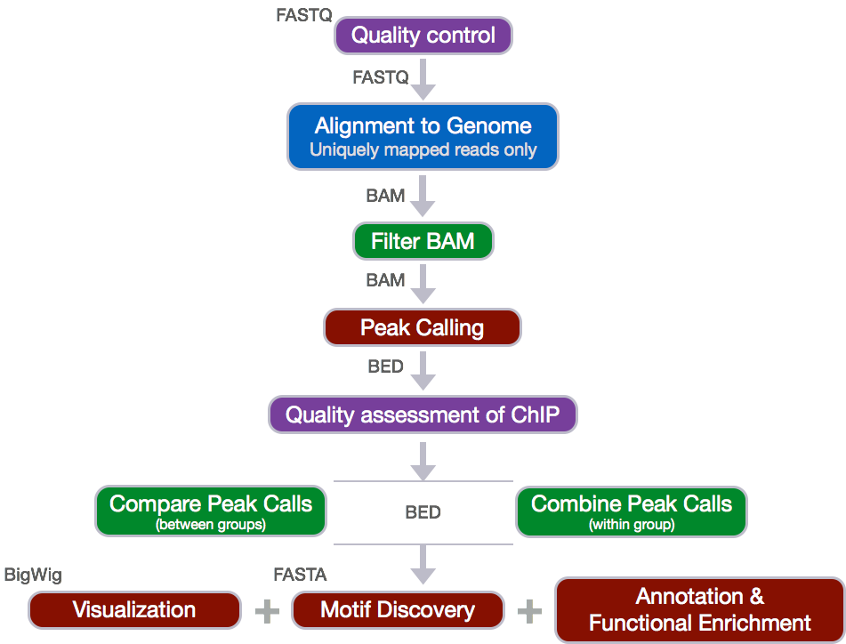

Approximate time: 45 minutes

## Learning Objectives

- Describe the best practices for designing a ChIP-seq experiment
- Recognize the need for data management and project organization

## Introduction to ChIP-seq
Chromatin immunoprecipitation (ChIP) experiments are performed to identify DNA bound to specific (chromatin) proteins of interest. The first step involves isolating the chromatin and immunoprecipitating (IP) fragements with an antibody against the protein of interest. In ChIP-seq, the immunoprecipitated DNA fragments are then sequenced, followed by identification of enriched regions of DNA or peaks. These peak calls can then be used to make biological inferences by determining the associated genomic features and/or over-represented sequence motifs. 


During this session we will be performing a complete workflow for ChIP-seq analysis, starting with experimental design and generation of the raw sequencing reads and ending with functional enrichment analyses and motif discovery.


## Experimental design and library preparation

Several steps are involved in the library preparation of protein-bound DNA fragments for sequencing: 


1. After the chromatin is isolated from the cell, proteins are cross-linked to the DNA
2. The DNA is sheared into fragments (sonication)
3. A protein-specific antibody is used to immunoprecipitate the protein-bound DNA fragments
4. The crosslink is reversed and DNA purified
5. DNA fragments are size selected and amplified using PCR


Within the DNA fragments enriched for the regions binding to a protein of interest, only a fraction correspond to actual signal. The proportion of DNA fragments containing the actual binding site of the protein depends on the **number of active binding sites, the number of starting genomes, and the efficiency of the IP**. 

In addition, when performing ChIP-seq, some sequences may appear enriched due to the following:

- Open chromatin regions are fragmented more easily than closed regions
- Repetitive sequences might seem to be enriched (copy number inaccuracies in genome assembly)
- Uneven distribution of sequence reads across the genome

Therefore, proper controls are essential. A ChIP-seq peak should be compared with the same region of the genome in a matched control.


The same starting material should be divided to be used for both the protein-specific IP and the control. The control sample can be generated by one of the following recommended techniques: 

- No IP (input DNA) 
- No antibody ("mock IP")
- Non-specific antibody (IgG "mock IP")


## Setting up

Since we are going to be working with this data on our remote server, **O2**, we first need to log onto the server. 

Type in the following command with your username to login:

```bash
ssh username@o2.hms.harvard.edu
```

Next we will start an interactive session on O2 with 2 cores (add the `-n 2`):

```bash
$ srun --pty -p short -t 0-12:00 --mem 8G -n 2 --reservation=HBC bash
```

Make sure that your command prompt is now preceded by a character string that contains the word "compute".

>**NOTE:** We are using the `--reservation` argument and the `short` partition during class since we have a dedicated set of computers reserved so that commands run quickly. When starting an interactive session outside of class you will need to leave out this argument and use the `interactive` partition:
>
>```bash
>$ srun --pty -p interactive -t 0-12:00 --mem 8G -n 2 bash
>```


## Data Management

One of the most important parts of research that involves large amounts of data, is how best to manage it. We tend to prioritize the analysis, but there are many other important aspects that are  often overlooked in the excitement to get a first look at new data. 

The data management lifecycle displayed below, courtesy of the [HMS Data Management Working Group](https://datamanagement.hms.harvard.edu/hms-data-management-working-group), illustrates some things to consider beyond the data creation and analysis components:



_Image aquired from the [Harvard Biomedical Data Management Website](https://datamanagement.hms.harvard.edu/hms-data-lifecycle)_

We will cover some parts of this lifecycle by talking about best practices for the **Research** half of the above lifecycle. Later in this workshop we will talk a little more about the data storage. For more information about the full lifecycle and more guidelines for data management, please look at the resources linked below.

**Resources**

* The [HMS Data Management Working Group's website](https://datamanagement.hms.harvard.edu/)
* A guide from the [Harvard library](http://guides.library.harvard.edu/dmp).

### Planning

You should approach your sequencing project in a very similar way to how you do a biological experiment, and ideally, begins with **experimental design**. We're going to assume that you've already designed a beautiful sequencing experiment to address your biological question, collected appropriate samples, and that you have enough statistical power.

During this stage it is important to keep track of how the experiment was performed and clearly tracking the source of starting materials and kits used. It is also best practice to include information about any small variations within the experiment or variation relative to standard experiments. 

### Organization

Every computational analysis you do is going to spawn many files, and inevitability you'll want to run some of those analyses again. For each experiment you work on and analyze data for, it is considered best practice to get organized by creating a planned storage space (directory structure).

We will start by creating a directory that we can use for the rest of the ChIP-seq session.

First, make sure that you are in your home directory.

```bash
$ cd
$ pwd
```
This should return `/home/username`.

Create a `chipseq` directory and change directories into it:

```bash
$ mkdir chipseq

$ cd chipseq
```

Now that we have a project directory, we can set up the following structure within it to keep files organized.

```bash
chipseq/
├── logs/
├── meta/
├── raw_data/
├── reference_data/
├── results/
│   ├── bowtie2/
│   └── fastqc/
└── scripts/
```

```bash
$ mkdir raw_data reference_data scripts logs meta

$ mkdir -p results/fastqc results/bowtie2

$ tree     # this will show you the directory structure you just created
```

> Note that we are using the parents flag (`-p` or `--parents`) with `mkdir` to complete the file path by creating any parent directories that do not exist. In our case, we have not yet created the `results` directory and so since it does not exist it will be created. This flag can be very useful when scripting workflows. 

**This is a generic directory structure and can be tweaked based on personal preference and analysis workflow.**

- `logs`: to keep track of the commands run and the specific parameters used, but also to have a record of any standard output that is generated while running the command. 
- `meta`: for any information that describes the samples you are using, which we refer to as [metadata](https://datamanagement.hms.harvard.edu/metadata-overview). We will discuss this in more detail as it pertains to our example dataset, later in this lesson.
- `raw_data`: for any **unmodified** (raw) data obtained prior to computational analysis here, e.g. FASTQ files from the sequencing center. We strongly recommend leaving this directory unmodified through the analysis.
- `reference_data`: for known information related to the reference genome that will be used in the analysis, e.g. genome sequence (FASTA), gene annotation file (GTF) associated with the genome.
- `results`: for output from the different tools you implement in your workflow. Create sub-folders specific to each tool/step of the workflow within this folder. 
- `scripts`: for scripts that you write and use to run analyses/workflow.


Now that we have the directory structure created, let's copy over the data to perform our quality control and alignment, including our FASTQ files and reference data files:

```bash
$ cp /n/groups/hbctraining/chip-seq/raw_fastq/*fastq raw_data/

$ cp /n/groups/hbctraining/chip-seq/reference_data/chr12* reference_data/
```

Now we are all set up for our analysis!

> #### File naming conventions
> 
> Another aspect of staying organized is making sure that all the filenames in an analysis are as consistent as possible, and are not things like `alignment1.bam`, but more like `20170823_kd_rep1_gmap-1.4.bam`. [This link](https://datamanagement.hms.harvard.edu/file-naming-conventions) and [this slideshow](http://www2.stat.duke.edu/~rcs46/lectures_2015/01-markdown-git/slides/naming-slides/naming-slides.pdf) have some good guidelines for file naming dos and don'ts.


### Documentation

**Documentation doesn't stop at the sequencer!** Keeping notes on what happened in what order, and what was done, is essential for reproducible research.

#### Log files

In your lab notebook, you likely keep track of the different reagents and kits used for a specific protocol. Similarly, recording information about the tools and parameters is important for documenting your computational experiments. 

- **Make note of the software you use.** Do your research and find out what tools are best for the data you are working with. Don't just work with tools that you are able to easily install.
- **Keep track of software versions.** Keep up with the literature and make sure you are using the most up-to-date versions.
- **Record information on parameters used and summary statistics** at every step (e.g., how many adapters were removed, how many reads did not align)
    - A general rule of thumb is to test on a single sample or a subset of the data before running your entire dataset through. This will allow you to debug quicker and give you a chance to also get a feel for the tool and the different parameters.
    - Different tools have different ways of reporting log messages and you might have to experiment a bit to figure out what output to capture. You can redirect standard output with the `>` symbol which is equivalent to `1> (standard out)`; other tools might require you to use `2>` to re-direct the `standard error` instead.
    
#### README files

After setting up the directory structure and when the analysis is running it is useful to have a **[README file](https://datamanagement.hms.harvard.edu/readme-files) within your project directory**. This file will usually contain a quick one line summary about the project and any other lines that follow will describe the files/directories found within it. An example README is shown below. Within each sub-directory you can also include README files to describe the analysis and the files that were generated.

```
## README ##
## This directory contains data generated during the Intro to ChIP-seq course
## Date: 

There are six subdirectories in this directory:

raw_data : contains raw data
meta:  contains...
logs:
reference_data:
results:
scripts:
```

*** 

### Homework Exercise

- Create a README for the `chipseq/` folder (hint: use `vim` to create the file). Give a short description of the project and as homework add brief descriptions of the types of files you will be storing within each of the sub-directories. 

***


## Exploring the example dataset

Our goal for this session is to compare the the binding profiles of [Nanog](https://www.nature.com/stemcells/2009/0909/090910/full/stemcells.2009.118.html) and [Pou5f1](https://www.nature.com/articles/7290134) (Oct4). The ChIP was performed on H1 human embryonic stem cell line (h1-ESC) cells, and sequenced using Illumina. The datasets were obtained from the [HAIB TFBS ENCODE collection](http://hgdownload.cse.ucsc.edu/goldenpath/hg19/encodeDCC/wgEncodeHaibTfbs/). These 2 transcription factors are involved in **stem cell pluripotency** and one of the goals is to understand their roles, individually and together, in transriptional regulation. 

Two replicates were collected and each was divided into 3 aliquots for the following:

- Nanog IP
- Pou5f1 IP
- Control input DNA


For these 6 samples, we will be using reads from only a 32.8 Mb of chromosome 12 (chr12:1,000,000-33,800,000), so we can get through the workflow in a reasonable amount of time. 

## The ChIP-seq workflow

Below is the workflow that we will be using today. Bioinformatics workflows, like this one, adopt a plug-and-play approach in that the output of one tool can be easily used as input to another tool without any extensive configuration. The tools that are used to analyze data at different stages of the workflow are built under the assumption that the data will be provided in a specific format to facilitate a more streamlined analysis. Hence different tools that can be implemented at specific steps in the workflow will have similar outputs.

	

***
*This lesson has been developed by members of the teaching team at the [Harvard Chan Bioinformatics Core (HBC)](http://bioinformatics.sph.harvard.edu/). These are open access materials distributed under the terms of the [Creative Commons Attribution license](https://creativecommons.org/licenses/by/4.0/) (CC BY 4.0), which permits unrestricted use, distribution, and reproduction in any medium, provided the original author and source are credited.*
