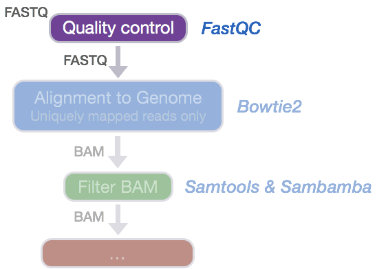
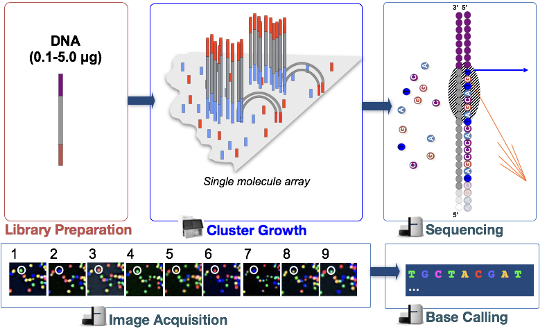
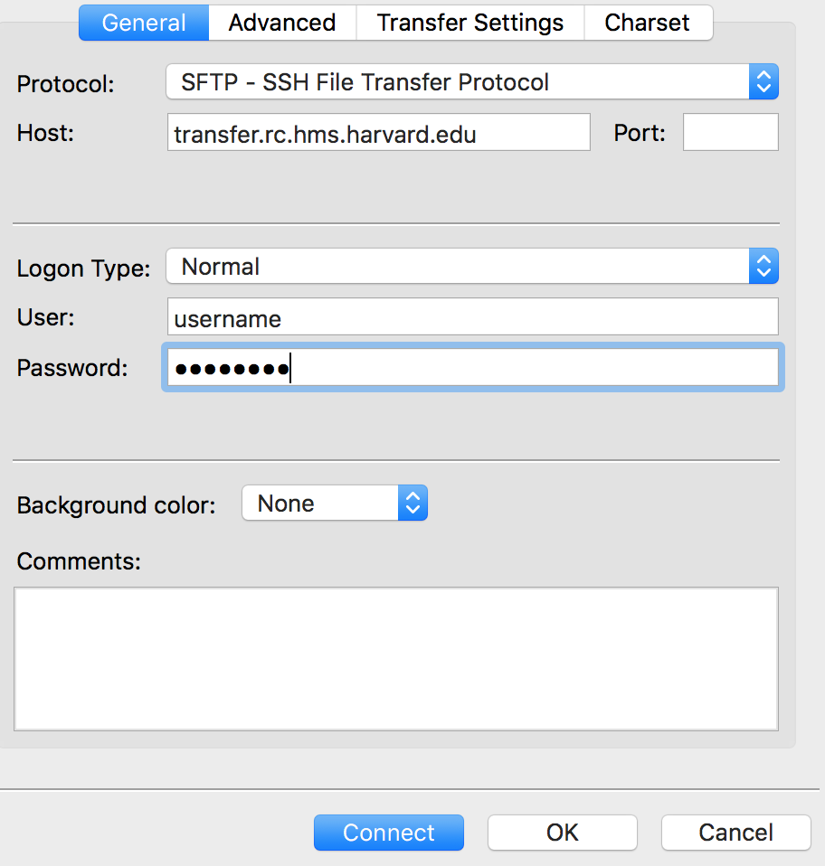
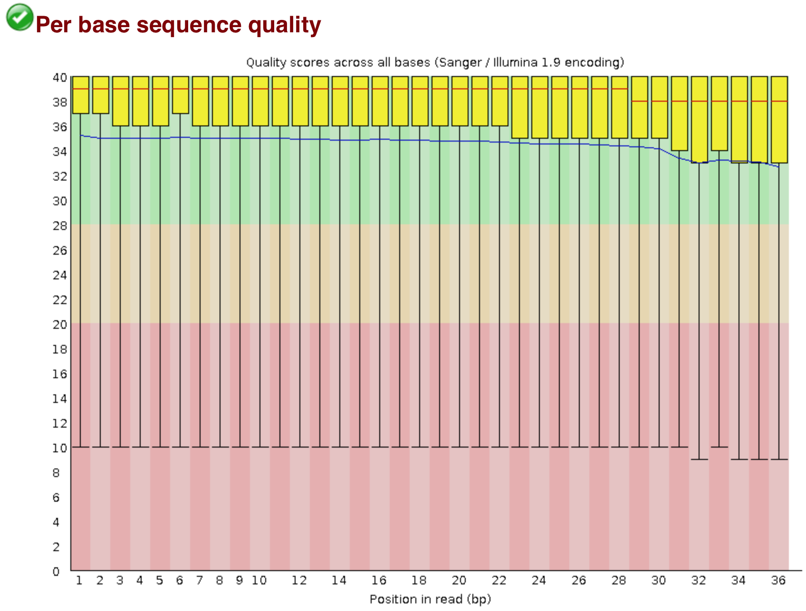

Contributors: Mary Piper, Radhika Khetani

Approximate time: 55 minutes

## Learning Objectives

* Become familiar with the Illumina sequencing technology
* Understanding how to use modules in the cluster environment
* Evaluate the quality of your sequencing data using FastQC

## Quality control of sequence reads



Now that we have our files and directory structure, we are ready to begin our ChIP-seq analysis. For any NGS analysis method, our first step in the workflow is to explore the quality of our reads prior to aligning them to the reference genome and proceeding with downstream analyses. 

### Understanding the Illumina sequencing technology

Before we can assess the quality of our reads, it would be helpful to know a little bit about how these reads were generated. Since our data was sequenced on an Illumina sequencer we will introduce you to their Sequencng by Synthesis methodology, however keep in mind there are other technologies and the way reads are generated will vary (as will the associated biases observed in your data). 



An **animation of the Sequencing by Synthesis is most helpful** (rather than reading through lines of text), and so we would like you to take five minutes and watch [this YouTube video](https://www.youtube.com/watch?v=fCd6B5HRaZ8&t=3s) from Illumina.

### Unmapped read data (FASTQ)

The [FASTQ](https://en.wikipedia.org/wiki/FASTQ_format) file format is the defacto file format for sequence reads generated from next-generation sequencing technologies. This file format evolved from FASTA in that it contains sequence data, but also contains quality information. Similar to FASTA, the FASTQ file begins with a header line. The difference is that the FASTQ header is denoted by a `@` character. For a single record (sequence read) there are four lines, each of which are described below:

|Line|Description|
|----|-----------|
|1|Always begins with '@' and then information about the read|
|2|The actual DNA sequence|
|3|Always begins with a '+' and sometimes the same info in line 1|
|4|Has a string of characters which represent the quality scores; must have same number of characters as line 2|

Let's use the following read as an example:

```
@HWI-ST330:304:H045HADXX:1:1101:1111:61397
CACTTGTAAGGGCAGGCCCCCTTCACCCTCCCGCTCCTGGGGGANNNNNNNNNNANNNCGAGGCCCTGGGGTAGAGGGNNNNNNNNNNNNNNGATCTTGG
+
@?@DDDDDDHHH?GH:?FCBGGB@C?DBEGIIIIAEF;FCGGI#########################################################
```

As mentioned previously, line 4 has characters encoding the quality of each nucleotide in the read. The legend below provides the mapping of quality scores (Phred-33) to the quality encoding characters. *Different quality encoding scales exist (differing by offset in the ASCII table), but note the most commonly used one is fastqsanger.*

 ```
 Quality encoding: !"#$%&'()*+,-./0123456789:;<=>?@ABCDEFGHI
                   |         |         |         |         |
    Quality score: 0........10........20........30........40                                
```
 
Using the quality encoding character legend, the first nucelotide in the read (C) is called with a quality score of 31 and our Ns are called with a score of 2. **As you can tell by now, this is a bad read.** 

Each quality score represents the probability that the corresponding nucleotide call is incorrect. This quality score is logarithmically based and is calculated as:

	Q = -10 x log10(P), where P is the probability that a base call is erroneous

These probabaility values are the results from the base calling algorithm and dependent on how much signal was captured for the base incorporation. The score values can be interpreted as follows:

|Phred Quality Score |Probability of incorrect base call |Base call accuracy|
|:-------------------|:---------------------------------:|-----------------:|
|10	|1 in 10 |	90%|
|20	|1 in 100|	99%|
|30	|1 in 1000|	99.9%|
|40	|1 in 10,000|	99.99%|
|50	|1 in 100,000|	99.999%|
|60	|1 in 1,000,000|	99.9999%|

Therefore, for the first nucleotide in the read (C), there is less than a 1 in 1000 chance that the base was called incorrectly. Whereas, for the the end of the read there is greater than 50% probabaility that the base is called incorrectly.

## Assessing quality with FastQC

Now we understand what information is stored in a FASTQ file, the next step is to examine quality metrics for our data.

[FastQC](http://www.bioinformatics.babraham.ac.uk/projects/fastqc/) provides a simple way to do some quality control checks on raw sequence data coming from high throughput sequencing pipelines. It provides a modular set of analyses which you can use to give a quick impression of whether your data has any problems of which you should be aware before doing any further analysis.

The main functions of FastQC are:

* Import of data from BAM, SAM or FastQ files (any variant)
* Providing a quick overview to tell you in which areas there may be problems
* Summary graphs and tables to quickly assess your data
* Export of results to an HTML based permanent report
* Offline operation to allow automated generation of reports without running the interactive application

### Run FastQC  

Let's run FastQC on all of our files. 

Change directories to the `raw_data` folder and check the contents

```bash
$ cd ~/chipseq/raw_data 

$ ls -l
```

Before we start using any software, we either have to check if it's available on the cluster, and if it is we have to load it into our environment (or `$PATH`). On the O2 cluster, we can check for, and load packages (or modules) using the **LMOD** system. 

If we check which modules we currently have loaded, we should not see FastQC.

```bash
$ module list
```

This is because the FastQC program is not in our $PATH (i.e. its not in a directory that unix will automatically check to run commands/programs).

```bash
$ echo $PATH
```

To find the FastQC module to load we need to search the versions available:

```bash
$ module spider
```

Then we can load the FastQC module:

```bash
$ module load fastqc/0.11.3
```

Once a module for a tool is loaded, you have essentially made it directly available to you like any other basic UNIX command.

```bash
$ module list

$ echo $PATH
```

FastQC will accept multiple file names as input, so we can use the `*.fq` wildcard.

```bash
$ fastqc *.fastq
```

*Did you notice how each file was processed serially? How do we speed this up?*

Exit the interactive session and once you are on a "login node," start a new interactive session with 6 cores. Now we can use the multi-threading functionality of FastQC to speed this up by running 6 jobs at once, one job for one file.

```bash
$ exit  #exit the current interactive session

$ srun --pty -n 6 -p short -t 0-12:00 --mem 8G --reservation=HBC /bin/bash  #start a new one with 6 cpus (-n 6) and 8G RAM (--mem 8G)

$ module load fastqc/0.11.3  #reload the module for the new session

$ cd ~/chipseq/raw_data

$ fastqc -t 6 *.fastq  #note the extra parameter we specified for 6 threads
```

How did I know about the -t argument for FastQC?

```bash
$ fastqc --help
```

Now, move all of the `fastqc` files to the `results/fastqc` directory:

```bash
$ mv *fastqc* ../results/fastqc/
```

### FastQC Results
   
Let's take a closer look at the files generated by FastQC:
   
`$ ls -lh ../results/fastqc/`

#### HTML reports
The .html files contain the final reports generated by fastqc, let's take a closer look at them. Transfer the file for `H1hesc_Input_Rep1_chr12.fastq` over to your laptop via *FileZilla*.

##### Filezilla - Step 1

Open *FileZilla*, and click on the File tab. Choose 'Site Manager'.
 
	

##### Filezilla - Step 2

Within the 'Site Manager' window, do the following: 

1. Click on 'New Site', and name it something intuitive (e.g. O2)
2. Host: transfer.rc.hms.harvard.edu 
3. Protocol: SFTP - SSH File Transfer Protocol
4. Logon Type: Normal
5. User: training_account
6. Password: password for training_account
7. Click 'Connect'

	
	
The **"Per base sequence quality"** plot is the most important analysis module in FastQC for ChIP-seq; it provides the distribution of quality scores across all bases at each position in the reads. This information can help determine whether there were any problems at the sequencing facility during the sequencing of your data. Generally, we expect a decrease in quality towards the ends of the reads, but we shouldn't see any quality drops at the beginning or in the middle of the reads.



Based on the sequence quality plot, we see the majority of the reads have high quality, but the whiskers drop into the poor quality regions, indicating that a significant number of reads have low quality bases across the reads. The poor quality reads in the middle of the sequence would be concerning if this was our dataset, and we would probably want to contact the sequencing facility. However, this dataset was created artifically, so does not indicate a problem at the sequencing facility. Trimming could be performed from both ends of the sequences, or we can use an alignment tool that can ignore these poor quality bases at the ends of reads (soft clip). 

This is the main plot explored for ChIP-seq, but if you would like to go through the remaining plots/metrics, FastQC has a really well documented [manual page](http://www.bioinformatics.babraham.ac.uk/projects/fastqc/) with [more details](http://www.bioinformatics.babraham.ac.uk/projects/fastqc/Help/) about all the plots in the report. We recommend looking at [this post](http://bioinfo-core.org/index.php/9th_Discussion-28_October_2010) for more information on what bad plots look like and what they mean for your data. Also, FastQC is just an indicator of what's going on with your data, don't take the "PASS"es and "FAIL"s too seriously.

> **We also have a [slidedeck](https://github.com/hbctraining/Intro-to-rnaseq-hpc-O2/raw/master/lectures/error_profiles_mm.pdf) of error profiles for Illumina sequencing, where we discuss specific FASTQC plots and possible sources of these types of errors.**

***
*This lesson has been developed by members of the teaching team at the [Harvard Chan Bioinformatics Core (HBC)](http://bioinformatics.sph.harvard.edu/). These are open access materials distributed under the terms of the [Creative Commons Attribution license](https://creativecommons.org/licenses/by/4.0/) (CC BY 4.0), which permits unrestricted use, distribution, and reproduction in any medium, provided the original author and source are credited.*

