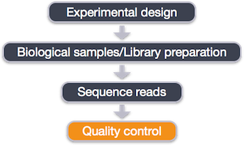
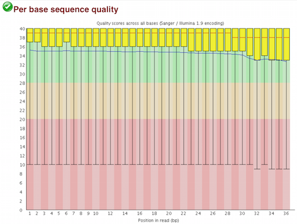
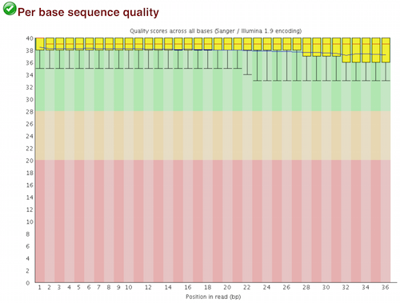
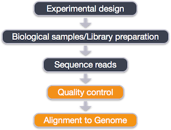

Contributors: Mary Piper, Radhika Khetani

Approximate time: 1 hour

## Learning Objectives

* to use previous knowledge of quality control steps to perform FastQC
* to learn how to use Trimmomatic to perform quality trimming
* to understand parameters and perform alignment using Bowtie2

## Quality control of sequence reads

 

Now that we have our files and directory structure, we are ready to begin our ChIP-Seq analysis. For any NGS analysis method, our first step in the workflow is to explore the quality of our reads prior to aligning them to the reference genome and proceeding with downstream analyses. 

We will use FastQC to get a good idea of the overall quality of our data. We will use FastQC to identify whether any samples appear to be outliers, to examine our data for contamination, and to determine a trimming strategy.

>**NOTE:** We will trim poor quality bases and/or adapters prior to alignment because that was the workflow previously used by ENCODE. However, we do not need to trim as the downstream alignment tool, Bowtie2, has an option for soft-clipping.

### FASTQC

Let's run FastQC on all of our files. 

Start an interactive session with 2 cores if don't have one going, and change directories to the `raw_data` folder.

```bash
$ cd ~/ngs_course/chipseq/raw_data 

$ module load seq/fastqc/0.11.3 

$ fastqc H1hesc_Input_Rep1_chr12.fastq 
```

Now, move all of the `fastqc` files to the `results/untrimmed_fastqc` directory:

```bash
$ mv *fastqc* ../results/untrimmed_fastqc/
```

Transfer the FastQC zip file for Input replicate 1 to your local machine using FileZilla and view the report.




Based on the sequence quality plot, we see across the length of the read the quality drops into the low range. Trimming should be performed from both ends of the sequences. 

### Trimmomatic

[*Trimmomatic*](http://www.usadellab.org/cms/?page=trimmomatic) can be used to trim away adapters and filter out poor quality score reads. *Trimmomatic* is a java based program that can remove sequencer specific reads and nucleotides that fall below a certain quality threshold. *Trimmomatic* offers the option to trim reads using a hard crop, sliding window or base-by-base methods. It can also trim adapter sequences and remove reads if below a minimum length. In addition, *Trimmomatic* can be multi-threaded to run quickly using a single, complex command. 

We will use Trimmomatic to trim the reads from both ends of the sequence.

Let's check for the *Trimmomatic* module and load it:

```bash
$ module avail seq/

$ module load seq/Trimmomatic/0.33

$ module list

$ echo $PATH
```

By loading the *Trimmomatic* module, Java and Trimmomatic are loaded and appear in our PATH. 

We will run Trimmomatic using the following parameters:

* `SE`: Single End reads
* `-threads`: number of threads / cores
* `-phread33`: quality score format
* `LEADING`: cut bases off the start of a read, if below a threshold quality
* `TRAILING`: cut bases off the end of a read, if below a threshold quality
* `MINLEN`: drop an entire read if it is below a specified length

> *NOTE:* We have to specify the `-threads` parameter because *Trimmomatic* uses all threads on a node by default.

*Trimmomatic* has a variety of other options and parameters:

* **_SLIDINGWINDOW_** Perform sliding window trimming, cutting once the average quality within the window falls below a threshold.
* **_CROP_** Cut the read to a specified length.
* **_HEADCROP_** Cut the specified number of bases from the start of the read.
* **_ILLUMINACLIP_** Cut adapter and other illumina-specific sequences from the read
* **_TOPHRED33_** Convert quality scores to Phred-33.
* **_TOPHRED64_** Convert quality scores to Phred-64.

Now that we know what parameters  we can set up our command. Since we are only trimming a single file, we will run the command in the interactive session rather than creating a script. Because *Trimmomatic* is java based, it is run using the `java -jar` command. In addition to the options as described above, we have two arguments specifying our input file and output file names. 

> *NOTE:* `java -jar` calls the Java program, which is needed to run *Trimmomatic*, which is a 'jar' file (`trimmomatic-0.33.jar`). A 'jar' file is a special kind of java archive that is often used for programs written in the Java programming language.  If you see a new program that ends in '.jar', you will know it is a java program that is executed `java -jar` <*location of program .jar file*>. Even though *Trimmomatic* is in our PATH, we still need to specify the full path to the `.jar` file in the command.

```bash
$ java -jar /opt/Trimmomatic-0.33/trimmomatic-0.33.jar SE \
-threads 2 \
-phred33 \
H1hesc_Input_Rep1_chr12.fastq \
../results/trimmed/H1hesc_Input_Rep1_chr12.qualtrim20.minlen36.fq \
LEADING:20 \
TRAILING:20 \
MINLEN:36
```

Let's see how much trimming improved our reads by running FastQC again:

```bash
$ fastqc ../results/trimmed/H1hesc_Input_Rep1_chr12.qualtrim20.minlen36.fq
```

Move the FastQC folders to the results directory for trimmed FastQC results:

```bash
$ mv ../results/trimmed/*fastqc* ../results/trimmed_fastqc/
```

Using Filezilla, transfer the file for the trimmed Input replicate 1 FastQC to your computer.



## Alignment



Now that we have removed the poor quality sequences from our data, we are ready to align the reads to the reference genome. Most ChIP-seq experiments do not require gapped alignments because the sequenced reads do not contain them, unlike exon junctions in RNA-seq analyses. 

[Bowtie2](http://bowtie-bio.sourceforge.net/bowtie2/manual.shtml) is a fast and accurate alignment tool that indexes the genome with an FM Index based on the Burrows-Wheeler Transform to keep memory requirements low for the alignment process. *Bowtie2* supports gapped, local and paired-end alignment modes. It works best for reads that are at least 50 bp (shorter read lengths should use Bowtie1), and it can perform soft-clipping to remove poor quality bases [[2](http://genomebiology.biomedcentral.com/articles/10.1186/gb-2009-10-3-r25)].

> _**NOTE:** Our reads are only 36 bp, so technically we should use Bowtie1. However, since it is rare that you will have sequencing reads with less than 50 bp, we will show you how to perform alignment using Bowtie2._

### Creating Bowtie2 index

To perform the Bowtie2 alignment, a genome index is required. **We previously generated the genome indexes for you**, and they exist in the `reference_data` directory.

However, if you needed to create a genome index yourself, you would use the following command:

```bash
# DO NOT RUN

bowtie2-build <path_to_reference_genome.fa> <prefix_to_name_indexes>

# Can find indexes for the entire genome on Orchestra using following path: /groups/shared_databases/igenome/Homo_sapiens/UCSC/hg19/Sequence/Bowtie2Index/
```

### Aligning reads with Bowtie2

Since we have our indexes already created, we can get started with read alignment. Change directories to the `bowtie2` folder:

```bash
$ cd ~/ngs_course/chipseq/results/bowtie2
```

We will perform alignment on our single trimmed sample, `H1hesc_Input_Rep1_chr12.qualtrim20.minlen36.fq`. Details on Bowtie2 and its functionality can be found in the [user manual](http://bowtie-bio.sourceforge.net/bowtie2/manual.shtml); we encourage you to peruse through to get familiar with all available options.

The basic options for aligning reads to the genome using Bowtie2 are:

* `-p`: number of processors / cores
* `-q`: reads are in FASTQ format
* `-x`: /path/to/genome_indices_directory
* `-U`: /path/to/FASTQ_file
* `-S`: /path/to/output/SAM_file

```bash
$ bowtie2 -p 2 -q \
-x ~/ngs_course/chipseq/reference_data/chr12 \
-U ~/ngs_course/chipseq/results/trimmed/H1hesc_Input_Rep1_chr12.qualtrim20.minlen36.fq \
-S ~/ngs_course/chipseq/results/bowtie2/H1hesc_Input_Rep1_chr12_aln_unsorted.sam

```
> _**NOTE:** If you had added the bcbio path to your `.bashrc` file you should be able to use bowtie2 without loading a module. If not, load the module using `module load seq/bowtie/2.2.4`_
>

## Filtering reads


An important issue concerns the inclusion of multiple mapped reads (reads mapped to multiple loci on the reference genome). **Allowing for multiple mapped reads increases the number of usable reads and the sensitivity of peak detection; however, the number of false positives may also increase** [[1]](https://www.ncbi.nlm.nih.gov/pubmed/21779159/). Therefore we need to filter our alignment files to **contain only uniquely mapping reads** in order to increase confidence in site discovery and improve reproducibility. Since there is no parameter in Bowtie2 to keep only uniquely mapping reads, we will need to perform the following steps to generate alignment files containing only the uniquely mapping reads:

1. Change alignment file format from SAM to BAM
2. Sort BAM file by read coordinate locations
3. Filter to keep only uniquely mapping reads (this will also remove any unmapped reads)

### 1. Changing file format from SAM to BAM

While the SAM alignment file output by Bowtie2 is human readable, we need a BAM alignment file for downstream tools. Therefore, we will use [Samtools](http://samtools.github.io) to convert the file formats. The command we will use is `samtools view` with the following parameters

* `-h`: include header in output
* `-S`: input is in SAM format
* `-b`: output BAM format
* `-o`: /path/to/output/file

```bash
$ samtools view -h -S \
-b H1hesc_Input_Rep1_chr12_aln_unsorted.sam \
-o H1hesc_Input_Rep1_chr12_aln_unsorted.bam
```

### 2. Sorting BAM files by genomic coordinates

Before we can filter to keep the uniquely mapping reads, we need to sort our BAM alignment files by genomic coordinates. To perform this sort, we will use [Sambamba](http://lomereiter.github.io/sambamba/index.html), which is a tool that quickly processes BAM and SAM files. It is similar to SAMtools, but has unique functionality.
The command we will use is `sambamba sort` with the following parameters:

* `-t`: number of threads / cores
* `-o`: /path/to/output/file

```bash
$ sambamba sort -t 2 \
-o H1hesc_Input_Rep1_chr12_aln_sorted.bam \
H1hesc_Input_Rep1_chr12_aln_unsorted.bam 
```

### 3. Filtering uniquely mapping reads

Finally, we can filter the uniquely mapped reads. We will use the `sambamba view` command with the following parameters:

* `-t`: number of threads / cores
* `-h`: print SAM header before reads
* `-f`: format of output file (default is SAM)
* `-F`: set [custom filter](https://github.com/lomereiter/sambamba/wiki/%5Bsambamba-view%5D-Filter-expression-syntax) - we will be using the filter to remove multimappers and unmapped reads.

```bash
$ sambamba view -h -t 2 -f bam \
-F "[XS] == null and not unmapped " H1hesc_Input_Rep1_chr12_aln_sorted.bam > H1hesc_Input_Rep1_chr12_aln.bam
```
We filtered out unmapped reads by specifying in the filter `not unmapped`. Also, among the reads that were aligned, we filtered out multimappers by specifying `[XS] == null`. 'XS' is a tag generated by Bowtie2 that gives an alignment score for the second-best alignment, and it is only present if the read is aligned and more than one alignment was found for the read [[1](http://computing.bio.cam.ac.uk/local/doc/bowtie2.html)].

Now that the alignment files contain only uniquely mapping reads, we are ready to perform peak calling.

> _**NOTE:** After performing read alignment, it's often useful to generate QC metrics for the alignment using tools such as [QualiMap](http://qualimap.bioinfo.cipf.es/doc_html/analysis.html#bam-qc) or [MultiQC](http://multiqc.info) prior to moving on to the next steps of the analysis._ 

***
*This lesson has been developed by members of the teaching team at the [Harvard Chan Bioinformatics Core (HBC)](http://bioinformatics.sph.harvard.edu/). These are open access materials distributed under the terms of the [Creative Commons Attribution license](https://creativecommons.org/licenses/by/4.0/) (CC BY 4.0), which permits unrestricted use, distribution, and reproduction in any medium, provided the original author and source are credited.*

