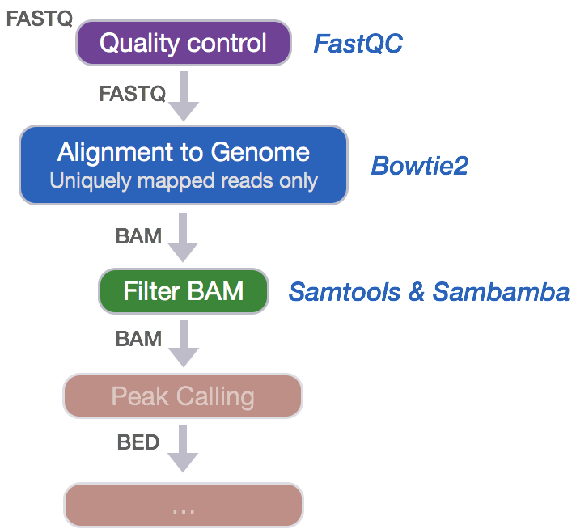

Approximate time: 45 minutes

## Learning Objectives

* Perform alignment of reads to the genome using Bowtie2
* Examining a SAM file and understanding the information stored in it
* Filtering aligned reads to keep only uniquely mapped ones


## Quality control of raw sequencing data

After receiving the raw FASTQ files from the sequencing facility, the quality of the data should be explored, similar to other NGS analyses. We have explored the sequencing quality using the FastQC tool to ensure the quality of the data is good prior to moving on to alignment. To explore on your own, we have the FastQC lesson for ChIP-seq data [available](https://hbctraining.github.io/In-depth-NGS-Data-Analysis-Course/sessionV/lessons/02_QC_FASTQC.html). 



## Alignment to Genome

After assessing the quality of the raw sequence data, we can move on to perform alignment of the reads to the genome using [Bowtie2](http://bowtie-bio.sourceforge.net/bowtie2/manual.shtml). Bowtie2 is a **fast and accurate alignment tool** that indexes the genome with an FM Index based on the Burrows-Wheeler Transform method to keep memory requirements low for the alignment process. *Bowtie2* supports gapped, local and paired-end alignment modes and works best for reads that are **at least 50 bp** (shorter read lengths should use Bowtie1). 

By default, Bowtie2 will perform a global *end-to-end read alignment*, which is best for quality-trimmed reads. However, it also has a local alignment mode, which will perform soft-clipping for the removal of poor quality bases or adapters from untrimmed reads. We will use this option since we did not trim our reads.

> _**NOTE:** Our reads are only 36 bp, so technically we should explore alignment with [bwa](http://bio-bwa.sourceforge.net/) or Bowtie1 to see if it is better. However, since it is rare that you will have sequencing reads with less than 50 bp, we will show you how to perform alignment using Bowtie2._


> #### How do other aligners compare?
> In this workshop we are using Bowtie2 to align our reads, but there are a number of other options. We have explored the use of [bwa](http://bio-bwa.sourceforge.net/) for ChIP-seq analysis and found some differences. For **bwa**, the mapping rates are higher (~ 2%), with an equally similar increase in the number of duplicate mappings identified. Post-filtering this translates to a significantly higher number of mapped reads and results in a much larger number of peaks being called (30% increase). When we compare the peak calls generated from the different aligners, the **bwa** peak calls are a superset of those called from the Bowtie2 aligments. Whether or not these additional peaks are true positives, is something that is yet to be determined. 

### Creating a Bowtie2 index

To perform the Bowtie2 alignment, a genome index is required. The index is analagous to the index in the back of a book. By indexing the genome, we have organized it in a manner that now allows for efficient search and retrieval of matches of the query (sequence read) to the genome. **We previously generated the genome indices for you**, and they exist in the `reference_data` directory.

However, if you needed to create a genome index yourself, you would use the following command:

```bash
# DO NOT RUN

bowtie2-build <path_to_reference_genome.fa> <prefix_to_name_indexes>
```

### Aligning reads to the genome with Bowtie2

Since we have our indices already created, we can get started with read alignment. Change directories to the `bowtie2` folder:

```bash
$ cd ~/chipseq/results/bowtie2
```

Now let's load the module. We can find out more on the module on O2:

```bash
$ module spider bowtie2
```
You will notice that before we load this module we also need to load the gcc compiler (as will be the case for many of the NGS analysis tools on O2. Always check `module spider` first.)

```bash
$ module load gcc/6.2.0 bowtie2/2.2.9
```

We will perform alignment on our single raw FASTQ file, `H1hesc_Input_Rep1_chr12.fastq`. Details on Bowtie2 and its functionality can be found in the [user manual](http://bowtie-bio.sourceforge.net/bowtie2/manual.shtml); we encourage you to peruse through to get familiar with all available options.

The basic options for aligning reads to the genome using Bowtie2 are:

* `-p`: number of processors / cores
* `-q`: reads are in FASTQ format
* `--local`: local alignment feature to perform soft-clipping
* `-x`: /path/to/genome_indices_directory
* `-U`: /path/to/FASTQ_file
* `-S`: /path/to/output/SAM_file

```bash
$ bowtie2 -p 2 -q --local \
-x ~/chipseq/reference_data/chr12 \
-U ~/chipseq/raw_data/H1hesc_Input_Rep1_chr12.fastq \
-S ~/chipseq/results/bowtie2/H1hesc_Input_Rep1_chr12_aln_unsorted.sam
```

## Alignment file format: SAM/BAM

The output we requested from the Bowtie2 aligner is an unsorted SAM file, also known as **Sequence Alignment Map format**. The SAM file, is a **tab-delimited text file** that contains information for each individual read and its alignment to the genome. While we will go into some features of the SAM format, the paper by [Heng Li et al](http://bioinformatics.oxfordjournals.org/content/25/16/2078.full) provides a lot more detail on the specification.

The file begins with a **header**, which is optional. The header is used to describe source of data, reference sequence, method of alignment, etc., this will change depending on the aligner being used. Each section begins with character ‘@’ followed by **a two-letter record type code**.  These are followed by two-letter tags and values. Example of some common sections are provided below:

```
@HD  The header line
VN: format version
SO: Sorting order of alignments

@SQ  Reference sequence dictionary
SN: reference sequence name
LN: reference sequence length
SP: species

@PG  Program
PN: program name
VN: program version
```

Following the header is the **alignment section**. Each line that follows corresponds to alignment information for a single read. Each alignment line has **11 mandatory fields for essential mapping information** and a variable number of other fields for aligner specific information. 


An example read mapping is displayed above. *Note that the example above spans two lines, but in the file it is a single line.* Let's go through the fields one at a time. 

- **`QNAME`:** Query name or read name - this is the same read name present in the header of the FASTQ file
- **`FLAG`:** numerical value providing information about read mapping and whether the read is part of a pair.
 
  > **NOTE:** The information stored inside the FLAG is additive based on the following information being TRUE or FALSE:
  > 
  > | Flag | Description |
  > | ------:|:----------------------:|
  > | 1 | read is mapped |
  > | 2 | read is mapped as part of a pair |
  > | 4 | read is unmapped |
  > | 8 | mate is unmapped |
  > | 16| read reverse strand|
  > | 32 | mate reverse strand |
  > | 64 | first in pair |
  > | 128 | second in pair |
  > | 256 | not primary alignment |
  > | 512 | read fails platform/vendor quality checks |
  > | 1024| read is PCR or optical duplicate |
  > 
  > * For a given alignment, each of these flags are either **on or off** indicating the condition is **true or false**. 
  > * The `FLAG` is a combination of all of the individual flags (from the table above) that are true for the alignment 
  > * The beauty of the flag values is that **any combination of flags can only result in one sum**.
  > 
  > **There are tools that help you translate the bitwise flag, for example [this one from Picard](https://broadinstitute.github.io/picard/explain-flags.html)**

- **`RNAME`:** is the reference sequence name, giving the chromosome to which the read mapped. The example read is from chromosome 1 which explains why we see 'chr1'. 
- **`POS`:** refers to the 1-based leftmost position of the alignment. 
- **`MAPQ`:** is giving us the alignment quality, the scale of which will depend on the aligner being used. 
- **`CIGAR`:** is a sequence of letters and numbers that represent the *edits or operations* required to match the read to the reference. The letters are operations that are used to indicate which bases align to the reference (i.e. match, mismatch, deletion, insertion), and the numbers indicate the associated base lengths for each 'operation'.

   | Operation | Description |
   | ------:|:----------------------:|
   | M | sequence match or mismatch |
   | I | insertion to the reference |
   | D | deletion from reference |
   | N | skipped region from the reference|


Now to the remaning fields in our SAM file:


The next three fields are more pertinent to paired-end data. 

- **`MRNM`:** is the mate reference name. 
- **`MPOS`:** is the mate position (1-based, leftmost). 
- **`ISIZE`:** is the inferred insert size.

Finally, you have the raw sequence data from the original FASTQ file stored for each read. 
- **`SEQ`:** is the raw sequence
- **`QUAL`:** is the associated quality values for each position in the read.

Let's take a quick peek at our SAM file that we just generated. Since it is just a text file, we can browse through it using `less`:

``` bash
$ less H1hesc_Input_Rep1_chr12_aln_unsorted.sam
```

**Does the information you see line up with the fields we described above?**

## Filtering reads

An important issue with ChIP-seq data concerns the inclusion of multiple mapped reads (reads mapped to multiple loci on the reference genome). **Allowing for multiple mapped reads increases the number of usable reads and the sensitivity of peak detection; however, the number of false positives may also increase** [[1]](https://www.ncbi.nlm.nih.gov/pubmed/21779159/). Therefore we need to filter our alignment files to **contain only uniquely mapping reads** in order to increase confidence in site discovery and improve reproducibility. Since there is no parameter in Bowtie2 to keep only uniquely mapping reads, we will need to perform the following steps to generate alignment files containing only the uniquely mapping reads:

1. Change alignment file format from SAM to BAM
2. Sort BAM file by read coordinate locations
3. Filter to keep only uniquely mapping reads (this will also remove any unmapped reads)

### 1. Changing file format from SAM to BAM

While the SAM alignment file output by Bowtie2 is human readable, we need a BAM alignment file for downstream tools. Therefore, we will use [Samtools](http://samtools.github.io) to convert the file formats.

To use `samtools` we will need to load the module:

```bash
$ module load gcc/6.2.0 # you may not need to load this if you are working in the same session from Bowtie2
$ module load samtools/1.3.1
```

The command we will use is `samtools view` with the following parameters:

* `-h`: include header in output
* `-S`: input is in SAM format
* `-b`: output BAM format
* `-o`: /path/to/output/file

```bash
$ samtools view -h -S -b \
-o H1hesc_Input_Rep1_chr12_aln_unsorted.bam \
H1hesc_Input_Rep1_chr12_aln_unsorted.sam
```

You can find additional parameters for the samtools functions in the [manual](http://www.htslib.org/doc/samtools-1.2.html).

### 2. Sorting BAM files by genomic coordinates

Before we can filter to keep the uniquely mapping reads, we need to sort our BAM alignment files by genomic coordinates (instead of by name). To perform this sort, we will use [Sambamba](http://lomereiter.github.io/sambamba/index.html), which is a tool that quickly processes BAM and SAM files.

The command we will use is `sambamba sort` with the following parameters:

* `-t`: number of threads / cores
* `-o`: /path/to/output/file

```bash
$ sambamba sort -t 2 \
-o H1hesc_Input_Rep1_chr12_aln_sorted.bam \
H1hesc_Input_Rep1_chr12_aln_unsorted.bam 
```

> **NOTE: This tool is not available as a module on O2.** You will only be able to use this as part of the tools available in the `bcbio` pipeline. In a previous lesson, you had added this to your $PATH by modifying your `.bashrc` file. **If the command above does not work for you, run this line below:**
> 
> `export PATH=/n/app/bcbio/tools/bin:$PATH`


We could have also used `samtools` to perform the above sort, however using `sambamba` gives us dual functionality. List the contents of the directory -- what do you see? The advantage to using `sambamba` is that along with the newly sorted file, an index file is generated. If we used `samtools` this would have been a two-step process.

### 3. Filtering uniquely mapping reads

Finally, we can filter the BAM to keep only uniquely mapping reads. We will use the `sambamba view` command with the following parameters:

* `-t`: number of threads / cores
* `-h`: print SAM header before reads
* `-f`: format of output file (default is SAM)
* `-F`: set [custom filter](https://github.com/lomereiter/sambamba/wiki/%5Bsambamba-view%5D-Filter-expression-syntax) - we will be using the filter to remove duplicates, multimappers and unmapped reads.

```bash
$ sambamba view -h -t 2 -f bam \
-F "[XS] == null and not unmapped  and not duplicate" \
H1hesc_Input_Rep1_chr12_aln_sorted.bam > H1hesc_Input_Rep1_chr12_aln.bam
```
We filtered out unmapped reads by specifying in the filter `not unmapped`, and duplicates with `not duplicate`. Also, among the reads that were aligned, we filtered out multimappers by specifying `[XS] == null`. 'XS' is a tag generated by Bowtie2 that gives an alignment score for the second-best alignment, and it is only present if the read is aligned and more than one alignment was found for the read.

Now that the alignment files contain only uniquely mapping reads, we are ready to perform peak calling.

> _**NOTE:** After performing read alignment, it's useful to generate QC metrics for the alignment using tools such as [MultiQC](http://multiqc.info) prior to moving on to the next steps of the analysis._

> ### Filtering out Blacklisted Regions
> Although we will not perform this step, it is common practice to apply an additional level of filtering to our BAM files. That is, we remove alignments that occur with defined Blacklisted Regions.
> 
> Blacklisted regions represent artifact regions that tend to show artificially high signal (excessive unstructured anomalous reads mapping). These regions are often found at specific types of repeats such as centromeres, telomeres and satellite repeats and typically appear uniquely mappable so simple mappability filters applied above do not remove them. The ENCODE and modENCODE consortia have compiled blacklists for various species and genome versions including human, mouse, worm and fly. These blacklisted regions (coordinate files) can be filtered out from our alignment files before proceeding to peak calling.
> 
> We will revisit this in more detail when we [discuss QC metrics](https://hbctraining.github.io/Intro-to-ChIPseq/lessons/07_QC_quality_metrics.html) in a later lesson.

***
*This lesson has been developed by members of the teaching team at the [Harvard Chan Bioinformatics Core (HBC)](http://bioinformatics.sph.harvard.edu/). These are open access materials distributed under the terms of the [Creative Commons Attribution license](https://creativecommons.org/licenses/by/4.0/) (CC BY 4.0), which permits unrestricted use, distribution, and reproduction in any medium, provided the original author and source are credited.*

