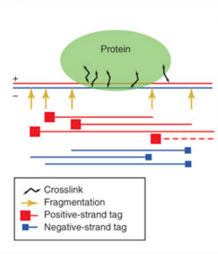
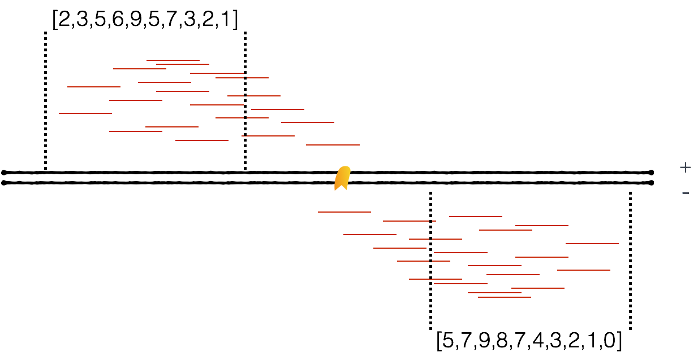
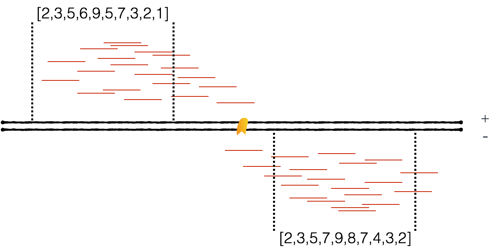
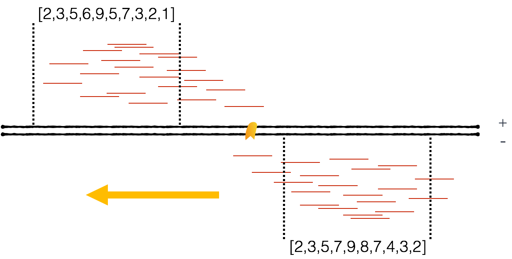
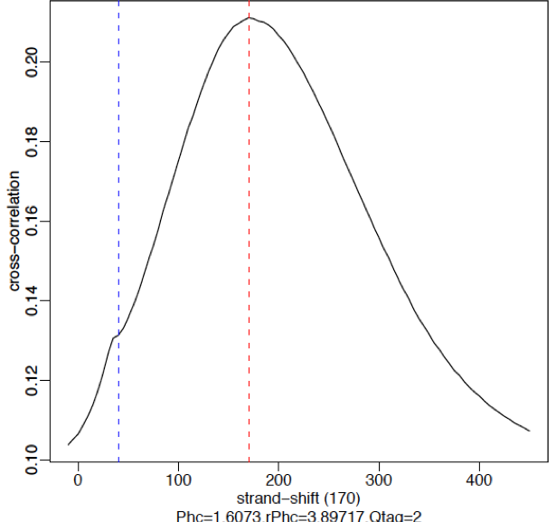
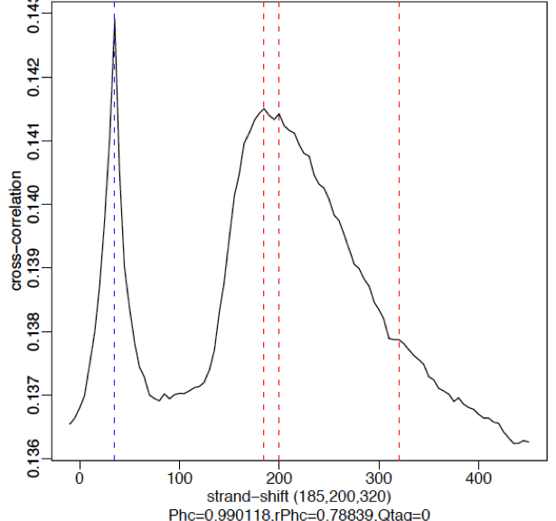
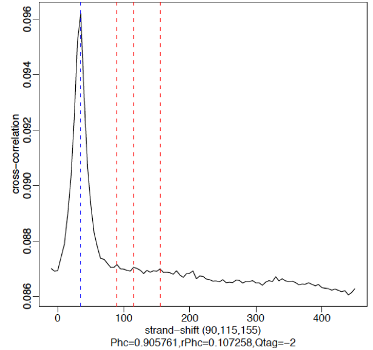
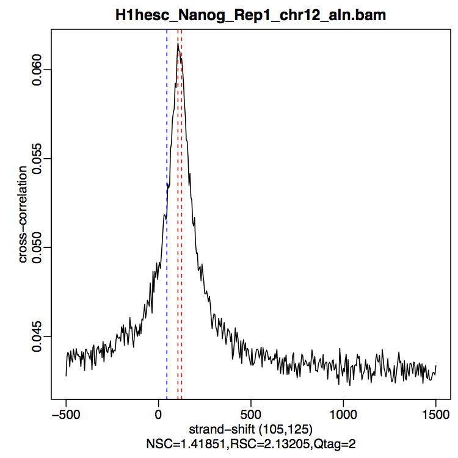

Approximate time: 1.5 hours

## Learning Objectives

* Discussing sources of low quality ChIP-seq data
* Understanding strand cross-correlation
* Using `phantompeakqualtools` to compute cross-correlation and associated QC metrics
* Evaluating the cross-correlation plot

## ChIP-Seq quality assessment

Prior to performing any downstream analyses with the results from a peak caller, it is best practice to assess the quality of your ChIP-Seq data. What we are looking for is good	quality	ChIP-seq enrichment over background.


## Strand cross-correlation

A very useful ChIP-seq quality metric that is independent of peak calling is strand cross-correlation. It is based on the fact that a high-quality ChIP-seq experiment will produce significant clustering of enriched DNA sequence tags at locations bound by the protein of interest, that present as a bimodal enrichment of reads on the forward and reverse strands.

During the ChIP-seq experiment, the DNA is fragmented and the protein-bound fragments are immunoprecipitated. This generates genome fragments that contain the protein-bound region. However, the protein-bound region is not necessarily in the middle of all of the fragments, and 



The cross-correlation metric is computed as the **Pearson's linear correlation between the Crick strand and the Watson strand, after shifting Watson by k base pairs.** Using a small genomic window as an example, let's walk through the details of the cross-correlation below.

**At strand shift of zero, the Pearson correlation between the two vectors is 0.539.**



**At strand shift of 5bp, the Pearson correlation between the two vectors is 0.931**



**Keep shifting the vectors and for each strand shift compute a correlation value.** 



In the end, we will have a table of values mapping each base pair shift to a Pearson correlation value. This is computed per chromosome and values are multiplied by a scaling factor and then summed across all chromosomes. We can then **plot cross-correlation values (y-axis) against the shift value (x-axis)** to generate a cross-correlation plot.

The cross-correlation plot **typically produces two peaks**: a peak of enrichment corresponding to the predominant **fragment length** (highest correlation value) and a peak corresponding to the **read length** (“phantom” peak).

High-quality ChIP-seq data sets tend to have a larger fragment-length peak compared with the read-length peak. An example of a **strong signal** is shown below using data from **CTCF (zinc-finger transcription factor)** in human cells. With a good antibody, transcription factors will typically result in 45-60k peaks. The red vertical line shows the dominant peak at the true peak shift, with a small bump at the blue vertical line representing the read length.

 


An example of **weaker signal** is demonstrated below with a **Pol2** data. Here, this particular antibody is not very efficient and these are broad scattered peaks. We observe two peaks in the cross-correlation profile: one at the true peak shift (~185-200 bp) and the other at read length. For weak signal datasets, the **read-length peak will start to dominate**.




A failed experiment will resemble a cross-correlation plot using **input only**, in which we observe little or no peak for fragment length. Note in the example below the **strongest peak is the blue line (read length)** and there is basically no other significant peak in the profile. The absence of a peak is expected since there should be no significant clustering of fragments around specific target sites (except potentially weak biases in open chromatin regions depending on the protocol used). The read-length peak occurs due to unique mappability properties of the mapped reads.

 


### Cross-correlation quality metrics

Using the cross-correlation plot we can compute metrics for assessing signal-to-noise ratios in a ChIP-seq experiment and to ensure the fragment length is accurate based on the experimental design. Poor signal-to-noise and inaccurate fragment lengths can indicate problems with the ChIP-Seq data. These metrics are described in more detail below:

#### Normalized strand cross-correlation coefficent (NSC):

The ratio of the maximal cross-correlation value divided by the background cross-correlation (minimum cross-correlation value over all possible strand shifts). **Higher values indicate more enrichment, values less than 1.1 are relatively low NSC scores, and the minimum possible value is 1 (no enrichment).** Datasets with NSC values much less than 1.05 tend to have low signal to noise or few peaks (this could be biological eg.a factor that truly binds only a few sites in a particular tissue type or it could be due to poor quality).

#### Relative strand cross-correlation coefficient (RSC):

The ratio of the fragment-length cross-correlation value minus the background cross-correlation value, divided by the phantom-peak cross-correlation value minus the background cross-correlation value. **The minimum possible value is 0 (no signal), highly enriched experiments have values greater than 1, and values much less than 1 may indicate low quality.** RSC values significantly low (< 0.8) tend to have low signal to noise and can be due to failed and poor quality ChIP, low read sequence quality and hence lots of mismappings, shallow sequencing depth or a combination of these. Like the NSC, datasets with few binding sites (< 200) which is biologically justifiable also show low RSC scores.


## `phantompeakqualtools` 

The [`phantompeakqualtools`](https://code.google.com/archive/p/phantompeakqualtools/) package is a tool used to compute enrichment and quality measures for ChIP-Seq data [[1](http://www.g3journal.org/content/4/2/209.full)]. We will be using the package to compute the predominant insert-size (fragment length) based on strand cross-correlation peak and data quality measures based on relative phantom peak.

### Set up

The `phantompeakqualtools` package is written as an R script, that uses `samtools` as a dependency. The package has various options that need to be specified when running from the command line. To get set up, we will need to start an interactive session, load the necessary modules and set up the directory structure:

```
$ bsub -Is -n 6 -q interactive bash

$ module load stats/R/3.2.1 seq/samtools/1.2

$ cd ~/ngs_course/chipseq/results

$ mkdir chip_qc

$ cd chip_qc
```

### Downloading `phantompeakqualtools`

To use this `phantompeakqualtools` package, we need to download it from the project website. On the [project website](https://code.google.com/archive/p/phantompeakqualtools/), click on the *Downloads* option on the left-hand side of the page. The *Downloads* page has all updates for the package, with the most recent being from 2013. 

Right-click on the link for the most recent update, and copy the link.

Download the `phantompeakqualtools` to your directory using `wget`:

```
$ wget https://storage.googleapis.com/google-code-archive-downloads/v2/code.google.com/phantompeakqualtools/ccQualityControl.v.1.1.tar.gz

$ ls
```

> **NOTE:** *You may be asked to choose a mirror. If so, just choose a location nearest to where you are located (i.e. in the northeast). Some mirrors can be slower than others for downloads depending on the server speed and distance to the server.*

You should see `ccQualityControl.v.1.1.tar.gz` appear in the folder. This is a compressed folder, to extract the contents we use the `tar -xzf` command:

```
$ tar -xzf ccQualityControl.v.1.1.tar.gz
```
The `tar` command offers a simple way to compress and uncompress entire directories. We are using the command to uncompress the `ccQualityControl.v.1.1.tar.gz` directory. 

The options included are:

`-x`: extract a tar archive (or tarball) file

`-z`: the file is a compressed gzip archive file

`-f`: file name of archive file (needs to precede the file name)

> **NOTE:** *To compress a directory, you would issue the same command, but replace -x with -c, which specifies to create a new tar archive (or tarball) file, and after the name of the tar file you would name the directory to be compressed*

You should now see a `phantompeakqualtools` folder. Let's explore the contents a bit:

```
$ cd phantompeakqualtools

$ ls -l
```
There should also be a `README.txt` which contains all the commands, options, and output descriptions. Let's check out the `README.txt`:

```
$ less README.txt
```
Note that there are two R scripts that are described in the README file. Both will compute the fragment length, and data quality characteristics based on cross-correlation analysis, but one is for use in situations where the duplicates have been removed (`run_spp_nodups.R`). This is the script we will be using.

### Installing R libraries

In the README you will have noticed an *INSTALLATION* section. We will need to install the R package, `caTools`, into our personal R library to run the script. To do this, first open up R:

```
$ R
```

Use the install.packages() function to install `caTools`:

```
> install.packages("caTools", lib="~/R/library")

# Choose a mirror near to your location (i.e. northeast). I chose the PA 1 mirror, which is number 117.

> quit()

```
 > **NOTE:** We do not need to install `spp` because the R module we have loaded has the package pre-installed.

### Running `phantompeakqualtools`

To obtain quality measures based on cross-correlation plots, we will be running the `run_spp_nodups.R` script from the command line which is a package built on SPP. This modified SPP package allows for determination of the cross-correlation peak and predominant fragment length in addition to peak calling. We will be using this package solely for obtaining these quality measures (no peak calling). 

The options that we will be using include:

* `-c`: full path and name (or URL) of tagAlign/BAM file
* `-savp`: save cross-correlation plot
* `-out`: will create and/or append to a file several important characteristics of the dataset described in more detail below.

```
## DO NOT RUN THIS
## THIS SCRIPT IS FOR COMPUTING METRICS ON A SINGLE FILE
$ Rscript run_spp.R -c=<tagAlign/BAMfile> -savp -out=<outFile>
```
>_**NOTE:** Even though the script is called `run_spp.R`, we aren't actually performing peak calling with SPP. 

From within the `phantompeakqualtools` directory, we will create output directories and use a 'for loop' to **run the script on every Nanog and Pouf51 BAM file**:

```
$ mkdir -p logs qual

$ for bam in ../../bowtie2/*Nanog*aln.bam ../../bowtie2/*Pou5f1*aln.bam
do 
bam2=`basename $bam _aln.bam`
Rscript run_spp_nodups.R -c=$bam -savp -out=qual/${bam2}.qual > logs/${bam2}.Rout
done
```

The for loop generates **three output files**. The **quality metrics** are written in a tab-delimited text file, and the **log files** contains the standard output text. A third file is created in the same directory as the BAM files. These are pdf files that contain the **cross-correlation** plot for each sample. Let's move those files into the appropriate output directory:

```
$ mv ../../bowtie2/*pdf qual  

```

To visualize the quality metrics (.qual) files more easily, we will concatenate the files together to create a single summary file that you can move over locally and open up with Excel.

```
$ cat qual/*qual > qual/phantompeaks_summary.xls
```
Let's use Filezilla or `scp` move the summary file over to our local machine for viewing. Open up the file in Excel and take a look at our NSC and RSC values. 

### `phantompeakqualtools`: quality metrics output

The qual files are tab-delimited with the columns containing the following information:

- COL1: Filename: tagAlign/BAM filename 
- COL2: numReads: effective sequencing depth i.e. total number of mapped reads in input file 
- COL3: estFragLen: comma separated strand cross-correlation peak(s) in decreasing order of correlation. (**NOTE:** The top 3 local maxima locations that are within 90% of the maximum cross-correlation value are output. In almost all cases, the top (first) value in the list represents the predominant fragment length.) 
- COL4: corr_estFragLen: comma separated strand cross-correlation value(s) in decreasing order (col2 follows the same order) 
- COL5: phantomPeak: Read length/phantom peak strand shift 
- COL6: corr_phantomPeak: Correlation value at phantom peak 
- COL7: argmin_corr: strand shift at which cross-correlation is lowest 
- COL8: min_corr: minimum value of cross-correlation 
- COL9: Normalized strand cross-correlation coefficient (NSC) = COL4 / COL8 
- COL10: Relative strand cross-correlation coefficient (RSC) = (COL4 - COL8) / (COL6 - COL8) 
- COL11: QualityTag: Quality tag based on thresholded RSC (codes: -2:veryLow,-1:Low,0:Medium,1:High,2:veryHigh)

> **NOTE:** The most important metrics we are interested in are the values in columns 9 through 12, however these numbers are computed from values in the other columns.

**How do the values compare to the thresholds mentioned above?** All samples have quite high NSC values indicating more enrichment, a good signal to noise and a fair number of peaks. Nanog-rep2 has a comparably higher NSC value which might explain the increased number of peaks for that sample compared to the others. The RSC and quality tags further indicate good chip signal and a quality IP, yielding a very high quality tag. Based on these metrics, the samples look good for further analysis.


### Cross-correlation plots

The cross-correlation plots show the best estimate for strand shift and the cross-correlation values. This file can be viewed by transferring it to your local machine using FileZilla. Copy `H1hesc_Nanog_Rep1_chr12_aln.pdf` to your machine to view the strand shift. The cross correlation peak shows the highest cross-correlation at fragment length 105, **How does this compare to the one we generated using MACS?**.



***
*This lesson has been developed by members of the teaching team at the [Harvard Chan Bioinformatics Core (HBC)](http://bioinformatics.sph.harvard.edu/). These are open access materials distributed under the terms of the [Creative Commons Attribution license](https://creativecommons.org/licenses/by/4.0/) (CC BY 4.0), which permits unrestricted use, distribution, and reproduction in any medium, provided the original author and source are credited.*
