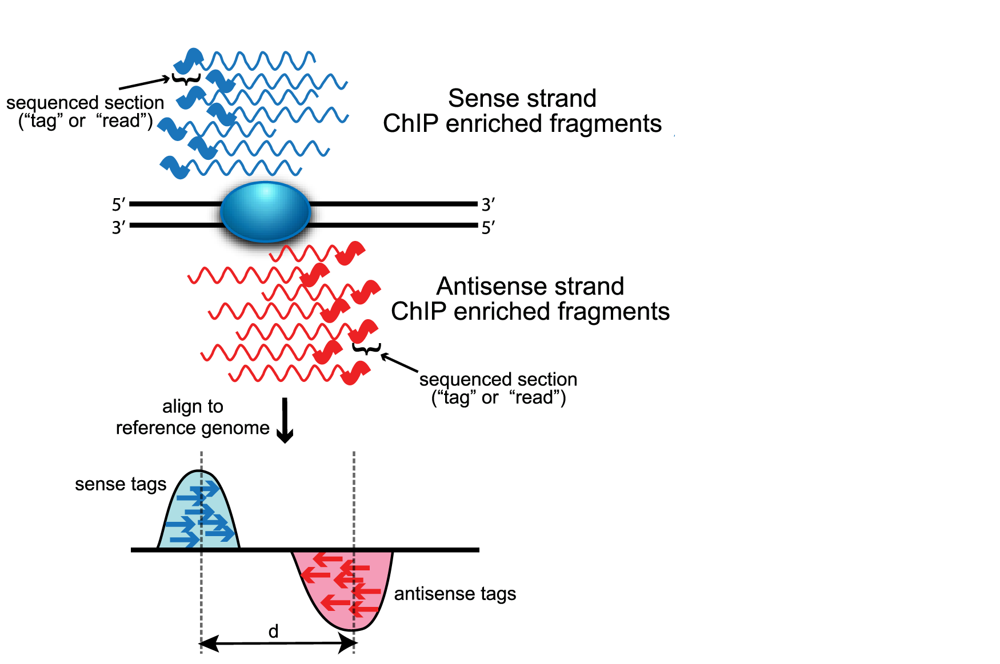
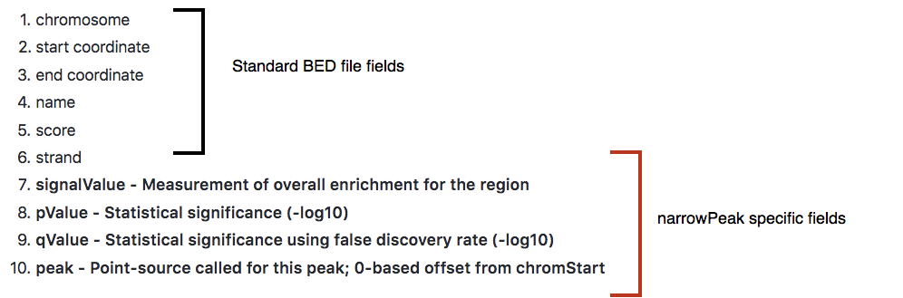

Contributors: Meeta Mistry, Radhika Khetani

Approximate time: 80 minutes

## Learning Objectives

* Describe the different components of the MACS2 peak calling algorithm
* Describe the parameters involved in running MACS2
* List and describe the output files from MACS2

# Peak Calling

Peak calling, the next step in our workflow, is a computational method used to identify areas in the genome that have been enriched with aligned reads as a consequence of performing a ChIP-sequencing experiment. 


For ChIP-seq experiments, what we observe from the alignment files is a **strand asymmetry with read densities on the +/- strand, centered around the binding site**. The 5' ends of the selected fragments will form groups on the positive- and negative-strand. The distributions of these groups are then assessed using statistical measures and compared against background (input or mock IP samples) to determine if the site of enrichment is likely to be a real binding site.

</div>

*Image source: [Wilbanks and Faccioti, PLoS One 2010](https://journals.plos.org/plosone/article?id=10.1371/journal.pone.0011471)*

There are various tools that are available for peak calling. One of the more commonly used peak callers is MACS2, and we will demonstrate it in this session. *Note that in this Session the term 'tag' and sequence 'read' are used interchangeably.*

> **NOTE:** Our dataset is investigating two transcription factors and so our focus is on identifying short degenerate sequences that present as punctate binding sites. ChIP-seq analysis algorithms are specialized in identifying one of **two types of enrichment** (or have specific methods for each): **broad peaks** or broad domains (i.e. histone modifications that cover entire gene bodies) or **narrow peaks** (i.e. a transcription factor binding). Narrow peaks are easier to detect as we are looking for regions that have higher amplitude and are easier to distinguish from the background, compared to broad or dispersed marks. There are also 'mixed' binding profiles which can be hard for algorithms to discern. An example of this is the binding properties of PolII, which binds at promotor and across the length of the gene resulting in mixed signals (narrow and broad).

## MACS2

A commonly used tool for identifying transcription factor binding sites is named [Model-based Analysis of ChIP-seq (MACS)](https://github.com/taoliu/MACS). The [MACS algorithm](http://genomebiology.biomedcentral.com/articles/10.1186/gb-2008-9-9-r137) captures the influence of genome complexity to evaluate the significance of enriched ChIP regions. Although it was developed for the detection of transcription factor binding sites it is also suited for larger regions.

MACS improves the spatial resolution of binding sites through **combining the information of both sequencing tag position and orientation.** MACS can be easily used either for the ChIP sample alone, or along with a control sample which increases specificity of the peak calls. The MACS workflow is depicted below. In this lesson, we will describe the steps in more detail.


### Removing redundancy

MACS provides different options for dealing with **duplicate tags** at the exact same location, that is tags with the **same coordination and the same strand**. The default is to keep a single read at each location. The `auto` option, which is very commonly used, tells MACS to calculate the maximum tags at the exact same location based on binomal distribution using 1e-5 as the pvalue cutoff. An alternative is to set the `all` option, which keeps every tag. If an `integer` is specified, then at most that many tags will be kept at the same location. This redundancy is consistently applied for both the ChIP and input samples.

> **Why worry about duplicates?**
Reads with the same start position are considered duplicates. These duplicates can arise from experimental artifacts, but can also contribute to genuine ChIP-signal.
>
> * **The bad kind of duplicates:** If initial starting material is low this can lead to overamplification of this material before sequencing. Any biases in PCR will compound this problem and can lead to artificially enriched regions. Also blacklisted (repeat) regions with ultra high signal will also be high in duplicates. Masking these regions prior to analysis can help remove this problem.
> * **The good kind of duplicates:** Duplicates will also exist within highly efficient (or even inefficient ChIP) when deeply sequenced. Removal of these duplicates can lead to a saturation and so underestimation of the ChIP signal.
>
> **The take-home:** Consider your enrichment efficiency and sequencing depth. But, because we cannot distinguish between the good and the bad, best practice is to remove duplicates prior to peak calling.  Retain duplicates for differential binding analysis. Also, if you are expecting binding in repetitive regions keep duplicates and multiple mappers.

### Modeling the shift size

The tag density around a true binding site should show a **bimodal enrichment pattern** (or paired peaks). MACS takes advantage of this bimodal pattern to empirically model the shifting size to better locate the precise binding sites.

To find paired peaks to **build the model**, MACS first scans the whole dataset searching for highly significant enriched regions. *This is done only using the ChIP sample!* Given a sonication size (`bandwidth`) and a high-confidence fold-enrichment (`mfold`), MACS slides two `bandwidth` windows across the genome to find regions with **tags more than `mfold` enriched relative to a random tag genome distribution**. 


MACS randomly **samples 1,000 of these high-quality peaks**, separates their positive and negative strand tags, and aligns them by the midpoint between their centers. The **distance between the modes of the two peaks in the alignment is defined as 'd'** and represents the estimated fragment length. MACS shifts all the tags by d/2 toward the 3' ends to the most likely protein-DNA interaction sites.

### Scaling libraries

For experiments in which sequence depth differs between input and treatment samples, MACS linearly scales the **total control tag count to be the same as the total ChIP tag count**. The default behaviour is for the larger sample to be scaled down.

### Effective genome length

To calculate λBG from tag count, MAC2 requires the **effective genome size** or the size of the genome that is mappable. Mappability is related to the uniqueness of the k-mers at a  particular position the genome. Low-complexity and repetitive regions have low uniqueness, which means low mappability. Therefore we need to provide the effective genome length to **correct for the loss of true signals in low-mappable regions**.


### Peak detection

After MACS shifts every tag by *d/2*, it then slides across the genome using a window size of *2d* to find candidate peaks. The tag distribution along the genome can be modeled by a Poisson distribution. The Poisson is a one parameter model, where the parameter **λ is the expected number of reads in that window**.


Instead of using a uniform λ estimated from the whole genome, MACS uses a dynamic parameter, λlocal, defined for each candidate peak. The lambda parameter is estimated from the control sample and is deduced by **taking the maximum value across various window sizes:** 

**λlocal = max(λBG, λ1k, λ5k, λ10k).** 

In this way lambda captures the influence of local biases, and is **robust against occasional low tag counts at small local regions**. Possible sources for these biases include local chromatin structure, DNA amplification and sequencing bias, and genome copy number variation.


A region is considered to have a significant tag enrichment if the p-value  < 10e-5 (this can be changed from the default). This is a Poisson distribution p-value based on λ.

Overlapping enriched peaks are merged, and each tag position is extended 'd' bases from its center. The location in the peak with the highest fragment pileup, hereafter referred to as the summit, is predicted as the precise binding location. The ratio between the ChIP-seq tag count and λlocal is reported as the fold enrichment.

### Estimation of false discovery rate

Each peak is considered an independent test and thus, when we encounter thousands of significant peaks detected in a sample we have a multiple testing problem. In MACSv1.4, the FDR was determined empirically by exchanging the ChIP and control samples. However, in MACS2, p-values are now corrected for multiple comparison using the **Benjamini-Hochberg correction**.

## Running MACS2

We will be using the newest version of this tool, MACS2. The underlying algorithm for peak calling remains the same as before, but it comes with some enhancements in functionality. 

### Setting up

To run MACS2, we will first start an interactive session using 1 core (do this only if you don't already have one) and load the macs2 library:

```bash
$ srun --pty -p short -t 0-12:00 --mem 8G --reservation=HBC bash

$ module load gcc/6.2.0  python/2.7.12 macs2/2.1.1.20160309
```

We will also need to create a directory for the output generated from MACS2:

```bash
$ mkdir -p ~/chipseq/results/macs2
```

Now change directories to the `results` folder:

```bash
$ cd ~/chipseq/results/
```

> **NOTE:** If your automation script was successful, you should have alignment information for **all 6 files**. However, if you do not have these BAM files then you can copy them over using the command below:
> 
>`$ cp /n/groups/hbctraining/chip-seq/bowtie2/*.bam ~/chipseq/results/bowtie2/`

### MACS2 parameters

There are seven [major functions](https://github.com/taoliu/MACS#usage-of-macs2) available in MACS2 serving as sub-commands. We will only cover `callpeak` in this lesson, but you can use `macs2 COMMAND -h` to find out more, if you are interested.

`callpeak` is the main function in MACS2 and can be invoked by typing `macs2 callpeak`. If you type this command without parameters, you will see a full description of commandline options. Here is a shorter list of the commonly used ones: 

**Input file options**

* `-t`: The IP data file (this is the only REQUIRED parameter for MACS)
* `-c`: The control or mock data file
* `-f`: format of input file; Default is "AUTO" which will allow MACS to decide the format automatically.
* `-g`: mappable genome size which is defined as the genome size which can be sequenced; some precompiled values provided.

**Output arguments**

* `--outdir`: MACS2 will save all output files into speficied folder for this option
* `-n`: The prefix string for output files
* `-B/--bdg`: store the fragment pileup, control lambda, -log10pvalue and -log10qvalue scores in bedGraph files

**Shifting model arguments**

* `-s`: size of sequencing tags. Default, MACS will use the first 10 sequences from your input treatment file to determine it
* `--bw`: The bandwidth which is used to scan the genome ONLY for model building. Can be set to the expected sonication fragment size.
* `--mfold`: upper and lower limit for model building

**Peak calling arguments**

* `-q`: q-value (minimum FDR) cutoff
* `-p`: p-value cutoff (instead of q-value cutoff)
* `--nolambda`: do not consider the local bias/lambda at peak candidate regions
* `--broad`: broad peak calling

> **NOTE:** Relaxing the q-value does not behave as expected in this case since it is partially tied to peak widths. Ideally, if you relaxed the thresholds, you would simply get more peaks but with MACS2 relaxing thresholds also results in wider peaks.

Now that we have a feel for the different ways we can tweak our command, let's set up the command for our run on Nanog-rep1:

```
$ macs2 callpeak -t bowtie2/H1hesc_Nanog_Rep1_aln.bam \
	-c bowtie2/H1hesc_Input_Rep1_aln.bam \
 	-f BAM -g 1.3e+8 \
	-n Nanog-rep1 \
	--outdir macs2
```

The tool is quite verbose so you should see lines of text being printed to the terminal, describing each step that is being carried out. If that runs successfully, go ahead and **re-run the same command but this time let's capture that information into a log file using `2>` to re-direct the stadard error to file**:

```
$ macs2 callpeak -t bowtie2/H1hesc_Nanog_Rep1_aln.bam \
	-c bowtie2/H1hesc_Input_Rep1_aln.bam \
 	-f BAM -g 1.3e+8 \
	-n Nanog-rep1 \
	--outdir macs2 2> macs2/Nanog-rep1-macs2.log
```

Ok, now let's do the same peak calling for the rest of our samples:

```bash
macs2 callpeak -t bowtie2/H1hesc_Nanog_Rep2_aln.bam -c bowtie2/H1hesc_Input_Rep2_aln.bam -f BAM -g 1.3e+8 --outdir macs2 -n Nanog-rep2 2> macs2/Nanog-rep2-macs2.log
	 
macs2 callpeak -t bowtie2/H1hesc_Pou5f1_Rep1_aln.bam -c bowtie2/H1hesc_Input_Rep1_aln.bam -f BAM -g 1.3e+8 --outdir macs2 -n Pou5f1-rep1 2> macs2/Pou5f1-rep1-macs2.log
	 
macs2 callpeak -t bowtie2/H1hesc_Pou5f1_Rep2_aln.bam -c bowtie2/H1hesc_Input_Rep2_aln.bam -f BAM -g 1.3e+8 --outdir macs2 -n Pou5f1-rep2 2> macs2/Pou5f1-rep2-macs2.log

```

## MACS2 Output files

### File formats
Before we start exploring the output of MACS2, we'll briefly talk about the new file formats you will encounter.

**narrowPeak:**

A narrowPeak (.narrowPeak) file is used by the ENCODE project to provide called peaks of signal enrichment based on pooled, normalized (interpreted) data. It is a BED 6+4 format, which means the first 6 columns of a standard BED file  with **4 additional fields**:



**WIG format:**

Wiggle format (WIG) allows the display of continuous-valued data in a track format. Wiggle format is line-oriented. It is composed of declaration lines and data lines, and require a separate wiggle track definition line. There are two options for formatting wiggle data: variableStep and fixedStep. These formats were developed to allow the file to be written as compactly as possible.

**BedGraph format:**

The BedGraph format also allows display of continuous-valued data in track format. This display type is useful for probability scores and transcriptome data. This track type is similar to the wiggle (WIG) format, but unlike the wiggle format, data exported in the bedGraph format are preserved in their original state. For the purposes of visualization, these can be interchangeable.

### MACS2 output files

	$ cd macs2/
	
	$ ls -lh
	
Let's first move the log files to the `log` directory:

	$ mv *.log ../../logs/
	
Now, there should be 6 files output to the results directory for each of the 4 samples, so a total of 24 files:

* `_peaks.narrowPeak`: BED6+4 format file which contains the peak locations together with peak summit, pvalue and qvalue
* `_peaks.xls`: a tabular file which contains information about called peaks. Additional information includes pileup and fold enrichment
* `_summits.bed`: peak summits locations for every peak. To find the motifs at the binding sites, this file is recommended
* `_model.R`: an R script which you can use to produce a PDF image about the model based on your data and cross-correlation plot
* `_control_lambda.bdg`: bedGraph format for input sample
* `_treat_pileup.bdg`: bedGraph format for treatment sample

Let's first obtain a summary of how many peaks were called in each sample. We can do this by counting the lines in the `.narrowPeak` files:

	$ wc -l *.narrowPeak

We can also generate plots using the R script file that was output by MACS2. There is a `_model.R` script in the directory. Let's load the R module and run the R script in the command line using the `Rscript` command as demonstrated below:


	$ module load gcc/6.2.0 R/3.4.1
	
	$ Rscript Nanog-rep1_model.r
	
> **NOTE:** We need to load the `gcc/6.2.0` before loading R. You can find out which modules need to be loaded first by using module spider R/3.4.1` 
	
Now you should see a pdf file in your current directory by the same name. Create the plots for each of the samples and move them over to your laptop using `Filezilla`. 

Open up the pdf file for Nanog-rep1. The first plot illustrates **the distance between the modes from which the shift size was determined**. 


The second plot is the  **cross-correlation plot**. This is a graphical representation of the Pearson correlation of positive- and negative- strand tag densities, shifting the strands relative to each other by increasing distance. We will talk about this in more detail in the next lesson.

> **NOTE:** [SPP](http://www.nature.com.ezp-prod1.hul.harvard.edu/nbt/journal/v26/n12/full/nbt.1508.html) is another very commonly used tool for *narrow* peak calling. While we will not be going through the steps for this peak caller in this workshop, we do have [a lesson on SPP](https://github.com/hbctraining/In-depth-NGS-Data-Analysis-Course/blob/may2017/sessionV/lessons/peak_calling_spp.md) that we encourage you to browse through if you are interested in learning more.

***
*This lesson has been developed by members of the teaching team at the [Harvard Chan Bioinformatics Core (HBC)](http://bioinformatics.sph.harvard.edu/). These are open access materials distributed under the terms of the [Creative Commons Attribution license](https://creativecommons.org/licenses/by/4.0/) (CC BY 4.0), which permits unrestricted use, distribution, and reproduction in any medium, provided the original author and source are credited.*
