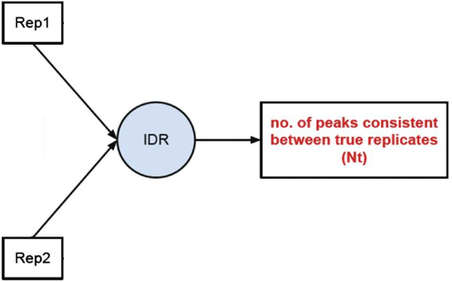
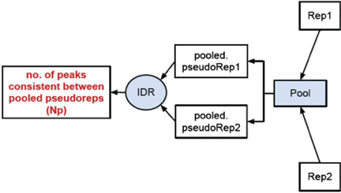
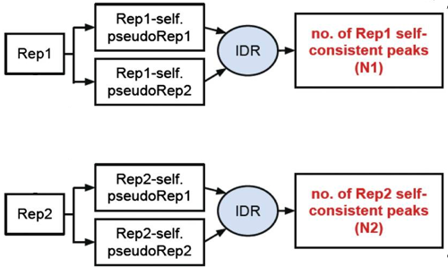

Contributors: Meeta Mistry, Radhika Khetani 

Approximate time: 75 minutes

## Learning Objectives

* Understanding the need for biological replicates
* Learning about the Irreproducibility Discovery Rate (IDR)
* Using the IDR pipeline to evaluate consistency between replicates


## Handling replicates in ChIP-Seq
 
As with any high-throughput experiment, a single assay is often subject to a substantial amount of variability. Thus, it is highly recommended to setup your experimental design with a minimum of 2-3 biological replicates. Presumably, two replicates measuring the same underlying biology should have high consistency but that is not always the case. In order to evaluate consistency between replicates **we require metrics that objectively assess the reproducibility of high-throughput assays**.

In our case, we have two replicates for each transcription factor. We want to consider the peaks that are consistent in both replicates before we can compare the peaks from the two transcription factors to one another.

 


Common methods for handling replicates includes taking overlapping peak calls across replicates and then assessing differences in binding regions. Additionally, there are more complex methods that employ statistical testing and evaluate the reproducibility between replicates. In this lesson we will cover both methods.

## Overlapping peaks

In this section, our goal is to determine what peaks are in common between the the two replicates for each factor (Nanog and Pou5f1). To perform this task we are going to use a suite of tools called `bedtools`.

### `bedtools`

The idea is that genome coordinate information can be used to perform relatively simple arithmetic, like combining, subsetting, intersecting, etc., to obtain all sorts of information. [bedtools](http://bedtools.readthedocs.org/en/latest/index.html) from [Aaron Quinlan's group](http://quinlanlab.org/) at University of Utah is an easy to use, extremely versatile tool that performs tasks of this nature. 


As the name implies, this suite of tools works with bed files; in addition it works with other file formats that have genome coordinate information. 


> **NOTE:** When working with multiple files to perform arithmetic on genomic coordinates, it is essential that all files have coordinate information for the same exact version of the genome!

### Setting up

Let's start an interactive session and change directories and set up a space for the resulting overlaps. 

	$ bsub -Is -q interactive bash
	
	$ cd ~/ngs_course/chipseq/results/

	$ mkdir bedtools
	
	
Load the modules for `bedtools` and `samtools`:
	
	$ module load seq/BEDtools/2.23.0
	
	$ module load seq/samtools/1.3
	
	
### Finding overlapping peaks between replicates
	
The `bedtools intersect` command only reports back the peaks that are overlapping with respect to the file defined as `a` in the command.


To find out more information on the parameters available when intersecting, use the help flag:

	$ bedtools intersect -h
	
The intersect tool evaluates A (file 1) and finds regions that overlap in B (file 2). We will add the `-wo` which indicates to write the original A (file 1) and B (file 2) entries plus the number of base pairs of overlap between the two features.

Let's start with the Nanog replicates: 

	$ bedtools intersect -a macs2/Nanog-rep1_peaks.narrowPeak -b macs2/Nanog-rep2_peaks.narrowPeak -wo > bedtools/Nanog-overlaps.bed

**How many overlapping peaks did we get?**

We'll do the same for the Pou5f1 replicates:

	$ bedtools intersect -a macs2/Pou5f1-rep1_peaks.narrowPeak -b macs2/Pou5f1-rep2_peaks.narrowPeak -wo > bedtools/Pou5f1-overlaps.bed

Note that we are working with subsetted data and so our list of peaks for each replicate is small. Thus, the overlapping peak set will be small as we found with both Nanog and Pou5f1. What is interesting though, is that although the individual peak lists are smaller for Pou5f1 samples, the overlapping replicates represent a higher proportion of overlap with respect to each replicate.


> **_Historical Note_:** A simpler heuristic for establishing reproducibility was previously used as a standard for depositing ENCODE data and was in effect when much of the currently available data was submitted. According to this standard, either 80% of the top 40% of the targets identified from one replicate using an acceptable scoring method should overlap the list of targets from the other replicate, or target lists scored using all available reads from each replicate should share more than 75% of targets in common. As with the current standards, this was developed based on experience with accumulated ENCODE ChIP-seq data, albeit with a much smaller sample size.


## Irreproducibility Discovery Rate (IDR)

[IDR](https://sites.google.com/site/anshulkundaje/projects/idr) is a framework developed by Qunhua Li and Peter Bickel's group that **compares a pair of ranked lists of regions/peaks and assigns values that reflect its reproducibility.** 

 

It is extensively used by the ENCODE and modENCODE projects and is part of their [ChIP-seq guidelines and standards](http://www.ncbi.nlm.nih.gov/pmc/articles/PMC3431496/). It has been established for submission of ChIP-seq data sets and have been constructed based on the historical experiences of ENCODE ChIP-seq data production groups.

### Why IDR?

* IDR avoids choices of initial cutoffs, which are not comparable for different callers 
* IDR does not depend on arbitrary thresholds and so all regions/peaks are considered. 
* It is based on ranks, so does not require the input signals to be calibrated or with a specific fixed scale (only order matters).


### Components of IDR

The IDR approach creates a curve, from which it then quantitatively assesses when the findings are no longer consistent across replicates. There are three main components: 

1) A **correspondence curve**: a graphical representation of matched peaks as you go down the ranked list. Qualitative, not adequate for selecting signals.

 

2) An **inference procedure**: summarizes the proportion of reproducible and irreproducible signals. Quantitative, using a copula mixture model.

> What proportion of identifications have a poor correspondence, i.e. falling into ”noise”?
> How consistent are the identifications before reaching breakdown?

3) **Irreproducible Discovery Rate (IDR)**: Derive a significance value from the inference procedure (#2) in a fashion similar to FDR, and can be used to control the level of irreproducibility rate when selecting signals.
i.e. 0.05 IDR means that peak has a 5% chance of being an irreproducible discovery


### The IDR pipeline

There are three main steps to the IDR pipeline:

1. Evaluate peak consistency between **true replicates**
2. Evaluate peak consistency between **pooled pseudo-replicates**
3. Evaluate **self-consistency** for each individual replicate

 

> This figures is taken from the [ENCODE ChIP-Seq Guidelines](http://www.ncbi.nlm.nih.gov/pmc/articles/PMC3431496/#box3).

_We will only be running Step 1 in this lesson, but will discuss steps 2 and 3 in a bit more detail._


## Running IDR

To run IDR *we should be using the full dataset*. The full BAM files can be downloaded from ENCODE, however for consistency we will continue with our subsetted data for this lesson.

Using MACS2, we used the chr12 BAM files and **called peaks using liberal cutoffs (p < 0.001)** than we would normally use for peak calling. This is recommended in the guidelines such that we have a larger set of peaks to begin with for each replicate. **Peaks were then sorted.** _You do NOT NEED TO RUN this code, we have already generated narrowPeak files for you!_

```
###DO NOT RUN THIS CODE###

# Call peaks using liberal cutoffs
macs2 callpeak -t treatFile.bam -c inputFile.bam -f BAM -g 1.3e+8 -n macs/NAME_FOR_OUPUT -B -p 1e-3  2> macs/NAME_FOR_OUTPUT_macs2.log

#Sort peak by -log10(p-value)
sort -k8,8nr NAME_OF_INPUT_peaks.narrowPeak > macs/NAME_FOR_OUPUT_peaks.narrowPeak 

```

> Peak callers tested with IDR:
> 
> * SPP - Works out of the box
> * MACS1.4 - DO NOT use with IDR
> * MACS2 - Works well with IDR with occasional problems of too many ties in ranks for low quality ChIP-seq data.
> * HOMER - developers have a detailed pipeline and code (in beta) for IDR analysis with HOMER at https://github.com/karmel/homer-idr 
> * PeakSeq - Run with modified PeakSeq parameters to obtain large number of peaks
> * HotSpot, MOSAiCS, GPS/GEM, …


### Setting up 

IDR is an open source tool available on [GitHub](https://github.com/nboley/idr). It is a Python program that has already been installed on Orchestra. The first thing we need to do is load the module to run IDR:

	$  module load seq/idr/2.0.2

> *NOTE:*  After loading the module, if your run the command `module list` you will notice that it has many dependencies which have also been loaded for you. 

Now let's move into the `chipseq/results` directory and create a new directory for the results of our IDR analysis.

	$ cd ngs_course/chipseq/results
	$ mkdir IDR

Copy over the sorted narrowPeak files for each replicate for Nanog and Pou5f1:

	$ cp /groups/hbctraining/ngs-data-analysis-longcourse/chipseq/idr/macs/*sorted* IDR/
	

### Peak consistency between true replicates

The first step is taking our replicates and evaluating how consistent they are with one another.



To run IDR we use the `idr` command followed by any necessary parameters. To see what parameters we have available to us, we can use:

	$ idr -h
	
For our run we will change only parameters associated with input and output files. We will also change the field on which we want to create ranks since the defaults are set for SPP peak calls. Parameters that pertain to the inference procedure are left as is, since the chosen defaults are what the developers believe are reasonable in the vast majority of cases. 

Move into the IDR directory:

	$ cd IDR

Let's start with the Nanog replicates:

```
$ idr --samples Nanog_Rep1_sorted_peaks.narrowPeak Nanog_Rep2_sorted_peaks.narrowPeak \
--input-file-type narrowPeak \
--rank p.value \
--output-file Nanog-idr \
--plot \
--log-output-file nanog.idr.log

``` 

And now with the Pou5f1 replicates:

```
$ idr --samples Pou5f1_Rep1_sorted_peaks.narrowPeak Pou5f1_Rep2_sorted_peaks.narrowPeak \
--input-file-type narrowPeak \
--rank p.value \
--output-file Pou5f1-idr \
--plot \
--log-output-file pou5f1.idr.log

``` 

#### Output files

The output file format mimics the input file type, with some additional fields. Note that the **first 10 columns are a standard narrowPeak file**, pertaining to the merged peak across the two replicates. 

**Column 5 contains the scaled IDR value, `min(int(log2(-125IDR), 1000)`** For example, peaks with an IDR of 0 have a score of 1000, peaks with an IDR of 0.05 have a score of int(-125log2(0.05)) = 540, and IDR of 1.0 has a score of 0. **Columns 11 and 12 correspond to the local and global IDR value, respectively.** The global IDR is used for thresholding, it _is analogous to a multiple hypothesis correction on a p-value to compute an FDR_. The local IDR is akin to the posterior probability of a peak belonging to the irreproducible noise component. You can read [this paper](http://projecteuclid.org/euclid.aoas/1318514284
) for more details. 

The next four columns correspond to Replicate 1 peak data and the following four columns with Replicate 2 peak data.

More detail on the output can be [found in the user manual](https://github.com/nboley/idr#output-file-format). Also, if you have any unanswered questions check out posts in the [Google groups forum](https://groups.google.com/forum/#!forum/idr-discuss). 


Let's take a look at our output files. _How many common peaks are considered for each TF?_

	$ wc -l *-idr
	
To find out how may of those shared regions have an IDR < 0.05, we can take a look at the log files. Alternatively, since we requested all peaks and their IDR value as output we can also filter the file using an `awk` command.

	$ awk '{if($5 >= 540) print $0}' Nanog-idr | wc -l
	$ awk '{if($5 >= 540) print $0}' Pou5f1-idr | wc -l
	
_Which of the two TFs show better reproducibility between replicates? How does this compare to the  `bedtools` overlaps?_


#### Output plots

There is a single image file output for each IDR analyses (`.png` files). Within each image you should see four plots. **Since we are working with such a small subset of data, the plots are not as meaningful. Therefore, below we have provided the images  generated for Pou5f1 full dataset below**.

 

The plot for each quadrant is described below:

**Upper Left**: Replicate 1 peak ranks versus Replicate 2 peak ranks - peaks that do not pass the specified idr threshold are colored red.

**Upper Right**: Replicate 1 log10 peak scores versus Replicate 2 log10 peak scores - peaks that do not pass the specified idr threshold are colored red.

**Bottom Row**: Peak rank versus IDR scores are plotted in black. The overlayed boxplots display the distribution of idr values in each 5% quantile. The IDR values are thresholded at the optimization precision - 1e-6 by default.


### Peak consistency between pooled pseudoreplicates

Once you have IDR values for true replicates, you want to see how this compares to pooled replicates. This is a bit more involved, as it requires you to go back to the BAM files, merge the reads and randomly split them into two pseudo-replicates. If the original replicates are highly concordant, then shuffling and splitting them should result in pseudo-replicates that the reflect the originals. **Therefore, if IDR analysis on the pooled pseudo-replicates results in a number of peaks that are similar (within a factor of 2) these are truly good replicates.**

 

_We will not run this analysis, but have provided a bash script below if you wanted to take a stab at it._ To run this script you will need to:

* Provide BAM files and run it for each TF separately. These are located at `/groups/hbctraining/ngs-data-analysis-longcourse/chipseq/bowtie2`. Or you can point to the BAM files generated from Bowtie2 in the home directory.
* Be sure to also ask for enough memory in your `bsub` command.
* Change the paths for output to the directories that are relevant to you

> _NOTE: For the paths and directories we are using `/n/scratch2`. This script generates fairly lrge intermediate files which can quickly fill up your home directory. To avoid this you can make use of scratch space and once the analysis is complete move over only the relevant files._

```
#!/bin/sh

# USAGE: sh pseudorep_idr.sh <input BAM rep1> <chip BAM rep1> <input BAM rep2> <chip BAM rep2> <NAME for IDR output>

# This script will take the BAM files and perform the following steps: 
    ## Merge BAMs for ChiP files,
    ## Shuffle reads and split into two new BAM files (pseudo-replicates), 
    ## Merge BAMs for Input files,
    ## Shuffle reads and split into two new BAM files (pseudo-replicates), 
    ## Call peaks on pseudo-replicates with MACS2 , 
    ## Sort peaks called on pseudo-replicates,
    ## IDR analysis using pseudo-replicate peak calls

# Please use the following LSF directives:
	## -W 10:00
	## -q priority
	## -R "rusage[mem=40000]"
	## -e pseudorep-idr.err

date 

inputFile1=`basename $1`
treatFile1=`basename $2`
inputFile2=`basename $3`
treatFile2=`basename $4`
EXPT=$5

NAME1=`basename $treatFile1 _full.bam`
NAME2=`basename $treatFile2 _full.bam`

# Make Directories
mkdir -p /n/scratch2/mm573/idr_ngscourse/macs
mkdir -p /n/scratch2/mm573/idr_ngscourse/pooled_pseudoreps
mkdir -p /n/scratch2/mm573/idr_ngscourse/tmp

# Set paths
baseDir=/groups/hbctraining/ngs-data-analysis-longcourse/chipseq/bowtie2
macsDir=/n/scratch2/mm573/idr_ngscourse/macs
outputDir=/n/scratch2/mm573/idr_ngscourse/pooled_pseudoreps
tmpDir=/n/scratch2/mm573/idr_ngscourse/tmp

#Merge treatment BAMS
echo "Merging BAM files for pseudoreplicates..."
samtools merge -u ${tmpDir}/${NAME1}_${NAME2}_merged.bam $baseDir/${treatFile1} $baseDir/${treatFile2}
samtools view -H ${tmpDir}/${NAME1}_${NAME2}_merged.bam > ${tmpDir}/${EXPT}_header.sam

#Split merged treatments
nlines=$(samtools view ${tmpDir}/${NAME1}_${NAME2}_merged.bam | wc -l ) # Number of reads in the BAM file
nlines=$(( (nlines + 1) / 2 )) # half that number
samtools view ${tmpDir}/${NAME1}_${NAME2}_merged.bam | shuf - | split -d -l ${nlines} - "${tmpDir}/${EXPT}" # This will shuffle the lines in the file and split it
 into two SAM files
cat ${tmpDir}/${EXPT}_header.sam ${tmpDir}/${EXPT}00 | samtools view -bS - > ${outputDir}/${EXPT}00.bam
cat ${tmpDir}/${EXPT}_header.sam ${tmpDir}/${EXPT}01 | samtools view -bS - > ${outputDir}/${EXPT}01.bam

#Merge input BAMS
echo "Merging input BAM files for pseudoreplicates..."
samtools merge -u ${tmpDir}/${NAME1}input_${NAME2}input_merged.bam $baseDir/${inputFile1} $baseDir/${inputFile2}

#Split merged treatment BAM
nlines=$(samtools view ${tmpDir}/${NAME1}input_${NAME2}input_merged.bam | wc -l ) # Number of reads in the BAM file
nlines=$(( (nlines + 1) / 2 )) # half that number
samtools view ${tmpDir}/${NAME1}input_${NAME2}input_merged.bam | shuf - | split -d -l ${nlines} - "${tmpDir}/${EXPT}_input" # This will shuffle the lines in the file and split in two 
cat ${tmpDir}/${EXPT}_header.sam ${tmpDir}/${EXPT}_input00 | samtools view -bS - > ${outputDir}/${EXPT}_input00.bam
cat ${tmpDir}/${EXPT}_header.sam ${tmpDir}/${EXPT}_input01 | samtools view -bS - > ${outputDir}/${EXPT}_input01.bam


#Peak calling on pseudoreplicates
echo "Calling peaks for pseudoreplicate1 "
macs2 callpeak -t ${outputDir}/${EXPT}00.bam -c ${outputDir}/${EXPT}_input00.bam -f BAM -g hs -n $macsDir/${NAME1}_pr -B -p 1e-3  2> $macsDir/${NAME1}_pr_macs2.log

echo "Calling peaks for pseudoreplicate2"
macs2 callpeak -t ${outputDir}/${EXPT}01.bam -c ${outputDir}/${EXPT}_input01.bam -f BAM -g hs -n $macsDir/${NAME2}_pr -B -p 1e-3  2> $macsDir/${NAME2}_pr_macs2.log

#Sort peak by -log10(p-value)
echo "Sorting peaks..."
sort -k8,8nr $macsDir/${NAME1}_pr_peaks.narrowPeak | head -n 100000 > $macsDir/${NAME1}_pr_sorted.narrowPeak
sort -k8,8nr $macsDir/${NAME2}_pr_peaks.narrowPeak | head -n 100000 > $macsDir/${NAME2}_pr_sorted.narrowPeak

#Independent replicate IDR
echo "Running IDR on pseudoreplicates..."
idr --samples $macsDir/${NAME1}_pr_sorted.narrowPeak $macsDir/${NAME2}_pr_sorted.narrowPeak --input-file-type narrowPeak --output-file ${EXPT}_pseudorep-idr --rank p.value --plot


# Remove the tmp directory
rm -r $tmpDir

```


### Self-consistency analysis

An _optional step_ is to create pseudo-replicates for each replicate byrandomly splitting the reads and running them through the same workflow. Again, **if IDR analysis on the self-replicates for Replicate 1 results in a number of peaks that are similar (within a factor of 2) to self-replicates for Replicate 2 these are truly good replicates.**



### Threshold guidelines

The user manual provides [guidelines on IDR thresholds](https://sites.google.com/site/anshulkundaje/projects/idr#TOC-GETTING-THRESHOLDS-TO-TRUNCATE-PEAK-LISTS) which are recommended for the different types of IDR analyses. Dependning on the organism you are studying and the total number of peaks you are starting with you will want to modify the thresholds accordingly.

An example for our analysis is described below:

* If starting with < 100K pre-IDR peaks for large genomes (human/mouse):
For true replicates and self-consistency replicates an IDR threshold of 0.05 is more appropriate 
* Use a tighter threshold for pooled-consistency since pooling and subsampling equalizes the pseudo-replicates in terms of data quality. Err on the side of caution and use more stringent IDR threshold of 0.01


***

*This lesson has been developed by members of the teaching team at the [Harvard Chan Bioinformatics Core (HBC)](http://bioinformatics.sph.harvard.edu/). These are open access materials distributed under the terms of the [Creative Commons Attribution license](https://creativecommons.org/licenses/by/4.0/) (CC BY 4.0), which permits unrestricted use, distribution, and reproduction in any medium, provided the original author and source are credited.*


