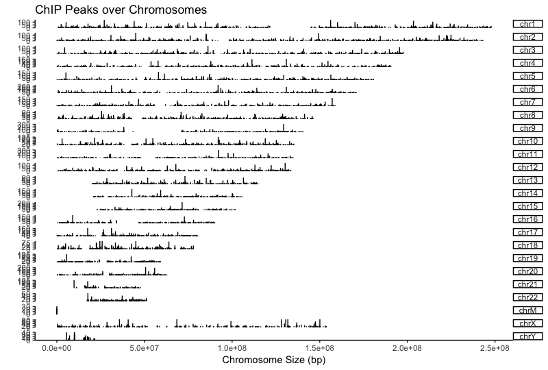
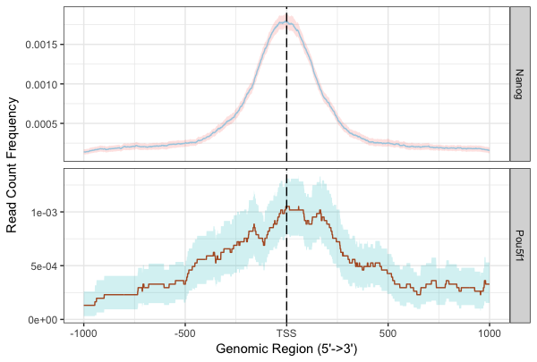
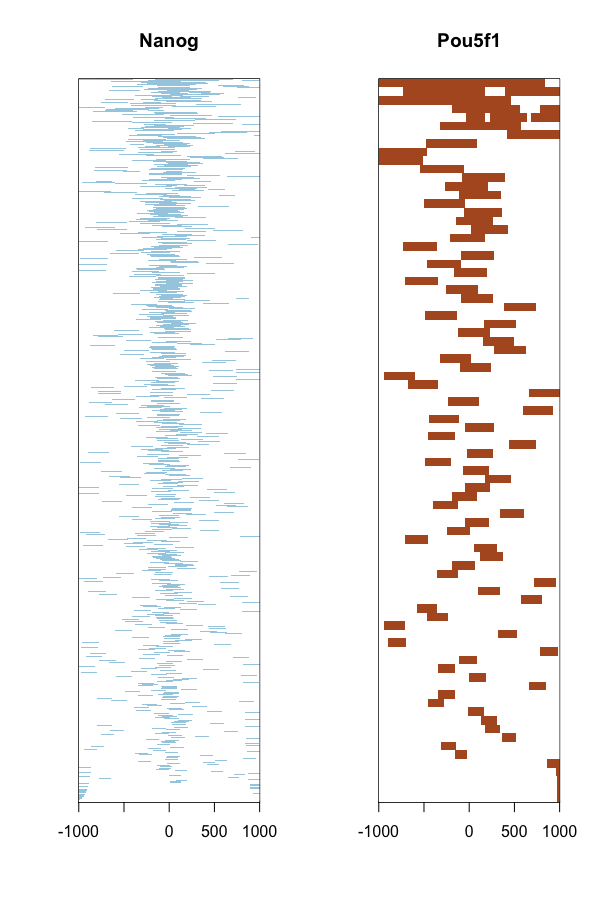
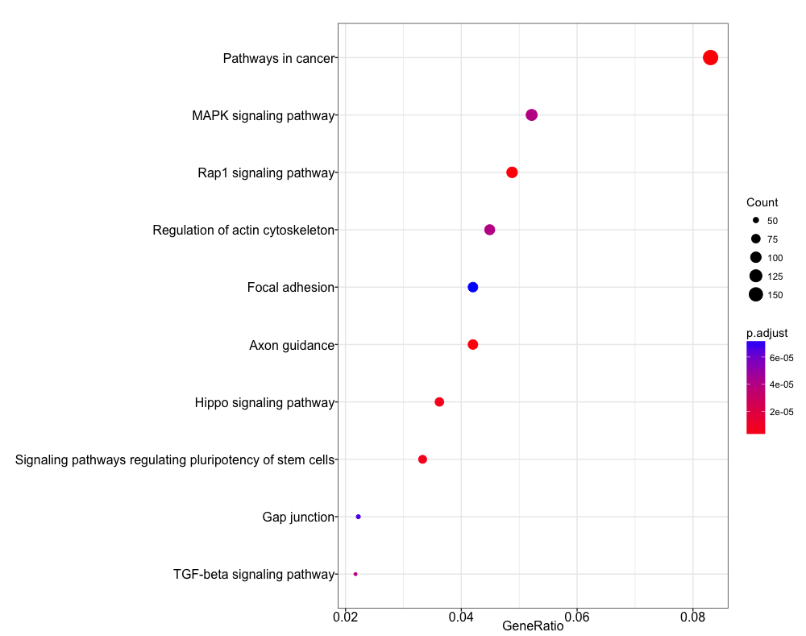

Contributors: Mary Piper and Meeta Mistry

Approximate time: 1.5 hours

## Learning Objectives


# ChIPseeker

Now that we have a set of high confidence peaks for our samples, the next step is to **annotate our peaks to identify relative location relationship information between query peaks and genes/genomic features** to obtain some biological context. 

[ChIPseeker](http://bioconductor.org/packages/release/bioc/vignettes/ChIPseeker/inst/doc/ChIPseeker.html) is an R package for annotating ChIP-seq data analysis. It supports annotating ChIP peaks and provides functions to visualize ChIP peaks coverage over chromosomes and profiles of peaks binding to TSS regions. Comparison of ChIP peak profiles and annotation are also supported, and can be useful to estimate how well biological replications are. Several visualization functions are implemented to visualize the peak annotation and statistical tools for enrichment analyses of functional annotations.


## Setting up 

1. Open up RStudio and open up the `chipseq-project` that we created previously.
2. Open up a new R script ('File' -> 'New File' -> 'Rscript'), and save it as `chipseeker.R`

> **NOTE:** This next section assumes you have the `ChIPseeker` package installed for R 3.3.3. You will also need one additional library for gene annotation. If you haven't done this please run the following lines of code before proceeding.
>
```
source("http://bioconductor.org/biocLite.R")
biocLite("ChIPseeker")
biocLite("TxDb.Hsapiens.UCSC.hg19.knownGene")
```

## Getting data 

As mentioned previously, these donwstream steps should be performed on your high confidence peak calls. While we have a set for our subsetted data, this set is rather small and will not result in anything meaningful in our functional analyses. **We have generated a set of high confidence peak calls using the full dataset.** These were obtained post-IDR analysis, (i.e. concordant peaks between replicates) and are provided in BED format which is optimal input for the ChIPseeker package. 

> **NOTE:** the number of peaks in these bed files are are significantly higher than what we observed with the subsetted data replicate analysis.

We will need to copy over the appropriate files from Orchestra to our laptop. You can do this using `FileZilla` or the `scp` command.

Move over the **BED files from Orchestra(`/groups/hbctraining/chip-seq/full-dataset/idr/*.bed`) to your laptop**. You will want to copy these files into your chipseq-project **into a new folder called `data/idr-bed`.**


Let's start by loading the libraries:

```r
# Load libraries
library(ChIPseeker)
library(TxDb.Hsapiens.UCSC.hg19.knownGene)
library(clusterProfiler)
library(biomaRt)
```

Now let's load all of the data. As input we need to provide the names of our BED files in a list format.

```r
# Load data
samplefiles <- list.files("data/idr-bed", pattern= ".bed", full.names=T)
samplefiles <- as.list(samplefiles)
names(samplefiles) <- c("Nanog", "Pou5f1")

```

We need to assign annotation databases generated from UCSC to a variable:

	txdb <- TxDb.Hsapiens.UCSC.hg19.knownGene

### Visualization

First, let's take a look at peak locations across the genome. The `covplot` function calculates **coverage of peak regions** across the genome and generates a figure to visualize this across chromosomes. We do this for the Nanog peaks and find a considerable number of peaks on all chromosomes.

```
# Assign peak data to variables
nanog <- readPeakFile(samplefiles[[1]])
pou5f1 <- readPeakFile(samplefiles[[2]])

# Plot covplot
covplot(nanog, weightCol="V5")

```




Using a window of +/- 1000bp around the TSS of genes we can plot the **density of read count frequency to see where binding is relative to the TSS** or each sample. This is similar to the plot in the ChIPQC report but with the flexibility to customize the plot a bit. We will plot both Nanog and Pou5f1 together to compare the two.

```
# Prepare the promotor regions
promoter <- getPromoters(TxDb=txdb, upstream=1000, downstream=1000)

# Calculate the tag matrix
tagMatrixList <- lapply(as.list(samplefiles), getTagMatrix, windows=promoter)

## Profile plots
plotAvgProf(tagMatrixList, xlim=c(-1000, 1000), conf=0.95,resample=500, facet="row")
```


With these plots the confidence interval is estimated by bootstrap method (500 iterations) and is shown in the grey shading that follows each curve. The Nanog peaks exhibit a nice narrow peak at the TSS with small confidence intervals. Whereas the Pou5f1 peaks display a bit wider peak suggesting binding around the TSS with larger confidence intervals.

The **heatmap is another method of visualizing the read count frequency** relative to the TSS.

	# Plot heatmap
	tagHeatmap(tagMatrixList, xlim=c(-1000, 1000), color=NULL)



## Annotation

ChIPseeker implements the `annotatePeak` function for annotating peaks with nearest gene and genomic region where the peak is located. Many annotation tools calculate the distance of a peak to the nearest TSS and annotates the peak to that gene. This can be misleading as binding sites might be located between two start sites of different genes or hit different genes, which have the same TSS location in the genome. 


The **`annotatePeak` function provides parameters to annotate genes with a max distance cutoff and all genes within this distance will be reported for each peak**. For annotating genomic regions, annotatePeak function reports detail information when genomic region is Exon or Intron. For instance, ‘Exon (uc002sbe.3/9736, exon 69 of 80)’, means that the peak overlaps with the 69th exon of the 80 exons that transcript uc002sbe.3 possess and the corresponding Entrez gene ID is 9736. 

> **NOTE:** *ChIPseeker supports annotating ChIP-seq data of a wide variety of species if they have transcript annotation TxDb object available.*

Let's start by retrieving annotations for our Nanog and Pou5f1 peaks calls:

```
peakAnnoList <- lapply(samplefiles, annotatePeak, TxDb=txdb, 
                       tssRegion=c(-1000, 1000), verbose=FALSE)
```

If you take a look at what is stored in `peakAnnoList`, you will see a summary of genomic features for each sample:

```
> peakAnnoList
$Nanog
Annotated peaks generated by ChIPseeker
11023/11035  peaks were annotated
Genomic Annotation Summary:
             Feature  Frequency
9           Promoter 17.1731833
4             5' UTR  0.2358705
3             3' UTR  0.9706976
1           1st Exon  0.5443164
7         Other Exon  1.7781003
2         1st Intron  7.2121927
8       Other Intron 28.2318788
6 Downstream (<=3kb)  0.9434818
5  Distal Intergenic 42.9102785

$Pou5f1
Annotated peaks generated by ChIPseeker
3242/3251  peaks were annotated
Genomic Annotation Summary:
             Feature  Frequency
9           Promoter  3.7939543
4             5' UTR  0.1542258
3             3' UTR  1.0795805
1           1st Exon  1.3263418
7         Other Exon  1.6347933
2         1st Intron  7.4336829
8       Other Intron 30.9685379
6 Downstream (<=3kb)  0.9561999
5  Distal Intergenic 52.6526835
```

To visualize this annotation data ChIPseeker provides several functions. We will demonstrate a few using the Nanog sample only. We will also show how some of the functions can also support comparing across samples.

### Pie chart of genomic region annotation

```
plotAnnoPie(peakAnnoList[["Nanog"]])
```


### Vennpie of genomic region annotation

```
vennpie(peakAnnoList[["Nanog"]])
```


### Barchart (multiple samples for comparison)

**Here, we see that Nanog has a much larger percentage of peaks in promotor regions.**

```
plotAnnoBar(peakAnnoList)

```


### Distribution of TF-binding loci relative to TSS (multiple samples)

**Nanog has also majority of binding regions falling in closer proximity to the TSS (0-10kb).**

```
plotDistToTSS(peakAnnoList, title="Distribution of transcription factor-binding loci \n relative to TSS")
```


### Writing annotations to file 

It would be nice to have the annotations for each peak call written to file, as it can be useful to browse the data and subset calls of interest. The **annotation information** is stored in the `peakAnnoList` object. To retrieve it we use the following syntax:

	nanog_annot <- as.data.frame(peakAnnoList[["Nanog"]]@anno)

Take a look at this dataframe. You should see columns corresponding to your input BED file and addditional columns containing nearest gene(s), the distance from peak to the TSS of its nearest gene, genomic region of the peak and other information. Since some annotation may overlap, ChIPseeker has adopted the following priority in genomic annotation.

* Promoter
* 5’ UTR
* 3’ UTR
* Exon
* Intron
* Downstream (defined as the downstream of gene end)
* Intergenic

One thing we **don't have is gene symbols** listed in table, but we can fetch them using **Biomart** and add them to the table before we write to file. This makes it easier to browse through the results.

```
# Get entrez gene Ids
entrez <- nanog_annot$geneId

# Choose Biomart database
ensembl_genes <- useMart('ENSEMBL_MART_ENSEMBL',
                        host =  'www.ensembl.org')

# Create human mart object
human <- useDataset("hsapiens_gene_ensembl", useMart('ENSEMBL_MART_ENSEMBL',
                           host =  'www.ensembl.org'))

# Get entrez to gene symbol mappings
entrez2gene <- getBM(filters = "entrezgene",
                     values = entrez,
                     attributes = c("external_gene_name", "entrezgene"),
                     mart = human)

# Match the rows and add gene symbol as a column                   
m <- match(nanog_annot$geneId, entrez2gene$entrezgene)
out <- cbind(nanog_annot[,1:13], geneSymbol=entrez2gene$external_gene_name[m], nanog_annot[,14:ncol(nanog_annot)])

# Write to file
write.table(out, file="results/Nanog_annotation.txt", sep="\t", quote=F, row.names=F)
```


## Functional enrichment analysis

Once we have obtained gene annotations for our peak calls, we can perform functional enrichment analysis to **identify predominant biological themes among these genes** by incorporating knowledge from biological ontologies such as Gene Ontology, KEGG and Reactome.

Enrichment analysis is a widely used approach to identify biological themes, and we talked about this in great detail during our RNA-seq analysis. Once we have the gene list, it can be used as input to functional enrichment tools such as clusterProfiler (Yu et al., 2012), DOSE (Yu et al., 2015) and ReactomePA. We will go through a few examples here.


### Single sample analysis

Let's start with something we have seen before with RNA-seq functional analysis. We will take our gene list from **Nanog annotations** and use them as input for a **GO enrichment analysis**.

```
# Run GO enrichment analysis 
ego <- enrichGO(gene = entrez, 
                    keytype = "ENTREZID", 
                    OrgDb = org.Hs.eg.db, 
                    ont = "BP", 
                    pAdjustMethod = "BH", 
                    qvalueCutoff = 0.05, 
                    readable = TRUE)

# Output results from GO analysis to a table
cluster_summary <- data.frame(ego)
write.csv(cluster_summary, "results/clusterProfiler_Nanog.csv")
```

We can visualize the results using the `dotplot` function. We find many terms related to **development and differentiation** and amongst those in the bottom half of the list we see 'stem cell population maintenance'. Functionally, Nanog blocks differentiation. Thus, negative regulation of Nanog is required to promote differentiation during embryonic development. Recently, Nanog has been shown to be involved in neural stem cell differentiation which might explain the abundance of neuro terms we observe.

```
# Dotplot visualization
dotplot(ego, showCategory=50)
```


Let's try a **KEGG pathway enrichment** and visualize again using the the dotplot. Again, we see a relevant pathway 'Signaling pathways regulating pluripotency of stem cells'.

```
ekegg <- enrichKEGG(gene = entrez,
                 organism = 'hsa',
                 pvalueCutoff = 0.05)

dotplot(kk)
```



### Multiple samples

We can also use the `compareCluster` function 


***
*This lesson has been developed by members of the teaching team at the [Harvard Chan Bioinformatics Core (HBC)](http://bioinformatics.sph.harvard.edu/). These are open access materials distributed under the terms of the [Creative Commons Attribution license](https://creativecommons.org/licenses/by/4.0/) (CC BY 4.0), which permits unrestricted use, distribution, and reproduction in any medium, provided the original author and source are credited.*
