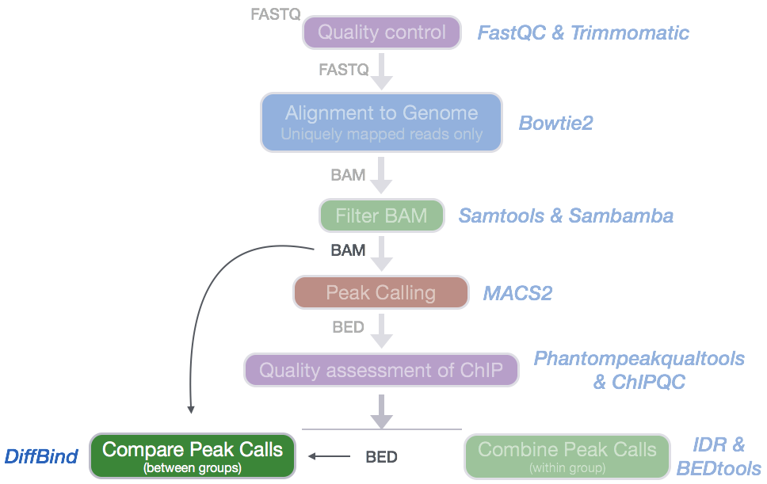
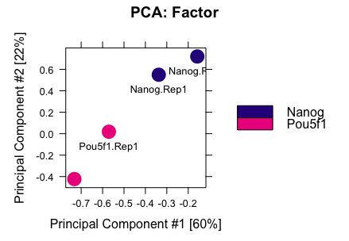
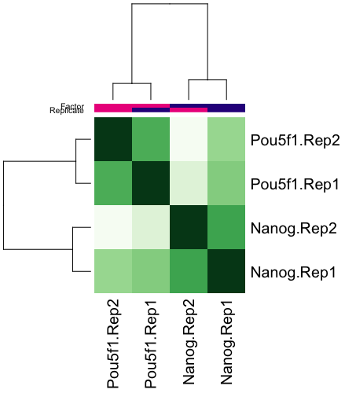
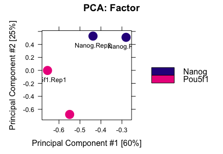
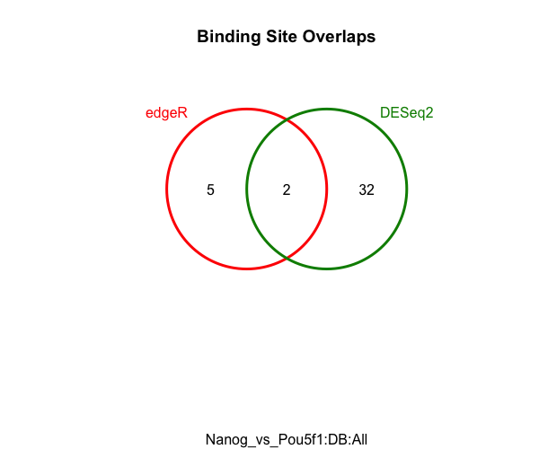
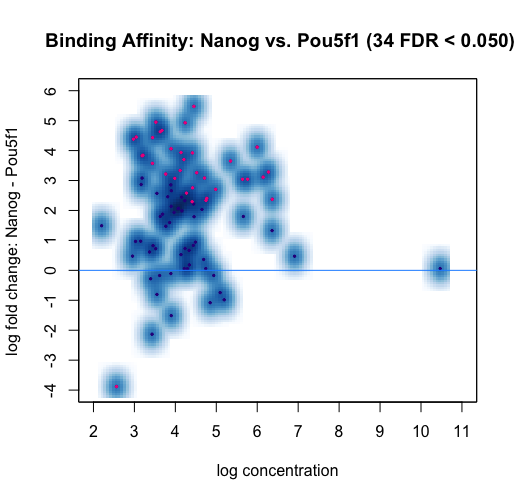
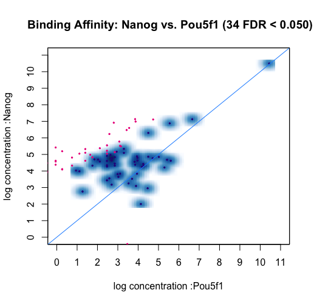
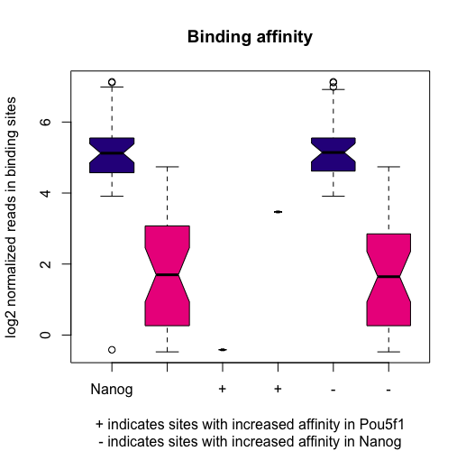

Contributors: Meeta Mistry, 

Approximate time: 90 minutes

## Learning Objectives

* Learn how to use the DiffBind workflow to assess differential binding between two sample classes
* Assess the relationship between samples using various plots
* Evaluate results and output to file

## Differential enrichment analysis

To provide a more complex picture of biological processes in a cell, many studies aim to compare different datasets obtained by ChIP-seq. In our dataset, we have peak calls from two different transcription factors: Nanog and Pou5f1. For each factor **we have two replicates, and it would be best to use tools that make use of these replicates (i.e [DiffBind](http://bioconductor.org/packages/release/bioc/html/DiffBind.html)**, [ChIPComp](https://www.bioconductor.org/packages/3.3/bioc/html/ChIPComp.html)) to compute statistics reflecting how significant the changes are. For this analysis, we will use as input not only the peak calls but also incorporate the BAM files.

 

## Tools for evaluating differential enrichment

An increasing number of ChIP-seq experiments are investigating transcription factor binding under multiple experimental conditions, for example, various treatment conditions, several distinct time points and different treatment dosage levels. Because differential enrichment has become of practical importance in biological and medical research, more tools have become available for this type of analysis. 

 

When choosing which tool to use there are several criterion to consider. 

1. You want software that can be **implemented without the need for extensive efforts** for porting the code. Also, keep track of whether this tool is being maintained and frequently updated.

2. What **inputs** are required by the user? Some tools  require preliminary detection of enriched regions by external peak-calling algorithms, while others implement their own detection method.

3. What is the underlying **statistical model** used for signal distribution? Is it based either on the Poisson distribution or on a more flexible negative binomial distribution.

4. Some tools have been specifically designed for particular ChIP-seq data (**signal type**), such as histone modifications or transcription factor (TF) binding.


## DiffBind

DiffBind is an R package that is used for identifying sites that are **differentially bound between two or more sample groups**. It works primarily with sets of peak calls ('peaksets'), which are sets of genomic intervals representing candidate protein binding sites for each sample. It includes functions that support the processing of peaksets, including **overlapping and merging peak sets across an entire dataset, counting sequencing reads in overlapping intervals in peak sets, and identifying statistically significantly differentially bound sites** based on evidence of binding affinity (measured by differences in read densities). We will discuss the importance of each step but for more information take a look at the [DiffBind vignette](http://bioconductor.org/packages/release/bioc/vignettes/DiffBind/inst/doc/DiffBind.pdf).

> **NOTE:** The required input for DiffBind is all samples in the dataset and all peaks (not just the high confidence peaks) for each sample. **Replicate peak calls are used individually, and not merged.** 


### Setting up

> **NOTE:** In order for you to follow this lesson you will need to have all of the required input files. The instructions for this can be found in the "Setting up" section of the [ChIPQC using R lesson](). **Please run through this before proceeding.**


1. Open up RStudio and open up the `chipseq-project` that we created previously.
2. Open up a new R script ('File' -> 'New File' -> 'Rscript'), and save it as `diffbind.R`

We do not need to download any data because everything we need is already in the current project. The **samplesheet** that we used for `ChIPQC` is also required here.

Now that we are setup let's load the DiffBind library.

```
library(DiffBind)
```	
> **NOTE:** You may not need to load this library since it was loaded as a dependency of the ChIPQC package.

### Reading in Peaksets

The first step is to **read in a set of peaksets and associated metadata**. This is done using the sample sheet. Once the peaksets are read in, a merging function finds all overlapping peaks and derives a single set of unique genomic intervals covering all the supplied peaks (a consensus peakset for the experiment). *A region is considered for the **consensus set** if it appears in more than two of the samples.* This consensus set represents the overall set of candidate binding sites to be used in further analysis.

```
samples <- read.csv('meta/samplesheet_chr12.csv')
dbObj <- dba(sampleSheet=samples)

```

Take a look at what information gets summarized in the `dbObj`. **How many consensus sites were identified for this dataset? Which sample has a disproportionatley larger number of peaks?**

```
> dbObj
	
4 Samples, 85 sites in matrix (280 total):
           ID Factor Replicate Caller Intervals
1  Nanog.Rep1  Nanog         1 narrow       108
2  Nanog.Rep2  Nanog         2 narrow       157
3 Pou5f1.Rep1 Pou5f1         1 narrow        98
4 Pou5f1.Rep2 Pou5f1         2 narrow        36
```

### Affinity binding matrix

The next step is to take the alignment files and **compute count information for each of the peaks/regions** in the consensus set. In this step, for each of the consensus regions DiffBind takes the number of aligned reads in the ChIP sample and the input sample, to compute a normalized read count for each sample at every potential binding site. The peaks in the consensus peakset may be re-centered and trimmed based on calculating their summits (point of greatest read overlap) in order to provide more standardized peak intervals.

We use the `dba.count()` function with the following additional parameter:

* `bUseSummarizeOverlaps`: to use a more standard counting procedure than the built-in one by default.

```
dbObj <- dba.count(dbObj, bUseSummarizeOverlaps=TRUE)
```

Take a look at the `dbObj` again. You should now see a column that contains the FRiP values for each sample. *These values may look slightly different from those reported in ChIPQC since we are looking at only the consensus peaks.*

```
> dbObj
4 Samples, 85 sites in matrix:
           ID Factor Replicate Caller Intervals FRiP
1  Nanog.Rep1  Nanog         1 counts        85 0.04
2  Nanog.Rep2  Nanog         2 counts        85 0.04
3 Pou5f1.Rep1 Pou5f1         1 counts        85 0.03
4 Pou5f1.Rep2 Pou5f1         2 counts        85 0.02
```

### Exploratory data analysis

To see how well the samples cluster with one another, we can draw a **PCA plot** using all 85 consensus sites. You should see both Nanog and Pou5f1 replicates clustering together. 

	dba.plotPCA(dbObj,  attributes=DBA_FACTOR, label=DBA_ID)
	




We can also plot a **correlation heatmap**, to evaluate the relationship between samples.

	plot(dbObj)



**In our data, we see that the replicates appear to cluster together**, which is what we would hope for. Although there is variability between the replicates, the largest amount of variability can be attributed to differences between the two groups.


### Establishing a contrast

Before running the differential enrichment analysis, we need to tell DiffBind **which samples we want to compare to one another**. In our case we only have one factor of interest which is the different transcription factor IPs. Contrasts are set up using the `dba.contrast` function, as follows:
	
	dbObj <- dba.contrast(dbObj, categories=DBA_FACTOR, minMembers = 2)
	
### Performing the differential enrichment analysis

The core functionality of DiffBind is the differential binding affinity
analysis, which enables binding sites to be identified that are **statistically significantly differentially bound between sample groups**. The core analysis routines are executed, by default using **DESeq2** with an option to also use **edgeR**. Each tool will assign a p-value and FDR to each candidate binding site indicating confidence that they are differentially bound.

The main differential analysis function is invoked as follows:


	dbObj <- dba.analyze(dbObj, method=DBA_ALL_METHODS)
	

To see a summary of results for each tool we can use `dba.show`:

```
dba.show(dbObj, bContrasts=T)	

  Group1 Members1 Group2 Members2 DB.edgeR DB.DESeq2
1  Nanog        2 Pou5f1        2        7        34
```

It appears as though edgeR is a bit more stringent and results in fewer peaks (by almost a factor of 5) being called as differentially enriched. This is not unsual, as we also see a lack of complete agreement with these tools during RNA-seq analysis.

***

**Exercise**

**The default threshold is padj < 0.05.** *How many regions are differentially bound between Nanog and Pou5f1? How does this change with a more stringent threshold of 0.01? (HINT: use `th=0.01`)*	

***

Try plotting a PCA but this time **only use the regions that were identified as significant by DESeq2** using the code below.

	dba.plotPCA(dbObj, contrast=1, method=DBA_DESEQ2, attributes=DBA_FACTOR, label=DBA_ID)
	
 

*Modify the code above so that you only plot a PCA using the regions identified as significant by edgeR. Do the plots differ?*

### Visualizing the results

We can see that edgeR identifies alot fewer peaks, but it would be good to see if those peaks are a subset of the DESeq2 results. For a quick look at the **overlapping peaks** identified by the two different tools (DESeq2 and edgeR) we can plot a Venn diagram. 

	dba.plotVenn(dbObj,contrast=1,method=DBA_ALL_METHODS)
	
 

**MA plots** are a useful way to visualize the effect of normalization on data, as well as seeing which of the data points are being identified as differentially bound. 

	dba.plotMA(dbObj, method=DBA_DESEQ2)
	


Each point represents a binding site. Points in red represent sites identified by DESeq2 as differentially bound (FDR < 0.05). The plot shows how the differentially bound sites appear to have an absolute log fold difference of at least 2. It also suggests that more binding sites gain binding affinity in the Nanog than loss, as evidenced by red dots above the center line. This same data can also be shown with the **concentrations of each sample groups plotted against each other**.


	dba.plotMA(dbObj, bXY=TRUE)
	


If we want to see **how the reads are distributed amongst the different classes of differentially bound sites and sample group**s, we can use a boxplot:

	pvals <- dba.plotBox(dbObj)
	


The left two boxes show distribution of reads over all differentially bound sites in the Nanog and Pou5f1 groups. Samples have a somewhat higher mean read concentration in Nanog samples. The next two boxes show the distribution of reads in differentially bound sites that exhibit increased affinity in the Pou5f1 samples, while the final two boxes show the distribution of reads in differentially bound sites that exhibit increased affinity in the Nanog samples. `dba.plotBox()` returns a matrix of p-values (computed using a two-sided Wilcoxon Mann-Whitney test and are stored in the `pvals` variable. 


### Extracting results

To extract the full results from DESeq2 we use `dba.report`:

```
res_deseq <- dba.report(dbObj, method=DBA_DESEQ2, contrast = 1, th=1)

```

> **NOTE:** Normally, we would keep the list of consensus peaks from edgeR and DESeq2 to use as our *high confidence set* to move forward with. But since we have an overlap of only two regions we will keep only the results from DESeq2.

**These results files contain the genomic coordinates for all consensus sites and statistics for differential enrichment including fold-change, p-value and FDR.**

```
> res_deseq

GRanges object with 85 ranges and 6 metadata columns:
     seqnames            ranges strand |      Conc Conc_Nanog Conc_Pou5f1      Fold
        <Rle>         <IRanges>  <Rle> | <numeric>  <numeric>   <numeric> <numeric>
  64    chr12 25644533-25644920      * |      4.45       5.42       -0.06      5.48
  28    chr12 12162157-12162655      * |         6       6.92         2.8      4.12
  35    chr12 13898546-13898828      * |      4.24       5.19        0.26      4.93
  46    chr12 16266148-16266518      * |      4.42       5.32         1.4      3.92
  36    chr12 13902296-13902867      * |      5.35       6.24        2.59      3.65
     p-value       FDR
     <numeric> <numeric>
  64  7.73e-06  0.000657
  28  3.14e-05   0.00133
  35  0.000129   0.00366
  46  0.000281   0.00597
  36  0.000594   0.00894
  -------
  seqinfo: 1 sequence from an unspecified genome; no seqlengths

```

The value columns are described below:

* **Conc**: mean read concentration over all the samples (the default calculation uses log2 normalized ChIP read counts with control read counts subtracted)
* **Conc_Nanog**: mean concentration over the first (Nanog) group
* **Conc_Pou5f1**: mean concentration over the second (Pou5f1) group
* **Fold**: shows the difference in mean concentrations between the two groups, with a positive value indicating increased binding affinity in the Nanog group and a negative value indicating increased binding affinity in the Pou5f1 group.


Before **writing to file** we need to convert it to a data frame so that genomic coordinates get written as columns and not GRanges.

```

# Write to file
out <- as.data.frame(res_deseq)
write.table(out, file="results/Nanog_vs_Pou5f1_deseq2.txt", sep="\t", quote=F, col.names = NA)

````

Additionally, we will want to create BED files for each set of significant regions identified by DESeq2, separating them based on the gain or loss of enrichment. For these we will only write to file the **first three columns (minimal BED format)**, in this way we can use it as **input for downstream visualization**. 


```
# Create bed files for each keeping only significant peaks (p < 0.05)

nanog_enrich <- out %>% 
  filter(FDR < 0.05 & Fold > 0) %>% 
  select(seqnames, start, end, strand, Fold)


pou5f1_enrich <- out %>% 
  filter(FDR < 0.05 & Fold < 0) %>% 
  select(seqnames, start, end, strand, Fold)
```


***
*This lesson has been developed by members of the teaching team at the [Harvard Chan Bioinformatics Core (HBC)](http://bioinformatics.sph.harvard.edu/). These are open access materials distributed under the terms of the [Creative Commons Attribution license](https://creativecommons.org/licenses/by/4.0/) (CC BY 4.0), which permits unrestricted use, distribution, and reproduction in any medium, provided the original author and source are credited.*


