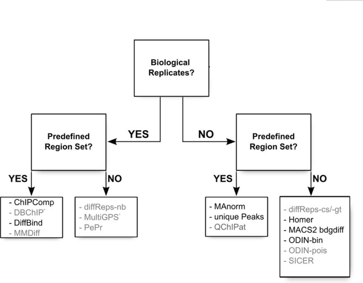
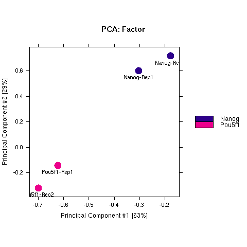
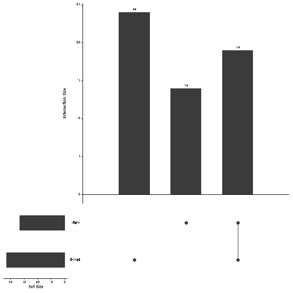

Contributors: Meeta Mistry, 

Approximate time: 90 minutes

## Learning Objectives

* Learning how to use the DiffBind workflow to assess differential enrichment of peaks between two sample classes
* Assessing relationship between samples using PCA
* Evaluating consensus diff peaks between two different tools


## Differential peak enrichment 

Increasing number of ChIP-seq experiments are investigating transcription factor binding under multiple experimental conditions, for example, various treatment conditions, several distinct time points and different treatment dosage levels. Hence, identifying differential binding sites across multiple conditions is of practical importance in biological and medical research. 

There are various methods/tools available when investigating narrow peaks, and the choice of tool will depend heavily on your experimental design. 



In our case, we are interested in identifying differences in binding between two transcription factors. For each group we have two replicates, and it would be best to use tools that make use of these replicates (i.e [DiffBind](http://bioconductor.org/packages/release/bioc/html/DiffBind.html), [ChIPComp](https://www.bioconductor.org/packages/3.3/bioc/html/ChIPComp.html)) to compute statistics reflecting how significant the changes are. 


## DiffBind

DiffBind is an R package that is used for identifying sites that are differentially bound between two sample groups. It works primarily with sets of peak calls ('peaksets'), which are sets of genomic intervals representing candidate protein binding sites for each sample. It includes functions that support the processing of peaksets, including overlapping and merging peak sets across an entire dataset, counting sequencing reads in overlapping intervals in peak sets, and identifying statistically significantly differentially bound sites based on evidence of binding affinity (measured by differences in read densities). We will discuss the importance of each step but for more information take a look at the [DiffBind vignette](http://bioconductor.org/packages/release/bioc/vignettes/DiffBind/inst/doc/DiffBind.pdf).


### Setting up

#### X11 forwarding

A number of programs with graphical user interfaces use the X11 system which lets the program **run on an Orchestra computer, but show the graphics on your desktop**. R is one of these programs. For this lesson we are going to want to plot diagnostic figures as we walk through the workflow, and be able to look at them interactively (instead of saving each to file and view locally).

To do this, you need to have an **X11 server running on your desktop**, and your SSH connection needs to **have X11 forwarding enabled on Orchestra**.

> *NOTE:* the X11 server is the program on your laptop that drives the user's display and handles connections from X11 clients. If you are using a Mac, this will be [XQuartz](https://www.xquartz.org/) and for PC users this would be [Xming](https://sourceforge.net/projects/xming/). You should already have these installed on your laptops. 

To set up X11 forwarding on Orchestra we need to log in to Orchestra using the `-X` parameter to enable X11 forwarding:

	$ ssh -X ecommons_id@orchestra.med.harvard.edu

Then start up an interactive session with 4 cores, and add `-XF` to indicate X11 forwarding to the compute nodes :

	$ bsub -Is -n 4 -XF -q interactive bash

Let's load the R module. We are going to use version 3.2.1 since it has DiffBind installed for us. 

	$ module load stats/R/3.2.1

Navigate to the `results` directory we have been working in and create a new directory for our DiffBind analysis:

	$ cd ~/ngs_course/chipseq/results
	$ mkdir diffBind


Finally, you will need the **sample sheet** which contains metadata information. Copy this over to your `diffBind` directory and then we will take a quick look at what is contained in it.

	$ cp /groups/hbctraining/ngs-data-analysis-longcourse/chipseq/ENCODE/diffBind/samples_chr12_DiffBind.csv diffBind/

	$ less diffBind/samples_chr12_DiffBind.csv


The **sample sheet** contains a row for each peak set (which in most cases is every ChIP sample) and several columns of required information, which allows us to easily load the associated data in one single command. _The column headers have specific names that are expected by DiffBind_. 

* SampleID: Identifier string for sample
* Replicate: Replicate number of sample
* Tissue, Factor, Condition, Treatment: Identifier strings for up to four different factors (need one of these at minimum)
* bamReads: file path for bam file containing aligned reads for ChIP sample
* bamControl: file path for bam file containing aligned reads for control sample
* ControlID: Identifier string for control sample
* Peaks: path for file containing peaks for sample
* PeakCaller: Identifier string for peak caller used. Possible values include “raw”, “bed”, “narrow”, “macs”


Finally, let's open up R and load the required libraries:

	$ R

```
R version 3.2.1 (2015-06-18) -- "World-Famous Astronaut"
Copyright (C) 2015 The R Foundation for Statistical Computing
Platform: x86_64-unknown-linux-gnu (64-bit)

R is free software and comes with ABSOLUTELY NO WARRANTY.
You are welcome to redistribute it under certain conditions.
Type 'license()' or 'licence()' for distribution details.

  Natural language support but running in an English locale

R is a collaborative project with many contributors.
Type 'contributors()' for more information and
'citation()' on how to cite R or R packages in publications.

Type 'demo()' for some demos, 'help()' for on-line help, or
'help.start()' for an HTML browser interface to help.
Type 'q()' to quit R.

> 

```

	> library(DiffBind)
	> library(reshape)
	

We also need to install a package for plotting called `UpSetR`. Since this is a Bioconductor package we will first need to source the Biconductor installation script.

	> source("http://bioconductor.org/biocLite.R")
	> biocLite('UpSetR')


### Reading in Peaksets

The first step is to read in a set of peaksets and associated metadata. This is done using the sample sheet. Once the peaksets are read in, a merging function finds all overlapping peaks and derives a single set of unique genomic intervals covering all the supplied peaks (a consensus peakset for the experiment). *A region is considered for the consensus set if it appears in more than two of the samples.* This consensus set represents the overall set of candidate binding sites to be used in further analysis.

```
samples <- read.csv('diffBind/samples_chr12_DiffBind.csv')
dbObj <- dba(sampleSheet=samples)

```

Take a look at what information gets summarized in the `dbObj`. *How many consensus sites were identified for this dataset? Which sample has a disproportionatley larger number of peaks?*

```
> dbObj
	
4 Samples, 83 sites in matrix (263 total):
           ID Factor Replicate Caller Intervals
1  Nanog-Rep1  Nanog         1 narrow        95
2  Nanog-Rep2  Nanog         2 narrow       162
3 Pou5f1-Rep1 Pou5f1         1 narrow        89
4 Pou5f1-Rep2 Pou5f1         2 narrow        33
```

### Affinity binding matrix

The next step is to take the alignment files and compute count information for each of the peaks/regions. In this step, for each of the consensus regions DiffBind takes the number of aligned reads in the ChIP sample and the input sample, to compute a normalized read count for each sample at every potential binding site. We use the `dba.count()` function with the following additional parameters:

* `bUseSummarizeOverlaps`: to use a more standard counting procedure than the built-in one by default.
* `bRemoveDuplicates`: remove duplicate reads
* `bParallel`: use multicore to get counts for each read file in parallel

```
dbObj <- dba.count(dbObj, bUseSummarizeOverlaps=TRUE, bRemoveDuplicates = TRUE, bParallel = TRUE)
```

Take a look at the `dbObj` again. You should know see a column that contains the FRiP values for each sample. 

```
> dbObj
4 Samples, 83 sites in matrix:
           ID Factor Replicate Caller Intervals FRiP
1  Nanog-Rep1  Nanog         1 counts        83 0.03
2  Nanog-Rep2  Nanog         2 counts        83 0.04
3 Pou5f1-Rep1 Pou5f1         1 counts        83 0.03
4 Pou5f1-Rep2 Pou5f1         2 counts        83 0.03
```

To see how well the samples cluster with one another, we can draw a PCA plot using all 83 consensus sites. You should see both Nanog and Pou5f1 replicates clustering together. 

	png('pcaplot.png')
	dba.plotPCA(dbObj,  attributes=DBA_FACTOR, label=DBA_ID)
	dev.off()
	


	

### Establishing a contrast

Before running the differential analysis, we need to tell DiffBind which samples we want to compare to one another. In our case we only have one factor of interest which is the different transcription factor IPs. Contrasts are set up using the `dba.contrast` function, as follows:
	
	dbObj <- dba.contrast(dbObj, categories=DBA_FACTOR, minMembers = 2)
	
### Performing the differential analysis

The core functionality of DiffBind is the differential binding affinity
analysis, which enables binding sites to be identified that are statistically significantly differentially bound between sample groups. The core analysis routines are executed, by default using DESeq2 with an option to also use edgeR. Each tool will assign a p-value and FDR to each candidate binding site indicating confidence that they are differentially bound.

The main differential analysis function is invoked as follows:


	dbObj <- dba.analyze(dbObj, method=DBA_ALL_METHODS)
	

To see a summary of results for each tool we can use `dba.show`:

	dba.show(dbObj, bContrasts=T)
	
**Note that the default threshold is padj < 0.05.** *How many regions are differentially bound between Nanog and Pou5f1? How does this change with a more stringent threshold of 0.01? (HINT: use `th=0.01`)*	

```
  Group1 Members1 Group2 Members2 DB.edgeR DB.DESeq2
1  Nanog        2 Pou5f1        2       33        43
```

Try plotting a PCA but this time only use the regions that were identified as significant by DESeq2 using the code below.

	png('pcaplotDeseq2.png')
	dba.plotPCA(dbObj, contrast=1, method=DBA_EDGER, attributes=DBA_FACTOR, label=DBA_ID)
	dev.off()

*Modify the code above so that you only plot a PCA using the regions identified as significant by edgeR. Do the plots differ?*

### Differential enrichment consensus peaks

Since the two tools identify a different number of differentially enriched regions, it can be useful to see if there is any consensus between them. To do so, we first need to extract the full set of results for each:

```
comp1.edgeR <- dba.report(dbObj, method=DBA_EDGER, contrast = 1, th=1)
comp1.deseq <- dba.report(dbObj, method=DBA_DESEQ2, contrast = 1, th=1)

```

**These results files contain the genomic coordinates for all consensus site and statistics for differential enrichment including fold-change, p-value and FDR.**

```
> head(comp1.edgeR)

GRanges object with 6 ranges and 6 metadata columns:
     seqnames               ranges strand |      Conc Conc_Nanog Conc_Pou5f1
        <Rle>            <IRanges>  <Rle> | <numeric>  <numeric>   <numeric>
  23    chr12 [ 7941791,  7941989]      * |      4.31       0.98        5.24
  62    chr12 [25991058, 25991248]      * |      3.52      -0.72        4.48
  19    chr12 [ 7243330,  7243609]      * |      5.47       2.55        6.37
  41    chr12 [14347305, 14347638]      * |      4.17       1.37        5.06
  36    chr12 [13241391, 13241794]      * |       6.1       4.21        6.89
  37    chr12 [13408751, 13409414]      * |      6.23       4.56        6.98
          Fold   p-value       FDR
     <numeric> <numeric> <numeric>
  23     -4.26  1.14e-08  5.85e-07
  62      -5.2  1.41e-08  5.85e-07
  19     -3.82  5.38e-08  1.49e-06
  41     -3.69  2.52e-07  5.22e-06
  36     -2.69  1.88e-06  3.12e-05
  37     -2.43  9.53e-06  0.000132
  -------
  seqinfo: 1 sequence from an unspecified genome; no seqlengths

```

Now we can use the code below to loop through all of the regions and identify those that meet the FDR < 0.05 threshold *and* appear in both edgeR and DESeq2 results.

```
sets = list(edger=comp1.edgeR, deseq2=comp1.deseq)
all_peaks = reduce(sort(c(comp1.edgeR, comp1.deseq, ignore.mcols=TRUE)))
.v= lapply(names(sets), function(name){
  de = sets[[name]]
  keep = mcols(de)[,"FDR"]<=0.05
  idx = findOverlaps(all_peaks, de[keep,])
  cols =  rep(FALSE, nrow(mcols(all_peaks)))
  cols[queryHits(idx)] = TRUE
  cols
})
ma = as.matrix(do.call(cbind,.v))
ma[ma] = 1
colnames(ma) = names(sets)
png('overlapsDE.png')
UpSetR::upset(as.data.frame(ma),sets = names(sets))
dev.off()
```



*The verical bars correspond to (from left to right), the set of regions unique to DESeq2 (24), the set of regions unique to edgeR (14), and the regions shared between edgeR and DESeq2 (19).*


### Writing results to file

The full results from each of the tools will be written to file. In this way we have the statistics computed for each of the consensus sites and can change the thresholds as we see fit. Before writing to file we need to convert it to a data frame so that genomic coordinates get written as columns and not GRanges.

```

# EdgeR
out <- as.data.frame(comp1.edgeR)
write.table(out, file="diffBind/Nanog_vs_Pou5f1_edgeR.txt", sep="\t", quote=F, col.names = NA)

# DESeq2
out <- as.data.frame(comp1.deseq)
write.table(out, file="diffBind/Nanog_vs_Pou5f1_deseq2.txt", sep="\t", quote=F, col.names = NA)

````

Additionally, we will want to keep only the significant regions that overlap between DESeq2 and edgeR. This list represents our most confident setof differentially enriched regions. For these we will only write to file the **first three columns (minimal BED format)**, in this way we can use it as **input for IGV visualization**.

```
# Consensus diff peaks
de_peaks = findOverlaps(comp1.edgeR, comp1.deseq)
de_df = comp1.edgeR
mcols(de_df) = cbind(mcols(de_df), mcols(comp1.deseq[subjectHits(de_peaks)])[,4:6])
names(mcols(de_df))[4:9] =
  apply(expand.grid(c("Fold", "pval", "FDR"), c("edgeR", "deseq")), 1, paste, collapse="_")
de_df <- as.data.frame(de_df)
de_df_filt <- de_df[which(de_df$FDR_edgeR < 0.05),]
de_df_filt <- de_df_filt[which(de_df_filt$FDR_deseq < 0.05),]

write.table(de_df_filt[,1:3], file="diffBind/Nanog_vs_Pou5f1.bed", row.names=F, sep="\t", quote=F, col.names=F)

```

Now that you're done, don't forget to save your session, in case you need to come back at a future date!

	save.image('diffBind/diffPeaks.RData')

***
*This lesson has been developed by members of the teaching team at the [Harvard Chan Bioinformatics Core (HBC)](http://bioinformatics.sph.harvard.edu/). These are open access materials distributed under the terms of the [Creative Commons Attribution license](https://creativecommons.org/licenses/by/4.0/) (CC BY 4.0), which permits unrestricted use, distribution, and reproduction in any medium, provided the original author and source are credited.*


