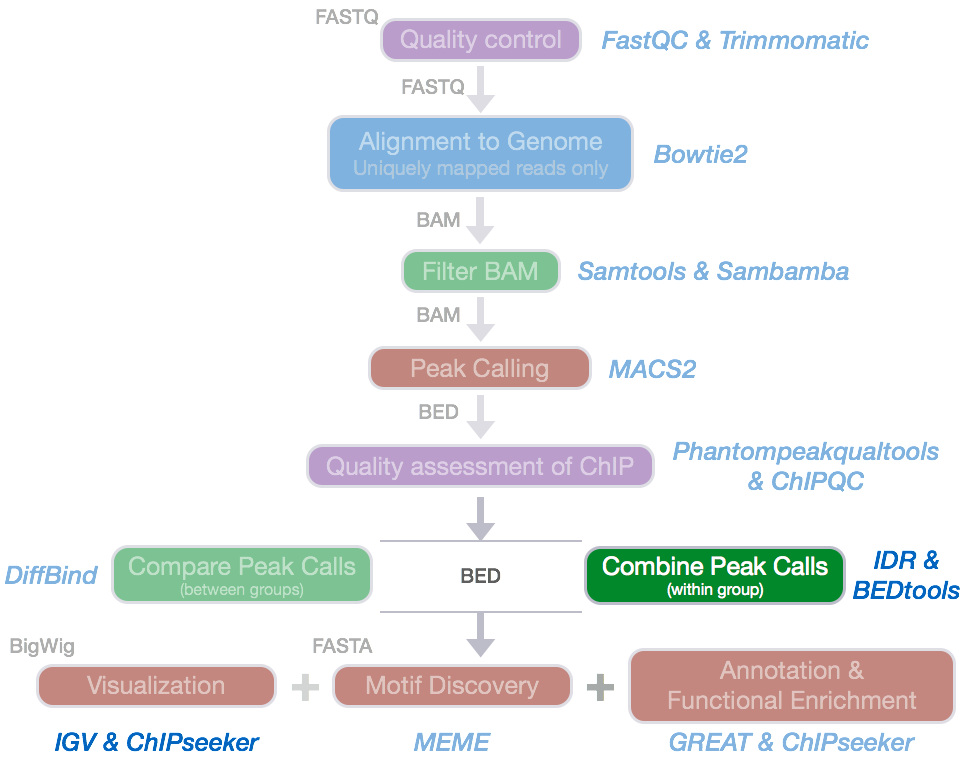
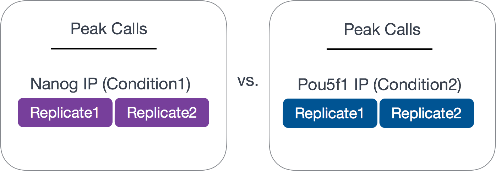

Contributors: Meeta Mistry, Radhika Khetani 

Approximate time: 75 minutes

## Learning Objectives

* Combining replicates using simple overlap with Bedtools


## Handling replicates in ChIP-seq
 
As with any high-throughput experiment, a single assay is often subject to a substantial amount of variability. Thus, it is highly recommended to setup your experimental design with a minimum of 2-3 biological replicates. Presumably, two replicates measuring the same underlying biology should have high consistency but that is not always the case. In order to evaluate consistency between replicates **we require metrics that objectively assess the reproducibility of high-throughput assays**.



Since we have 2 replicates in this example, we want to consider only those peaks that are present in both replicates before we compare the peaks from the two transcription factors to one another.

 

Common methods for handling replicates includes taking overlapping peak calls across replicates and then assessing differences in binding regions. Additionally, there are more complex methods that employ statistical testing and evaluate the reproducibility between replicates. In this workshop we will cover both methods.

> **NOTE: A recent talk on "Accessing and using ENCODE data" [linked here](https://hstalks.com/t/2679/accessing-and-using-encode-data/?biosci) where they talk about handling replicates and the similarities and differences when using an overlap versus IDR analysis.**


## Overlapping peaks

In this section, our goal is to determine what peaks are in common between the the two replicates for each factor (Nanog and Pou5f1). To perform this task we are going to use a suite of tools called `bedtools`.

### `bedtools`

The idea is that genome coordinate information can be used to perform relatively simple arithmetic, like combining, subsetting, intersecting, etc., to obtain all sorts of information. [bedtools](http://bedtools.readthedocs.org/en/latest/index.html) from [Aaron Quinlan's group](http://quinlanlab.org/) at University of Utah is easy to use, and an extremely versatile tool that performs tasks of this nature. 


As the name implies, this suite of tools works with **Bed** files, but it also works with other file formats that have genome coordinate information. 


> **NOTE:** When working with multiple files to perform arithmetic on genomic coordinates, it is essential that all files have coordinate information for the same exact version of the genome and the same coordinate system (0-based or 1-based)!

### Setting up

Let's start an interactive session and change directories and set up a space for the resulting overlaps. 

```bash
$ srun --pty -p short -t 0-12:00 --mem 8G --reservation=HBC bash	

$ cd ~/chipseq/results/

$ mkdir bedtools
```
	
Load the modules for `bedtools` and `samtools`:
	
```bash
$ module load gcc/6.2.0 bedtools/2.26.0 samtools/1.3.1
```
	
### Finding overlapping peaks between replicates

The [`bedtools intersect`](https://bedtools.readthedocs.io/en/latest/content/tools/intersect.html) command within bedtools is the one we want to use, since it is able to report back the peaks that are overlapping with respect to a given file (the file designated as "a").


To find out more information on the parameters available when intersecting, use the help flag:

```bash
$ bedtools intersect -h
```

The intersect tool evaluates A (file 1) and finds regions that overlap in B (file 2). We will add the `-wo` which indicates to write the original A (file 1) and B (file 2) entries plus the number of base pairs of overlap between the two features.

Let's start with the Nanog replicates: 

```bash
$ bedtools intersect \
-a macs2/Nanog-rep1_peaks.narrowPeak \
-b macs2/Nanog-rep2_peaks.narrowPeak \
-wo > bedtools/Nanog-overlaps.bed
```

**How many overlapping peaks did we get?**

We'll do the same for the Pou5f1 replicates:

```bash
$ bedtools intersect \
-a macs2/Pou5f1-rep1_peaks.narrowPeak \
-b macs2/Pou5f1-rep2_peaks.narrowPeak \
-wo > bedtools/Pou5f1-overlaps.bed
```
Note that we are working with subsetted data and so our list of peaks for each replicate is small. Thus, the overlapping peak set will be small as we found with both Nanog and Pou5f1. What is interesting though, is that even though the individual peak lists are smaller for Pou5f1 samples, the overlapping replicates represent a higher proportion of overlap with respect to each replicate.

> **_Historical Note_:** A simpler heuristic for establishing reproducibility was previously used as a standard for depositing ENCODE data and was in effect when much of the currently available data was submitted. According to this standard, either 80% of the top 40% of the peaks identified from one replicate using an acceptable scoring method should overlap the list of peaks from the other replicate, OR peak lists scored using all available reads from each replicate should share more than 75% of regions in common. As with the current standards, this was developed based on experience with accumulated ENCODE ChIP-seq data, albeit with a much smaller sample size.


***

*This lesson has been developed by members of the teaching team at the [Harvard Chan Bioinformatics Core (HBC)](http://bioinformatics.sph.harvard.edu/). These are open access materials distributed under the terms of the [Creative Commons Attribution license](https://creativecommons.org/licenses/by/4.0/) (CC BY 4.0), which permits unrestricted use, distribution, and reproduction in any medium, provided the original author and source are credited.*


