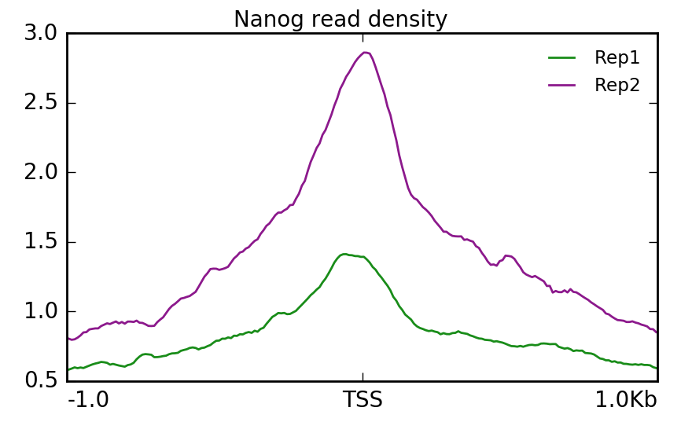
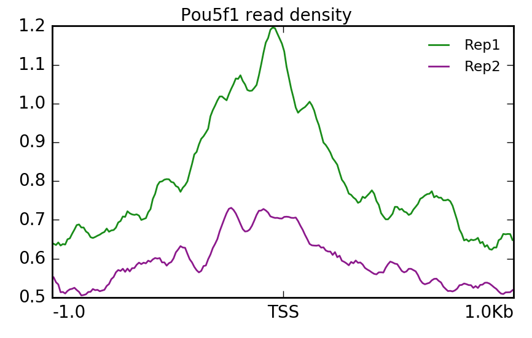
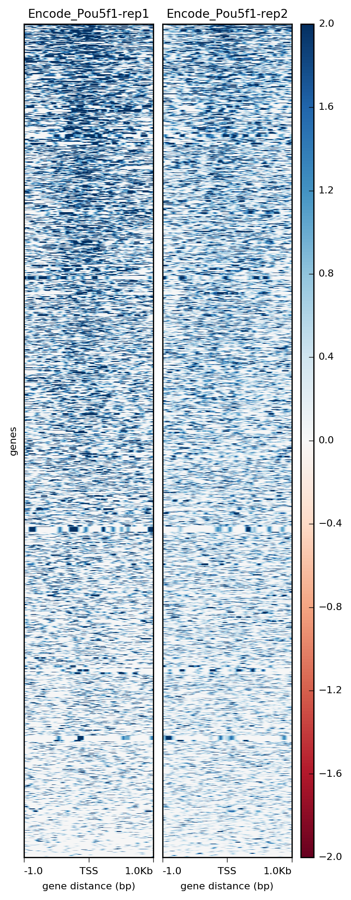
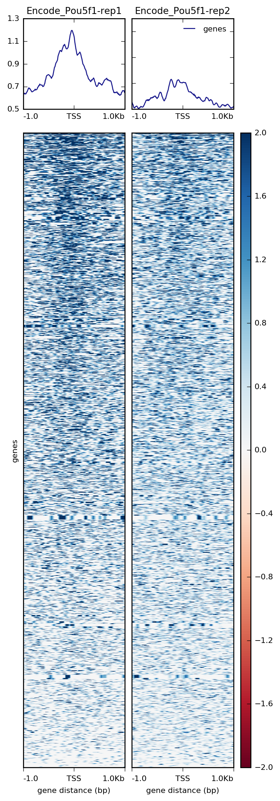
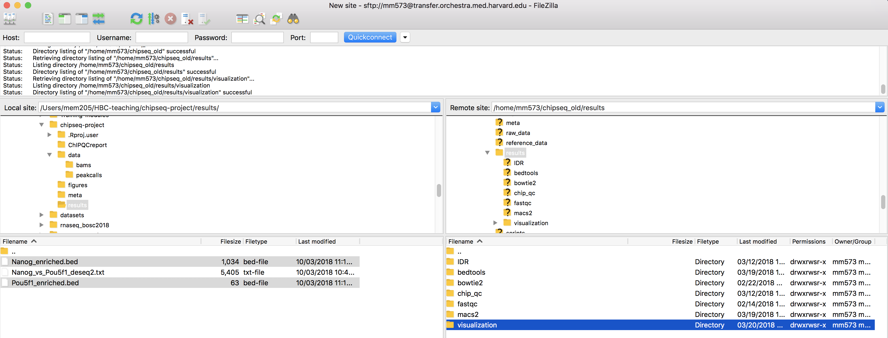
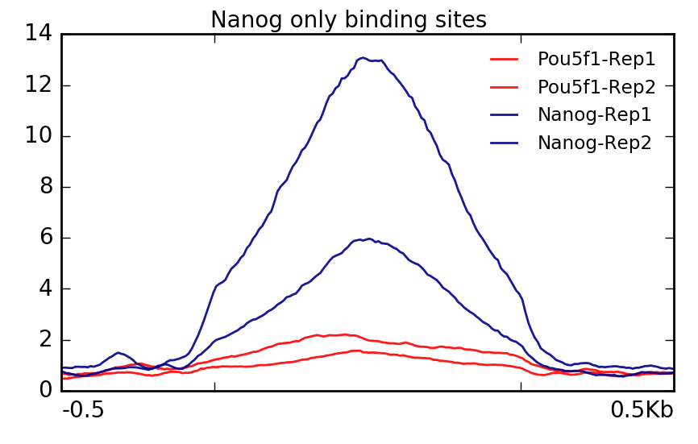

Approximate time: 80 minutes

## Learning Objectives
* Generate bigWig files
* Visualizing enrichment patterns at particular locations in the genome

## Visualization of ChIP-seq data

The first part of ChIP-sequencing analysis uses common processing pipelines, which involves the alignment of raw reads to the genome, data filtering, and identification of enriched signal regions (peak calling). In the second stage, individual programs allow detailed analysis of those peaks, biological interpretation, and visualization of ChIP-seq results.

There are various strategies for visualizing enrichment patterns and we will explore a few of them. To start, we will create bigWig files for our samples, a standard file format commonly used for ChIP-seq data visualization.

### Creating bigWig files

The first thing we want to do is take our alignment files (BAM) and convert them into bigWig files. The bigWig format is an indexed binary format useful for dense, continuous data that will be displayed in a genome browser as a graph/track, but also is used as input for some of the visualization commands we will be running in `deepTools`. 

[`deepTools`](http://deeptools.readthedocs.org/en/latest/content/list_of_tools.html), is a suite of Python tools developed for the efficient analysis of high-throughput sequencing data, such as ChIP-seq, RNA-seq or MNase-seq. `deepTools` has a wide variety of commands that go beyond those that are covered in this lesson. We encourage you to look through the docuementation and explore on your own time. 


*Image acquired from [deepTools documentation](http://deeptools.readthedocs.io/en/latest/content/tools/bamCoverage.html?highlight=bigwig) pages*

Start an interactive session with 6 cores. *If you are already logged on to a compute node you will want to exit and start a new session*.

```bash
$ srun --pty -p short -t 0-12:00 --mem 8G -n 6 --reservation=HBC bash
```

We will begin by creating a directory for the visualization output and loading the required modules to run `deepTools`.

```bash
$ cd ~/chipseq/results/
$ mkdir -p visualization/bigWig visualization/figures
```

```bash
$ module load gcc/6.2.0  python/2.7.12
$ module load deeptools/2.5.3 
```

One last thing we need to do is **create an index file for each one of our BAM files**. To perform some functions on the BAM file, many tools require an index. Think of an index located at the back of a textbook. When you are interested in a particular subject area you look for the keyword in the index and identify the pages that contain the relevant information. Similarily, indexing the BAM file aims to achieve fast retrieval of alignments overlapping a specified region without going through the whole alignment file. 

In order to index a BAM file, we will use [SAMtools](http://samtools.sourceforge.net/), a tool suite that provides alot of functionality in dealing with alignment files. There is a command called **`samtools index`**, which is what we will use. Since we need an index for each of our BAM files, we will put this in a `for` loop to avoid having to run the same command multiple times.

First, let's load the module:

```bash
$ module load samtools/1.3.1
```

Now, at the command prompt start the **`for` loop**:

```bash

for file in ~/chipseq/results/bowtie2/*aln.bam
do
samtools index $file
done
```

> **NOTE:** The above is assuming that you are pressing return after each line of code. If you wanted you could also run this command as a single line:
>
> `$ for file in ~/chipseq/results/bowtie2/*aln.bam; do samtools index $file; done`
>

Now, to create our bigWig files there are two tools that can be useful: `bamCoverage` and `bamCompare`. The former will take in a single BAM file and return to you a bigWig file. The latter allows you to normalize two files to each other (i.e. ChIP sample relative to input) and will return a single bigWig file.

Let's **create a bigWig file for Nanog replicate 2** using the `bamCoverage` command. In addition to the input and output files, there are a few additional parameters we have added. 

* `normalizeTo1x`: Report read coverage normalized to 1x sequencing depth (also known as Reads Per Genomic Content (RPGC)). Sequencing depth is defined as: (total number of mapped reads * fragment length) / effective genome size). So **the number provided here represents the effective genome size**. Some examples of values for commonly used organisms can be [found here](http://deeptools.readthedocs.io/en/latest/content/feature/effectiveGenomeSize.html).
* `binSize`: size of bins in bases
* `smoothLength`: defines a window, larger than the `binSize`, to average the number of reads over. This helps produce a more continuous plot.
* `centerReads`: reads are centered with respect to the fragment length as specified by `extendReads`. This option is useful to get a sharper signal around enriched regions.

```bash
$ bamCoverage -b bowtie2/H1hesc_Nanog_Rep2_aln.bam \
-o visualization/bigWig/H1hesc_Nanog_Rep2.bw \
--binSize 20 \
--normalizeTo1x 130000000 \
--smoothLength 60 \
--extendReads 150 \
--centerReads \
-p 6 2> ../logs/Nanog_rep2_bamCoverage.log
```
We can do the same for the **Pou5f1 replicate 1**:

```bash
$ bamCoverage -b bowtie2/H1hesc_Pou5f1_Rep1_aln.bam \
-o visualization/bigWig/H1hesc_Pou5f1_Rep1.bw \
--binSize 20 \
--normalizeTo1x 130000000 \
--smoothLength 60 \
--extendReads 150 \
--centerReads \
-p 6 2> ../logs/Pou5f1_rep1_bamCoverage.log
```
>**NOTE:** There is a reason we chose the specific replicates for the above commands, and it will become more obvious as we get to the end of this lesson!

Now, if we wanted to **create a bigWig file in which we normalize the ChIP against the input** we would use `bamCompare`. The command is quite similar to `bamCoverage`, the only difference being you require two files as input (`b1` and `b2`).

```bash
## DO NOT RUN THIS

$ bamCompare -b1 bowtie2/H1hesc_Pou5f1_Rep1_aln.bam \
-b2 bowtie2/H1hesc_Input_Rep1_chr12_aln.bam \
-o visualization/bigWig/H1hesc_Pou5f1_Rep1_bgNorm.bw \
--binSize 20 \
--normalizeTo1x 130000000 \
--smoothLength 60 \
--extendReads 150 \
--centerReads \
-p 6 2> ../logs/Pou5f1_rep1_bamCompare.log
```

> **NOTE:** When you are creating bigWig files for your full dataset, this will take considerably longer and you will not want to run this interactively (except for testing purposes). Instead, you might want to consider writing a job submission script with a loop that runs this command over all of your BAM files.

Since we are using a toy dataset which contains only a subset of the data, using these bigWigs for visualization would not give us meaningful results. As such, **we have created bigWig files from the full dataset that you can use for the rest of this lesson.**


### Profile plots and heatmaps

Once you have bigWig files you can use them to get a global look at enrichment patterns in your data at specified regions. In our example, we will assess enrichment around the TSS and plot this separately for the Nanog and Pou5f1 samples (two replicates in each plot). 

Rather than looking at the TSS for all known genes, we will only look be looking at genes on chromosome 12 in the interest of time. Copy over the BED file which contains the coordinates for all genes on chromosome 12 to the visualization folder.

```bash
$ cp /n/groups/hbctraining/chip-seq/deepTools/chr12_genes.bed ~/chipseq/results/visualization/
```

Before we start plotting our data, we first need to prepare an intermediate file that can be used with the `plotHeatmap` and `plotProfile` commands.


The `computeMatrix` command accepts multiple bigWig files and multiple region files (BED format) to create a count matrix which is the intermediate file. It can also be used to filter and sort regions according to their score. Our region file will be the BED file we just copied over and our bigWog files will be those generated from the full dataset that we have provided for you. Additionally, We will specify a window of +/- 1000bp around the TSS of genes (`-b` and `-a`). For each window, `computeMatrix` will calculate scores based on the read density values in the bigWig files.

First, let's create a matrix one for the Nanog replicates:

```bash

$ computeMatrix reference-point --referencePoint TSS \
-b 1000 -a 1000 \
-R ~/chipseq/results/visualization/chr12_genes.bed \
-S /n/groups/hbctraining/chip-seq/full-dataset/bigWig/Encode_Nanog*.bw \
--skipZeros \
-o ~/chipseq/results/visualization/matrixNanog_TSS_chr12.gz \
--outFileSortedRegions ~/chipseq/results/visualization/regions_TSS_chr12.bed

```

> **NOTE:** Typically, the genome regions are genes, and can be obtained from the [UCSC table browser](http://rohsdb.cmb.usc.edu/GBshape/cgi-bin/hgTables). Alternatively, you could look at other regions of interest that are not genomic feature related (i.e. binding regions from another protein of interest).

Now, let's create another matrix for the Pou5f1 replicates:

```bash

$ computeMatrix reference-point --referencePoint TSS \
-b 1000 -a 1000 \
-R ~/chipseq/results/visualization/chr12_genes.bed \
-S /n/groups/hbctraining/chip-seq/full-dataset/bigWig/Encode_Pou5f1*.bw \
--skipZeros -o ~/chipseq/results/visualization/matrixPou5f1_TSS_chr12.gz \
--outFileSortedRegions ~/chipseq/results/visualization/regionsPou5f1_TSS_chr12.bed

```

Using that matrix we can create a **profile plot** which is essentially a density plot that evaluates read density across all transcription start sites. For Nanog, we can see that **Replicate 2 has a particularly higher amount of signal at the TSS compared to Replicate 1**. 

```bash
$ plotProfile -m visualization/matrixNanog_TSS_chr12.gz \
-out visualization/figures/TSS_Nanog_profile.png \
--perGroup \
--colors green purple \
--plotTitle "" --samplesLabel "Rep1" "Rep2" \
--refPointLabel "TSS" \
-T "Nanog read density" \
-z ""

```



Alternatively, we could use a **heatmap** to evaluate the same matrix of information:

```bash
$ plotHeatmap -m visualization/matrixNanog_TSS_chr12.gz \
-out visualization/figures/TSS_Nanog_heatmap.png \
--colorMap RdBu \
--whatToShow 'heatmap and colorbar' \
--zMin -4 --zMax 4  
```


Similarly we can do the same for **Pou5f1. Here, we find that Replicate 1 exhibits stronger signal**.

```bash
$ plotProfile -m visualization/matrixPou5f1_TSS_chr12.gz \
-out visualization/figures/TSS_Pou5f1_profile.png \
--perGroup --colors green purple \
--plotTitle "" --samplesLabel "Rep1" "Rep2" \
--refPointLabel "TSS" -T "Pou5f1 read density" -z ""
```



```bash
$ plotHeatmap -m visualization/matrixPou5f1_TSS_chr12.gz \
-out visualization/figures/TSS_Pou5f1_heatmap.png \
--colorMap RdBu \
--whatToShow 'heatmap and colorbar' \
--zMin -2 --zMax 2  
```



If we wanted **both images in one single plot**, we can do that with `plotHeatmap` and just removing the `--whatToShow` parameter.

```bash
$ plotHeatmap -m visualization/matrixPou5f1_TSS_chr12.gz \
-out visualization/figures/TSS_Pou5f1_profile-heatmap.png \
--colorMap RdBu \
--zMin -2 --zMax 2  
```



> **NOTE:** Both `plotProfile` and `plotHeatmap` have many options, including the ability to change the type of lines plotted and to plot by group rather than sample. Explore the documentation to find out more detail.

### Visualizing enrichment in differentially enriched regions

Previously, we had evaluated differential enrichment between the two factors in our study. We had found **almost all of the peaks that were identfied were specific to Nanog and only one region that had significantly higher enrichment in Pou5f1**. We can use the BED files we generated with DiffBind as input to `deepTools` and visualize enrichment in those regions to evaluate the differences in read density.

Open up `FileZilla` and copy over the BED files to O2 in`~/chipseq/results/visualization`:



We can do this by **using some of the `deepTools` commands we had explored previously.**

```bash

 $ computeMatrix scale-regions \
-R ~/chipseq/results/bedtools/Nanog_only_peaks.bed \
-S /n/groups/hbctraining/chip-seq/full-dataset/bigWig/Encode_Pou5f1*.bw /n/groups/hbctraining/chip-seq/full-dataset/bigWig/Encode_Nanog*.bw \
--skipZeros -p 6 \
-a 500 -b 500 \
-o ~/chipseq/results/visualization/matrixAll_Nanog_binding_sites.gz


$ plotProfile -m visualization/matrixAll_Nanog_binding_sites.gz \
-out visualization/figures/Allsamples_NanogSites_profile.png \
--perGroup  --plotTitle "" \
--samplesLabel "Pou5f1-Rep1" "Pou5f1-Rep2" "Nanog-Rep1" "Nanog-Rep2" \
-T "Nanog only binding sites"  -z "" \
--startLabel "" --endLabel "" \
--colors red red darkblue darkblue
```



```bash

 $ computeMatrix scale-regions \
-R ~/chipseq/results/bedtools/Pou5f1_only_peaks.bed \
-S /n/groups/hbctraining/chip-seq/full-dataset/bigWig/Encode_Pou5f1*.bw /n/groups/hbctraining/chip-seq/full-dataset/bigWig/Encode_Nanog*.bw \
--skipZeros -p 6 \
-a 500 -b 500 \
-o ~/chipseq/results/visualization/matrixAll_Pou5f1_binding_sites.gz 


$ plotProfile -m visualization/matrixAll_Pou5f1_binding_sites.gz \
-out visualization/figures/Allsamples_Pou5f1Sites_profile.png \
--perGroup  --plotTitle "" \
--samplesLabel "Pou5f1-Rep1" "Pou5f1-Rep2" "Nanog-Rep1" "Nanog-Rep2" \
-T "Pou5f1 only binding sites"  -z "" \
--startLabel "" --endLabel "" \
--colors red red darkblue darkblue
```


***
*This lesson has been developed by members of the teaching team at the [Harvard Chan Bioinformatics Core (HBC)](http://bioinformatics.sph.harvard.edu/). These are open access materials distributed under the terms of the [Creative Commons Attribution license](https://creativecommons.org/licenses/by/4.0/) (CC BY 4.0), which permits unrestricted use, distribution, and reproduction in any medium, provided the original author and source are credited.*
