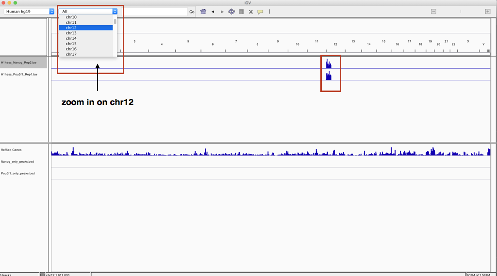

Approximate time: 25 minutes

## Learning Objectives

* Visualize alignment data and ChIP-seq results using the Integrated Genome Viewer. 

## Qualitative assessment using IGV

Another method for assessing the quality of your alignment is to visualize the alignment using a genome browser. For this workshop we will be using the [Integrative Genomics Viewer (IGV)](https://www.broadinstitute.org/igv/) from the Broad Institute. *You should already have this downloaded on your laptop.* 

IGV is an interactive tool which allows exploration of large, integrated genomic datasets. It allows users to visualize different representations of genomic data, including BAM (alignment), BED (peak calls), BigWig (coverage etc.) and many more. In addition, it has a large repository of public data available as well. 

### Transfer files

In order to visualize our ChIP-seq enrichment we will first need to move over some files using Fliezilla or `scp` (see below).

> **Reminder Note: `scp` or "secure copy" allows files to be copied to, from, or between different remote servers.** It uses `ssh` for data transfer and provides the same authentication and same level of security as `ssh`. The first argument is the location on the remote server and the second argument is the destination on your local machine. 
>
> `$ scp username@transfer.rc.hms.harvard.edu:/path/to/file_on_O2 path/to/directory/on/local_machine`

Open up `FileZilla` and connect to the transfer node on O2. Navigate to the correct directory on the cluster panel and copy over the following files:

**Alignment files (BAM + index):**
* Nanog_Rep2 BAM - `~/chipseq/results/bowtie2/H1hesc_Nanog_Rep2_chr12_aln.bam`
* Nanog_Rep2 BAM index (bai) - `~/chipseq/results/bowtie2/H1hesc_Nanog_Rep1_chr12_aln.bam.bai`
* Pou5f1_Rep1 BAM - `~/chipseq/results/bowtie2/H1hesc_Pou5f1_Rep1_chr12_aln.bam`
* Pou5f1_Rep1 BAM index (bai) - `~/chipseq/results/bowtie2/H1hesc_Pou5f1_Rep1_chr12_aln.bam.bai`

**Peak Calls (BED):**
* Nanog-only - `~/chipseq/results/bedtools/Nanog_only_peaks.bed`
* Pou5f1-only - `~/chipseq/results/bedtools/Pou5f1_only_peaks.bed`

**Read density or coverage data (BigWig):**
* Nanog_Rep2 - `~/chipseq/results/visualization/bigWig/H1hesc_Nanog_Rep2.bw`
* Pou5f1_Rep1 - `~/chipseq/results/visualization/bigWig/H1hesc_Pou5f1_Rep1.bw `

> **NOTE:** We are copying over only a single sample bigWig from each group. Since we observed that in each case there was a stronger replicate (high read density) that is what we used to make our selection.

Start [IGV](https://www.broadinstitute.org/software/igv/download) _You should have this previously installed on your laptop._

* Load the Human genome (hg19) into IGV using the dropdown menu at the top left of your screen. _Note: there is also an option to "Load Genomes from File..." under the "Genomes" pull-down menu - this is useful when working with non-model organisms_
* Load the BAM, bigWig files and BED files using the **"Load from File..."** option under the **"File"** pull-down menu. *Do not load the `.bai` or index file.*

Your IGV interface should now look something like the screenshot below. By default, you will be in a zoomed out view. You will notice that for both bigWig tracks there appears to be a dense blue chunk at the beginning of chromosome 12, which makes sense considering the subsetted toy dataset we are working with. **Use the pulldown menu to zoom into chromosome 12.**

* Right click on the left-hand side panel. You should see many options available to you. If "Autoscale" is not checked go ahead and do this. You can do the same for both bigWig tracks.

The interaction between Pou5f1, and Nanog is supported by immunoprecipitation, functional analysis, and co-localization of binding sites, and so it is not surprising that they share the **same target genes**. While our BED files congtain peaks that are non-overlapping, the target genes that harbor these peaks can still be overlapping.

* For example take a look at **Sox5** (use the search box to zoom into the gene). How many peaks are associated with this gene for Nanog? For Pou5f1?
* How convincing is the difference in enrichment?
* For the **Erc1** gene, there is only one peak associated with this gene. Which factor binds here? Is the differential enrichment obvious?

* Finally, we are going to visually **compare our data** to the output from the **full dataset from ENCODE**, by loading that data from the IGV server.

***
*This lesson has been developed by members of the teaching team at the [Harvard Chan Bioinformatics Core (HBC)](http://bioinformatics.sph.harvard.edu/). These are open access materials distributed under the terms of the [Creative Commons Attribution license](https://creativecommons.org/licenses/by/4.0/) (CC BY 4.0), which permits unrestricted use, distribution, and reproduction in any medium, provided the original author and source are credited.*
