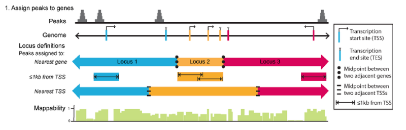
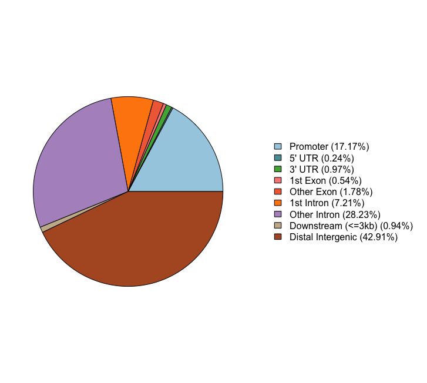
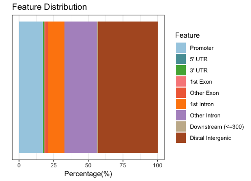
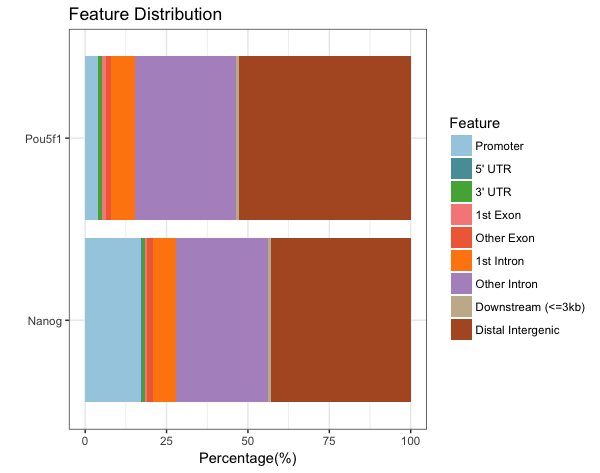
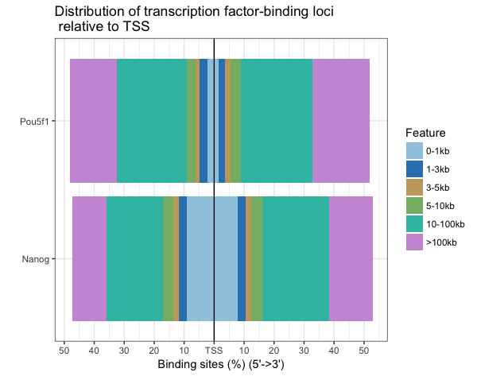
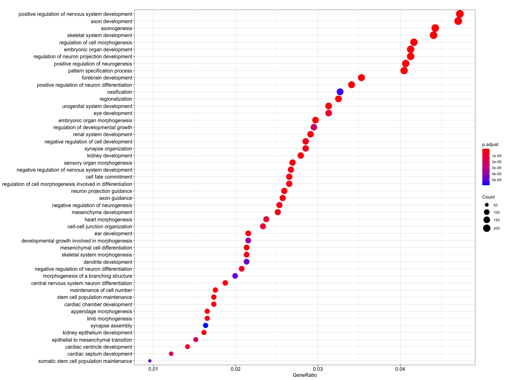
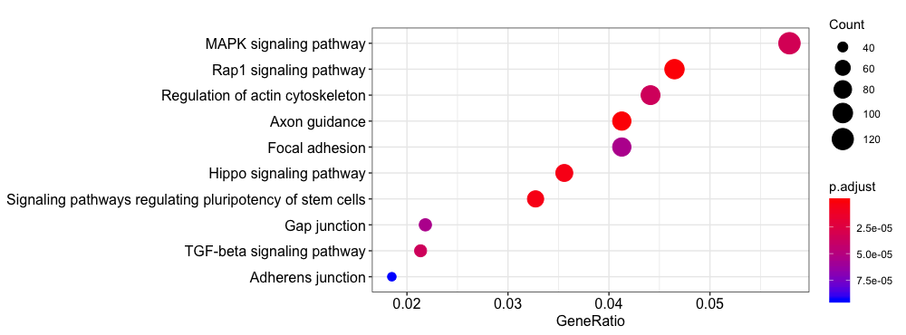
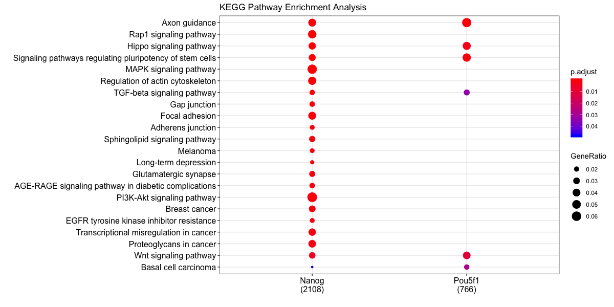

Contributors: Mary Piper and Meeta Mistry

Approximate time: 60 minutes

## Learning Objectives

* Visualizing peak locations with respect to the TSS
* Generating gene annotations for peak calls and evaluating overall distributions across dataset
* Functional enrichment of gene annotations obtained from peak calls


## Peak annotation

Now that we have a set of high confidence peaks for our samples, the next step is to **annotate our peaks to identify relative location relationship information between query peaks and genes/genomic features** to obtain some biological context. 


To annotate our preaks we will be using [ChIPseeker](http://bioconductor.org/packages/release/bioc/vignettes/ChIPseeker/inst/doc/ChIPseeker.html), an R package for annotating ChIP-seq data and various visualization functions.


### Setting up 

1. Open up RStudio and open up the `chipseq-project` that we created previously.
2. Open up a new R script ('File' -> 'New File' -> 'Rscript'), and save it as `chipseeker.R`

> **NOTE:** This next section assumes you have the `ChIPseeker` package installed. You will also need one additional library for gene annotation. If you haven't done this please run the following lines of code before proceeding.
>
```
source("http://bioconductor.org/biocLite.R")
biocLite("ChIPseeker")
biocLite("TxDb.Hsapiens.UCSC.hg19.knownGene")
```

### Getting data 

The input to ChIPseeker is one or more peak callsets. Alhtough we currently have our peak calls copied over for each sample, we are not going to use those and will instead copy over a new set. We have a few reasons for this:

1. Typically, you will want to annotate and characterize your most confident set of peak calls for each sample group. Thus, rather than annotating individual replicates, you will want to use your IDR peakset so you have only one peakset per sample group.
2. The peakcalls we have in our working directory are generated for a subset of the full dataset. The resulting target gene set that we get back from annotating will not be comprehensive enough to give us meaningful results in the downstream functional analysis.

**We have generated a set of high confidence peak calls using the full dataset.** These were obtained post-IDR analysis, (i.e. concordant peaks between replicates) and are provided in BED format which is optimal input for the ChIPseeker package. 
The number of peaks in these BED files are are significantly higher than what we observed with the subsetted data replicate analysis.

We will need to **copy over the appropriate files from O2 to our laptop**. You can do this using `FileZilla` or the `scp` command. The files are located at `/n/groups/hbctraining/chip-seq/full-dataset/idr/*.bed`.

> #### Copying over files using `scp`
> The `scp` command works very much like the `cp` command in that you will need to provide the path to the file you want to copy and the path to the destination. In our case the file lives on O2 and the destination is our laptop.
> 1. Open up a new terminal on your laptop
> 2. Change directories to your Desktop
> 3. Create a directory called `idr-bed`
> 4. Type in the following command (replacing eCommons with your own username): 
> `scp eCommons@transfer.rc.hms.harvard.edu:/n/groups/hbctraining/chip-seq/full-dataset/idr/*.bed idr-bed`
> 
> Once copied over you will want to move the `idr-bed` folder over to your `chipseq-project/data` directory.


### Running ChIPseeker

Let's start by loading the libraries:

```r
# Load libraries
library(ChIPseeker)
library(TxDb.Hsapiens.UCSC.hg19.knownGene)
library(clusterProfiler)
library(annotables)
library(org.Hs.eg.db)
```

Now let's load all of the data. As input we need to provide the names of our BED files in a list format.

```r
# Load data
samplefiles <- list.files("data/idr-bed", pattern= ".bed", full.names=T)
samplefiles <- as.list(samplefiles)
names(samplefiles) <- c("Nanog", "Pou5f1")

```

We need to **assign annotation databases** generated from UCSC to a variable:
        
	# Assign annotation db
	txdb <- TxDb.Hsapiens.UCSC.hg19.knownGene
	
> **NOTE:** *ChIPseeker supports annotating ChIP-seq data of a wide variety of species if they have a transcript annotation TxDb object available.* To find out which genomes have the annotation available follow [this link](http://bioconductor.org/packages/3.5/data/annotation/) and scroll down to "TxDb". Also, if you are interested in creating your own TxDb object you will find [more information here](https://bioconductor.org/packages/devel/bioc/vignettes/GenomicFeatures/inst/doc/GenomicFeatures.pdf). 


### Annotation

ChIPseeker implements the `annotatePeak` function for annotating peaks with nearest gene and genomic region where the peak is located. Many annotation tools calculate the distance of a peak to the nearest TSS and annotates the peak to that gene. This can be misleading as **binding sites might be located between two start sites of different genes**.



The **`annotatePeak` function by default uses the TSS method, and provides parameters to specify a max distance cutoff.** There is also an option to report ALL genes within this distance regardless of whether there is overlap with TSS or not. For annotating genomic regions, annotatePeak function reports detail information when genomic region is Exon or Intron. For instance, ‘Exon (uc002sbe.3/9736, exon 69 of 80)’, means that the peak overlaps with the 69th exon of the 80 exons that transcript uc002sbe.3 possess and the corresponding Entrez gene ID is 9736. 


Let's start by retrieving annotations for our Nanog and Pou5f1 peaks calls:

```
# Get annotations
peakAnnoList <- lapply(samplefiles, annotatePeak, TxDb=txdb, 
                       tssRegion=c(-1000, 1000), verbose=FALSE)
```

If you take a look at what is stored in `peakAnnoList`, you will see a summary of the genomic features for each sample:

```
> peakAnnoList
$Nanog
Annotated peaks generated by ChIPseeker
11023/11035  peaks were annotated
Genomic Annotation Summary:
             Feature  Frequency
9           Promoter 17.1731833
4             5' UTR  0.2358705
3             3' UTR  0.9706976
1           1st Exon  0.5443164
7         Other Exon  1.7781003
2         1st Intron  7.2121927
8       Other Intron 28.2318788
6 Downstream (<=3kb)  0.9434818
5  Distal Intergenic 42.9102785

$Pou5f1
Annotated peaks generated by ChIPseeker
3242/3251  peaks were annotated
Genomic Annotation Summary:
             Feature  Frequency
9           Promoter  3.7939543
4             5' UTR  0.1542258
3             3' UTR  1.0795805
1           1st Exon  1.3263418
7         Other Exon  1.6347933
2         1st Intron  7.4336829
8       Other Intron 30.9685379
6 Downstream (<=3kb)  0.9561999
5  Distal Intergenic 52.6526835
```

To visualize this annotation data ChIPseeker provides several functions. We will **demonstrate a few visualizations** using the Nanog sample only. We will also show how some of the functions can also support comparing across samples.

#### Pie chart of genomic region annotation

These next two figures are two ways of presenting the same information, that is the percentage of peaks that fall into the various categories of genomic features. For the Nanog peaks we find a large number of peaks in distal intergenic regions, and only 17% of peaks falling in promoter regions.

```
plotAnnoPie(peakAnnoList[["Nanog"]])
```



#### Barchart of genomic region annotations

```
plotAnnoBar(peakAnnoList[["Nanog"]])
```



#### Barchart (multiple samples for comparison)

When we compare those numbers across the two factors, we see that the peaks in promoter regions are much fewer for Pou5f1.

```
plotAnnoBar(peakAnnoList)
```




#### Distribution of TF-binding loci relative to TSS 

This plot breaks down the location of each peak relative to the TSS. The x-axis give you the percentage of sites, while the color represents the distance from the TSS. Since we observed almost 50% of the peaks to be in distal intergenic regions, it's not surprising that a large percentage of sites are far away from the TSS.

```
plotDistToTSS(peakAnnoList, title="Distribution of transcription factor-binding loci \n relative to TSS")
```



### Writing annotations to file 

It would be nice to have the annotations for each peak call written to file, as it can be useful to browse the data and subset calls of interest. The **annotation information** is stored in the `peakAnnoList` object. To retrieve it we use the following syntax:

	# Get annotation data frame
	nanog_annot <- as.data.frame(peakAnnoList[["Nanog"]]@anno)
	pou5f1_annot <- as.data.frame(peakAnnoList[["Pou5f1"]]@anno)


Take a look at this dataframe. You should see columns corresponding to your input BED file and addditional columns containing nearest gene(s), the distance from peak to the TSS of its nearest gene, genomic region of the peak and other information. Since some annotation may overlap, ChIPseeker has adopted the following priority in genomic annotation.

* Promoter
* 5’ UTR
* 3’ UTR
* Exon
* Intron
* Downstream (defined as the downstream of gene end)
* Intergenic

One thing we **don't have is gene symbols** listed in table, but we can fetch them using **`annotables`** and add them to the data frame before we write to file. This makes it easier to browse through the results. Let's start with **Nanog**.

```
# Get unique entrez gene Ids
entrezids <- unique(nanog_annot$geneId)

# Get hg19 entrez to gene symbol mappings
entrez2gene <- grch37 %>% 
  filter(entrez %in% entrezids) %>% 
  dplyr::select(entrez, symbol)

# Match to each annotation dataframe
m <- match(nanog_annot$geneId, entrez2gene$entrez)
nanog_annot <- cbind(nanog_annot[,1:14], geneSymbol=entrez2gene$symbol[m], nanog_annot[,15:16])

write.table(nanog_annot, file="results/Nanog_annotation.txt", sep="\t", quote=F, row.names=F)
```

Now we can do the same for the **Pou5f1**:

```
# Get unique entrez gene Ids
entrezids <- unique(pou5f1_annot$geneId)

# Get hg19 entrez to gene symbol mappings
entrez2gene <- grch37 %>% 
  filter(entrez %in% entrezids) %>% 
  dplyr::select(entrez, symbol)

# Match to each annotation dataframe
m <- match(pou5f1_annot$geneId, entrez2gene$entrez)
pou5f1_annot <- cbind(pou5f1_annot[,1:14], geneSymbol=entrez2gene$symbol[m], pou5f1_annot[,15:16])

write.table(pou5f1_annot, file="results/Pou5f1_annotation.txt", sep="\t", quote=F, row.names=F)
```

## Functional enrichment analysis

Once we have obtained gene annotations for our peak calls, we can perform functional enrichment analysis to **identify predominant biological themes among these genes** by incorporating knowledge from biological ontologies such as Gene Ontology, KEGG and Reactome.

Enrichment analysis is a widely used approach to identify biological themes, and we talked about this in great detail during our RNA-seq analysis. Once we have the gene list, it can be used as input to functional enrichment tools such as clusterProfiler (Yu et al., 2012), DOSE (Yu et al., 2015) and ReactomePA. We will go through a few examples here.


### Single sample analysis

Let's start with something we have seen before with RNA-seq functional analysis. We will take our gene list from **Nanog annotations** and use them as input for a **GO enrichment analysis**.

```
# Run GO enrichment analysis 
entrezids <- nanog_annot$geneId %>% 
  as.character() %>% 
  unique()


ego <- enrichGO(gene = entrezids, 
                    keyType = "ENTREZID", 
                    OrgDb = org.Hs.eg.db, 
                    ont = "BP", 
                    pAdjustMethod = "BH", 
                    qvalueCutoff = 0.05, 
                    readable = TRUE)

# Output results from GO analysis to a table
cluster_summary <- data.frame(ego)
write.csv(cluster_summary, "results/clusterProfiler_Nanog.csv")
```

We can visualize the results using the `dotplot` function. We find many terms related to **development and differentiation** and amongst those in the bottom half of the list we see 'stem cell population maintenance'. Functionally, Nanog blocks differentiation. Thus, negative regulation of Nanog is required to promote differentiation during embryonic development. Recently, Nanog has been shown to be involved in neural stem cell differentiation which might explain the abundance of neuro terms we observe.

```
# Dotplot visualization
dotplot(ego, showCategory=50)
```




Let's try a **KEGG pathway enrichment** and visualize again using the the dotplot. Again, we see a relevant pathway 'Signaling pathways regulating pluripotency of stem cells'.

```
ekegg <- enrichKEGG(gene = entrezids,
                 organism = 'hsa',
                 pvalueCutoff = 0.05)

dotplot(ekegg)
```



### Multiple samples

Our dataset consist of two different transcription factor peak calls, so it would be useful to compare functional enrichment results from both. We will do this using the `compareCluster` function. We see similar terms showing up, and in particular the stem cell term is more significant (and a higher gene ratio) in the Pou5f1 data.

```
# Create a list with genes from each sample
genes = lapply(peakAnnoList, function(i) as.data.frame(i)$geneId)

# Run KEGG analysis
compKEGG <- compareCluster(geneCluster = genes, 
                         fun = "enrichKEGG",
                         organism = "human",
                         pvalueCutoff  = 0.05, 
                         pAdjustMethod = "BH")
dotplot(compKEGG, showCategory = 20, title = "KEGG Pathway Enrichment Analysis")
```

 

We have only scratched the surface here with functional analyses. Since the data is compatible with many current R packages for functional enrichment the possibilities there is alot of flexibility and room for customization. For more detailed analysis we encourage you to browse through the [ChIPseeker vignette](http://bioconductor.org/packages/release/bioc/vignettes/ChIPseeker/inst/doc/ChIPseeker.html) and the [clusterProfiler vignette](https://www.bioconductor.org/packages/devel/bioc/vignettes/clusterProfiler/inst/doc/clusterProfiler.html).


## Motif Analysis


The MEME suite of sequence analysis tools offers an enormous amount of functioality for motif analysis and discovery. [DREME](http://meme-suite.org/tools/dreme) is a motif discovery algorithm designed to find short, core DNA-binding motifs of eukaryotic transcription factors and is optimized to handle large ChIP-seq data sets.

DREME is tailored to eukaryotic data by focusing on short motifs (4 to 8 nucleotides) encompassing the DNA-binding region of most eukaryotic monomeric transcription factors. Therefore it may miss wider motifs due to binding by large transcription factor complexes.


DREME’s HTML output provides a list of Discovered Motifs displayed as sequence logos (in the forward and reverse complement (RC) orientations), along with an E-value for the significance of the result. 


***
*This lesson has been developed by members of the teaching team at the [Harvard Chan Bioinformatics Core (HBC)](http://bioinformatics.sph.harvard.edu/). These are open access materials distributed under the terms of the [Creative Commons Attribution license](https://creativecommons.org/licenses/by/4.0/) (CC BY 4.0), which permits unrestricted use, distribution, and reproduction in any medium, provided the original author and source are credited.*
