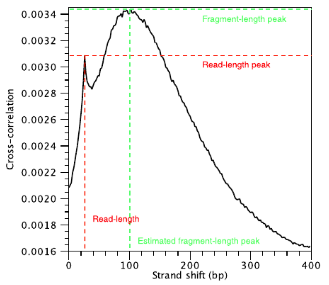

## Quality Metrics Based on Cross-Correlation

Using the cross-correlation plot we can **compute metrics for assessing signal-to-noise ratios in a ChIP-seq experiment**. Poor signal-to-noise can indicate problems with the ChIP-seq data. 

### Cross-correlation plot

Strand cross-correlation is computed as the Pearson's linear correlation between the minus strand and the plus strand, after shifting minus strand by k base pairs. In the end we will have a cross-correlation value for each shift value, and they can be plotted against each other to generate a cross-correlation plot as shown below. The **cross-correlation plot typically produces two peaks**: a peak of enrichment corresponding to the predominant fragment length (highest correlation value) and a peak corresponding to the read length (“phantom” peak).

### Metrics based on the cross-correlation plot

There are two metrics that are computed using the cross-correlation described below. If you are interested in computing these and drawing cross-correlation plots outside of the ChIPQC package you can use [phantompeakqualtools](https://github.com/kundajelab/phantompeakqualtools). 

#### Normalized strand cross-correlation coefficent (NSC):

The ratio of the maximal cross-correlation value divided by the background cross-correlation (minimum cross-correlation value over all possible strand shifts). 

- higher NSC values indicate more enrichment (better signal:noise)
- low signal-to-noise: NSC values < 1.1
- minimum possible NSC value: 1 (no enrichment) 

#### Relative strand cross-correlation coefficient (RSC):

The ratio of the fragment-length cross-correlation value minus the background cross-correlation value, divided by the phantom-peak cross-correlation value minus the background cross-correlation value. 

- high enrichment: RSC values > 1
- low signal-to-noise: RSC values < 0.8
- minimum possible RSC value: 0 (no enrichment)

> **NOTE:** Low NSC and RSC values can be due to failed and poor quality ChIP, low read sequence quality and hence lots of mismappings, shallow sequencing depth or a combination of these. Also, datasets with few binding sites (< 200) which could be due to biological reasons (i.e. a factor that truly binds only a few sites in a particular tissue type) would output low NSC and RSC scores.

### Fragment length 

The shift value at which we observe the highest correlation value is considered to be the estimated fragment length. Some tools will report to you the top three fragment length values if the peak is not entirely clear. You will want the fragment length estimate to roughly resemble the actual fragment length you had decided on when size selecting during your library preparation.

### 'phantom peak'

