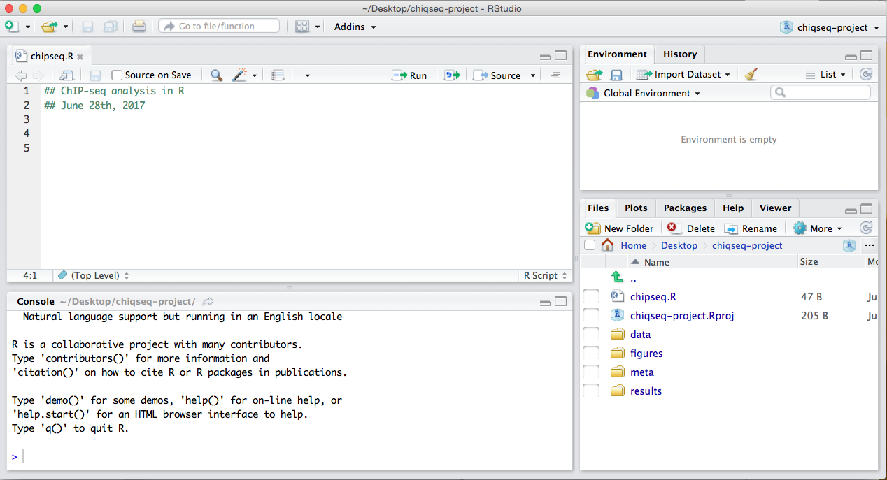
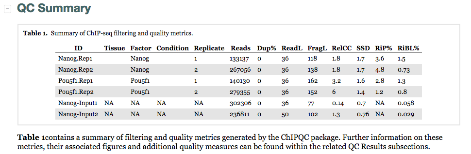
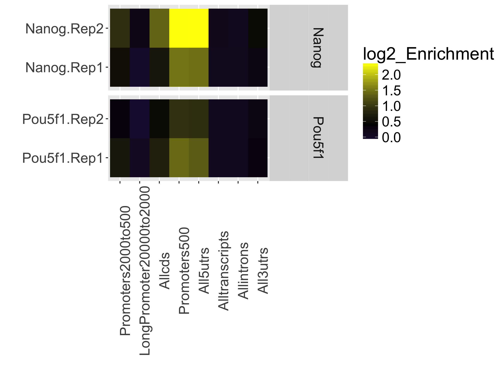
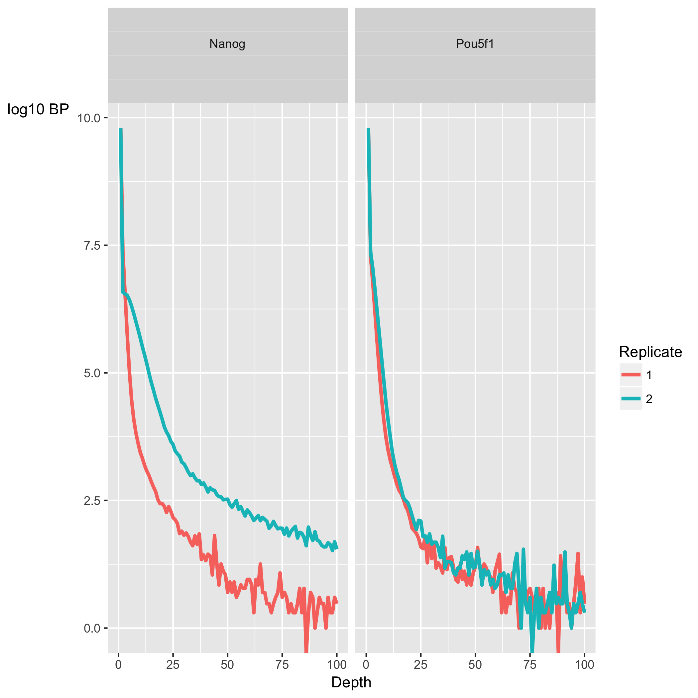
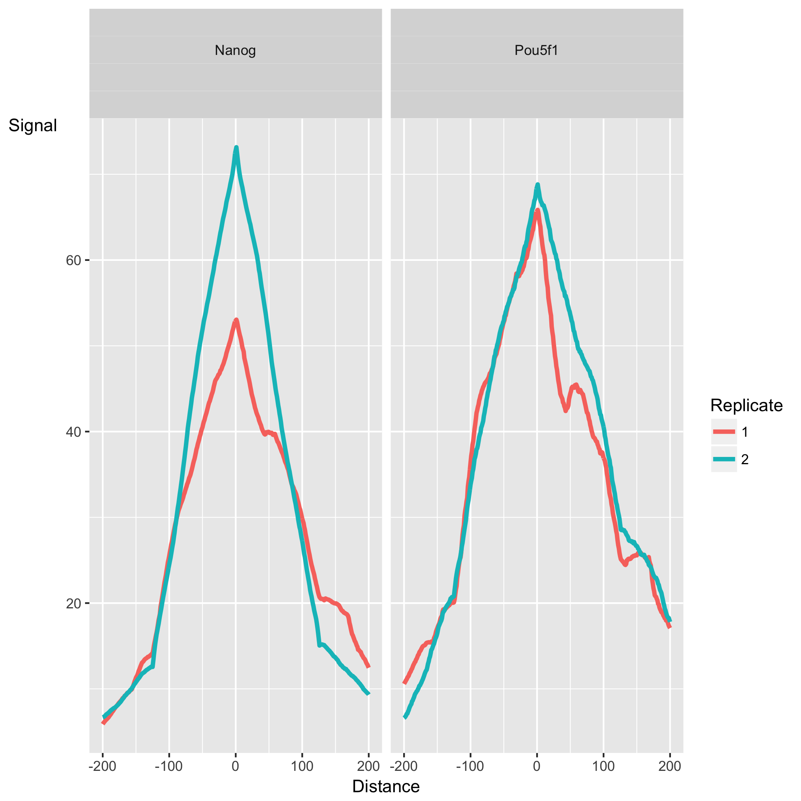
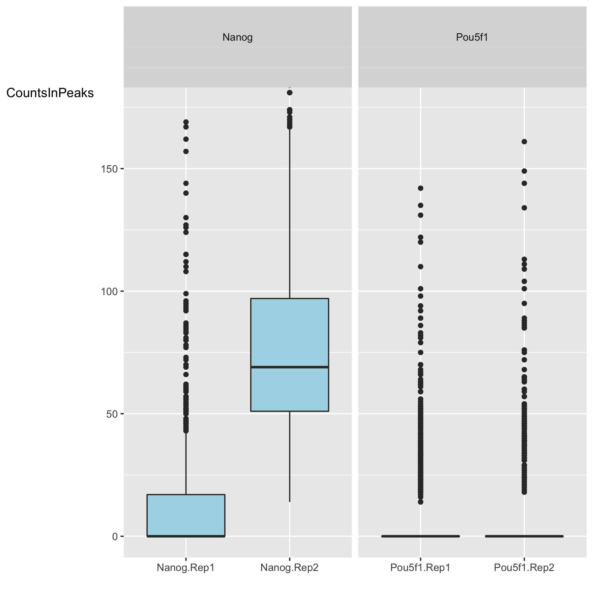
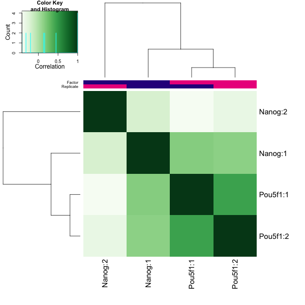
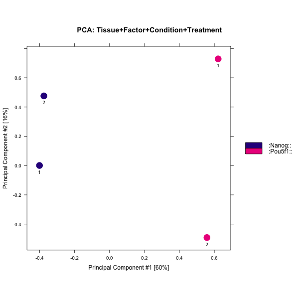

Contributors: Mary Piper, Meeta Mistry and Radhika Khetani

Approximate time: 1.75 hours

## Learning Objectives

* Generate a report containing QC metrics using `ChIPQC`
* Describe QC metrics
* Identify sources of low quality data

## `ChIPQC`: quality metrics report

`ChIPQC` is a Bioconductor package that takes as input BAM files and peak calls to automatically **compute a number of quality metrics and generates a ChIPseq
experiment quality report**. We are going to use this package to generate a report for our Nanog and Pou5f1 samples.

### Setting up 


1. Open up RStudio and create a new project for your ChIP-seq analyses on your Desktop. Select 'File' -> 'New Project' -> 'New directory' and call the new directory `chipseq-project`.
2. Create a directory structure for your analyses. You will want to create four directories: `data`, `meta`, `results`, and `figures`.
3. Inside `data` create two subdirectories: one for your BAM files called `bams` and one for the MACS2 peak calls called `peakcalls`.
4. Open up a new R script ('File' -> 'New File' -> 'Rscript'), and save it as chipQC.R

Your Rstudio interface should look something like the screenshot below:




> **NOTE:** This next section assumes you have the `ChIPQC` package (vChIPQC_1.10.3 or higher) installed for R 3.3.3. If you haven't done this please run the following lines of code before proceeding.
>
```
source("http://bioconductor.org/biocLite.R")
biocLite("ChIPQC")
```

### Getting data 

Now let's move over the appropriate files from Orchestra to our laptop. You can do this using `FileZilla` or the `scp` command.

1. Move over the **BAM files (`_aln.bam`)** and the corresponding **indices (`_aln.bam.bai`)** from `~/chipseq/results/bowtie2` to your laptop. You will want to copy these files into your chipseq-project **into the `data/bams` folder.**

> *NOTE*: Do not copy over the input file that we initially ran QC and alignment on (i.e `H1hesc_Input_Rep1_chr12_aln_sorted.bam`). Only the files you had copied over to your home directory is what you need.


2. Move over the **narrowPeak files (`.narrowPeak`)** `~/chipseq/results/macs2` to your laptop. You will want to copy these files into your chipseq-project **into the `data/peakcalls` folder.**

3. Download the sample data sheet available from [this link](https://github.com/hbctraining/Intro-to-ChIPseq/raw/master/samplesheet_chr12.csv). Move the samplesheet into the `meta` folder.


### Running `ChIPQC` 

Let's start by loading the `ChIPQC` library and the samplesheet into R. Use the `View()` function to take a look at what the samplesheet contains.

```
## Load libraries
library(ChIPQC)

## Load sample data
samples <- read.csv('meta/samplesheet_chr12.csv')
View(samples)
```

The **sample sheet** contains metadata information for our dataset.Each row represents a peak set (which in most cases is every ChIP sample) and several columns of required information, which allows us to easily load the associated data in one single command. _NOTE: The column headers have specific names that are expected by ChIPQC!!_. 

* **SampleID**: Identifier string for sample
* **Tissue, Factor, Condition**: Identifier strings for up to three different factors (You will need to have all columns listed. If you don't have infomation, then set values to NA)
* **Replicate**: Replicate number of sample
* **bamReads**: file path for BAM file containing aligned reads for ChIP sample
* **ControlID**: an identifier string for the control sample
* **bamControl**: file path for bam file containing aligned reads for control sample
* **Peaks**: path for file containing peaks for sample
* **PeakCaller**: Identifier string for peak caller used. Possible values include “raw”, “bed”, “narrow”, “macs”

Next we will create a ChIPQC object which might take a few minutes to run. `ChIPQC` will use the samplesheet read in the data for each sample (BAMs and narrowPeak files) and compute quality metrics. The results will be stored into the object. 

```

## Create ChIPQC object
chipObj <- ChIPQC(samples, annotation="hg19") 

```

Now let's take those quality metrics and summarize information into an HTML report with tables and figures.

```

## Create ChIPQC report
ChIPQCreport(chipObj, reportName="ChIP QC report: Nanog and Pou5f1", reportFolder="ChIPQCreport")

```

If you were unable to run the code successfully you can take a look an example report found [here]().


### `ChIPQC` report


Since our report is based only on a small subset of data, the figures will not be as meaningful. **Take a look at the report generated using the full dataset instead.** Download [this zip archive](https://www.dropbox.com/s/sn8drmjj2tar4xs/ChIPQCreport%20-%20full%20dataset.zip?dl=0). Uncompress it and you should find an html file in the resulting directory. Double click it and it will open in your browser. At the top left you should see a button labeled 'Expand All', click on that to expand all sections.

Let's start with the **QC summary table**:



Here, we see the metrics mentioned above (SSD, RiP and RiBL). A higher SSD is more indicative of better enrichment. Higher scores are obseved for the Pou5f1 replicates and so greatest enrichment for depth of signal. SSD scores are dependent on the degree of total genome wide signal pile-up and so are sensitive to regions of high signal found with Blacklisted regions as well as genuine ChIP enrichment. The RiBL percentages are not incredibly high (also shown in the plot in the  next section) and FriP percentages are around 5% or higher, except for Pou5f1-rep2. 

Additionally, we see other statistics related to the strand cross-correlation (FragLength and RelCC which is similar to the RSC). With RelCC values larger than one for all ChIP samples suggest good enrichment.

The next table contains **the mapping quality, and duplication rate,** however since we had already filtered our BAM files we find the numbers do not report much for us.

Next is a plot showing the effect of blacklisting, with the proportion of reads that do and do not overlap with blacklisted regions. The final plot in this section uses the genomic annotation to show **where reads map in terms of genomic features**. This is represented as a heatmap showing the enrichment of reads compared to the background levels of the feature. We find that there is most enrichment in promotor regions. This plot is useful when you expect enrichment of specific genomic regions.  
 


The next section, **ChIP Signal Distribution and Structure**, looks at the inherent ”peakiness” of the samples. The first plot is a **coverage histogram**. The x-axis represents the read pileup height at a basepair position, and the y-axis represents how many positions have this pileup height. This is on a log scale. **A ChIP sample with good enrichment should have a reasonable ”tail”, that is more positions (higher values on the y-axis) having higher sequencing depth**. 
Samples with low enrichment (i.e input), consisting of mostly background reads will have lower genome wide low pile-up. In our dataset, the Nanog samples have quite heavy tails compared to Pou5f1, especially replicate 2. The SSD scores, however, are higher for Pou5f1. When SSD is high but coverage looks low it is possibly due to the presence of large regions of high depth and a flag for blacklisting of genomic regions. The cross-correlation plot which is displayed next is one we have already covered. 




The final set of plots, **Peak Profile and ChIP Enrichment**, are based on metric computed using the supplied peaks if available. The first plot shows average peak profiles, centered on the summit (point of highest pileup) for each peak.



The **shape of these profiles can vary depending on what type of mark is being studied** – transcription factor, histone mark, or other DNA-binding protein such as a polymerase – but similar marks usually have a distinctive profile in successful ChIPs. 

Next we have two plots that summarize the number of **Reads in Peaks**. ChIP samples with good enrichment will have a higher proportion of their reads overlapping called peaks. Although RiP is higher in Nanog, the boxplot for the Nanog samples shows quite different distributions between the replicates compared to Pou5f1.





Finally, there are plots to show **how the samples are clustered**. The correlation heatmap is based on correlation values for all the peak scores for each sample. The other plot shows the first two principal component values for each sample. In our dataset, the replicates do cluster by replicate for Pou5f1, which is a positive sign. For Nanog we see that Replicate 1 appears to correlate slightly better with Pou5f1 than with Replicate 2. The PCA also demonstrates distance between the Nanog replicates.






In general, our data look good. There is some discordance apparent between the Nanog replicates and this combined with lower SSD scores might indicate that while there are many peaks identified it is mainly due to noise. 

## Experimental biases: sources of low quality ChIP-seq data

Once you have identified low quality samples, th next logical step is to troubleshoot what might be causing it.

* **Strength/efficiency and specificity of the immunoprecipitation** 

The quality of a ChIP experiment is ultimately dictated by the specificity of the antibody and the degree of enrichment achieved in the affinity precipitation step [[1]](https://www.ncbi.nlm.nih.gov/pmc/articles/PMC3431496/). Antibody deficiencies are of two main types:

1. Poor reactivity against the intended target
2. Non-specific antibody, causing cross-reactivity with other DNA-associated proteins

Antibodies directed against transcription factors must be characterized using both a primary (i.e immunoblot, immunofluorescence) and secondary characterization (i.e knockout of target protein, IP with multiple antibodies).

* **Fragmentation/digestion**

The way in which sonication is carried out can result in different fragment size distributions and, consequently, sample-specific chromatin configuration induced biases. As a result, it is not recommended to use a single input sample as a control for ChIP-seq peak calling if it is not sonicated together with the ChIP sample. 

* **Biases during library preparation:** 

*PCR amplification:* Biases arise because DNA sequence content and length determine the kinetics of annealing and denaturing in each cycle of PCR. The combination of temperature profile, polymerase and buffer used during PCR can therefore lead to differential efficiencies in amplification between different sequences, which could be exacerbated with increasing PCR cycles. This is often manifest as a bias towards GC rich fragments [[2]](https://www.ncbi.nlm.nih.gov/pmc/articles/PMC4473780/). **Limited use of PCR amplification is recommended because bias increases with every PCR cycle.**


***

> **NOTE:** Many of the plots that were generated in the ChIPQC report can also be generated using [`deepTools`](http://deeptools.readthedocs.org/en/latest/content/list_of_tools.html), a suite of python tools developed for the efficient analysis of high-throughput sequencing data, such as ChIP-seq, RNA-seq or MNase-seq. If you are interested in learning more we have a [lesson on quality assessment using deepTools](https://github.com/hbctraining/In-depth-NGS-Data-Analysis-Course/blob/may2017/sessionV/lessons/qc_deeptools.md).

***
*This lesson has been developed by members of the teaching team at the [Harvard Chan Bioinformatics Core (HBC)](http://bioinformatics.sph.harvard.edu/). These are open access materials distributed under the terms of the [Creative Commons Attribution license](https://creativecommons.org/licenses/by/4.0/) (CC BY 4.0), which permits unrestricted use, distribution, and reproduction in any medium, provided the original author and source are credited.*

*Details on ChIPQC plots was taken from the [ChIPQC vignette](http://bioconductor.org/packages/release/bioc/vignettes/ChIPQC/inst/doc/ChIPQC.pdf), which provides a walkthrough with examples and thorough explanations.*

