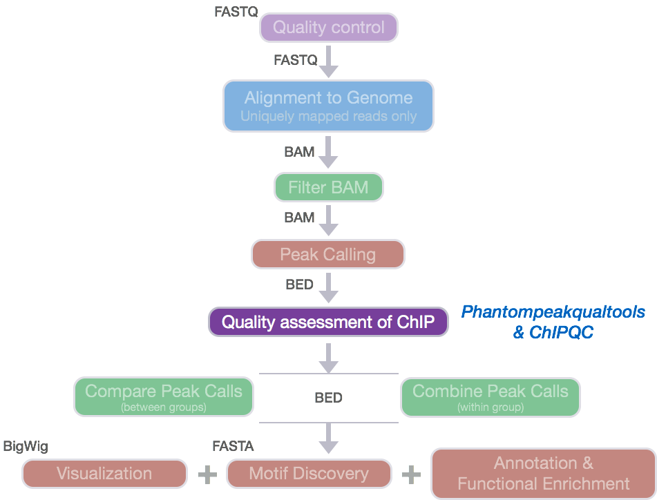
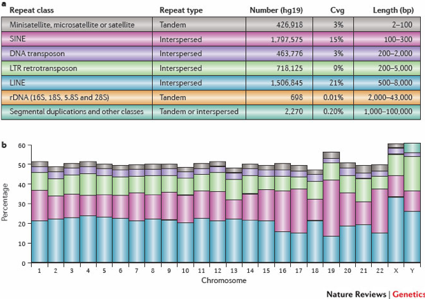
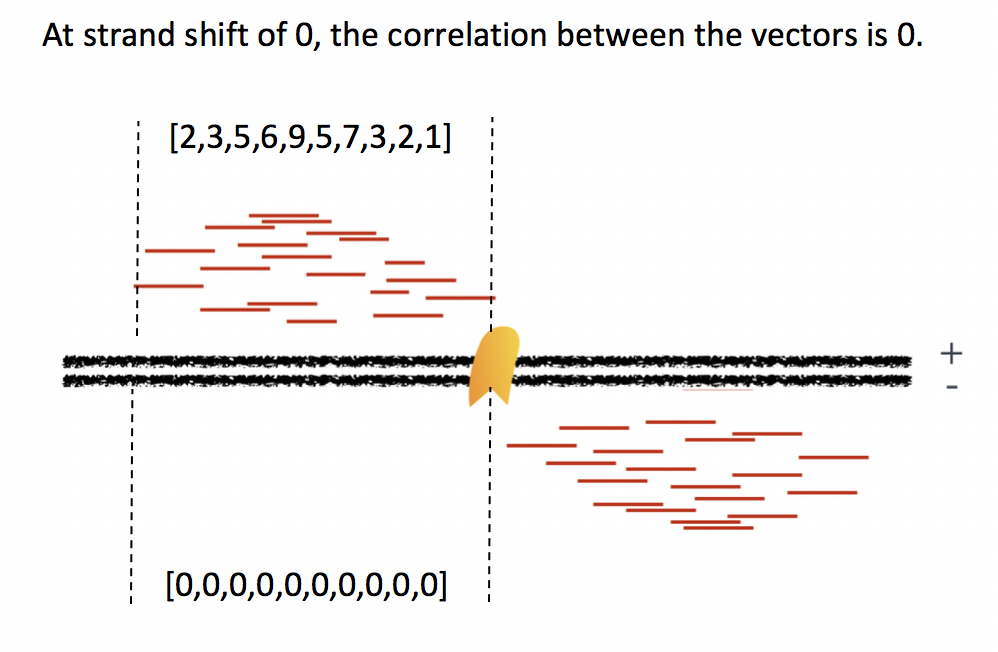
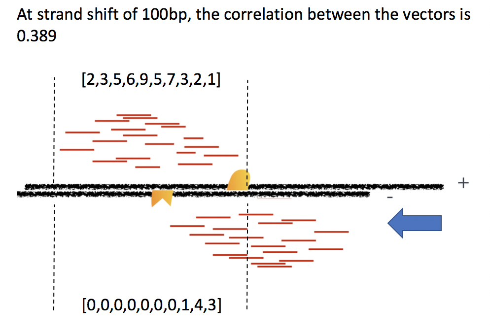
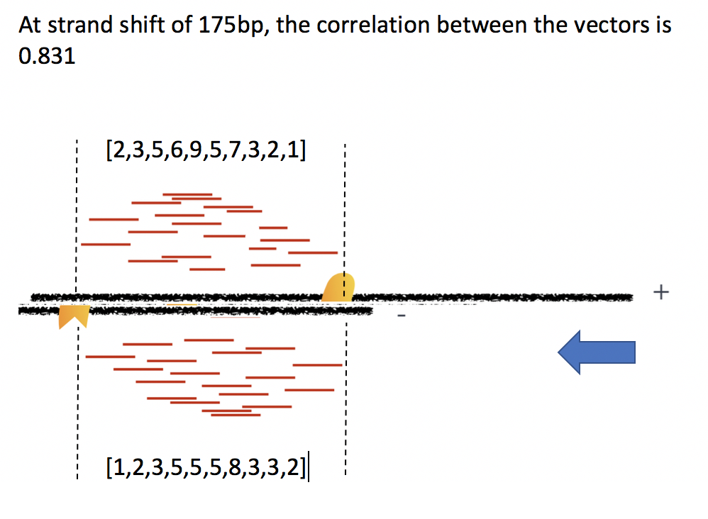

Contributors: Mary Piper, Meeta Mistry and Radhika Khetani

Approximate time: 1.75 hours

## Learning Objectives

* Generate a report containing QC metrics using `ChIPQC`
* Describe QC metrics
* Identify sources of low quality data

## ChIP-seq quality assessment using ChIPQC

Prior to performing any downstream analyses with the results from a peak caller, it is best practice to assess the quality of your ChIP-seq data. What we are looking for is good quality ChIP enrichment over background.



Today, we will be using `ChIPQC`, a Bioconductor package that takes as input BAM files and peak calls to automatically **compute a number of quality metrics and generates a ChIPseq
experiment quality report**. We are going to use this package to generate a report for our Nanog and Pou5f1 samples.

### Setting up 

1. Open up RStudio and create a new project for your ChIP-seq analyses on your Desktop. Select 'File' -> 'New Project' -> 'New directory' and call the new directory `chipseq-project`.
2. Create a directory structure for your analyses. You will want to create four directories: `data`, `meta`, `results`, and `figures`.
3. Inside `data` create two subdirectories: one for your BAM files called `bams` and one for the MACS2 peak calls called `peakcalls`.
4. Open up a new R script ('File' -> 'New File' -> 'Rscript'), and save it as chipQC.R

Your Rstudio interface should look something like the screenshot below:


> **NOTE:** This next section assumes you have the `ChIPQC` package (vChIPQC_1.10.3 or higher) installed for R 3.3.3. If you haven't done this please run the following lines of code before proceeding.
>
```
source("http://bioconductor.org/biocLite.R")
biocLite("ChIPQC")
```

### Get data 

Now let's move over the appropriate files from Orchestra to our laptop. You can do this using `FileZilla` or the `scp` command.

1. Move over the **BAM files (`_aln.bam`)** and the corresponding **indices (`_aln.bam.bai`)** from `~/chipseq/results/bowtie2` to your laptop. You will want to copy these files into your chipseq-project **into the `data/bams` folder.**

> *NOTE*: Do not copy over the input file that we initially ran QC and alignment on (i.e `H1hesc_Input_Rep1_chr12_aln_sorted.bam`). Only the files you had copied over to your home directory is what you need.


2. Move over the **narrowPeak files (`.narrowPeak`)** `~/chipseq/results/macs2` to your laptop. You will want to copy these files into your chipseq-project **into the `data/peakcalls` folder.**

3. Download the sample data sheet available from [this link](https://github.com/hbctraining/Intro-to-ChIPseq/raw/master/samplesheet_chr12.csv). Move the samplesheet into the `meta` folder.


### Run `ChIPQC` 

Let's start by loading the `ChIPQC` library and the samplesheet into R. Use the `View()` function to take a look at what the samplesheet contains.

```
## Load libraries
library(ChIPQC)

## Load sample data
samples <- read.csv('meta/samplesheet_chr12.csv')
View(samples)
```

The **sample sheet** contains metadata information for our dataset.Each row represents a peak set (which in most cases is every ChIP sample) and several columns of required information, which allows us to easily load the associated data in one single command. _NOTE: The column headers have specific names that are expected by ChIPQC!!_. 

* **SampleID**: Identifier string for sample
* **Tissue, Factor, Condition**: Identifier strings for up to three different factors (You will need to have all columns listed. If you don't have infomation, then set values to NA)
* **Replicate**: Replicate number of sample
* **bamReads**: file path for BAM file containing aligned reads for ChIP sample
* **ControlID**: an identifier string for the control sample
* **bamControl**: file path for bam file containing aligned reads for control sample
* **Peaks**: path for file containing peaks for sample
* **PeakCaller**: Identifier string for peak caller used. Possible values include “raw”, “bed”, “narrow”, “macs”

Next we will create a ChIPQC object which might take a few minutes to run. `ChIPQC` will use the samplesheet read in the data for each sample (BAMs and narrowPeak files) and compute quality metrics. The results will be stored into the object. 

```
## Create ChIPQC object
chipObj <- ChIPQC(samples, annotation="hg19") 
```

Now let's take those quality metrics and summarize information into an HTML report with tables and figures.

```
## Create ChIPQC report
ChIPQCreport(chipObj, reportName="ChIP QC report: Nanog and Pou5f1", reportFolder="ChIPQCreport")
```

> If you were unable to run the code successfully you download [this zipped folder](https://github.com/hbctraining/In-depth-NGS-Data-Analysis-Course/raw/master/sessionV/results/ChIPQCreport.zip), and open the html within. However, it may be better to download the report for the full dataset linked below instead.


### `ChIPQC` report


Since our report is based only on a small subset of data, the figures will not be as meaningful. **Take a look at the report generated using the full dataset instead.** Download [this zip archive](https://www.dropbox.com/s/sn8drmjj2tar4xs/ChIPQCreport%20-%20full%20dataset.zip?dl=1). Uncompress it and you should find an html file in the resulting directory. Double click it and it will open in your browser. At the top left you should see a button labeled 'Expand All', click on that to expand all sections.

#### The QC summary table:


Here, we see a table with some known columns and some columns that we have not talked about before. The information under the *SSD, RiP and RiBL columns* are metrics developed and described by the [ENCODE consortium](https://genome.ucsc.edu/ENCODE/qualityMetrics.html), and calculated for us by ChIPQC. These will allow us to **assess the distribution of signal within enriched regions, within/across expected annotations, across the whole genome, and within known artefact regions.**

> **NOTE**: For some of the metrics we give examples of what is considered a 'good measure' indicative of good quality data. Keep in mind that passing this threshold does not automatically mean that an experiment is successful and a values that fall below the threshold does not automatically mean failure!

Let's take a closer look what these metrics are telling us:

**SSD**

The SSD score is a measure used to indicate evidence of enrichment. It provides a measure of read pileup across the genome and is computed by looking at the standard deviation of signal pile-up along the genome normalised to the total number of reads. 

A "good" or enriched sample typically has regions of significant read pile-up so **a higher SSD is more indicative of better enrichment**. SSD scores are dependent on the degree of total genome wide signal pile-up and therefore are sensitive to regions of high signal found with Blacklisted regions as well as genuine ChIP enrichment. 

In our dataset, higher scores are observed for the Pou5f1 replicates which indicates greater enrichment relative to sequencing depth as compared to Nanog reps.

MEETA: ADD A NOTE ABOUT WHY NANOG SAMPLES ARE STILL BETTER.

**RiP: Fraction of Reads in Peaks**

This value reports the percentage of reads that overlap within called peaks. This is another good indication of how ”enriched” the sample is, or the success of the immunoprecipitation. It can be considered a ”signal-to-noise” measure of what proportion of the library consists of fragments from binding sites vs. background reads. 

RiP (also called FRiP) values will vary depending on the protein of interest:

 * A typical good quality TF with successful enrichment would exhibit a RiP around 5% or higher. 
 * A good quality PolII would exhibit a RiP of 30% or higher. 
 * There are also known examples of good datasets with FRiP < 1% (i.e. RNAPIII).

In our dataset, RiP percentages are higher for the Nanog replicates as compared to Pou5f1, with Pou5f1-rep2 being very low.

**RiBL: Reads overlapping in Blacklisted Regions**

It is important to keep track of and filter artifact regions that tend to show artificially high signal (likely due to excessive unstructured anomalous reads mapping). The blacklisted regions typically appear uniquely mappable so simple mappability filters do not remove them. These regions are often found at specific types of repeats such as centromeres, telomeres and satellite repeats. **The signal from blacklisted regions has been shown to contribute to confound peak callers and fragment length estimation.** 



The RiBL score acts as a guide for the level of background signal in a ChIP or input and is found to be correlated with SSD in input samples and the read length cross coverage score in both input and ChIP samples. These regions represent around 0.5% of genome, yet can account for high proportion of total signal (> 10%).

**Lower RiBL percentages are better than higher.** In our experiment, the RiBL percentages look reasonable since they not incredibly high (also shown in the plot in the next section).

> **NOTE:** If you had filtered out blacklisted regions before peak calling, and those filtered BAM files are used as input to `ChIPQC` you will not need to evaluate this metric.
>
> **How were the 'blacklists compiled?** These blacklists were empirically derived from large compendia of data using a combination of automated heuristics and manual curation. Blacklists were generated for various species including and genome versions including human, mouse, worm and fly. The lists can be [downloaded here.](http://mitra.stanford.edu/kundaje/akundaje/release/blacklists/). For human, they used 80 open chromatin tracks (DNase and FAIRE datasets) and 12 ChIP-seq input/control tracks spanning ~60 cell lines in total. These blacklists are applicable to functional genomic data based on short-read sequencing (20-100bp reads). These are not directly applicable to RNA-seq or any other transcriptome data types. 

**Metrics from cross-correlation: FragL and RelCC (RSC):**
 
In addition to the 3 metrics above, we see other statistics related to the strand cross-correlation: FragLength and RelCC (also called RSC). **RelCC values larger than 1 for all ChIP samples suggest good enrichment** and the **FragL values should be roughly the same as the fragment length you picked in the size selection step during library prepation**. 

***Please note we will discuss cross-correlation later in this lesson and we will come back to both of these metrics then.***

#### Mapping Quality table

This table contains **the mapping quality, and duplication rate,** however since we had already filtered our BAM files we find the numbers do not report much for us.

#### Plot of percentage of reads in blacklists

ADD TEXT

#### Heatmap of log2 enrichment of reads in genomic features

Next is a plot showing the effect of blacklisting, with the proportion of reads that do and don't overlap with blacklisted regions. The final plot in this section uses the genomic annotation to show **where reads map in terms of genomic features**. This is represented as a heatmap showing the enrichment of reads compared to the background levels of the feature. We find that there is most enrichment in promotor regions. This plot is useful when you expect enrichment of specific genomic regions.  
 


In our dataset, the "Promoters500" and "All5UTRs" categories seem to be lighting up, which is great since it meets our expectations of where Nanog and Pou5f1 should be binding as transcription factors.

#### Coverage histogram

The next section, **ChIP Signal Distribution and Structure**, looks at the inherent ”peakiness” of the samples. The first plot is a **coverage histogram**. The x-axis represents the read pileup height at a basepair position, and the y-axis represents how many positions have this pileup height. This is on a log scale. 

**A ChIP sample with good enrichment should have a reasonable ”tail”, that is more positions (higher values on the y-axis) having higher sequencing depth**. Samples with low enrichment (i.e input), consisting of mostly background reads will have lower genome wide low pile-up. 


In our dataset, the Nanog samples have quite heavy tails compared to Pou5f1, especially replicate 2. The SSD scores, however, are higher for Pou5f1. When SSD is high but coverage looks low it is possibly due to the presence of large regions of high depth and a flag for blacklisting of genomic regions. 

MEETA: CLARIFY THE LANGUAGE ABOUT CURVE HEAVINESS

#### Strand cross-correlation

A very useful ChIP-seq quality metric that is independent of peak calling is **strand cross-correlation**. It is based on the fact that a high-quality ChIP-seq experiment will produce significant clustering of enriched DNA sequence tags at locations bound by the protein of interest; the expectation is that we can observe a bimodal enrichment of reads (sequence tags) on both the forward and the reverse strands.

***

***How are the Cross-Correlation scores calculated?***

*Using a small genomic window as an example, let's walk through the details of the cross-correlation below. It is important to note that the cross-correlation metric is computed as the **Pearson's linear correlation between the minus strand and the plus strand**, after shifting minus strand by k base pairs.*

**REPLACE ALL OF THESE FIGURES**







*In the end, we will have a table of values mapping each base pair shift to a Pearson correlation value.* ***These Pearson correlation values are computed for every peak for each chromosome and values are multiplied by a scaling factor and then summed across all chromosomes.***

***

Once the final cross-correlation values have been calculated, they can be plotted (Y-axis) against the shift value (X-axis) to generate a cross-correlation plot! The cross-correlation plot **typically produces two peaks**: a peak of enrichment corresponding to the predominant **fragment length** (highest correlation value) and a peak corresponding to the **read length** (“phantom” peak).

Let's take a look at the cross-correlation plot ChIPQC generated for us:


In our dataset, ADD SOME TEXT HERE THAT EVALUATES THIS PLOT BRIEFLY

> **Examples of Cross-Correlation Plots**
> 
> *Strong signal*
> 
> High-quality ChIP-seq data sets tend to have a larger fragment-length peak compared with the read-length peak. An example of a **strong signal** is shown below using data from **CTCF (zinc-finger transcription factor)** in human cells. With a good antibody, transcription factors will typically result in 45,000 - 60,000 peaks. The red vertical line shows the dominant peak at the true peak shift, with a small bump at the blue vertical line representing the read length.
> 
>  
> 
> *Weak signal*
> 
> An example of **weaker signal** is demonstrated below with a **Pol2** data. Here, this particular antibody is not very efficient and these are broad scattered peaks. We observe two peaks in the cross-correlation profile: one at the true peak shift (~185-200 bp) and the other at read length. For weak signal datasets, the **read-length peak will start to dominate**.
> 
> 
> 
> *No signal*
> 
> A failed experiment will resemble a cross-correlation plot using **input only**, in which we observe little or no peak for fragment length. Note in the example below the **strongest peak is the blue line (read length)** and there is basically no other significant peak in the profile. The absence of a peak is expected since there should be no significant clustering of fragments around specific target sites (except potentially weak biases in open chromatin regions depending on the protocol used).
> 
>  

#### Peak Profile and ChIP Enrichment

This final set of plots are based on metric computed using the supplied peaks if available. These show average peak profiles, centered on the summit (point of highest pileup) for each peak.

The **shape of these profiles can vary depending on what type of mark is being studied** – transcription factor, histone mark, or other DNA-binding protein such as a polymerase – but similar marks usually have a distinctive profile in successful ChIPs. 


In our dataset, ADD SOME TEXT HERE THAT EVALUATES THIS PLOT BRIEFLY

#### Reads in Peaks

Next we have two plots that summarize the number of **Reads in Peaks**. ChIP samples with good enrichment will have a higher proportion of their reads overlapping called peaks. Although RiP is higher in Nanog, the boxplot for the Nanog samples shows quite different distributions between the replicates compared to Pou5f1.


#### Sample similarity

Finally, there are plots to show **how the samples are clustered** using methods we have seen in the RNA-seq lessons. 

The correlation heatmap is based on correlation values for all the peak scores for each sample. 


The other plot shows the first two principal component values for each sample. 


According to the heatmap the Pou5f1 replicates cluster together, which is good. However, for Nanog we see that Replicate 1 appears to correlate slightly better with the Pou5f1 replicates than with Replicate 2.

In the PCA plot however, Nanog and Pou5f1 replicates are clustering appropriately in the context of PC1. 

### Final takehome from ChIPQC

In general, our data look good. There is some discordance apparent between the Nanog replicates and this combined with lower SSD scores might indicate that while there are many peaks identified it is mainly due to noise. 

## Experimental biases: sources of low quality ChIP-seq data

Once you have identified low quality samples, the next logical step is to troubleshoot what might be causing it.

* **Strength/efficiency and specificity of the immunoprecipitation** 

The quality of a ChIP experiment is ultimately dictated by the specificity of the antibody and the degree of enrichment achieved in the affinity precipitation step [[1]](https://www.ncbi.nlm.nih.gov/pmc/articles/PMC3431496/). Antibody deficiencies are of two main types:

1. Poor reactivity against the intended target
2. Non-specific antibody, causing cross-reactivity with other DNA-associated proteins

Antibodies directed against transcription factors must be characterized using both a primary (i.e immunoblot, immunofluorescence) and secondary characterization (i.e knockout of target protein, IP with multiple antibodies).

* **Fragmentation/digestion**

The way in which sonication is carried out can result in different fragment size distributions and, consequently, sample-specific chromatin configuration induced biases. As a result, it is not recommended to use a single input sample as a control for ChIP-seq peak calling if it is not sonicated together with the ChIP sample. 

* **Biases during library preparation:** 

*PCR amplification:* Biases arise because DNA sequence content and length determine the kinetics of annealing and denaturing in each cycle of PCR. The combination of temperature profile, polymerase and buffer used during PCR can therefore lead to differential efficiencies in amplification between different sequences, which could be exacerbated with increasing PCR cycles. This is often manifest as a bias towards GC rich fragments [[2]](https://www.ncbi.nlm.nih.gov/pmc/articles/PMC4473780/). **Limited use of PCR amplification is recommended because bias increases with every PCR cycle.**


***

> **NOTE:** Many of the plots that were generated in the ChIPQC report can also be generated using [`deepTools`](http://deeptools.readthedocs.org/en/latest/content/list_of_tools.html), a suite of python tools developed for the efficient analysis of high-throughput sequencing data, such as ChIP-seq, RNA-seq or MNase-seq. If you are interested in learning more we have a [lesson on quality assessment using deepTools](https://github.com/hbctraining/In-depth-NGS-Data-Analysis-Course/blob/may2017/sessionV/lessons/qc_deeptools.md).

***
*This lesson has been developed by members of the teaching team at the [Harvard Chan Bioinformatics Core (HBC)](http://bioinformatics.sph.harvard.edu/). These are open access materials distributed under the terms of the [Creative Commons Attribution license](https://creativecommons.org/licenses/by/4.0/) (CC BY 4.0), which permits unrestricted use, distribution, and reproduction in any medium, provided the original author and source are credited.*

*Details on ChIPQC plots was taken from the [ChIPQC vignette](http://bioconductor.org/packages/release/bioc/vignettes/ChIPQC/inst/doc/ChIPQC.pdf), which provides a walkthrough with examples and thorough explanations.*


***


---
title: "ChIP Quality Assessment Metrics"
authors: "Mary Piper and Meeta Mistry"
date: "March 17, 2018"
---

Approximate time: 60 minutes

## Learning Objectives

* Discuss sources of low quality ChIP-seq data
* Understand strand cross-correlation
* Evaluate and interpret QC metrics and the cross-correlation plot


## Additional Quality Metrics for ChIP-seq data


### Quality Metrics Based on Cross-Correlation

Using the cross-correlation plot we can **compute metrics for assessing signal-to-noise ratios in a ChIP-seq experiment** and to ensure the fragment length is accurate based on the experimental design. Poor signal-to-noise and inaccurate fragment lengths can indicate problems with the ChIP-seq data. These metrics are described in more detail below:

#### Normalized strand cross-correlation coefficent (NSC):

The ratio of the maximal cross-correlation value divided by the background cross-correlation (minimum cross-correlation value over all possible strand shifts). 


- higher NSC values indicate more enrichment (better signal:noise)
- low signal-to-noise: NSC values < 1.1
- minimum possible NSC value: 1 (no enrichment) 

#### Relative strand cross-correlation coefficient (RSC):

The ratio of the fragment-length cross-correlation value minus the background cross-correlation value, divided by the phantom-peak cross-correlation value minus the background cross-correlation value. 


- high enrichment: RSC values > 1
- low signal-to-noise: RSC values < 0.8
- minimum possible RSC value: 0 (no enrichment)


> **NOTE:** Low NSC and RSC values can be due to failed and poor quality ChIP, low read sequence quality and hence lots of mismappings, shallow sequencing depth or a combination of these. Datasets with few binding sites (< 200) could be due to biological reasons, such as a factor that truly binds only a few sites in a particular tissue type, which would output low NSC and RSC scores.


### Relative Enrichment of Genomic Intervals (REGI)

Using the genomic regions identified as called peaks, we can obtain **genomic annotation to show where reads map in terms of various genomic features**. We then evaluate the relative enrichment across these regions and make note of how this compares to what we expect for enrichment for our protein of interest.

