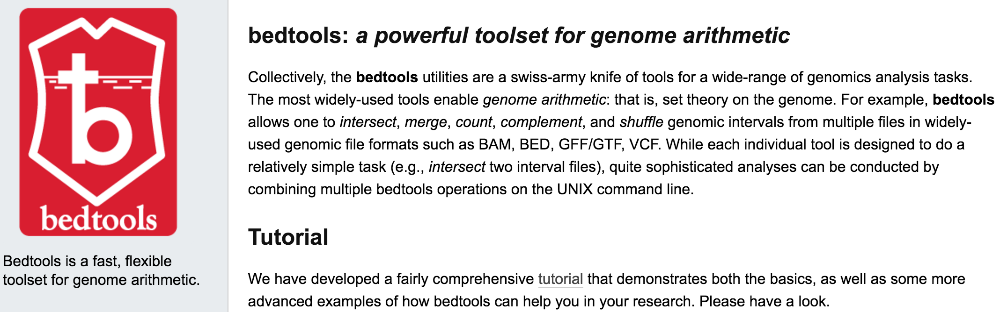
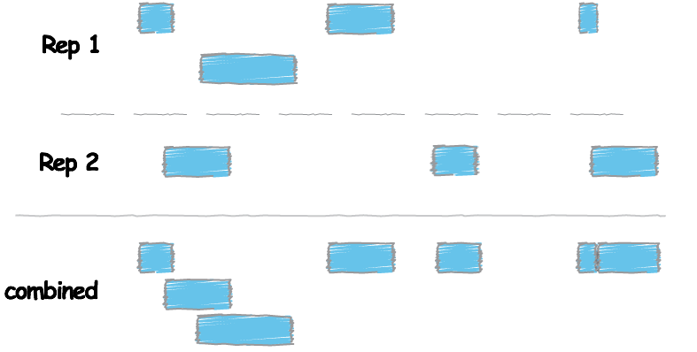
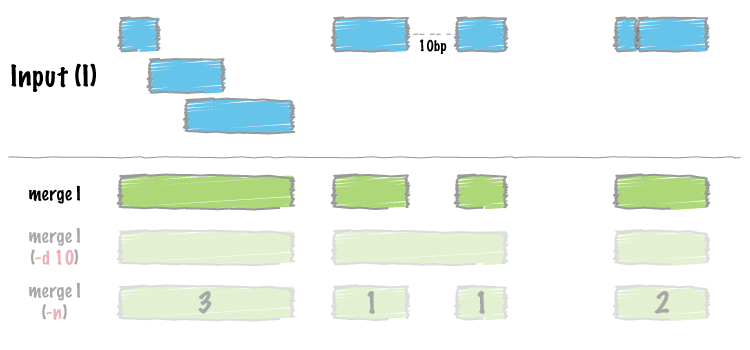
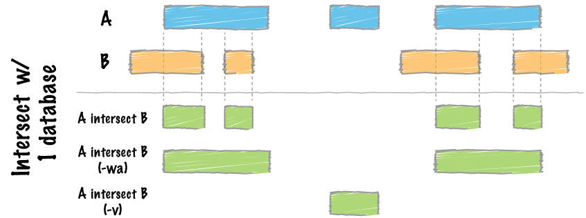

Contributors: Radhika Khetani, 

Approximate time: 60 minutes

## Learning Objectives

* Learn how to perform coordinate-based analysis using *bedtools*
* Explore ChIP-seq data in IGV


## How much overlap exists between SPP and MACS2?

In this section, our goal is to determine what peaks are in common between the calls made by both SPP and MACS2. To perform this task we are going to use a suite of tools called bedtools.

### bedtools

The idea is that genome coordinate information can be used to perform relatively simple arithmetic, like combining, subsetting, intersecting, etc., to obtain all sorts of information. [bedtools](http://bedtools.readthedocs.org/en/latest/index.html) from [Aaron Quinlan's group](http://quinlanlab.org/) at University of Utah is an easy to use, extremely versatile tool that performs tasks of this nature. 


As the name implies, this suite of tools works with bed files; in addition it works with other file formats that have genome coordinate information. 


> Note: When working with multiple files to perform arithmetic on genomic coordinates, it is essential that all files have coordinate information for the same exact version of the genome!

### Setting up

	$ bsub -Is -q interactive bash
	
	$ cd ~/ngs_course/chipseq/results/
	
	$ module load seq/BEDtools/2.23.0
	
	$ module load seq/samtools/1.3

	$ mkdir -p overlap_spp_macs2/
	
	$ cd overlap_spp_macs2/

### Finding the Nanog peaks that overlap between SPP and MACS2

Before using bedtools to obtain the overlap, we need to combine the information from both replicates.

#### Combining the replicates



```
# Combine the peaks called for both replicates by SPP using `cat`

$ cat ../spp/Nanog_Rep1.narrowPeak ../spp/Nanog_Rep2.narrowPeak > spp_Nanog.narrowPeak
	
# Sort/re-order the combined files by coordinates using `sort`

$ sort -k1,1 -k2,2n spp_Nanog.narrowPeak > spp_Nanog_sorted.narrowPeak
```	

#### Merge peaks to generate a single file from the 2 replicates using `bedtools merge`


```
	$ bedtools merge -h
	
	$ bedtools merge -i spp_Nanog_sorted.narrowPeak > spp_Nanog_merged.bed 
```	

> Note: this command modifies your `narrowPeak` file into a simple, 3-column `bed` file.

****
**Exercise**

1. Generate a merged bed files for MACS2 calls for the Nanog sample, and call it `macs2_Nanog_merged.bed`.

****

How many peaks did we start with?

	$ wc -l ../[sm]*/*Nanog*narrowPeak
	
> Note: In the above command, we are using **2 wildcards**, one is the `*`, and the other is `[ ]`. This wildcard tells shell that you want to consider all the characters within the brackets as independent, sort of like an "or" case. In the above case shell will perform a `wc -l` on all filenames that fit the pattern `*Nanog*narrowPeak`, within directories that either start with `s` or with `m`. In our case this would be the `spp` and `macs2` directories. 

How many peaks did we get after merging? Is this what you expected?

	$ wc -l *merged.bed

#### Identify overlap by getting the intersect between peaks from each caller using `bedtools intersect`
	
`bedtools merge` combines overlapping peaks, but `bedtools intersect` only reports back the peaks that are overlapping with respect to the file defined as `a` in the command.



	$ bedtools intersect -h
	
	$ bedtools intersect -a spp_Nanog_merged.bed -b macs2_Nanog_merged.bed -wo > Nanog_spp-macs_overlap.bed

How many overlapping peaks did we get?

	$ wc -l Nanog_spp-macs_overlap.bed

### Getting set up for IGV 

Once you generate your overlapping peaks from ChIP-seq data, you might want to visualize it in a genome browser like IGV. In addition to peak calls, it is useful to look at the BAM files (IP and input) that were used to generate the peaks.

Use FileZilla to transfer the following files to a new directory on your computer called `ChIP-seq_visualization`:

* `bowtie2/H1hesc_Input_Rep1_chr12_aln.bam` and `bowtie2/H1hesc_Input_Rep1_chr12_aln.bam.bai`

* `bowtie2/H1hesc_Nanog_Rep1_chr12_aln.bam` and `bowtie2/H1hesc_Nanog_Rep1_chr12_aln.bam.bai`

* `macs2/Nanog-rep1_treat_pileup.bdg` and `macs2/Nanog-rep1_control_lambda.bdg` and change the extension to `.bedgraph` for IGV

* `overlap_spp_macs2/Nanog_spp-macs_overlap.bed`

### IGV

1. Open up IGV and make sure you are using hg19. Start loading all the files we just transferred over. Let's go to chromosome 12, since that is where our data are from.

1. What do the various formats look like? (Zoom in to view the alignment information.)

1. Do you observe any correlation between the peaks and the alignment patterns in the Nanog and Input tracks?

1. Suggested genes and surrounding areas to look at:

	GRIN2B

	SOX5
	
	GPR19

***
*This lesson has been developed by members of the teaching team at the [Harvard Chan Bioinformatics Core (HBC)](http://bioinformatics.sph.harvard.edu/). These are open access materials distributed under the terms of the [Creative Commons Attribution license](https://creativecommons.org/licenses/by/4.0/) (CC BY 4.0), which permits unrestricted use, distribution, and reproduction in any medium, provided the original author and source are credited.*
