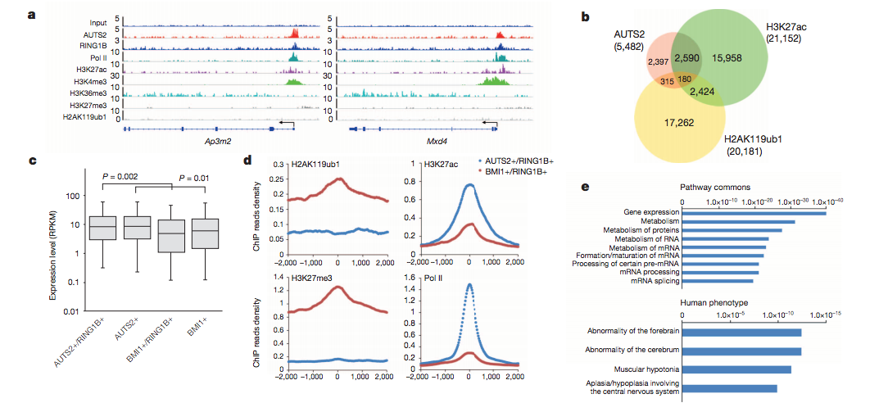
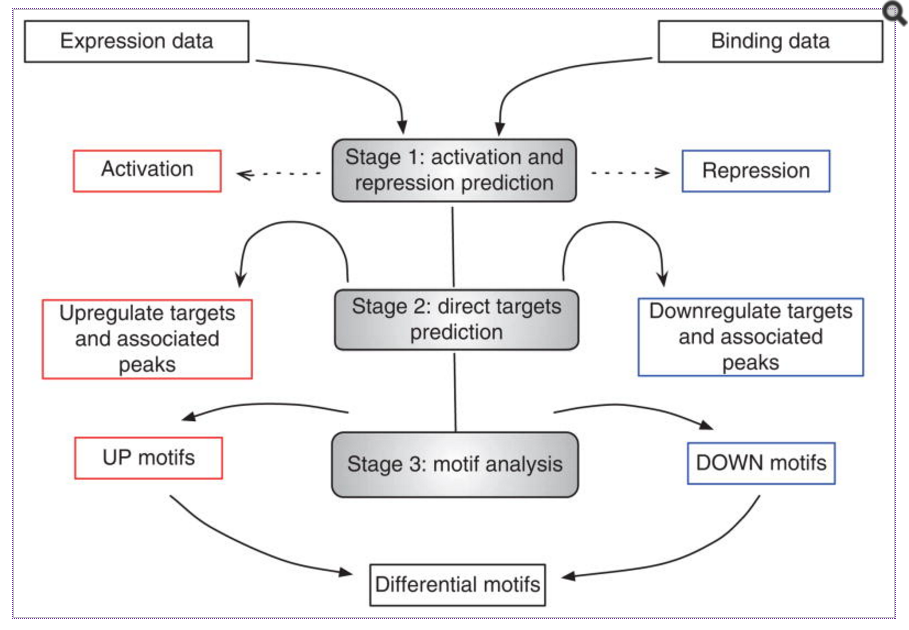

## Integrating RNA-seq and ChIP-seq

As discussed previously, cells use a wide range of mechanisms to regulate gene expression. The increase or decrease in production of specific gene products is dependent on sophisticated programs/machinery, which can change in different cellular conditions. 

Evaluating the amount of up- and down-regulation of gene, was something that we explored during the RNA-seq sessions. In this ChIP-seq session, we discussed the machinery regulating expression, specifically in the context of transcription factors and chromatin regulators. It is very common to run both of these types of experiments and integrate data from each to derive a better understanding at the molecular level. However, there are not alot of sophisticated methods developed to compae the two types of data in a robust manner.

### Direct comparisons

Typically in the literature, one will find studies in which the RNA-seq and ChIP-seq were performed independently and then differntially expressed genes were compared with target genes from the ChIP-seq using a simple overlap measure. These overlapping statistics are complemented with a figure focussing on a panel of select genes. For these genes binding evidence is displayed (using bigWig tracks and/or density profile plots) and a plot of expression changes taken from the RNA-seq data next to it. 

> This was taken from [Gao et. al, Nature 2014](file:///Users/mmistry/Downloads/Gao2014Nature%20Auts2%20.pdf), where they investigated the AUTS2 protein, risk factor for ASD and other neurological disorders and its link with PRC1, a key epigenetic regulator. 

### BETA (Binding and Expression Target Analysis)

An another alternative is a tool called [BETA](http://cistrome.org/BETA/) from Shirley Liu's lab at HMS. BETA is a software package that integrates ChIP-seq of transcription factors or chromatin regulators with differential gene expression data to infer direct target genes. This tool stands out from the other nearest gene analyses as it has potential to find target genes for proteins that bind enhancer regions.

BETA has **three functions**: 

1. to predict whether the factor has activating or repressive function
2. to infer the factor’s target genes
3. to identify the motif of the factor and its collaborators which might modulate the factor’s activating or repressive function. 

It has three commands depending on what input data you have and what output you desire. 

* BETA **basic**: TF activating and repressive function prediction and direct targets detecting
* BETA **plus**: BETA basic + motif analysis on target regions 
* BETA **minus**: TF target genes prediction based on regulatory potential score with only binding data

**Image source: Nat Protoc. 2013 Dec; 8(12): 2502–2515.**

> *NOTE: BETA is available as a module on Orchestra.*

#### How does it work?

* For each gene a **regulatory potential (RP)** value is computed by taking all binding sites within the specified range of gene TSS (i.e 100kb)
* RP is a gene’s likelihood of being regulated by a factor, and is dependent on the number of sites withing range of the TSS and the distance between the binding site and TSS.
* **BETA minus** will rank genes by the RP value to identify targets. 
* **BETA basic** will require your DE analysis results in a specific format and knowledge of which are significant. It uses a CDF to determine whether the UP and DOWN groups differ from NON-DE. This is used to identify activating and repressive function. For each gene a rank product score is computed using your RP and DE statistic. This rank product is the new score to identify targets. 

 

