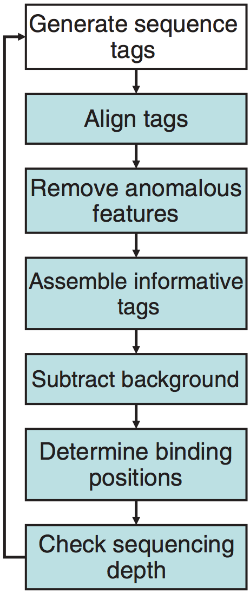
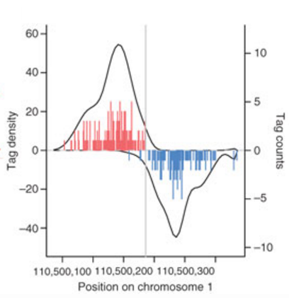
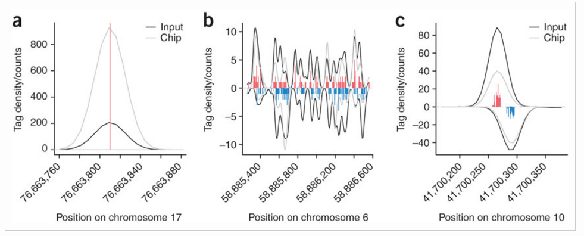

Contributors: Meeta Mistry

Approximate time: 90 minutes

## Learning Objectives

* Learning how to use SPP for peak calling
* Understanding different components of the SPP algorithm
* Interpretation of results from a peaks including cross-correlation plots and various file formats 


## SPP

SPP is a data processing pipeline optimized for the detection of localized protein binding positions from unpaired sequence reads. The [publication](http://www.nature.com.ezp-prod1.hul.harvard.edu/nbt/journal/v26/n12/full/nbt.1508.html) describes the algorithm in great detail, from which we have listed some of the main features here.

* Discarding or restricting positions with abnormally high number of tags
* Provides smoothed tag density in WIG files for viewing in other browsers
* Provides conservative statistical estimates of fold enrichment ratios along the genome, to determine regions of significant enrichment/depletion (can be exported for visualization)

The main steps of the ChIP-seq processing pipline are described in the illustration below. As we walk through the SPP pipeline in this lesson, we will describe each step in more detail.

<div style="text-align:center"></div>


SPP is an R package which can be installed in one of two ways: There is [source code](https://github.com/hms-dbmi/spp/archive/1.13.tar.gz) avaiable for download, or alternatively it can be installed using `devtools` as it is now [available on GitHub](https://github.com/hms-dbmi/spp).


## Setting up

Start an interactive session with a single core (if you don't already have one going) since we are working with such a small dataset; for parallel processing options with SPP see note below.

	$ bsub -Is -q interactive bash

Now let's setup the directory structure. Navigate to `~/ngs_course/chipseq/` if you are not already there. Within the results directory we will create directory called `spp`:

	$ mkdir results/spp
	$ cd results
	
The last thing we need to before getting started is to load the appropriate software. As mentioned, SPP is an R package. On Orchestra the package comes installed by default when you load the most recent R module:

	$ module load stats/R/3.2.1
	

> ### Parallel processing with SPP
> 	
> When working with large datasets it can be beneficial to use multiple cores during some of the more computationally intensive processes of peak calling. In order to do so, you will need to install the `snow` package in R. Using snow you can initialize a cluster of nodes for parallel processing (in the example below we have a cluster of 8 nodes). *See `snow` package manual for details.* This cluster variable can then be used as input to functions that allow for parallel processing.
> 
> 	`library(snow)`
> 	
> 	`cluster <- makeCluster(8)`


## An R script for running SPP

To run SPP, there are several functions that need to be run sequentially. For more information on these functions the [home page](http://compbio.med.harvard.edu/Supplements/ChIP-seq/) is quite useful, as they provide a brief tutorial showing the use of the main methods.

For this class, we have put together an R script that contains all of the methods required for peak calling. You can copy over the script into your current directory, and then we can discuss the methods in more detail.

	$ cp /groups/hbctraining/ngs-data-analysis-longcourse/chipseq/scripts/get_peaks.R .

Open it up using `vim`, as there is a modification we need to make in order for you to be able to run this from your working directory. Use `:set number` in `vim` to add numbers to your lines. Now scroll down to line 16. Here, you need to change the path to where your `spp` directory is located. It will look something like this:

	/home/user_name/ngs_course/chipseq/results/spp/

Save and exit vim. We can now run this script from the command line by using the `Rscript` command followed by the name of our script and need to pass in two arguments:

1. Input BAM file
2. Treatment/IP BAM file

Let's try running it on Nanog-rep1:

	$ Rscript get_peaks.R bowtie2/H1hesc_Input_Rep1_chr12_aln.bam bowtie2/H1hesc_Nanog_Rep1_chr12_aln.bam

Before we look at the output, we'll first take some time to discuss whats inside our R script. 

### Setup the environment

The first few lines are setting up the environment which involves **loading the library and reading in the data**. The input and treatment BAM files need to be given as arguments to this script when running it. The final few lines in this chunk of code include defining a path for the resulting output files and a prefix for output file names.


(***DO NOT RUN THIS***)

```
# Load library
library(spp)

# Get filenames from arguments
filenames <- commandArgs(trailingOnly=TRUE)
file.input <- filenames[1]
file.data <- filenames[2]

# Load in data
input.data <- read.bam.tags(file.input, read.tag.names=T)
chip.data <- read.bam.tags(file.data, read.tag.names=T)

# Set path 
path <- "/groups/hbctraining/ngs-data-analysis-longcourse/chipseq/spp/"

# Create a prefix for your output file
# This can be changed based on file naming convention 
s <- strsplit(file.data,split="_")
prefix <- paste(s[[1]][2], "_", s[[1]][3], sep="")
``` 

### Remove anomalous features

The next chunk of code **uses the cross-correlation profile to calculate binding peak separation distance**.  The separation distance will be printed out and the **cross-correlation plot** will be saved to file. The `srange` argument gives the possible range for the size of the protected region; it should be higher than tag length but note that making the upper boundary too high will increase calculation time. The `bin` argument is telling SPP to bin tags within the specified number of basepairs to speed up calculation. Increasing the bin size decreases the accuracy of the determined parameters. The numbers we have selected here are defaults suggested in the tutorial.

At this point SPP also assesses whether the inclusion of **reads with non-perfect alignment quality** improves the cross-correlation peak, and flags them accordingly. If you would like to accept all aligned tags, specify `accept.all.tags=T` argument to save time.

(***DO NOT RUN THIS***)
```
# Get binding info from cross-correlation profile
binding.characteristics <- get.binding.characteristics(chip.data,srange=c(50,500),bin=5)

# Print out binding peak separation distance
print(paste("binding peak separation distance =",binding.characteristics$peak$x))

# Plot cross-correlation profile
pdf(file=paste(path, prefix, ".crosscorrelation.pdf", sep=""),width=5,height=5)
par(mar = c(3.5,3.5,1.0,0.5), mgp = c(2,0.65,0), cex = 0.8)
plot(binding.characteristics$cross.correlation,type='l',xlab="strand shift",ylab="cross-correlation")
abline(v=binding.characteristics$peak$x,lty=2,col=2)
dev.off()
```

### Assemble informative tags

The next function will select tags with acceptable alignment quality, based on flags assigned above. Moving forward with only informative tags, the ChIP and input data has been converted into a simple list of tag coordinate vectors (read start position:read end position). 

<div style="text-align:center"></div>

(***DO NOT RUN THIS***)
```
# select informative tags based on the binding characteristics
chip.data <- select.informative.tags(chip.data, binding.characteristics)
input.data <- select.informative.tags(input.data, binding.characteristics)

```

### Subtract background

The statistical significance of a peak observed for a putative protein binding position depends on the expected background pattern. 

The input tag density identifies three major types of background anomalies: 

1. Singular peaks of tag density at a single chromosome position many orders of magnitude higher than the surrounding density. Such peaks commonly occur at the same position on both chromosome strands. 
2. Larger, nonuniform regions of increased background tag density on either one or both strands 
3. Background tag density patterns resembling true protein-binding positions (typically shows smaller separation between strand peaks)

<div style="text-align:center"></div>

The next function is used to correct for background anomalies described in point 1 above. `remove.local.tag.anomalies()` will scan along the chromosomes calculating local density of regions (can be specified using window.size parameter, default is 200bp), removing or restricting singular positions with extremely high tag count relative to the neighborhood. 

(***DO NOT RUN THIS***)
```
# restrict or remove singular positions with very high tag counts
chip.data <- remove.local.tag.anomalies(chip.data)
input.data <- remove.local.tag.anomalies(input.data)
```

### Determine binding positions

To identify peaks, background subtraction methods are applied to correct for anomalies outlined in 2) and 3) above. The corrections have little effect on the top binding positions, but help with lower ranked peaks reducing false-positive peaks arising from uneven background.

We will use the WTD method to call binding positions, which uses a sliding window and calculates the geometric average on positive and negative strand. Additionally, we will specify an FDR of 1% and a window size estimated by the binding.characteristics:

(***DO NOT RUN THIS***)
```
# binding detection parameters
# desired FDR (1%). Alternatively, an E-value can be supplied to the method calls below instead of the fdr parameter
fdr <- 1e-2

# the binding.characteristics contains the optimized half-size for binding detection window
detection.window.halfsize <- binding.characteristics$whs

# determine binding positions using wtd method
bp <- find.binding.positions(signal.data=chip.data,control.data=input.data,fdr=fdr,whs=detection.window.halfsize)

print(paste("detected",sum(unlist(lapply(bp$npl,function(d) length(d$x)))),"peaks"))

```

### Output to file

Finally, we will write the results to file. Three files will be generated in your `spp` directory:

1. Detected binding positions
2. narrowPeak file
3. WIG file of enrichment estimates

To generate enrichment estimates SPP scans ChIP and signal tag density to estimate lower bounds of tag enrichment (and upper bound of tag depletion if it is significant) along the genome. The resulting profile gives conservative statistical estimates of log2 fold-enrichment ratios along the genome. The example below uses a window of 500bp (and background windows of 1, 5, 25 and 50 times that size) and a confidence interval corresponding to 1%.

(***DO NOT RUN THIS***)
```
# output detected binding positions
output.binding.results(bp,paste(path, prefix,".binding.positions.txt", sep=""))
write.narrowpeak.binding(bp,paste(path, prefix,".narrowPeak", sep=""))

# output wig file
enrichment.estimates <- get.conservative.fold.enrichment.profile(chip.data,input.data,fws=500,step=100,alpha=0.01)
writewig(enrichment.estimates,paste(path, prefix, ".enrichment.estimates.wig", sep=""), paste(prefix, "_Conservative fold-enrichment/depletion estimates shown on log2 scale", sep=""))

```

## Running SPP on all files

To generate peaks for the remaining samples we need to run the Rscript three more times, each time changing the input to the appropriate files:

`$ Rscript get_peaks.R bowtie2/H1hesc_Input_Rep2_chr12_aln.bam bowtie2/H1hesc_Nanog_Rep2_chr12_aln.bam`

`$ Rscript get_peaks.R bowtie2/H1hesc_Input_Rep1_chr12_aln.bam bowtie2/H1hesc_Pou5f1_Rep1_chr12_aln.bam`

`$ Rscript get_peaks.R bowtie2/H1hesc_Input_Rep2_chr12_aln.bam bowtie2/H1hesc_Pou5f1_Rep2_chr12_aln.bam`

## Evaluating SPP output

Take a look at the files output from SPP. For each file you should see **4 files**, one of which is the **narrowPeak** files described above. 

There is also a **binding positions** file, which to the narrowPeak file in that each line correspond to a peak, but it contains differ in fields of information. The file contains a table with each row corresponding to a detected position, with the following columns: 

1. chromosome 
2. position of detected binding site on the chromosome
3. score reflecting magnitude of the binding 
4. E-value corresponding to the peak magnitude
5. FDR corresponding to the peak magnitude
6. lower bound of the fold-enrichment ratio
7. maximum likelihood estimate of the fold-enrichment ratio

We can summarize the number of peaks for each sample by counting the lines:

	wc -l spp/*.narrowPeak

*How do these numbers compare to those generated by MACS2?*

> **NOTE:** To take a quick look at how the results overlap with MACS2 (and get your hands wet with [bedtools](http://bedtools.readthedocs.org/en/latest/index.html)) you can browse our [lesson on comparing peak callers](https://github.com/hbctraining/In-depth-NGS-Data-Analysis-Course/blob/may2017/sessionV/lessons/compare_callers_IGV.md). However, keep in mind that you **can't really compare peaks from two different peak callers using their default or arbitrary thresholds**. They are totally uncalibrated. Rather you run them individually through IDR and then compare the IDR thresholded peaks.

***
*This lesson has been developed by members of the teaching team at the [Harvard Chan Bioinformatics Core (HBC)](http://bioinformatics.sph.harvard.edu/). These are open access materials distributed under the terms of the [Creative Commons Attribution license](https://creativecommons.org/licenses/by/4.0/) (CC BY 4.0), which permits unrestricted use, distribution, and reproduction in any medium, provided the original author and source are credited.*

* *Material in this lesson is in part adapted from the SPP tutorial: http://compbio.med.harvard.edu/Supplements/ChIP-seq/tutorial.html*


