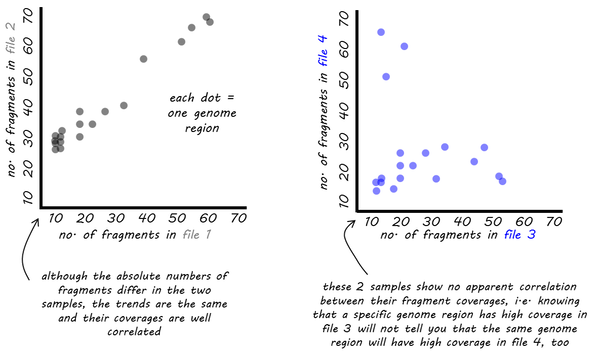
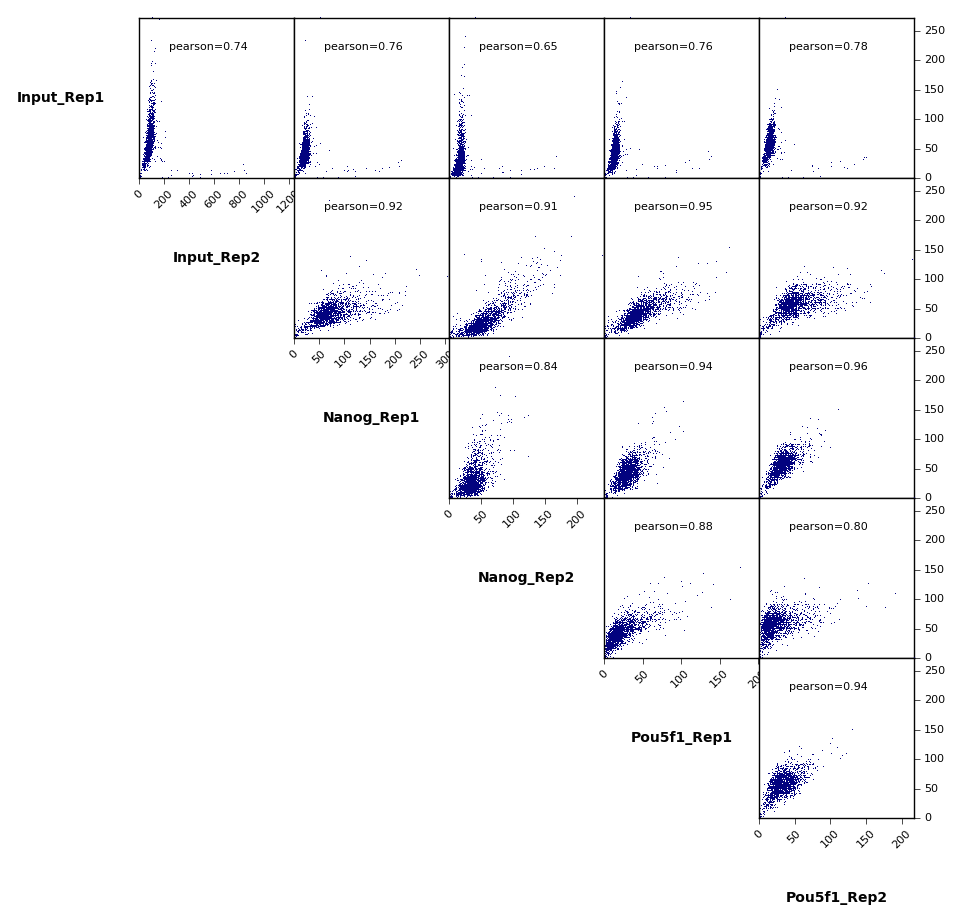
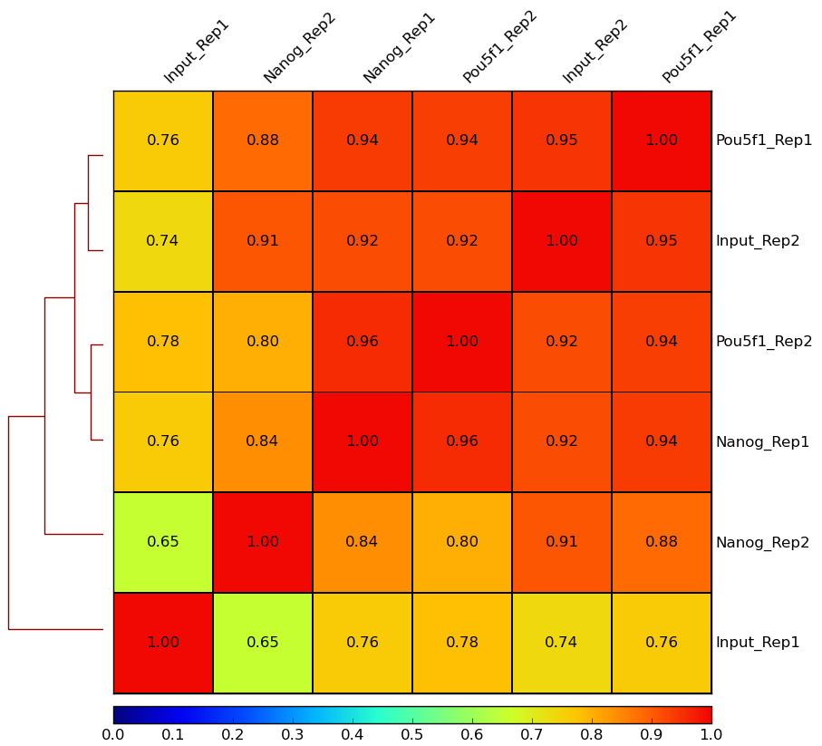
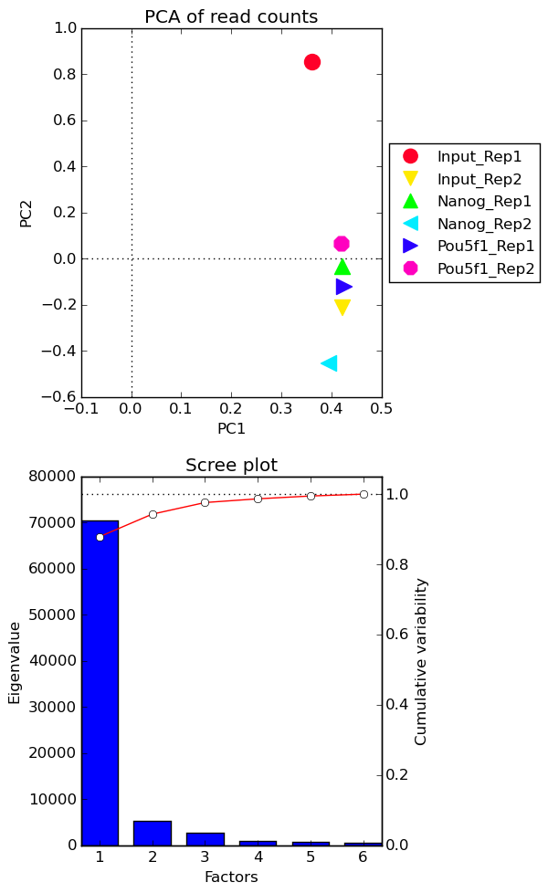

## Quality assessment using `deepTools`

Another way in which we can assess the quality of our samples is by investigating the read coverages for each sample and determine the variability in coverage per sample group. Replicate samples that vary greatly in where the reads stack up is indicative of a weak ChIP-seq experiment. In addition, we can identify outlier samples or batch effects.

To evaluate read coverage we will be using the [`deepTools`](http://deeptools.readthedocs.org/en/latest/content/list_of_tools.html), a suite of python tools developed for the efficient analysis of high-throughput sequencing data, such as ChIP-seq, RNA-seq or MNase-seq. `deepTools` has a wide variety of tools that go beyond those that are covered in this lesson. We encourage you to look through the docuementation and explore on your own time.

Assessing and visualizing coverage using `deepTools` requires three steps: 

1. Indexing the BAM alignment files
2. Calculation of the read coverage scores using the `multiBamSummary` tool
3. Visualizing how read coverage scores compare between samples

First let's create a directory for all of the output generated by deepTools, and move into that directory:

```
$ cd ~/ngs_course/chipseq/results/chip_qc		
 		
$ mkdir deeptools 		
 	
$ cd deeptools
```
To use deepTools, we will need an **index** (`.bai` file) for each of our BAM files using the `samtools index` tool. This has **already been done for you**, if you look inside your `bowtie2` folder:

```
$ ls -l ../../bowtie2/*.bai
```

Let's load the module and we are ready to get started:

```
$ module load seq/deeptools/2.2.0
```

### Calculation of the read coverage scores using the `multiBamSummary` tool

The `multiBamSummary` tool will calculate the read coverage scores for specific genomic regions between samples and provide the output as a binary compressed numpy array (.npz) file; however, the analysis can be performed on the entire genome by changing the mode of this tool to `bins`. If you prefer, it can also output a `readCounts.tab` file that contains a list read counts per sample for every 10,000bp region in the genome from which you can use to create your own images. 

```
$ multiBamSummary bins --ignoreDuplicates -p 6 \
--bamfiles ../../bowtie2/*aln.bam \
-out deeptools_multiBAM.out.npz \
--outRawCounts readCounts.tab
```

### Visualizing read coverage quality metrics

Now that we have the read coverage scores calculated for all samples, we can now analyze the coverage between samples using a variety of the `deepTools` tools:

#### 1. Sample correlation - `plotCorrelation` tool

The `plotCorrelation` tool allows us to visualize the similarity between samples based on their read coverage of regions of the genome. 



We can visualize correlations using a scatterplot:

```
$ plotCorrelation --corData deeptools_multiBAM.out.npz \
--plotFile deepTools_scatterplot.png \
--corMethod pearson \
--whatToPlot scatterplot \
--labels Input_Rep1 Input_Rep2 Nanog_Rep1 Nanog_Rep2 Pou5f1_Rep1 Pou5f1_Rep2
```


We expect high correlations between replicates, and lower correlations between samplegroups. However, we do not observe this when looking at read coverage on chromosome 12. Specifically, we see that Input-Rep1 does not correlate well with any of the other samples. If this were for the entire genome, we might be concerned that we would not have reporducibility between replicates for many of the peaks, and that Input-Rep1 is a potential outlier.

The same `plotCorrelation` tool can be used to examine the read coverage similarity using a heatmap to perform heirarchical clustering and determine whether our sample groups cluster well (i.e. have similar read coverage profiles within and between sample groups). The lack of correlation between replicates is even more visible in the heatmap, as is the lack of correlation with Input-Rep1 and all other samples.

```
$ plotCorrelation --corData deeptools_multiBAM.out.npz \
--plotFile deepTools_heatmap.png \
--corMethod pearson \
--whatToPlot heatmap \
--labels Input_Rep1 Input_Rep2 Nanog_Rep1 Nanog_Rep2 Pou5f1_Rep1 Pou5f1_Rep2 \
--plotNumbers
```


#### 2. Sample variability - `plotPCA` tool

The next quality metric we will explore is the principal component analysis (PCA) of our read coverage calculations. PCA can be used to determine whether samples display greater variability between experimental conditions than between replicates of the same treatment based on information (read coverage values) from thousands of regions. PCA is also useful to identify unexpected patterns, such as those caused by batch effects or outliers. 

We will use the tool `plotPCA` to sort the principal components according to the amount of variability of the data that they explain and generate two plots:

- the PCA plot for the top two principal components eigenvalues 
- the Scree plot for the top five principal components where the bars represent the amount of variability explained by the individual factors and the red line traces the amount of variability is explained by the individual components in a cumulative manner [[1]](http://deeptools.readthedocs.org/en/latest/content/tools/plotPCA.html)

```
$ plotPCA --corData deeptools_multiBAM.out.npz \
--plotFile deepTools_pcaplot.png \
-T "PCA of read counts" \
--outFileNameData deeptools_pcaProfile.tab \
--labels Input_Rep1 Input_Rep2 Nanog_Rep1 Nanog_Rep2 Pou5f1_Rep1 Pou5f1_Rep2
```



Similar to the correlation plots, we see little clustering of the replicates. The variation between sample groups does not account for the major sources of variation in the data. Keep in mind that these plots are generated for a small subset of data. It is likely that using the whole dataset will change the outcome of these plots and perhaps more similar to what we would expect.

***
*This lesson has been developed by members of the teaching team at the [Harvard Chan Bioinformatics Core (HBC)](http://bioinformatics.sph.harvard.edu/). These are open access materials distributed under the terms of the [Creative Commons Attribution license](https://creativecommons.org/licenses/by/4.0/) (CC BY 4.0), which permits unrestricted use, distribution, and reproduction in any medium, provided the original author and source are credited.*