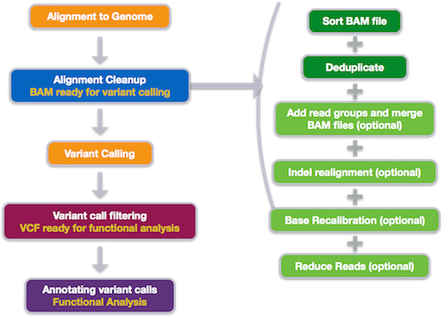
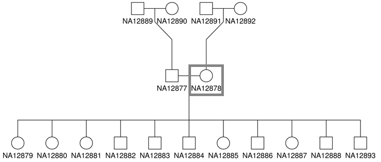
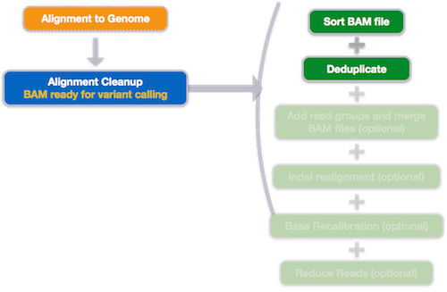
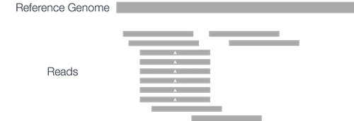

## Learning Objectives:

* Exploring the variant calling workflow
* Choosing appropriate BWA alignment parameters for our dataset
* Understanding alignment clean-up steps

## Variant Calling Workflow

The variant calling workflow begins with quality control and alignment, similar to the other NGS applications. Alignment is followed by alignment clean-up to prepare data for variant calling. Then, variant calling is performed, followed by filtering and annotation of the variant calls.



## Set-up

Before we start with variant calling, we need to set-up our directory structure, and make sure the tools are readily available. 

Login to Orchestra and start an interactive session with four cores:

```
$ bsub -Is -n 2 -q interactive bash
```

Create a project directory for variant calling and change directories into it:

```bash
$ mkdir ~/ngs_course/var-calling
$ cd ~/ngs_course/var-calling
```

Create the following directory structure for the variant calling project:

```bash
~/ngs_course/
    ├── var-calling/
    	├── logs/
    	├── meta/
        ├── raw_data/
	├── reference_data/
	├── scripts/
        ├── results/
            ├── bwa/
```

With the `-p` option of the `mkdir` command, we create the above structure very quickly:

```bash
mkdir -p raw_data reference_data scripts logs meta

mkdir -p results/bwa
```

Now that we have the directory structure created, let's copy over the data to perform our quality control and alignment, including our fastq files and reference data files:

```bash
$ cp /groups/hbctraining/ngs-data-analysis-longcourse/var-calling/raw_fastq/*fq raw_data/

$ cp /groups/hbctraining/ngs-data-analysis-longcourse/var-calling/reference_data/chr20.fa reference_data/
```

Now that we have the data, let's make sure that bcbio tools (`/opt/bcbio/centos/bin`) are in your PATH. First, test if you have already have them in your path:

```bash
$ which picard
```

**If the output is `/opt/bcbio/centos/bin/picard`, then you are all set!** 

> **NOTE: If you don't get any output, do one of the following options below:**
>
> **Option #1**:
>
>```bash
>$ PATH=/opt/bcbio/centos/bin:$PATH
>```
>
> **Option #2**, add the following line to your `.bashrc` file:
>
>```bash
>export PATH=/opt/bcbio/centos/bin:$PATH
>```
>
> *If you would like to use the tools/programs installed outside of the bcbio set up, we have a small section at the end of this markdown which tells you how to. For today's class, please use the bcbio installations of the tools.*

## Dataset

To explore the variant calling workflow, we will be using a subset of a human WGS dataset attained from the [Genome in a Bottle Consortium (GIAB)](http://jimb.stanford.edu/giab). 


GIAB was initiated in 2011 by the National Institute of Standards and Technology "to develop the technical infrastructure (reference standards, reference methods, and reference data) to enable translation of whole human genome sequencing to clinical practice" [[1](http://jimb.stanford.edu/giab/)].

The human WGS dataset completed by GIAB is "essentially the **first complete human genome to have been extensively sequenced and re-sequenced by multiple techniques**, with the results weighted and analyzed to eliminate as much variation and error as possible" [[2](http://www.nist.gov/mml/bbd/dna-022514.cfm)]. To minimize bias from any specific DNA sequencing method, the dataset was sequenced separately by 14 different sequencing experiments and 5 different platforms [[3](http://www.nature.com/nbt/journal/v32/n3/full/nbt.2835.html)]. 

**The dataset acts as a 'truth set' for variation in the human genome to be used as a genotype reference set to compare variant calls against.** Additionally, the DNA is available for validating new sequencing technologies / analysis methods, and ~8300 vials of DNA from a homogenized large batch of the sample cells is available for distribution to other labs [[2](http://www.nist.gov/mml/bbd/ppgenomeinabottle2.cfm)].

The source DNA, known as NA12878, was taken from a single person: the daughter in a father-mother-child 'trio' (she is also mother to 11 children of her own) [[4](http://www.nature.com/nmeth/journal/v12/n10/fig_tab/nmeth.3505_SF4.html)]. Father-mother-child 'trios' are often sequenced to utilize genetic links between family members.



"The Genome in a Bottle consortium also plans to develop well-characterized whole genome reference materials from two genetically diverse groups: Asians and Ashkenazi Jews. Both reference sets will include sequencing results from father-mother-child 'trios'" [[2](http://www.nist.gov/mml/bbd/dna-022514.cfm)]. The NIST Reference Materials are expected to be released in September 2016, but detailed information on the data and methods have been published, and the project information, data and analyses are available on Github (https://github.com/genome-in-a-bottle) [[1](http://jimb.stanford.edu/giab/), [5](http://www.nature.com/articles/sdata201625)].

While the sample NA12878 was sequenced at a depth of 300x, we will only be using a subset of the dataset aligning to chromosome 20. The sequencing files we will be using for NA12878 sample will have a total of ~4 million paired-end reads.

## QC and Alignment

In our workflow, we are going to skip over the Quality Control steps, but we will assume that we used *FastQC* to ensure there are no obvious problems with our samples and no adapter or vector contamination. Since the aligner we will use performs soft-clipping, we will skip the quality trimming step as well.

Choice of alignment tool is often determined by the type of NGS application being conducted. We have previously used STAR for RNA-Seq data because it is fast and optimized for aligning spliced reads. For ChIP-Seq we used Bowtie2 to align the reads because it is fast and accurate. For variant calling we will use [BWA (Burrows-Wheeler Aligner)](http://bio-bwa.sourceforge.net) for alignment. 

BWA is generally slower than Bowtie2 with similar sensitivity and both tools can perform gapped alignment for the identification of indels and can effectively map paired-end reads. However, BWA is a bit more accurate and provides information on which alignments are trustworthy. Small numbers of bad alignments can result in many false variant calls, so accuracy is paramount, and is the basis for choosing BWA.

### BWA modes

Depending on read length, BWA has different modes optimized for different sequence lengths:

- **BWA-backtrack:** designed for Illumina sequence reads up to 100bp (3-step)

- **BWA-SW:** designed for longer sequences ranging from 70bp to 1Mbp, long-read support and split alignment

- **BWA-MEM:** shares similar features to BWA-SW, but BWA-MEM is the latest, and is generally recommended for high-quality queries as it is faster and more accurate. BWA-MEM also has better performance than BWA-backtrack for 70-100bp Illumina reads.

### Aligning reads with BWA-MEM

Change directories into the `reference_data` directory:

```bash
$ cd ~/ngs_course/var-calling/reference_data
```

#### Creating BWA-MEM index

Similar to the other alignment tools we have used, the first step in the BWA alignment is to create an index for the reference genome. Similar to Bowtie2, BWA indexes the genome with an FM Index based on the Burrows-Wheeler Transform to keep memory requirements low for the alignment process. 

The basic options for indexing the genome using BWA are:

* `-p`: prefix for all index files

```bash
$ bwa index -p chr20 chr20.fa
```

#### Aligning reads with BWA-MEM

Now that we have our indexes created, we can get started with read alignment. Change directories to the `var-calling` folder:

```bash
$ cd ../
```

We will perform alignment on our paired-end reads for sample `na12878`. Details on BWA and its functionality can be found in the [user manual](http://bio-bwa.sourceforge.net/bwa.shtml); we encourage you to peruse through to get familiar with all available options.

The basic options for aligning reads to the genome using BWA-MEM are:

* `-t`: number of threads / cores
* `-M`: mark shorter split hits as secondary (for Picard compatibility)

Additionally we will specify:

* the path to genome indexes including prefix
* FASTQ files for paired-end reads
* `2>`: save standard error to file
* `>`: save alignment output to a SAM file

**NOTE:** BWA will soft-clip poor quality sequences from the ends of the reads by default, so we do not need to specify a parameter to perform soft clipping.

```bash
$ bwa mem -M -t 4  \
reference_data/chr20 \
raw_data/na12878_1.fq raw_data/na12878_2.fq \
2> logs/bwa.err \
> results/bwa/na12878.sam
```

### Alignment clean-up

The last stage of the alignment phase is marking duplicates, and it is usually only required for variant calling. We need to find reads that are likely artifacts from the PCR amplification as they can bias variant calls.



If duplicates aren't marked, then the PCR-based errors will be picked up again and again as false positive variant calls. Duplicates are easy to detect: since they have the same mapping information and CIGAR string:  



Marking duplicates with tools such as *Picard* or *samblaster* will result in the variant caller ignoring these PCR-based errors, and instead seeing:


The variant caller will be more likely to discard the error, instead of calling it as a variant.

We will be using the [Picard](http://broadinstitute.github.io/picard/) suite of tools from the Broad Institute to sort the alignment SAM file and mark duplicates. The documentation for the tools and their usage and options is available in the [user manual](http://broadinstitute.github.io/picard/command-line-overview.html#Tools).

The latest version of Picard [requires Java 1.8](http://gatkforums.broadinstitute.org/gatk/discussion/6624/latest-picard-version-error), and so before we run it we need to load the Java module:

```bash
$ module load dev/java/jdk1.8
```

#### Sorting SAM by coordinates
The *Picard* tool, `SortSam`, sorts an input SAM or BAM file by coordinate, queryname, etc. Input and output formats (SAM or BAM) are determined by the file extension.

The description of base options for the `SortSam` tool:

* `INPUT`:	The BAM or SAM file to sort. Required.
* `OUTPUT`:	The sorted BAM or SAM output file. Required.
* `SORT_ORDER`:	Sort order of output file Required. Possible values: {unsorted, queryname, coordinate, duplicate}
* `VALIDATION_STRINGENCY`: Validation stringency for all SAM files read by this program. Possible values: {STRICT, LENIENT, SILENT}
	
> **NOTE:** BWA can produce SAM records that are marked as unmapped but have non-zero MAPQ and/or non-"*" CIGAR. Typically this is because BWA found an alignment for the read that hangs off the end of the reference sequence. Picard considers such input to be invalid. In general, this error can be suppressed in Picard programs by passing VALIDATION_STRINGENCY=LENIENT or VALIDATION_STRINGENCY=SILENT [[3](https://sourceforge.net/p/picard/wiki/Main_Page/)]. 

```bash
$ cd results/bwa

$ picard SortSam \
INPUT=na12878.sam \
OUTPUT=na12878_sorted.sam \
SORT_ORDER=coordinate \
VALIDATION_STRINGENCY=SILENT

```

#### Marking duplicates
The *Picard* tool, `MarkDuplicates`, can locate and tag duplicate reads (both PCR and optical/sequencing-driven) in a BAM or SAM file, where duplicate reads are defined as originating from the same original fragment of DNA. Explanation of the process of determining duplicate reads is provided in the [user manual](http://broadinstitute.github.io/picard/command-line-overview.html#Tools).

The basic options for marking duplicates are:

* `INPUT`:	The BAM or SAM file to sort. Required.
* `OUTPUT`:	The sorted BAM or SAM output file. Required.
* `METRICS_FILE`: File to write duplication metrics to Required.
* `ASSUME_SORTED`: If true, assume that the input file is coordinate sorted even if the header says otherwise. Default value: false. Possible values: {true, false}
* `VALIDATION_STRINGENCY`: Validation stringency for all SAM files read by this program. Default value: STRICT. Possible values: {STRICT, LENIENT, SILENT}

```bash
$ picard MarkDuplicates \
INPUT=na12878_sorted.sam \
OUTPUT=na12878_sorted_marked.bam \
METRICS_FILE=metrics.txt \
ASSUME_SORTED=true \
VALIDATION_STRINGENCY=SILENT
```

#### Creating index for BAM file

Now that we have a sorted BAM file that has duplicates marked, let's index it for visualization with IGV. As we have done in previous sessions, we will use *Samtools* to create the index:

```bash
samtools index na12878_sorted_marked.bam
```
---

> 
> ## Don't want to use the bcbio installation of tools?
> 
> If you are not using the bcbio-nextgen tools you will have to load the necessary modules:
> 
> 	`$ module load seq/samtools/1.3 seq/bwa/0.7.8  seq/picard/1.138`
>	
> And, the command will be slightly different for running `picard`, which is a java program and is normally run using JAR files (Java Archive), in a manner similar to `trimmomatic` (see example below). We did not have to use it earlier because we were using the version installed for bcbio, which has been setup with an alias such that just `picard` works.
>
>```bash 
>$ java -jar /opt/picard-1.138/bin/picard.jar SortSam \
>         INPUT=na12878.sam \
>         OUTPUT=na12878_sorted.sam \
>         SORT_ORDER=coordinate \
>         VALIDATION_STRINGENCY=SILENT`
>```

***
*This lesson has been developed by members of the teaching team at the [Harvard Chan Bioinformatics Core (HBC)](http://bioinformatics.sph.harvard.edu/). These are open access materials distributed under the terms of the [Creative Commons Attribution license](https://creativecommons.org/licenses/by/4.0/) (CC BY 4.0), which permits unrestricted use, distribution, and reproduction in any medium, provided the original author and source are credited.*


