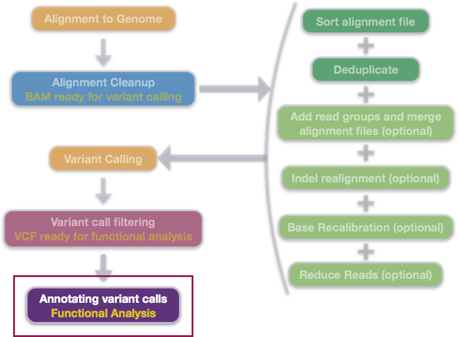
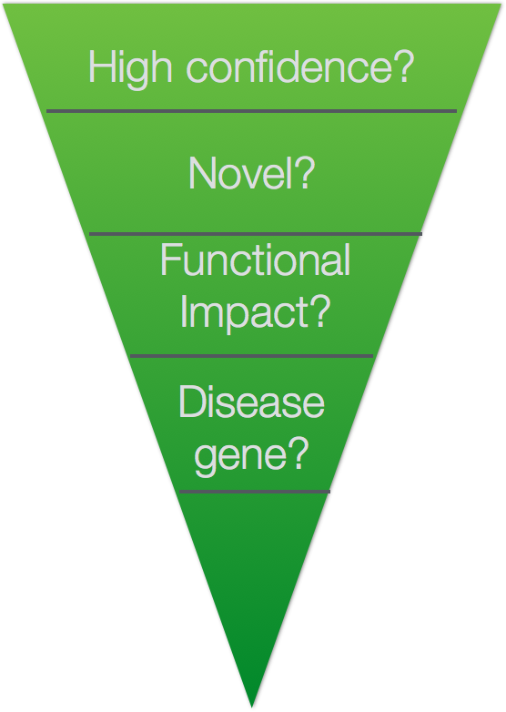
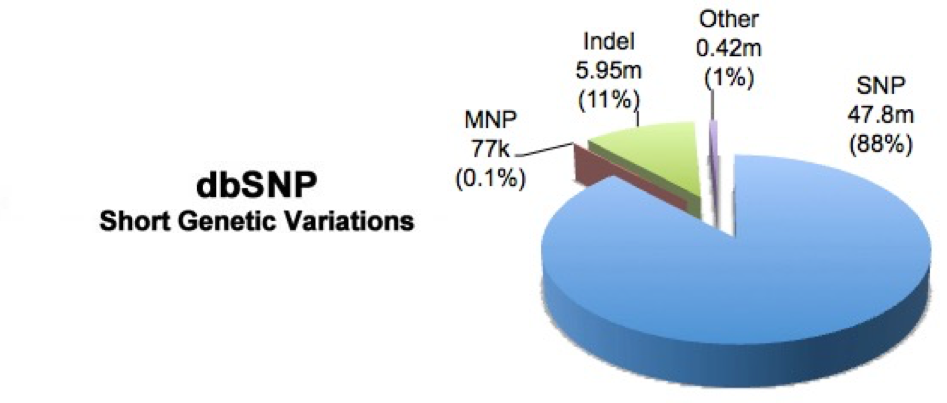
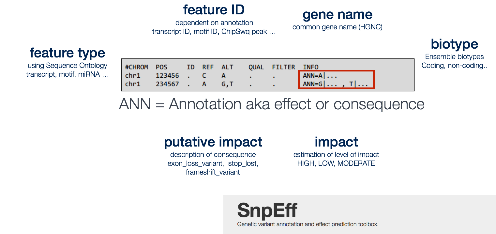
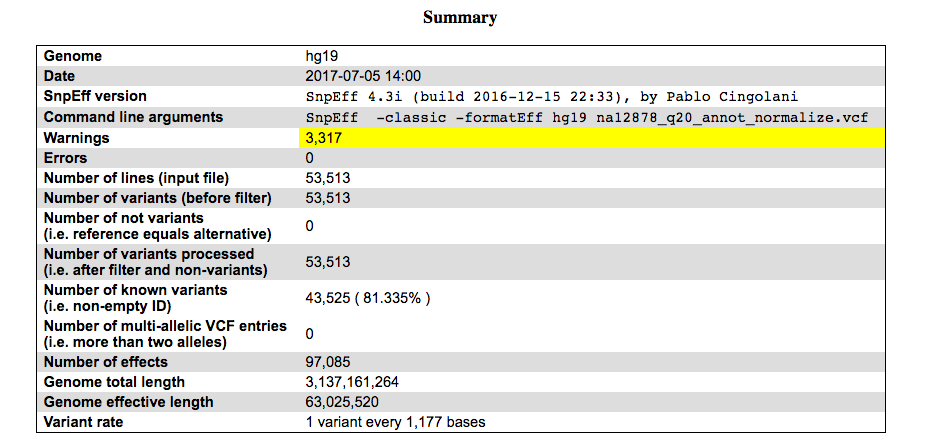
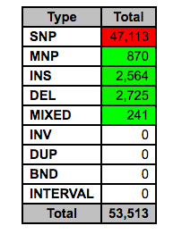
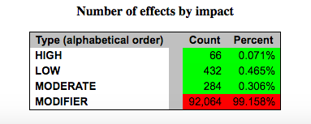

Approximate time: 90 minutes

## Learning Objectives:

* Adding information on known SNPs to our VCF
* Adding functional information to variants in the VCF
* Understanding where the annotation is added in the VCF format


## Annotating variants

Variant annotation is a crucial step in linking sequence variants with changes in phenotype. Annotation results can have a strong influence on the ultimate conclusions of disease studies. Incorrect or incomplete annotations can cause researchers both to overlook potentially disease-relevant DNA variants and to dilute interesting variants in a pool of false positives. 



At this stage, we have a large tab-delimited file containing loci at which a variation was found in the sample DNA sequence relative to the reference. We have filtered out these variations (also referred to as 'variant calls') to keep only those we are highly confident in, and now need to find out more. We can do this by **comparing our variants against known variants, and also use genome annotations to help predict information about our variants.** 




### Setting up

For this section we are going to need to copy over some reference data required for annotation. Start an interactive session and move into `var-calling` directory. Then copy over the required data.

```
$ srun --pty -p interactive -c 2 -t 0-6:00 --mem 8G -reservation=HBC bash

$ cd ~/var-calling

$ cp /n/groups/hbctraining/ngs-data-analysis-longcourse/var-calling/reference_data/dbsnp.138.chr20.vcf.gz* \
reference_data/

```

Let's also create a new directory for the results of our annotation steps:

```
$ mkdir results/annotation
```


## Annotation with known variants 

Variant annotation is the process of assigning information to DNA variants. There are many different types of information that can be associated with variants, and a first commonly used resource is using databases which contain variants that have previously been described. One popular example is [dbSNP](http://www.ncbi.nlm.nih.gov/SNP/),a free, public archive for genetic variation within and across different species. It is hosted by NCBI in collaboration with NHGRI and although the name implies SNPs; it actually includes range of molecular variation.



To add dbSNP information you need to download the organism specific data using their FTP download. **We have already done this for you** and was the zip file that you copied over into your `reference_data` folder. 

> For the full dbSNP dataset that corresponds with our data you can download it via the FTP site: ftp://ftp.ncbi.nih.gov/snp/organisms/human_9606/VCF/ . You may notice is that there are alot of files, and the README does not provide enough information. To find out more on how the datasets differ you can access the [NCBI human variation docs](http://www.ncbi.nlm.nih.gov/variation/docs/human_variation_vcf/).  

To annotate our data with dbSNP information we wil be using [`bcftools`](https://samtools.github.io/bcftools/), a command-line utility for variant calling and manipulating VCF files and its binary counterpart BCF files. It is a part of the `samtools` project, a tool that we are by now pretty familiar with. 

The `bcftools annotate` command allows the user to **add or remove annotations**. 

```bash
$ module load gcc/6.2.0 bcftools/1.9

$ bcftools annotate --help
```

The annotation we wish to add and the file we are annotating must be a Bgzip-compressed and tabix-indexed file (usually VCF or BED format). Tabix indexes a tab-delimited genome position file and creates an index file (.tbi), which facilitates quick retrieval of data lines overlapping regions. *NOTE: this has already been done for our dbSNP file*

```bash
$ bgzip ~/var-calling/results/variants/na12878_q20.recode.vcf 
$ tabix ~/var-calling/results/variants/na12878_q20.recode.vcf.gz
```

> Both `bgzip` and `tabix` are not available on O2 as modules, we are using bcbio's installations of these tools.

When running `bcftools annotate`, we also need to specify the column(s) to carry over from the annotation file, which in our case is ID.

```bash
$ bcftools annotate -c ID \
-a ~/var-calling/reference_data/dbsnp.138.chr20.vcf.gz \
~/var-calling/results/variants/na12878_q20.recode.vcf.gz \
> ~/var-calling/results/annotation/na12878_q20_annot.vcf
```

Take a quick peek at the new VCF file that was generated using `less`. You should now see in the ID column `rs` ids which correspond to identifiers from dbSNP. For the variants that are not known, you will find the `.` in place of an ID indicating novelty of that sequence change.

## Functional annotation with SnpEff

One fundamental level of variant annotation involves categorising each variant based on its relationship to coding sequences in the genome and how it may change the coding sequence and affect the gene product. To do this we will be using a tool called [SnpEff](http://snpeff.sourceforge.net/), a **variant effect predictor program**. 

Our understanding of the protein-coding sequences in the genome is summarised in the set of transcripts we believe to exist. Thus, **variant annotation depends on the set of transcripts used as the basis for annotation**. The widely used annotation databases and browsers – ENSEMBL, RefSeq, UCSC – contain sets of transcripts that can be used for variant annotation, as well as a wealth of information of many other kinds as well, such as ENCODE data about the function of non-coding regions of the genome. SnpEff will take information from the provided annotation database and populate our VCF file by adding it into the `INFO` field name `ANN`. Data fields are encoded separated by pipe sign "|"; and the order of fields is written in the VCF header.



Some **common annotations** are listed below, but [the manual](http://snpeff.sourceforge.net/SnpEff_manual.html#input)
provides a more comprehensive list.

* Putative_impact/impact: A simple estimation of putative impact / deleteriousness : (HIGH, MODERATE, LOW, MODIFIER)
* Gene Name: Common gene name (HGNC). Optional: use closest gene when the variant is “intergenic”.
* Feature type: Which type of feature (e.g. transcript, motif, miRNA, etc.). It is preferred to use Sequence Ontology (SO) terms, but ‘custom’ (user defined) are allowed. 
* Feature ID: Depending on the annotation sources, this may be: Transcript ID (preferably using version number), Motif ID, miRNA, ChipSeq peak, Histone mark, etc. Note: Some features may not have ID (e.g. histone marks from custom Chip-Seq experiments may not have a unique ID).
* Biotype: The bare minimum is at least a description on whether the transcript is (“Coding”, “Noncoding”). Whenever possible, use ENSEMBL biotypes.

Take a look at the options available. We will be using `snpEff` to annotate our variants.

```bash
$ module load snpEff/4.3g

$ java -jar $SNPEFF/snpEff.jar -h
```

> `snpEff` is also a java based tool, similar to `picard` and we have to use a similar syntax to run it.

To run the snpEff command we will need to specify two things:

1. The appropriate genome
2. The VCF file we want to annotate
	
An additional parameter to add to our command is `Xmx8G`, a Java parameter to define available memory. Since we are in an interactive session with 8GB, if we had requested more before starting the session we could increase the number here.

The final command will look like this:

```bash
## DO NOT RUN THIS CODE

$ java -Xmx8G -jar $SNPEFF/snpEff.jar eff hg19 \
results/annotation/na12878_q20_annot.vcf \
> results/annotation/na12878_q20_annot_snpEff.vcf
```	

By default snpEff downloads and install databases automatically (since version 4.0) for the organism that is specified. To see what databases are available for human you can use the `databases` command:

```bash
$ java -jar $SNPEFF/snpEff.jar databases | grep Homo_sapiens
```

Before we run SnpEff, we need to do a few [pre-processing steps](https://gemini.readthedocs.org/en/latest/#new-gemini-workflow) which will prepare us for the use of [GEMINI](http://gemini.readthedocs.org/en/latest/index.html), a tool used downstream of SnpEff for variant prioritization. **If you are not using GEMINI downstream, you would be able to proceed with the command above.**

### Pre-processing the VCF

As of version 0.12.2 of GEMINI it is required that your input VCF file undergo additional preprocessing such that multi-allelic variants are decomposed and normalized using the `vt` toolset from the [Abecasis lab](http://genome.sph.umich.edu/wiki/Main_Page). 


> Note that in GEMINI all of the VCF-based annotation files (e.g., ExAC, dbSNP, ClinVar, etc.) are also decomposed and normalized so that variants and alleles are properly annotated and we minimize false negative and false positive annotations. For a great discussion of why this is necessary, please read this [blog post](http://www.cureffi.org/2014/04/24/converting-genetic-variants-to-their-minimal-representation/) from Eric Minikel in Daniel MacArthur’s lab.

There are two steps in the pre-processing. We will use an example presented in the blog post linked above to illustrate the need for pre-processing and what is involved in each step.

Suppose in your data you find a a patient with a potentially interesting frameshift:

```bash
#CHROM	POS	ID	REF	ALT
1	1001	.	CT	C
```

To check the rarity of this variant it is common to cross-reference against reference populations (i.e. 1000 genomes, ESP), however our comparison shows that this allele does not exist. If we look a bit closer we find there is an individual with the variant, but due to joint calling it looks more like this:

```bash
#CHROM	POS	ID	REF	ALT
1	1001	.	CTCC	CCC,C,CCCC
```

This where the pre-processing comes in to play. 

1)  **Decomposing**: this step takes multiallelic variants and expands them into distinct variant records; one record for each REF/ALT combination. So our exmaple above now becomes:
 
```bash
POS	REF	ALT
1001	CTCC	CCC
1001	CTCC	C
1001	CTCC	CCCC
```

2) **Normalize**: This is a 3-step process and we'll use the first variant as an example below.

First right align the ALT and REF:

```bash 
CTCC REF
 CCC ALT
```

Then remove any suffix shared between the REF and ALT alleles.

```bash 
CTCC REF →   CT REF
 CCC ALT →    C ALT
```

Finally, remove any prefix shared between the REF and ALT alleles and increment POS by the number of characters you removed from each. With the first variant example, there is no shared prefix so the POS value doesn't change. You can however see that for the last variant from the original example:

```bash
POS	REF	ALT	→	POS	REF	ALT
1001	CTCC	CCC	→	1001	CT	C
1001	CTCC	C	→	1001	CTCC	C
1001	CTCC	CCCC	→	1002	T	C
```

For both steps we will be using the `vt` toolset (available as a bcbio installation on O2). First, the command to decompose:

```bash
$ vt decompose \
-s -o na12878_q20_annot_decompose.vcf \
na12878_q20_annot.vcf
```

We then apply the `normalize` command, providing the path to the reference genome:

```bash
$ vt normalize \
-r ~/ngs_course/var-calling/reference_data/chr20.fa \
-o na12878_q20_annot_normalize.vcf \
na12878_q20_annot_decompose.vcf  	
```

**Now we are ready to run SnpEff**. We can modify the command above to specify the relevant files. We will also need to add two additional flags which are used to customize the file for use with GEMINI. The new version of snpEff uses `ANN` (as described above), but GEMINI is expecting information to be written in `EFF`. By adding the `-classic` and `-formatEff` the results are written using the old format with EFF.

```bash
$ java -Xmx8G -jar $SNPEFF/snpEff.jar \
-dataDir /n/groups/hbctraining/ngs-data-analysis-longcourse/var-calling/annotation/hg19_snpeff_data \
-classic -formatEff hg19 \
na12878_q20_annot_normalize.vcf \
> na12878_q20_annot_snpEff.vcf
```


### SnpEff Output

SnpEff produces three output files:

1. an annotated VCF file 
2. an HTML file containing summary statistics about the variants and their annotations
3. a text file summarizing the number of variant types per gene

Let's take a look at the **text file**:

```bash
$ head snpEff_genes.txt
```
Each row corresponds to a gene, and each column coresponds to a different variant type. This gives you a resource for quickly interrogating genes of interest and see what types of variants they contain, if any.

To look at the **HTML file**, we will need to use `scp` or FileZilla to bring it over to our local machine. 

> You can [download this report](https://www.dropbox.com/s/31k9y1935qh4k7p/snpEff_summary.html?dl=1) here if there are any issues with generating it.

Let's scroll through the report. The first part of the report is a summary, which outlines what was run and what was found.



As we scroll through the report, we can obtain more details on the categories of variants in our file. 

There is a section **summarizing variant by type**:



These different types are defined as follows:

|Type  |  What it means  |  Example|
| ------------- |:-------------:| -----:|
|SNP  |  Single-Nucleotide Polymorphism  |  Reference = 'A', Sample = 'C'|
|Ins  |  Insertion  |  Reference = 'A', Sample = 'AGT'|
|Del  |  Deletion  |  Reference = 'AC', Sample = 'C'|
|MNP  |  Multiple-nucleotide polymorphism  |  Reference = 'ATA', Sample = 'GTC'|
|MIXED  |  Multiple-nucleotide and an InDel  |  Reference = 'ATA', Sample = 'GTCAGT'|


Additionally, variants are **categorized by their 'impact'**: {High, Moderate, Low, Modifier}. These impact levels are [pre-defined categories](http://snpeff.sourceforge.net/SnpEff_manual.html#input) based on the 'Effect' of the variant, to help users find more significant variants. 



***

**Exercise**

Use the HTML report to answer the following questions:

1. The majority of variants idenified are classified as SNPs. How many insertions and deletions were found?
2. How many of our variants are novel (not in dbSNP)?
3. How many variants were found in exonic regions?
4. The Ts/Tv ratio (the transition/transversion rate) tends to be around 2-2.1 for the human genome, although it changes between different genomic regions. What is the ratio reported for our sample? 

***
*This lesson has been developed by members of the teaching team at the [Harvard Chan Bioinformatics Core (HBC)](http://bioinformatics.sph.harvard.edu/). These are open access materials distributed under the terms of the [Creative Commons Attribution license](https://creativecommons.org/licenses/by/4.0/) (CC BY 4.0), which permits unrestricted use, distribution, and reproduction in any medium, provided the original author and source are credited.*
