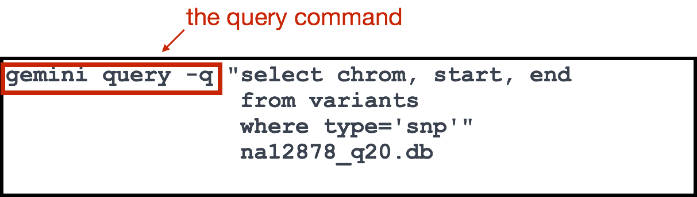
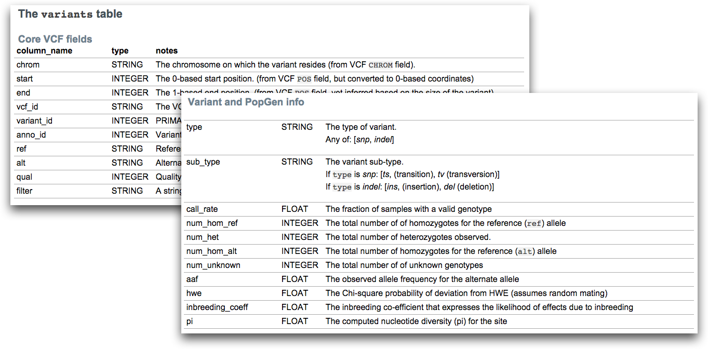

Approximate time: 90 minutes

## Learning Objectives:

* Using annotation information to filter out important variants
* Learning how to use GEMINI, a framework for exploring variant information


## Prioritizing variants 

Now we have annotations for all of our variants, but how do we easily sift through and find the important ones? To tackle this problem we look to tools beyond your text editor (simple shell scripts) and excel. Aaron Quinlan’s lab at University of Utah has been developing a framework called [GEMINI (GEnome MINIng)](https://github.com/arq5x/gemini) for quite some time now. 

GEMINI is a tool that helps turn those giant, sparse VCF variant matrices (millions of rows, thousands of columns) into a simple, accessible database. Within the database GEMINI annotates with just about everything out there. ENCODE, OMIM, dbSNP… *plus* internal annotations like regions of interest, candidate genes, etc. The resulting framework supports an **interactive exploration of variant information** in the context of numerous third-party genomic annotations.


Let's start by opening an interactive session with 4 cores:
	
```bash
$ bsub -Is -n 4 -q interactive bash
```

Next we will load our VCF file into the database. This command assumes that the VCF has been pre-annotated with snpEff as pecified with `-t`. While loading the database, GEMINI computes many additional population genetics statistics that support downstream analyses and for this file can take up to 30 minutes on a single core. We have the resources so let's use them by adding `--cores 4`. You will first need to move into the annotation directory:

```bash
$ cd ~/ngs_course/var-calling/results/annotation

$ gemini load -v na12878_q20_annot_snpEff.vcf -t snpEff --cores 4 na12878_q20.db
```

> If this does not work, copy over the database:
>
> `cp /groups/hbctraining/ngs-data-analysis-longcourse/var-calling/annotation/na12878_q20.db .`

### Constructing a query in GEMINI

To explore variants in GEMINI, we need to use SQL (Structured Query Language) to create simple, powerful queries based on annotations, genotypes or a combination of both. It will take some time to get used to the language but once you have the hang of it, you‘ll see how powerful it is.

Below is an example query used to demonstrate the structure and what each of the components represent. To begin you will need to use the `gemini query` command to **ask GEMINI to report to us data from the database that matches the criteria we provide**.



The query itself is written as SQL statements using `select`, `from` and `where`. Remember that we are querying a database, and databases most often contains one or more **tables**. Each table is identified by a name, and contain some number of **fields/columns** and **records (rows)** with data. 

When we **`select`** we are identifying the **fields** we are interested in retrieving. In our case this is the chromsome name, start and end coordinates. 


The **`from`** is used to identify the **name of the table** we wish to query from. Here, we are querying from a table called `variants`.


The `variants` table is one of many available in GEMINI. It contains a wide array of information on variants including the snpEff annotations, disease phenotype information, ENCODE data and much, much more. To find out more about the different tables and types of information available in GEMINI, take a look at the documentation pertaining to [database schema](http://gemini.readthedocs.org/en/latest/content/database_schema.html).

  
 
Finally, there is also a **`where`** clause which is used to **filter records/rows**. We can add criteria, that each row must satisfy in order for it to be retrieved. In our case the rows are variants, and in our example we are querying for variants in which the `type` field is equal to `snp.`


The final touches to the command involve wrapping the entire statement in double quotation marks and then adding the name of the database that we wish to query.

****

**Exercise**

1. Try running the query in the example above and pipe (`|`) the results to `less`. What is returned to you? How many variants are SNPs?
2. Modify the `where` clause in your query in Q#1 to instead find out how many variants are indels (*hint: type = 'indel'*)

***

### Counting query results

Rather than printing matching rows from the table, you can also query GEMINI to report *only the number of lines* that match your query. This is done using the `count()` operator and is used in place of the fields/columns you normally specify in the `select` statement. 

*How many variants are SNPs?*

```bash
$ gemini query -q "select count(*) \
	from variants \
	where type='snp'" \
	na12878_q20.db  
```

*How many variants are Indels?*

```bash
$ gemini query -q "select count(*) \
	from variants \
	where type='indel'" \
	na12878_q20.db  
```

> *NOTE:* The number of variants reported here as indels is different from the value reported in the Snpeff report. How do the numbers compare? What might GEMINI be reporting here?

You can also request the **count be broken down by category**. To do so, the `count()` operation is combined with `group by` so rather than providing a total count, GEMINI will give us a breakdown of numbers per category. Let's query for the distribution of our variants across the different types:

```bash
$ gemini query -q "select type, count(*) \
	from variants \
	group by type" \
	na12878_q20.db
```

****

**Exercise**

1. Use the `group by` to count how many variants fall into the different types of impact categories. *Impact is based on the snpEff predictions*. How many different categories are there? How many are exon variants? How many are intron variants?
2. Modify the query from Q#1 to get the count breakdown for impact but **only for SNP variants** (hint: add a `where` clause).

***


### Query fields with boolean values

For some fields the value is not numeric or character, but is boolean (TRUE == 1, and FALSE == 0). 

Let's query a field that has boolean values. **How many variants are exonic?**

```bash
$ gemini query -q "select count(*) \
	from variants \
	where is_exonic=1" \
	na12878_q20.db  
```

**How would you modify the query to find variants that are not exonic?**
	

### Query with multiple selection criteria

Queries can also be combined by using `and` to separate multiple `where` clauses. 

For example, supposed we wanted to ask how many of our SNP variants are located within coding regions?

```bash
$ gemini query -q "select count(*)
	from variants 
	where is_exonic=1 and type='snp'" 
	na12878_q20.db
```

****

**Exercise**

1. The `impact_severity` field tells us how serious the consequence of the variant is, based on it's `impact` value (i.e where it is located in the genome). **Use multiple selection criteria to identify how many of the SNP variants are `HIGH` impact severity.**
2. Since there are so few variants from Q#1, rather than counting them modify the  select statement to  output the following fields of information: `chrom`, `start`, `end`, `gene`, `impact`. Which genes harbor these high impact variants? 
3. How many variants overlap with a CpG island? (Based on ‘UCSC Regulation’ track) *Hint: this is a boolean query*
4. How many variants overlap with a conserved region? *Hint: this is a boolean query*

***

### Query genotype information

Genotype information for each variant is also stored in GEMINI. Some of the most commonly used fields for genotype information are listed below, but a full list can be found [here](http://gemini.readthedocs.org/en/latest/content/database_schema.html?highlight=database%20schema#genotype-information). 

* Sample genotypes for the variant: `gts`, `gt_types`
* Depth of aligned sequence for that variant: `gt_depths`
* Depth of reference and alt alleles: `gt_ref_depths`, `gt_alt_depths`
* Genotype quality (PHRED-scaled estimates): `gt_quals`
*  ... 

Because of the way genotype information is stored in GEMINI, we **cannot directly do this in the SQL query using the `where` clause**. However, the `gemini query` tool has an option called `-–gt-filter` that allows one to specify filters to apply to the returned rows. To select information we need to specify samples by name, by appending the sample ID to it. 

> *NOTE: In our example, we use `gt_depths.unknown` since our sample was not named.* 

We can still include the fields/columns of information that we want to retrieve by specifying in our `select` statement. We would also want to add a header to keep track of what information is being tracked in each column, using `--header`. Take a look at what is returned when querying for variants that have a genotype depth greater than 20: 

```bash
gemini query -q "select chrom, start, end, gt_depths \
	from variants" \
	--gt-filter "(gt_depths.unknown >=20)" \
	--header na12878_q20.db | less
```

If we had **multiple samples**, we use an extended syntax which uses the wild card to help apply the same rule to multiple samples without having to enter the rule over and over again. 

The syntax for multiple sample filtering is:

	--gt-filters is (COLUMN).(SAMPLE_WILDCARD).(SAMPLE_WILDCARD_RULE).(RULE_ENFORCEMENT).	

We can try an example query, but because we have ony one sample this will retrieve the same results as the query above:	

```bash
$ gemini query -q "select chrom, start, end, ref, alt, gene, gt_depths \
	from variants" \
	--gt-filter "((gt_depths).(*).(>=20).(all))" \
	--header \
	na12878_q20.db | less
```

***

**Exercise**

1. How many of the variants that have a genotype depth greater than 20, *are conserved*?
2. Which genes harbor these high quality conserved variants?

***
                 
### Filtering based on sample information

GEMINI also accepts [PED](http://pngu.mgh.harvard.edu/~purcell/plink/data.shtml#ped) files in order to establish the familial relationships and phenotypic information of the samples in the VCF file. An example PED file for the trio that our sample (daughter) was derived from is shown below. At minimum the file requires a column for Family ID, Subject name, Paternal ID, Maternal ID, Sex and Phenotype.


We can filter based on sample information by adding this to our `--gt-filter` rule. For example if we wanted to filter by genotype depth but only on samples with a specific phenotype:

```bash
$ gemini query -q "select count (*) \
	from variants \
	where is_conserved=1" \
	--gt-filter “(gt_depths).(phenotype == 2).(>=20).(all)" \
	--header \
	na12878_q20.db 
```
If we had **multiple families** in our dataset, we could specify to GEMINI the minimum number of families for the variant to be present in using `--min-kindreds` or we can select the specific families we want to query using `--families`.

We have only scratched the surface here! GEMINI has so much functionality for exploration and is worth the time to learn more if it is relevant to your work. There is a cornucopia of information at your fingerprints. Check out http://gemini.readthedocs.org/ to learn more.
 
***
*This lesson has been developed by members of the teaching team at the [Harvard Chan Bioinformatics Core (HBC)](http://bioinformatics.sph.harvard.edu/). These are open access materials distributed under the terms of the [Creative Commons Attribution license](https://creativecommons.org/licenses/by/4.0/) (CC BY 4.0), which permits unrestricted use, distribution, and reproduction in any medium, provided the original author and source are credited.*
