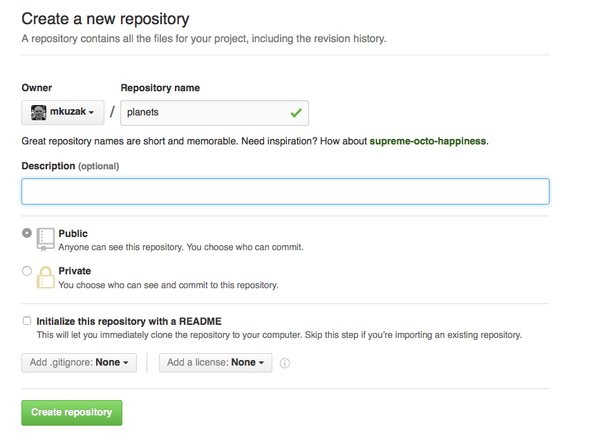
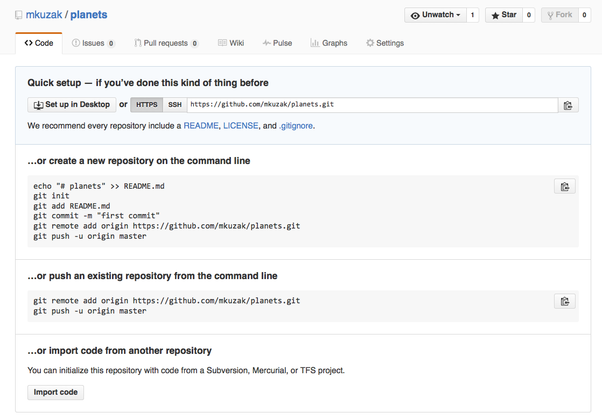
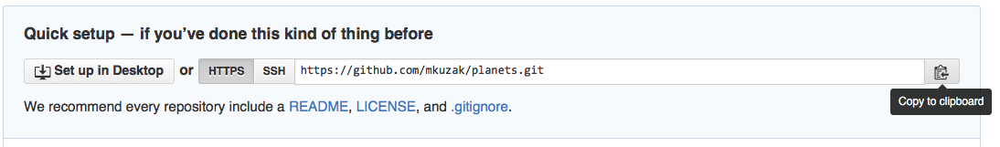
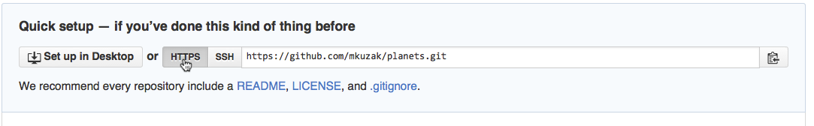
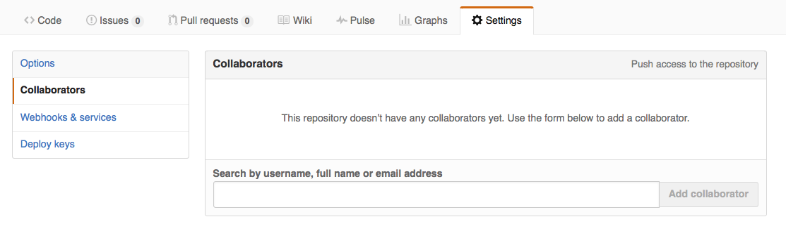

## Learning Objectives
*  Explain what remote repositories are and why they are useful.
*  Push to or pull from a remote repository.
*  Clone a remote repository.
*  Collaborate pushing to a common repository.

## Introduction to Github

Version control really comes into its own
when we begin to collaborate with other people.
We already have most of the machinery we need to do this;
the only thing missing is to copy changes from one repository to another.

Systems like Git allow us to move work between any two repositories.
In practice,
though,
it's easiest to use one copy as a central hub,
and to keep it on the web rather than on someone's laptop.
Most programmers use hosting services like
[GitHub](http://github.com),
[BitBucket](http://bitbucket.org) or
[GitLab](http://gitlab.com/)
to hold those master copies;
we'll explore the pros and cons of this in the final section of this lesson.

Let's start by sharing the changes we've made to our current project with the world.
Go to [Github](http://github.com), and create an account if you don't have one or log in to GitHub. Once you have logged in with your (new) credentials, click on the icon in the top right corner to create a new repository called `planets`:

Name your repository "planets" and then click "Create Repository":

As soon as the repository is created,
GitHub displays a page with a URL and some information on how to configure your local repository:

This effectively does the following on GitHub's servers:

~~~ {.bash}
$ mkdir planets
$ cd planets
$ git init
~~~

Our local repository still contains our earlier work on `mars.txt`,
but the remote repository on GitHub doesn't contain any files yet:

The next step is to connect the two repositories.
We do this by making the GitHub repository a [remote](../reference.html#remote)
for the local repository.
The home page of the repository on GitHub includes
the string we need to identify it:

Click on the 'HTTPS' link to change the [protocol](../reference.html#protocol) from SSH to HTTPS.

> ### HTTPS vs SSH
>
> We use HTTPS here because it does not require additional configuration.
> After the workshop you may want to set up SSH access by generating a new ssh key using the `ssh-keygen` command, which is a bit more
> secure. There are great tutorials available to help you with this; a few are listed here:
> [GitHub](https://help.github.com/articles/generating-ssh-keys),
> [Atlassian/BitBucket](https://confluence.atlassian.com/display/BITBUCKET/Set+up+SSH+for+Git)
> and [GitLab](https://about.gitlab.com/2014/03/04/add-ssh-key-screencast/)
> (this one has a screencast).

Copy that URL from the browser,
go into the local `planets` repository,
and run this command:

~~~ {.bash}
$ git remote add origin https://github.com/vlad/planets.git
~~~

Make sure to use the URL for your repository rather than Vlad's:
the only difference should be your username instead of `vlad`.

We can check that the command has worked by running `git remote -v`:

~~~ {.bash}
$ git remote -v
~~~
~~~ {.output}
origin   https://github.com/vlad/planets.git (push)
origin   https://github.com/vlad/planets.git (fetch)
~~~

The name `origin` is a local nickname for your remote repository:
we could use something else if we wanted to,
but `origin` is by far the most common choice.

Once the nickname `origin` is set up,
this command will push the changes from our local repository
to the repository on GitHub:

~~~ {.bash}
$ git push origin master
~~~
~~~ {.output}
Counting objects: 9, done.
Delta compression using up to 4 threads.
Compressing objects: 100% (6/6), done.
Writing objects: 100% (9/9), 821 bytes, done.
Total 9 (delta 2), reused 0 (delta 0)
To https://github.com/vlad/planets
 * [new branch]      master -> master
Branch master set up to track remote branch master from origin.
~~~

This is what we have done so far to make sure that out local and remote repositories are in sync:

We can pull changes from the remote repository to the local one as well:

~~~ {.bash}
$ git pull origin master
~~~
~~~ {.output}
From https://github.com/vlad/planets
 * branch            master     -> FETCH_HEAD
Already up-to-date.
~~~

Pulling has no effect in this case
because the two repositories are already synchronized.
If someone else had pushed some changes to the repository on GitHub,
though,
this command would download them to our local repository.

***
**Exercises**

1. Browse to your `planets` repository on GitHub. Under the Code tab, find and click on the text that says "XX commits" (where "XX" is some number). Hover over and/or click on the three buttons to the right of each commit to explore what they point to; what information can you gather from these buttons?

2. In this lesson, we introduced the "git push" command. How is "git push" different from "git commit"?

***

## Collaborating with Git and Github

For the next step, get into pairs, and give each other access to your `planets` repo. In all cases, you will be "Owner" for your own repo, and a "Collaborator" on yout partner's repo.

The Owner needs to give the Collaborator access. On GitHub, click the settings button on the right, then select Collaborators, and enter your partner's Github username.

Once the Collaborator has been added, he/she will get an email with the invitation. Go to the link in the invitation email and you should be able to see the Owner's repo on Github. 

The Collaborator can work on this project online or locally. To work on it locally, click on the green "Clone or download" button and copy the `https` address. Now on your computer (in Terminal), `cd` to another directory since you can't have 2 folders called `planets` in the same folder. Next, make a copy of the Owner's repository locally using `git clone`:

~~~ {.bash}
$ git clone <paste copied URL>
~~~

The Collaborator can now make a change in his or her copy of the Owner's repository:

~~~ {.bash}
$ cd planets
$ vim pluto.txt
~~~
~~~ {.output}
It is so a planet!
~~~
~~~ {.bash}
$ git add pluto.txt
$ git commit -m "Some notes about Pluto"
~~~
~~~ {.output}
 1 file changed, 1 insertion(+)
 create mode 100644 pluto.txt
~~~

Then push the change to GitHub:

~~~ {.bash}
$ git push origin master
~~~
~~~ {.output}
Counting objects: 4, done.
Delta compression using up to 4 threads.
Compressing objects: 100% (2/2), done.
Writing objects: 100% (3/3), 306 bytes, done.
Total 3 (delta 0), reused 0 (delta 0)
To https://github.com/vlad/planets.git
   9272da5..29aba7c  master -> master
~~~

Note that we didn't have to create a remote called `origin`:
Git does this automatically using that name when we clone a repository.

Please check your own `planets` repo online, you should have an additional file called `pluto.txt` created by your partner. To update your local repo with these changes, `cd` into the original planets directory/repo locally and `pull` the changes.

~~~ {.bash}
$ cd ~/planets      #### Modify this to the path of your original repo.
$ git pull origin master
~~~

Now we have 2 repos that you are collaborating with your partner on, one as an Owner and one as a Collaborator, and they are both available online on github.com as well as locally.

## Resolving conflicts

Collaborations are great but they make it very likely that someone's going to step on someone
else's toes, figuratively speaking. Essentially, this means that if 2 people are working on the same section of a document at the same time. This can even happen with a single person: if we are working on a document on both our laptop and the lab computer. 

Version control helps us manage these [conflicts](../reference.html#conflicts) by giving us tools to [resolve](../reference.html#resolve) overlapping changes.

To see how we can resolve conflicts, we must first create one. In your 2-person group that has a collaboration, pick an Owner and a Collaborator for this exercise (you can't be both for this activity). Now, the collaborator needs to change directories to the Owner's repo and modify the `mars.txt` file:

~~~ {.bash}
$ vim mars.txt
~~~
~~~ {.output}
Cold and dry, but everything is my favorite color
The two moons may be a problem for Wolfman
But the Mummy will appreciate the lack of humidity
This line added to Wolfman's copy
~~~

And then push the change to GitHub:

~~~ {.bash}
$ git add mars.txt
$ git commit -m "Adding a line in our home copy"
~~~
~~~ {.output}
[master 5ae9631] Adding a line in our home copy
 1 file changed, 1 insertion(+)
~~~
~~~ {.bash}
$ git push origin master
~~~
~~~ {.output}
Counting objects: 5, done.
Delta compression using up to 4 threads.
Compressing objects: 100% (3/3), done.
Writing objects: 100% (3/3), 352 bytes, done.
Total 3 (delta 1), reused 0 (delta 0)
To https://github.com/vlad/planets
   29aba7c..dabb4c8  master -> master
~~~

Now let's have the Owner make a different change to their copy *without* updating from GitHub:

~~~ {.bash}
$ vim mars.txt
~~~
~~~ {.output}
Cold and dry, but everything is my favorite color
The two moons may be a problem for Wolfman
But the Mummy will appreciate the lack of humidity
We added a different line in the other copy
~~~

Commit the change locally:

~~~ {.bash}
$ git add mars.txt
$ git commit -m "Adding a line in my copy"
~~~
~~~ {.output}
[master 07ebc69] Adding a line in my copy
 1 file changed, 1 insertion(+)
~~~

When you try to push this change, Git won't let us push it to GitHub:

~~~ {.bash}
$ git push origin master
~~~
~~~ {.output}
To https://github.com/vlad/planets.git
 ! [rejected]        master -> master (non-fast-forward)
error: failed to push some refs to 'https://github.com/vlad/planets.git'
hint: Updates were rejected because the tip of your current branch is behind
hint: its remote counterpart. Merge the remote changes (e.g. 'git pull')
hint: before pushing again.
hint: See the 'Note about fast-forwards' in 'git push --help' for details.
~~~

Git detects that the changes made in one copy overlap with those made in the other
and stops us from trampling on our previous work.
What Owners have to do is pull the changes from GitHub, and [merge](../reference.html#merge) them into the copy they're currently working in, then push the modified file to Github.

*Only owners will be doing this!*

~~~ {.bash}
$ git pull origin master
~~~
~~~ {.output}
remote: Counting objects: 5, done.        
remote: Compressing objects: 100% (2/2), done.        
remote: Total 3 (delta 1), reused 3 (delta 1)        
Unpacking objects: 100% (3/3), done.
From https://github.com/vlad/planets
 * branch            master     -> FETCH_HEAD
Auto-merging mars.txt
CONFLICT (content): Merge conflict in mars.txt
Automatic merge failed; fix conflicts and then commit the result.
~~~

`git pull` tells us there's a conflict, and marks that conflict in the affected file:

~~~ {.bash}
$ cat mars.txt
~~~
~~~ {.output}
Cold and dry, but everything is my favorite color
The two moons may be a problem for Wolfman
But the Mummy will appreciate the lack of humidity
<<<<<<< HEAD
We added a different line in the other copy
=======
This line added to Wolfman's copy
>>>>>>> dabb4c8c450e8475aee9b14b4383acc99f42af1d
~~~

Our change&mdash;the one in `HEAD`&mdash;is preceded by `<<<<<<<`.
Git has then inserted `=======` as a separator between the conflicting changes
and marked the end of the content downloaded from GitHub with `>>>>>>>`.
(The string of letters and digits after that marker
identifies the commit we've just downloaded.)

It is now up to us to edit this file to remove these markers and reconcile the changes.
We can do anything we want: keep the change made in the local repository, keep the change made in the remote repository, write something new to replace both, or get rid of the change entirely. Let's replace both so that the file looks like this:

~~~ {.bash}
$ vim mars.txt
~~~
~~~ {.output}
Cold and dry, but everything is my favorite color
The two moons may be a problem for Wolfman
But the Mummy will appreciate the lack of humidity
We removed the conflict on this line
~~~

To finish merging, we add `mars.txt` to the changes being made by the merge
and then commit:

~~~ {.bash}
$ git add mars.txt
$ git status
~~~
~~~ {.output}
# On branch master
# All conflicts fixed but you are still merging.
#   (use "git commit" to conclude merge)
#
# Changes to be committed:
#
#	modified:   mars.txt
#
~~~
~~~ {.bash}
$ git commit -m "Merging changes from GitHub"
~~~
~~~ {.output}
[master 2abf2b1] Merging changes from GitHub
~~~

Now we can push our changes to GitHub:

~~~ {.bash}
$ git push origin master
~~~
~~~ {.output}
Counting objects: 10, done.
Delta compression using up to 4 threads.
Compressing objects: 100% (6/6), done.
Writing objects: 100% (6/6), 697 bytes, done.
Total 6 (delta 2), reused 0 (delta 0)
To https://github.com/vlad/planets.git
   dabb4c8..2abf2b1  master -> master
~~~

Git keeps track of what we've merged with what,
so we don't have to fix things by hand again. When the Collaborator who made the first change pulls again, they will get the merged file.

~~~ {.bash}
$ git pull origin master
~~~
~~~ {.output}
remote: Counting objects: 10, done.        
remote: Compressing objects: 100% (4/4), done.        
remote: Total 6 (delta 2), reused 6 (delta 2)        
Unpacking objects: 100% (6/6), done.
From https://github.com/vlad/planets
 * branch            master     -> FETCH_HEAD
Updating dabb4c8..2abf2b1
Fast-forward
 mars.txt | 2 +-
 1 file changed, 1 insertion(+), 1 deletion(-)
~~~
~~~ {.bash}
$ cat mars.txt 
~~~
~~~ {.output}
Cold and dry, but everything is my favorite color
The two moons may be a problem for Wolfman
But the Mummy will appreciate the lack of humidity
We removed the conflict on this line
~~~

Version control's ability to merge conflicting changes is another reason users tend to divide their programs and papers into multiple files instead of storing everything in one large file. There's another benefit too: whenever there are repeated conflicts in a particular file, the version control system is essentially trying to tell its users that they ought to clarify who's responsible for which section in the document, or find a way to divide the work up differently.

***

*These materials were adapted from [Software Carpentry](https://software-carpentry.org/lessons/), the Licensing information can be [found here](LICENSE_SWC_git_materials.md).*

***
